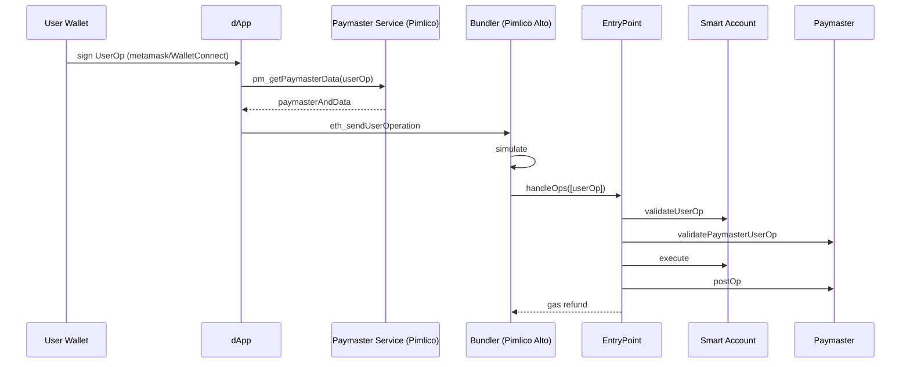

# Pimlico / Paymaster 生态

> **TL;DR**：ERC-4337 把账户抽象（AA）从 L1 协议层下沉到合约层，衍生出三类新基础设施：**Bundler**（打包 UserOperation 发 L1）、**Paymaster**（代付 gas，或收 ERC-20 作 gas）、**Smart Account Factory**（部署合约钱包）。Pimlico 是 2023-2026 年市场份额最大的 AA infra 服务商，自研 Bundler Alto（Go/Rust）、Paymaster（支持 Verifying / ERC-20 两种）、ERC-7677 标准化 Paymaster API；此外 Stackup、Candide、Biconomy、Alchemy AA、ZeroDev 等竞争激烈。本篇拆解 ERC-4337/7702 协议、Bundler 内部设计、Paymaster 三种模式、以及 Pimlico Infra 的 SLO 与对比。

## 1. 背景与动机

原生 EOA 有四个痛点：

1. 助记词易丢、易泄。
2. Gas 必须是 ETH。
3. 无社交恢复、多签、会话 key。
4. 批量操作需要多笔 tx。

Gnosis Safe（2017）把钱包做成合约；但合约账户自身无法作为 tx 签名发起方，必须 EOA 触发，限制 UX。ERC-4337（2023-03 Ethereum 主网启用）通过"伪 mempool + EntryPoint + Bundler"把合约钱包升为一等公民：用户签 UserOperation → Bundler 打包成一笔 tx → EntryPoint 逐个验证并执行。

AA 三大衍生需求：
- **Bundler**：像矿工一样打包 UserOp。
- **Paymaster**：替用户出 gas，或收 USDC/USDT 等稳定币作 gas。
- **Account Factory**：CREATE2 部署合约钱包。

市场早期（2023）主要是 Stackup + Alchemy，2024-2025 Pimlico 凭借高 TPS Bundler 和 ERC-7677 标准化 Paymaster API 成为主导。

## 2. 核心原理

### 2.1 形式化：UserOp 生命周期

UserOperation 数据结构（ERC-4337 v0.7）：

```
UserOperation {
  sender: address,
  nonce: uint256,
  factory: address,           // 首次部署用
  factoryData: bytes,
  callData: bytes,
  callGasLimit, verificationGasLimit, preVerificationGas,
  maxFeePerGas, maxPriorityFeePerGas,
  paymaster: address,
  paymasterVerificationGasLimit, paymasterPostOpGasLimit,
  paymasterData: bytes,
  signature: bytes
}
```

EntryPoint（单例合约 `0x0000000071727De22E5E9d8BAf0edAc6f37da032`）的 `handleOps(UserOp[], beneficiary)`：

1. 对每个 UserOp 调用 `validateUserOp` 和可选 `paymaster.validatePaymasterUserOp`。
2. 执行 `sender.callData`。
3. `paymaster.postOp`（若有）。
4. 结算 gas 偿付给 beneficiary（Bundler）。

形式化不变式：

$$
\forall \text{UserOp } u: \text{preDeposit}(sender \text{ or } paymaster) \ge \text{maxGasCost}(u) \Leftrightarrow \text{accepted}
$$

违反则 Bundler 自行承担 gas 损失 → Bundler 必须严格模拟。

### 2.2 子机制一：Bundler 设计（Pimlico Alto）

Alto（Go → Rust 重写）核心循环：

```
while true:
  ops = collect_from_user_op_mempool()
  valid_ops = simulate_and_filter(ops)    # eth_estimateUserOp / debug_traceCall
  batch = pack_until_gas_limit(valid_ops)
  tx = build_eoa_tx_calling_entryPoint(batch)
  send_tx(tx, flashbots_private_relay)
```

关键挑战：
- **Simulation**：需用 ERC-7562 restricted opcode 检测，避免 state-dependent validation（防 UserOp 在 mempool 有效、上链时失效）。
- **Bundling 利润**：Bundler 付 ETH gas，得到 `maxFeePerGas` 偿付；若估算误差可能亏损。
- **抗 DOS**：恶意 UserOp 构造让 simulation 消耗资源。ERC-7562 Storage Access Rules 限制。
- **PBS 集成**：Bundler 通过 Flashbots relay 提交 bundle，避免 front-run。

### 2.3 子机制二：Paymaster 三种模式

**(a) Verifying Paymaster（链下签名）**：
Paymaster 合约只信任某 signer 的 EIP-712 签名，dApp 后端决定是否替用户付 gas。

```solidity
function validatePaymasterUserOp(UserOp op, bytes32 hash, uint256 maxCost) external returns (bytes memory ctx, uint256 valid) {
    (uint48 validUntil, uint48 validAfter, bytes memory sig) = parsePaymasterAndData(op.paymasterAndData);
    bytes32 digest = keccak256(abi.encode(op.sender, op.nonce, hash, validUntil, validAfter));
    require(signers[ECDSA.recover(digest.toEthSignedMessageHash(), sig)], "bad sig");
    return ("", _packValidationData(false, validUntil, validAfter));
}
```

**(b) ERC-20 Token Paymaster**：
用户用 USDC/USDT/DAI 付 gas。Paymaster 先预估 gas cost，transferFrom 用户对应数额，执行完在 postOp 退差价。

**(c) Singleton Gasless Paymaster**：dApp 自付，简单 allowlist sender。

### 2.4 子机制三：Smart Account Factory + CREATE2

常用合约钱包：**Safe 4337 Module**、**Kernel（ZeroDev）**、**Biconomy SA**、**SimpleAccount（reference）**、**Coinbase Smart Wallet**。部署用 CREATE2，地址 = `H(factory, salt, initCode)`，无需先 deploy 即可收款。

首次 UserOp 里 `factory + factoryData` 同时部署+执行，UX 为零等待。

### 2.5 子机制四：ERC-7677 Paymaster Service

2024-Q3 Coinbase + Pimlico + Stackup 制定 ERC-7677：Paymaster 服务暴露标准 JSON-RPC：

- `pm_getPaymasterData(userOp, entryPoint, chainId, context)` → 返回 paymasterAndData。
- `pm_getPaymasterStubData(...)` → 返回估算用 stub。

钱包厂商一次集成即可切换 paymaster 供应商。

### 2.6 子机制五：EIP-7702（Pectra 2025）

EIP-7702 让 EOA 在一次 tx 里临时"变身"为合约（通过 authorization tuple）。打破"合约钱包须是合约"的前提，EOA 用户无须迁移即可享受 AA 功能。Pimlico 在 2025-Q3 推出基于 7702 的 Bundler 路径（称 "EIP-7702 SmartEOA"）。

### 2.7 关键参数（Pimlico 2026）

| 参数 | 值 |
| --- | --- |
| Bundler endpoint | 12+ 链（Ethereum、Base、Arbitrum、Optimism、Polygon、Scroll、Linea、Blast、BNB、Gnosis、Celo、Mantle） |
| Paymaster TPS | 峰值 > 200 UserOp/s |
| 免费额度 | 开发者 tier 每月 ~100k UserOp |
| 平均 UserOp gas | ~200-300k |
| API 延迟 | p50 ~150ms，p99 ~800ms |

### 2.8 边界条件与失败模式

- **Bundler 亏损**：gas 估算偏低，bundle 上链失败，Bundler 自付 ETH。
- **Paymaster 耗尽余额**：signer 签了过多 sponsorship，合约 balance 不足，UserOp 全部失败。
- **ERC-7562 违规**：用户钱包 validation 中读了未授权 storage slot，Bundler 拒绝。
- **Frontrun risk**：mempool UserOp 公开 → MEV bots 抢先。Pimlico 提供私密 mempool。
- **Rate limiting**：滥用免费 tier，被 429。

### 2.9 图示：ERC-4337 调用图



## 3. 架构剖析

### 3.1 分层视图：Pimlico 栈

```
┌─────────────────────────────────┐
│ SDK (permissionless.js)         │
├─────────────────────────────────┤
│ REST / JSON-RPC Gateway         │
├─────────────────────────────────┤
│ Bundler (Alto, Rust)            │
├─────────────────────────────────┤
│ Paymaster Service               │
│  ├ Verifying (sponsored)        │
│  ├ ERC-20 (USDC etc.)           │
│  └ ERC-7677 JSON-RPC            │
├─────────────────────────────────┤
│ Simulator / Tracer              │
├─────────────────────────────────┤
│ Key Management (KMS / HSM)      │
├─────────────────────────────────┤
│ Indexer / Dashboard             │
└─────────────────────────────────┘
```

### 3.2 核心模块清单

| 模块 | 职责 | 技术 | 可替换 |
| --- | --- | --- | --- |
| Alto Bundler | 打包 UserOp | Rust | Stackup bundler / Candide voltaire / Infinitism reference |
| Paymaster Contracts | 链上 sponsor | Solidity（Pimlico 开源） | Biconomy / ZeroDev / 自建 |
| Paymaster Service | 链下签名决策 | TS Node + KMS | 自建 |
| Simulator | ERC-7562 规则 | Rust，tracer | geth debug_traceCall |
| Permissionless.js | 客户端 SDK | TypeScript | viem/AA SDK |
| Dashboard | 用量 + policy | Next.js | — |
| Policy Engine | 定义哪些 UserOp 被 sponsor | TS | 自建 |

### 3.3 数据流：dApp sponsor 一次 Uniswap swap

1. 用户连 Coinbase Smart Wallet。
2. dApp 要求 swap → permissionless.js 构造 UserOp。
3. dApp 调用 `pm_getPaymasterData`（带 chainId、policyId）。
4. Pimlico Service 根据 policy（如 "USDC 交易量 < $1k/day/user"）决定 sponsor。
5. 签 paymasterAndData 返回 dApp。
6. dApp 请求用户签 UserOp。
7. `eth_sendUserOperation` 到 Bundler。
8. Alto simulate → flashbots 提交。
9. 回执通过 webhook 通知 dApp。

### 3.4 竞品对比（2026）

| 厂商 | Bundler | Paymaster | 特色 |
| --- | --- | --- | --- |
| Pimlico | Alto (Rust) | Verifying + ERC-20 | 全链覆盖最多，ERC-7677 |
| Stackup | Go Bundler | Verifying | 老牌，文档好 |
| Alchemy AA | 私有 | AA+Gas Manager | 品牌效应，embedded wallet |
| Biconomy | Bico Bundler | ERC-20 Sessions | Session key、Nexus SCA |
| ZeroDev | Kernel + ULTRA | Kernel Paymaster | ECDSA + WebAuthn + Passkey |
| Candide | Voltaire | Open-source | 欧洲、完全开源 |
| thirdweb | 自有 | Pack gas | 全套 SDK |

### 3.5 接口

- **JSON-RPC**：`eth_sendUserOperation / eth_getUserOperationByHash / eth_estimateUserOperationGas / pm_*`。
- **Webhook**：UserOp status 推送。
- **SDK**：permissionless.js、viem account-abstraction。

## 4. 关键代码：使用 permissionless.js sponsor UserOp

```ts
// scripts/sponsor-swap.ts  (Pimlico + viem + permissionless)
import { createSmartAccountClient } from 'permissionless';
import { toSafeSmartAccount } from 'permissionless/accounts';
import { createPimlicoClient } from 'permissionless/clients/pimlico';
import { http, createPublicClient, parseEther } from 'viem';
import { base } from 'viem/chains';
import { privateKeyToAccount } from 'viem/accounts';

const owner = privateKeyToAccount(process.env.PK as `0x${string}`);
const publicClient = createPublicClient({ chain: base, transport: http() });

const pimlicoUrl = `https://api.pimlico.io/v2/base/rpc?apikey=${process.env.PIMLICO_KEY}`;
const pimlicoClient = createPimlicoClient({ transport: http(pimlicoUrl), entryPoint: { address: '0x0000000071727De22E5E9d8BAf0edAc6f37da032', version: '0.7' } });

const account = await toSafeSmartAccount({ client: publicClient, owners: [owner], version: '1.4.1', entryPoint: { address: '0x0000000071727De22E5E9d8BAf0edAc6f37da032', version: '0.7' } });

const smart = createSmartAccountClient({
  account, chain: base, bundlerTransport: http(pimlicoUrl),
  paymaster: pimlicoClient,
  userOperation: { estimateFeesPerGas: async () => (await pimlicoClient.getUserOperationGasPrice()).fast },
});

const hash = await smart.sendTransaction({
  to: '0x4200000000000000000000000000000000000006', // WETH on Base
  value: parseEther('0.001'),
  data: '0xd0e30db0', // deposit()
});
console.log('tx:', hash);
```

## 5. 演进与版本对比

| 时期 | 里程碑 |
| --- | --- |
| 2021 | EIP-2938（第一次 AA 尝试，失败）被 Vitalik 放弃 |
| 2023-03 | ERC-4337 v0.6 主网启用（Infinitism 团队） |
| 2023-Q4 | Pimlico 公开 Bundler 服务 |
| 2024-03 | ERC-4337 v0.7（UserOp 结构简化，paymaster data 拆 3 字段） |
| 2024-Q3 | ERC-7677 Paymaster API 标准化 |
| 2025-Q2 | Pectra 激活 EIP-7702，SmartEOA 模式上线 |
| 2025-Q4 | Pimlico Alto Rust 重构完毕 |

## 6. 实战示例：curl 直接调 Bundler

```bash
curl -X POST $PIMLICO_URL \
  -H "content-type: application/json" \
  -d '{
    "jsonrpc": "2.0", "id": 1,
    "method": "eth_supportedEntryPoints", "params": []
  }'

curl -X POST $PIMLICO_URL \
  -H "content-type: application/json" \
  -d "{
    \"jsonrpc\":\"2.0\",\"id\":2,
    \"method\":\"pm_getPaymasterData\",
    \"params\":[$USEROP,\"0x0000000071727De22E5E9d8BAf0edAc6f37da032\",\"0x2105\",{}]
  }"
```

## 7. 安全与已知攻击

- **EntryPoint 0.6 → 0.7 迁移**：某些 Paymaster 未升级导致 UserOp validation 失败（非攻击，运维问题）。
- **恶意 Paymaster**：假冒 ERC-20 Paymaster 合约 `postOp` 里 transfer 用户所有余额。用户应检查 Paymaster 地址白名单。
- **ERC-4337 v0.6 Invalidation Bug**（2023-07 ChainSafe 发现）：特殊 UserOp 可让 Bundler 进入死循环，后 patch。
- **Paymaster signer 私钥泄露**：attacker 无限制生成有效 paymasterAndData，耗尽 Paymaster deposit。须 KMS/HSM。
- **Phishing Approvals**：Smart Account 签 session key 授权给恶意 dApp，批量转资产。

## 8. 与同类方案对比

| 维度 | ERC-4337 AA | EIP-7702 SmartEOA | MPC 钱包（Fireblocks/Privy） | Multisig（Safe 本身） |
| --- | --- | --- | --- | --- |
| 账户类型 | 合约 | EOA 临时合约 | EOA（私钥分片） | 合约 |
| 需要 Bundler | 是 | 可选 | 否 | 否 |
| Gasless | 是（Paymaster） | 是 | 否（除非另包） | 否 |
| ERC-20 付 gas | 是 | 是 | 否 | 否 |
| 社交恢复 | 是 | 是 | 是（中心化） | 是（guardian） |
| 升级成本 | 0（已部署） | 每 tx 新 auth | 客服 | 多签迁移 |

## 9. 延伸阅读

- ERC-4337: https://eips.ethereum.org/EIPS/eip-4337
- ERC-7677: https://eips.ethereum.org/EIPS/eip-7677
- Pimlico Tutorial: docs.pimlico.io/permissionless
- Vitalik's "Road to AA" blog posts (2023)
- Infinitism reference impl github.com/eth-infinitism/account-abstraction
- 中文：imToken Labs 《账户抽象系列》

## 10. 术语表

| 术语 | 英文 | 释义 |
| --- | --- | --- |
| AA | Account Abstraction | 账户抽象 |
| UserOp | User Operation | 用户操作，4337 的 tx 等价物 |
| Bundler | Bundler | 打包 UserOp 发 L1 的节点 |
| Paymaster | Paymaster | 代付 gas 合约 |
| EntryPoint | EntryPoint | 单例合约，4337 核心 |
| SmartEOA | — | EIP-7702 升级的 EOA |
| Factory | Factory | CREATE2 部署 SCA 的合约 |
| Sponsored | — | dApp 替用户付 gas |

---

*Last verified: 2026-04-22*
