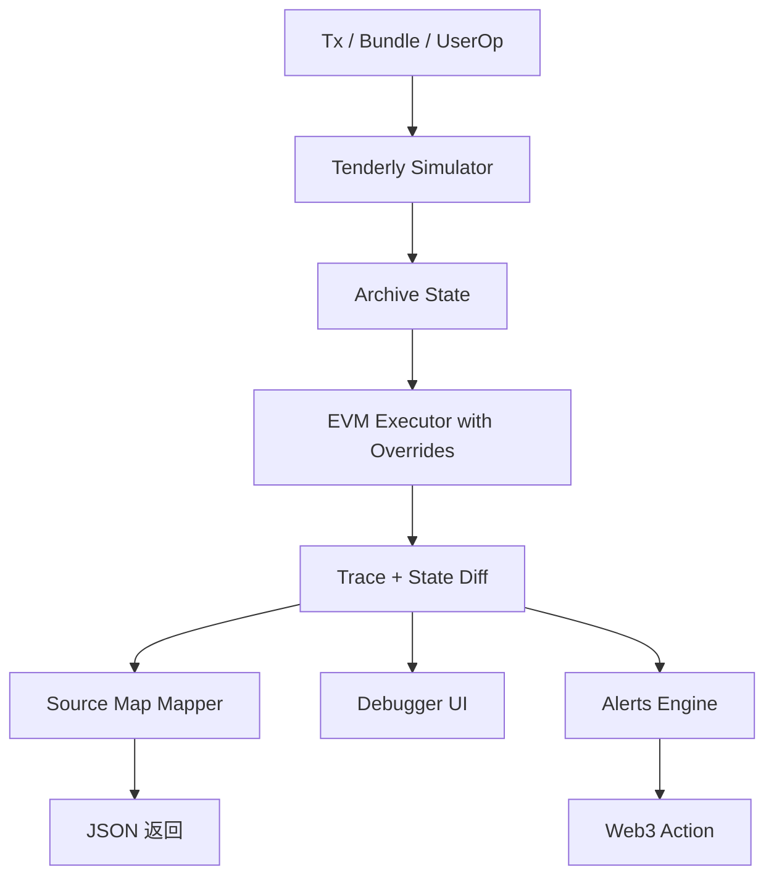

# Tenderly：模拟、调试与 Web3 Actions

> **TL;DR**：Tenderly 是 2018 年在塞尔维亚创立、2021 年 D 轮融资 4,000 万美元的 Web3 开发者平台，定位"Ethereum Observability + Simulation"。核心产品：**Simulator**（任意 tx 历史/未来状态下的模拟执行）、**Debugger**（Step-by-step EVM 调试，含 Solidity 源码行级映射）、**Alerts**（链上事件订阅）、**Web3 Actions**（Serverless 事件驱动）、**Virtual TestNets**（可分叉的弹性测试网）、**Gas Profiler**、**War Room**（事故响应协作）。钱包与 DApp 普遍用其 `tenderly_simulateBundle` 做交易预检，防御 phishing。

## 1. 背景与动机

Web3 开发者传统调试链上交易极为痛苦：`eth_getTransactionReceipt` 只给 Logs、Revert Reason 偶缺失、Trace 功能需归档节点、source map 与 bytecode 对齐需要手动处理。Tenderly 创始团队意识到这一痛点，打造"EVM 调试器 + 交易模拟器"的 SaaS 版。

在市场位置上：

- **Etherscan**：浏览器 + verify，调试能力弱；
- **Hardhat / Foundry**：本地工具，链上 tx 需重放；
- **Blockscout**：开源，调试弱；
- **Tenderly**：SaaS，专注"我要知道这笔 tx 为什么 revert、模拟这笔 tx 将要发生什么"。

2022 年后，钱包（Rabby、Frame、OKX、Trust Wallet）开始把 Tenderly Simulator 集成到签名前预览，使其成为 Web3 安全 UX 基础设施。

## 2. 核心原理

### 2.1 Simulator：状态重放与分叉

Tenderly 的 Simulator 核心是：给定起始状态（某区块的 world state）+ 一系列 tx，返回执行结果（state diff、logs、trace、gas）。技术本质是一个"定制化的 EVM 执行引擎 + 多链归档节点"：

1. 用户提交 `simulation` 请求：`{network_id, from, to, input, value, state_objects_overrides?, block_number?}`；
2. Tenderly 后端从归档数据快速构建 VM initial state（MPT 访问快照）；
3. 应用可选的 state override（模拟"假设这个账户有 1M USDC"）；
4. 执行 EVM → 获得 trace；
5. Map trace 到 Solidity source（基于 source map）；
6. 返回 JSON。

形式化：$\text{sim}(S_b, tx) = (S_{b+1}, \text{logs}, \text{trace}, \text{gas})$，其中 $S_b$ 是区块 $b$ 末的状态。

### 2.2 Bundle 模拟（tenderly_simulateBundle）

钱包集成最常用的接口：一次性模拟多个 tx（例如：approve + swap）：

```json
[
  {"from":"0xU","to":"0xUSDC","data":"0x095ea7b3...","value":0},
  {"from":"0xU","to":"0xUniswapV3","data":"0x5ae401dc...","value":0}
]
```

返回顺序执行结果，并给出 state diff。这允许 Rabby 等钱包在签名前告诉用户："这笔交易将花费你 X USDC、得到 Y ETH"。

### 2.3 Debugger

Debugger 在 Simulator 之上添加"Step/Breakpoint/Variables"：

- 映射 EVM bytecode PC 到源代码行（via source map）；
- 维护 call stack、storage slot diff、memory hex；
- 支持 Solidity expression inspection；
- 对 revert 事件自动定位到 `require` 行。

### 2.4 Web3 Actions

Web3 Actions 是 Tenderly 的 Serverless 平台：

1. 用户注册 Trigger（link to Alert rule，如"USDC transfer > 1M"）；
2. 用户编写 TypeScript / Node.js 函数；
3. Tenderly 部署到 FaaS 平台；
4. Trigger 触发时 runtime 执行函数；
5. 函数可以读取链上状态、签名并发送 tx（通过 Tenderly RPC + Secrets）；
6. 支持 cron schedule、web hook 触发。

### 2.5 Virtual TestNets

Virtual TestNets 是 2024 新品：给用户一个"可分叉的私有 testnet"，底层按需从主网 fork，支持 cheatcodes（账户余额、时间穿越）。相比 Foundry `forge test --fork-url`：

- 持久化（可被前端使用）；
- 多用户共享；
- 内置 Explorer；
- 可接入钱包测试。

### 2.6 子机制拆解

1. **归档节点**：自建多链归档（Ethereum、BNB、Polygon、Arbitrum、OP、Base、Avalanche、Gnosis、Sepolia…）；
2. **快照层**：MPT 快照 + 内存缓存；
3. **EVM 执行器**：基于 go-ethereum fork，添加 state override 支持；
4. **Source Map 服务**：从 Etherscan / Sourcify 拉取源码；
5. **Alerts Engine**：类似 Forta 的订阅；
6. **Web3 Actions Runtime**：Node 18 FaaS；
7. **Collaboration UI**：War Room 多人协作时间线。

### 2.7 参数与常量

- **Simulation 延迟**：P50 ~200ms，P99 1s；
- **Alert 延迟**：新块 ~3s；
- **Web3 Actions 执行时限**：60s；
- **Virtual TestNet 生命期**：按计划，可长期；
- **免费层**：每月若干 simulations。

### 2.8 边界条件与失败模式

- **非 EVM 链**：Tenderly 不支持 Solana / Move 等；
- **状态漂移**：基于旧区块模拟，在上链时实际状态可能已变（race），需加 slippage；
- **Gas 估计误差**：模拟基于当前节点状态，真实上链可能因 base fee 变化 gas 不足；
- **源码缺失**：未 verify 的合约只能看到 bytecode trace；
- **Web3 Actions 单点**：依赖 Tenderly 运行时。



## 3. 架构剖析

### 3.1 分层视图

1. **Node Fleet**：多链归档节点（自建 + 合作）；
2. **Snapshot / State Store**：MPT 快照 + KV 缓存；
3. **Simulation Engine**：go-ethereum fork；
4. **API Layer**：REST / JSON-RPC / SDK；
5. **Product Layer**：Simulator / Debugger / Alerts / Actions / TestNets / Gas Profiler；
6. **Collaboration Layer**：War Room、Projects、Access Control。

### 3.2 核心模块清单

| 模块 | 职责 | 依赖 | 可替换性 |
| --- | --- | --- | --- |
| Simulator | 状态重放 | Archive node | Anvil / Foundry 本地 |
| Debugger | 源码级 | Simulator + Source | 无直接竞品 |
| Alerts | 事件订阅 | Indexer | Defender Sentinel / Forta |
| Web3 Actions | Serverless | Node 18 runtime | AWS Lambda 自建 |
| Virtual TestNets | Fork testnet | Snapshot | Alchemy Subnet |
| Gas Profiler | Function-level gas | Trace | 部分竞品 |

### 3.3 一次典型的"预检 + 警报 + 响应"流水

1. 钱包用户点 Sign；
2. 钱包前端调用 Tenderly `simulate_bundle`；
3. 返回 state diff → 钱包提示"将损失 X"；
4. 用户发送 tx；
5. tx 上链，Alert 触发（规则："用户地址发送>100 ETH"）；
6. Web3 Action 执行（发 Slack 通知）。

### 3.4 参考实现

- Tenderly SDK：`@tenderly/sdk`（TypeScript）；
- Hardhat 插件：`@tenderly/hardhat-tenderly`；
- Foundry 集成：通过 `tenderly` CLI；
- TypeScript for Actions：`@tenderly/actions`。

### 3.5 扩展 / 互操作

- `tenderly_simulateTransaction` / `tenderly_simulateBundle` 作为 JSON-RPC 扩展；
- Webhooks、Slack / Telegram / Discord 集成；
- 与 Safe Wallet：Safe Transaction Builder 使用 Tenderly 做 pre-execute simulation；
- 与 OZ Defender：Defender Sentinel 可调用 Tenderly 做二次验证。

## 4. 关键代码 / 实现细节

Simulation REST（`docs.tenderly.co/simulations/api-reference`）：

```bash
curl -X POST https://api.tenderly.co/api/v1/account/$TENDERLY_USER/project/$PROJ/simulate \
  -H "X-Access-Key: $TENDERLY_KEY" \
  -H "Content-Type: application/json" \
  -d '{
    "network_id": "1",
    "from": "0xUser",
    "to": "0xContract",
    "input": "0xa9059cbb...",
    "value": "0",
    "save": true,
    "save_if_fails": true,
    "simulation_type": "full",
    "state_objects": {
       "0xUser": { "balance": "0x3635C9ADC5DEA00000" }
    }
  }'
```

tenderly JSON-RPC（`https://gateway.tenderly.co/...`）：

```ts
// 使用 viem
const res = await client.request({
  method: "tenderly_simulateTransaction",
  params: [
    { from: "0x...", to: "0x...", data: "0x...", value: "0x0" },
    "latest",
  ],
});
```

Web3 Action 示例（`@tenderly/actions`）：

```ts
import type { ActionFn, Context, Event, TransactionEvent } from "@tenderly/actions";

export const onLargeTransfer: ActionFn = async (ctx: Context, ev: Event) => {
  const tx = ev as TransactionEvent;
  const value = BigInt(tx.transaction.value);
  if (value > 1000n * 10n ** 18n) {
    await fetch(ctx.secrets.get("SLACK_WEBHOOK"), {
      method: "POST",
      body: JSON.stringify({ text: `Large transfer: ${tx.hash}` }),
    });
  }
};
```

配置 `tenderly.yaml`：

```yaml
actions:
  my-project:
    runtime: v2
    sources: ./actions
    specs:
      onLargeTransfer:
        description: "Slack on large ETH transfer"
        function: actions/handlers.ts:onLargeTransfer
        trigger:
          type: transaction
          transaction:
            status: [success]
            filters:
              - network: 1
                from: 0xHotWallet
```

## 5. 演进与版本对比

| 里程碑 | 时间 | 变化 |
| --- | --- | --- |
| v1 Simulator + Debugger | 2018–2020 | 基础 |
| Alerts | 2021 | 链上事件订阅 |
| Web3 Actions | 2022 | Serverless |
| Gateway (RPC) | 2022 | 提供 RPC 端点 |
| War Room | 2023 | 事故协作 |
| Virtual TestNets | 2024 | Fork as service |
| Non-EVM 探索 | 2025 | 计划中的支持 |

## 6. 实战示例

前端接入 Simulation 用于 tx preview：

```ts
async function preview(tx) {
  const sim = await fetch(`/api/tenderly-simulate`, {
    method: "POST", body: JSON.stringify(tx),
  }).then(r => r.json());
  const diff = sim.transaction_info.state_diff;
  return renderStateDiff(diff);
}
```

Hardhat 插件一键 verify + push simulation：

```js
// hardhat.config.js
require("@tenderly/hardhat-tenderly");
module.exports = { tenderly: { project: "my-proj", username: "me" } };
```

```bash
npx hardhat tenderly:verify --network mainnet MyContract=0xabc
```

## 7. 安全与已知攻击

- **Simulation 与上链不一致**：攻击者可利用"模拟通过但实际失败"的时间差。最佳实践是 slippage 控制；
- **State Override 滥用**：有些恶意 dApp 给用户展示"模拟结果：得到 10 ETH"，但实际用 override 造假；钱包应禁止自定义 override；
- **API Key 泄漏**：泄漏会导致被刷 simulation 额度；
- **Web3 Actions 秘钥**：Secrets 应轮换；
- **Dependency on Tenderly 可用性**：Tenderly 宕机时 dApp 的 preview 功能失效，需 fallback 到 `eth_call`；
- **Phishing preview 欺骗**：钱包应校验模拟结果对应的合约 ABI，而非盲信 diff。

## 8. 与同类方案对比

| 维度 | Tenderly | Foundry/Anvil | OZ Defender | Phalcon | Alchemy Sandbox |
| --- | --- | --- | --- | --- | --- |
| Simulation | 强，多链 SaaS | 本地 | 基本 | 强（调试）| 中 |
| Debugger | 强（行级）| 中 | 无 | 强 | 中 |
| Alerts | 强 | 无 | 强 | 弱 | 强 |
| Serverless | Web3 Actions | 无 | Autotasks | 无 | 无 |
| Virtual TestNet | 强 | 本地 fork | 无 | 无 | Subnet |
| 费用 | SaaS 付费 | 本地免费 | SaaS 付费 | SaaS 付费 | SaaS 付费 |

## 9. 延伸阅读

- **Docs**：`https://docs.tenderly.co`
- **Simulation API**：`https://docs.tenderly.co/simulations`
- **Web3 Actions**：`https://docs.tenderly.co/web3-actions`
- **Virtual TestNets**：`https://docs.tenderly.co/virtual-testnets`
- **Blog**：`https://blog.tenderly.co`
- **Rabby Wallet 使用 Tenderly 示例**：`https://rabby.io`
- **Safe Tx Builder Simulation**：Safe 文档

## 10. 术语表

| 术语 | 英文 | 释义 |
| --- | --- | --- |
| State Override | State Override | 模拟时覆盖账户状态 |
| State Diff | State Diff | 模拟结果的状态变化 |
| Source Map | Source Map | bytecode → Solidity 行映射 |
| Bundle | Tx Bundle | 一组顺序执行的 tx |
| War Room | War Room | 事故协作工作区 |
| Virtual TestNet | Virtual TestNet | 按需分叉的测试网 |
| Paymaster Simulation | Paymaster Simulation | AA 代付模拟 |

---

*Last verified: 2026-04-22*
