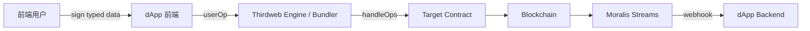

# Thirdweb 与 Moralis：SDK、NFT 与 Gasless

> **TL;DR**：Thirdweb 与 Moralis 是面向 Web2/Web3 开发者的"Firebase for Web3"式平台，目标是让 dApp 开发从"配节点 + 写合约 + 前端 Web3 接入"三件事变成"调 SDK 即可"。**Thirdweb** 提供预审计合约模板（Marketplace、ERC-721 Drop、Staking）、Deploy CLI、Storage (IPFS)、**Engine**（类 Defender Relayer）、In-App Wallet、Account Abstraction、Gasless 等；**Moralis** 侧重 Web3 Data API（EVM、Solana、Aptos 多链），以及 Streams（链上事件推送）、Auth（Sign-In with Ethereum）。两者功能重叠但市场定位不同：Thirdweb 更像"全栈脚手架"，Moralis 更像"多链数据后端"。

## 1. 背景与动机

Web3 开发者面临的常见痛点：

1. 自建节点或使用 Alchemy/Infura + 多链适配；
2. 编写安全合约模板（避免重写 ERC-721）；
3. 前端集成 wagmi / ethers / viem；
4. 实现"用户免 gas"体验（Meta-Transaction / Account Abstraction / Paymaster）；
5. 监听链上事件并在后端响应；
6. NFT metadata 存储到 IPFS；
7. 用户无需手动创建钱包即可开始使用（社交登录 / email）。

**Thirdweb**（前身 Web3Sdks，2021 由 Furqan Rydhan、Steven Bartlett 等创立）把这些拼图整合成一站式 SDK + SaaS。**Moralis**（2020 由 Ivan on Tech 等创立于瑞典）最早以"Web3 云后端"出圈，后聚焦数据 API。两家 2022 年前市场定位高度重合，2023 年后分化：Thirdweb 走"SDK + Engine + AA 生态"，Moralis 专注"Data API"。

## 2. 核心原理

### 2.1 Thirdweb 模块组成

Thirdweb 产品可按 Stack 划分：

1. **Contracts**：预审计模板，官方维护的 `@thirdweb-dev/contracts`（Drop、Marketplace、Split、VoteToken、Staking）；
2. **SDK**：JS/Python/Unity/Unreal，封装"部署、读写、权限"；
3. **Deploy CLI**：`npx thirdweb deploy`，无需 private key 也能部署；
4. **Storage**：`@thirdweb-dev/storage` 包装 IPFS pinning；
5. **Engine**：后端 HTTP 服务，自托管或云托管，持有 KMS 钱包做 gasless、batch tx；
6. **Account Abstraction**：EIP-4337 Smart Wallet SDK + Bundler + Paymaster（与 Biconomy/Pimlico 合作或自建）；
7. **In-App Wallet**：email / social login 登录后 MPC/托管创建用户钱包（Embedded Wallet）；
8. **Auth**：SIWE 实现，供前后端用户验证；
9. **Dashboard**：可视化部署、权限配置、analytics。

### 2.2 Moralis 模块组成

Moralis 产品按 API 划分：

1. **Web3 Data API**：REST API，覆盖 EVM 多链、Solana、Aptos、StarkNet；包括 `getWalletTokens`、`getNFTsByOwner`、`resolveENS`、`getTransfers` 等高阶端点；
2. **Streams API**：订阅特定 address / 合约事件，Webhook 推送；
3. **Auth API**：Sign-In with Ethereum/Solana；
4. **RPC Nodes**：作为部分链的 RPC 提供商；
5. **NFT API**：metadata 标准化、rarity、image resize；
6. **DeFi API**：token price、LP position；
7. **Wallet API**：history feed。

### 2.3 Gasless / Meta-Transaction 机制

Thirdweb Engine 与 AA 模块支持 gasless 写入：

1. 用户在前端签名 EIP-712 结构（而非发送 tx）；
2. 前端把签名发到 Engine；
3. Engine 用托管 relayer 钱包代付 gas，调用合约 `executeMetaTransaction` 或 `entryPoint.handleOps`（AA）；
4. 目标合约收到调用，内部用 `_msgSender()` 还原真实 user；
5. user 的状态变化生效，但他不需要持有 gas token。

形式化：
$$\text{userOp} = (\text{sender}, \text{nonce}, \text{callData}, \text{sig})$$
$$\text{bundler} \to \text{entryPoint.handleOps}([\text{userOp}_1, \dots]) \to \text{sender.execute}(\text{callData})$$

### 2.4 Streams / Webhook 模型

Moralis Streams 定义一个"monitoring stream"：

```json
{
  "chains": ["0x1","0x89"],
  "includeContractLogs": true,
  "tag": "my-stream",
  "webhookUrl": "https://myapp.com/moralis-webhook",
  "description": "Monitor USDC transfers of a pool",
  "advancedOptions": [{"topic0":"Transfer(address,address,uint256)","filter":{...}}]
}
```

Moralis 维护节点 + indexer，每次满足条件即打包推送；Webhook 请求带签名 header，可验证来源；重试 + 去重由 Moralis 处理。

### 2.5 子机制拆解

- **Thirdweb Storage**：走 IPFS（Pinata / 自建 cluster），同时 gateway 加速；
- **Thirdweb In-App Wallet**：社交登录底层用 MPC（与 Magic Labs 架构相似）；
- **Moralis Data API Cache**：多层缓存（Redis + CDN）以降低 RPC 成本；
- **Moralis Auth**：生成 nonce → 用户 sign → Moralis 验签 → 颁发 JWT。

### 2.6 参数与常量

- **Thirdweb 免费层**：合约部署无费用（Contract Deployment 链上 gas 自付）；Engine Free ≤ 小量 tx；
- **Moralis 免费层**：40k Compute Units / day；
- **Rate limit**：Moralis 25 req/s（免费），无限（企业）；
- **In-App Wallet 创建延迟**：秒级（MPC 初始化）；
- **Streams 延迟**：新区块 ~5s 内。

### 2.7 边界条件与失败模式

- **Moralis API 挂**：数据服务降级，需要在客户端提供 fallback；
- **Engine 单点**：自托管 Engine 需 HA；托管 Engine 由 Thirdweb 运维；
- **Storage 不去中心化**：Pinata 挂会导致 metadata 失联；IPFS 需自行 pin；
- **Embedded Wallet 信任模型**：MPC 份额存放在 Thirdweb 基础设施，社交登录提供商（Google/Apple）对账户安全有影响；
- **Gas 成本**：gasless 由 Engine 钱包代付，项目方实际仍需补贴。



## 3. 架构剖析

### 3.1 分层视图

Thirdweb：
1. **Contracts Library**；
2. **SDK Library**（JS/Python/Unity）；
3. **Engine**：SaaS + OSS；
4. **AA & Paymaster**；
5. **Dashboard / Auth**；
6. **Storage**（IPFS + Gateway）。

Moralis：
1. **Node Fleet**（自建 + 合作）；
2. **Indexer & ETL**；
3. **Data API**；
4. **Streams Engine**（Webhook 管理）；
5. **Auth Service**；
6. **Dashboard**。

### 3.2 核心模块清单

| 平台 | 模块 | 职责 | 可替换性 |
| --- | --- | --- | --- |
| Thirdweb | Contracts | 合约模板 | OZ Contracts |
| Thirdweb | SDK | 前端/后端封装 | wagmi + viem |
| Thirdweb | Engine | Relayer + KMS | OZ Defender / Pimlico |
| Thirdweb | Embedded Wallet | 社交登录钱包 | Magic / Dynamic / Privy |
| Thirdweb | Storage | IPFS 封装 | Pinata / web3.storage |
| Moralis | Data API | 多链查询 | Alchemy Enhanced / Covalent |
| Moralis | Streams | Webhook | Alchemy Notify / QuickNode Streams |
| Moralis | Auth | SIWE | NextAuth + siwe.js |

### 3.3 数据流（Thirdweb NFT Drop 全流程）

1. 开发者 `npx thirdweb create app` → 选择 Next.js 模板；
2. `npx thirdweb deploy` 部署 Drop 合约；
3. 上传 metadata JSON → Thirdweb Storage；
4. 前端 SDK `useContract` 连接；
5. 用户点击 Mint → 若配置 gasless，SDK 生成 userOp → Engine 提交；
6. 合约 emit `Tokens Minted`；
7. Moralis Streams 侦听后通知后端发邮件。

### 3.4 参考实现

- `thirdweb-dev/contracts`；`thirdweb-dev/js`（v5 SDK）；`thirdweb-dev/engine`；
- `MoralisWeb3/Moralis-JS-SDK`；Streams: `MoralisWeb3/streams-typescript`。

### 3.5 扩展 / 互操作

- Thirdweb SDK v5 底层基于 viem；
- Moralis 支持 AWS Lambda / Cloudflare Workers；
- 两家都支持主要 EVM 链 + Solana（Moralis 更全）。

## 4. 关键代码 / 实现细节

Thirdweb v5 SDK 读合约（`thirdweb-dev/js`，`portal.thirdweb.com/references/typescript/v5`）：

```ts
import { createThirdwebClient, getContract, readContract } from "thirdweb";
import { sepolia } from "thirdweb/chains";

const client = createThirdwebClient({ clientId: process.env.TW_CLIENT_ID! });
const contract = getContract({ client, chain: sepolia, address: "0xABC" });
const balance = await readContract({
  contract,
  method: "function balanceOf(address) view returns (uint256)",
  params: ["0x123"],
});
```

Thirdweb Engine 发起 gasless transfer：

```bash
curl -X POST https://<engine-url>/contract/<chain>/<addr>/write \
  -H "Authorization: Bearer $ENGINE_TOKEN" \
  -H "x-backend-wallet-address: 0xRelayer" \
  -d '{ "functionName": "transfer", "args": ["0xdef", "1000000"] }'
```

Moralis Data API（`docs.moralis.io`）：

```ts
import Moralis from "moralis";
await Moralis.start({ apiKey: process.env.MORALIS_KEY });

const res = await Moralis.EvmApi.nft.getWalletNFTs({
  address: "0xabc",
  chain: "0x1",
  limit: 20,
});
console.log(res.toJSON().result);
```

Moralis Streams 注册：

```ts
await Moralis.Streams.add({
  chains: ["0x1"],
  description: "Monitor USDC transfers",
  tag: "usdc",
  webhookUrl: "https://myapp.com/mo",
  includeContractLogs: true,
  topic0: ["Transfer(address,address,uint256)"],
  abi: erc20Abi,
  advancedOptions: [{ topic0: "Transfer(...)", filter: { value: { $gt: "1000000000" } } }],
});
```

## 5. 演进与版本对比

| 产品 | 年份 | 关键变化 |
| --- | --- | --- |
| Moralis v1 | 2020 | Web3 + Parse Server 后端 |
| Moralis v2 | 2022 | 转向 Data API 优先 |
| Moralis Streams | 2023 | 替代老 Sync |
| Thirdweb v1 | 2021 | 合约模板 + SDK |
| Thirdweb v4 | 2023 | 重写 SDK、Engine 发布 |
| Thirdweb v5 | 2024 | 全面 viem 化、AA 深度集成 |
| Thirdweb Embedded Wallet | 2023+ | social login |

## 6. 实战示例

场景：构建"免 gas NFT mint"的站点。

```bash
npx thirdweb create app my-drop
cd my-drop
# 部署 Drop
npx thirdweb deploy
# 在 dashboard 配 paymaster
```

前端 mint：

```tsx
import { useActiveAccount, TransactionButton } from "thirdweb/react";
import { claimTo } from "thirdweb/extensions/erc721";

function Mint({ contract }) {
  const acc = useActiveAccount();
  return (
    <TransactionButton
      transaction={() => claimTo({ contract, to: acc!.address, quantity: 1n })}
      gasless={{ provider: "engine", relayerUrl: "https://engine.example.com", ... }}
    >
      Mint Free
    </TransactionButton>
  );
}
```

## 7. 安全与已知攻击

- **Embedded Wallet 风险**：托管方的安全模型若被攻破，大量用户私钥同时泄漏（与 Magic Link 风险同源）；Thirdweb 使用分片 + 社交恢复，但仍非完全非托管；
- **Engine Gas Drain**：若 paymaster 策略松（不限 tx 数/钱包），攻击者大量 mint 耗尽余额；建议 per-user 每日配额 + whitelist；
- **Webhook Replay**：Moralis Streams webhook 需校验签名（`x-signature`），避免攻击者伪造；
- **Contracts 模板漏洞**：Thirdweb 模板曾发现几处 Medium 级别问题并修复（Marketplace 双花、Drop 权限等），升级依赖时要注意；
- **Moralis Rate Limit**：过高的 QPS 可能导致超支或限流。

## 8. 与同类方案对比

| 维度 | Thirdweb | Moralis | Alchemy | QuickNode | Privy |
| --- | --- | --- | --- | --- | --- |
| 合约模板 | 强 | 无 | 无 | 无 | 无 |
| 多链 Data API | 中 | 强 | 强（EVM）| 强 | 无 |
| Streams / Webhook | Engine + Alerts | 强 | Notify | Streams | 无 |
| AA / Gasless | 强（Engine + 4337）| 无 | 合作伙伴（Alchemy AA）| 合作伙伴 | 无 |
| Embedded / Social Wallet | 强 | 无 | 无 | 无 | 强（同类竞品）|
| Open-source | 部分 | 部分 | 少 | 少 | 少 |

## 9. 延伸阅读

- **Thirdweb Portal**：`https://portal.thirdweb.com`
- **Thirdweb GitHub**：`https://github.com/thirdweb-dev`
- **Moralis Docs**：`https://docs.moralis.io`
- **Moralis GitHub**：`https://github.com/MoralisWeb3`
- **ERC-4337 文档**：`https://eips.ethereum.org/EIPS/eip-4337`
- **SIWE**：`https://login.xyz`
- **Pimlico Paymaster**：`https://docs.pimlico.io/`
- **Magic Labs / Privy**：embedded wallet 竞品

## 10. 术语表

| 术语 | 英文 | 释义 |
| --- | --- | --- |
| AA | Account Abstraction (EIP-4337) | 账户抽象 |
| UserOp | User Operation | AA 交易单元 |
| Paymaster | Paymaster | AA 代付合约 |
| Bundler | Bundler | 打包 userOp 的节点 |
| SIWE | Sign-In with Ethereum | 以太坊登录 EIP-4361 |
| Relayer | Relayer | 代发 tx 的托管钱包 |
| Stream | Moralis Stream | 事件订阅流 |
| Embedded Wallet | Embedded Wallet | 嵌入式钱包（email/社交登录）|

---

*Last verified: 2026-04-22*
