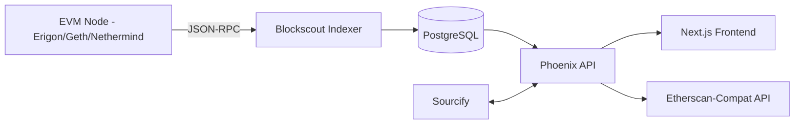

# Blockscout：开源区块浏览器

> **TL;DR**：Blockscout 是 POA Network 团队 2018 年开源的 Ethereum / EVM 区块浏览器，Apache 2.0 许可，GitHub star 3,500+。其独特之处在于"任何 EVM 链都可以自己部署一套完整浏览器"，被 Gnosis Chain、Ethereum Classic、Optimism、Polygon zkEVM、Scroll、Base（部分阶段）、Celo、Chiliz、RootstockMainnet、以及数十条 L2/L3/appchain 采用。Blockscout 与 **Sourcify** 合约验证服务深度集成，是 Etherscan 的开源替代。近年重构为前后端分离（Phoenix/Elixir 后端 + Next.js 前端），v6（2024）引入多链统一前端与 Autoscout / Merits 等产品。

## 1. 背景与动机

Etherscan 虽事实标准但闭源，对新链自部署不友好：每条 L2 若想"像以太坊一样被浏览"，只能付费请 Etherscan 团队或自建轮子。Blockscout 的初衷是：让任意 EVM 链拥有**一等公民级浏览器**。

2018 年 POA Network 团队（面向 Proof-of-Authority 联盟链）开源 Blockscout，使用 Elixir/Phoenix，原因是 Erlang OTP 的 actor 模型适合并发索引区块。后续由 Blockscout Ltd 持续维护，产品线扩展：

- **Core Explorer**：区块/tx/账户/合约；
- **Sourcify 合约验证**集成（2020+）；
- **Blockscout Hosted**：SaaS 形式为 chain 团队部署浏览器；
- **Autoscout**：一键链上部署；
- **Merits**：用户活跃奖励；
- **DEX aggregator / NFT / Multichain Explorer**（v6 新品）。

## 2. 核心原理

### 2.1 架构范式：一链一套 vs 多链聚合

Etherscan 家族是"多链多套部署 + 聚合 API"；Blockscout 传统上是"每条链独立一套 Blockscout 实例"，比如 `eth.blockscout.com`、`gnosis.blockscout.com`、`optimism.blockscout.com`。2024 起，Blockscout 发布 **Multichain Explorer**，前端统一搜索多链；后端仍是独立部署的实例。

### 2.2 Elixir/Phoenix 后端

使用 Elixir + Phoenix 的动机：

1. **并发**：Erlang 进程轻量，每个区块一个 fetcher process 轻松扩展；
2. **容错**：OTP supervisor 自动重启失败 worker；
3. **实时**：Phoenix Channels 支持 WebSocket 推送新区块；
4. **开发效率**：Ecto ORM 对 PostgreSQL 友好。

Blockscout 索引器（indexer）启动若干 supervisor：`Block Fetcher`、`Internal Tx Fetcher`、`Token Fetcher`、`Coin Balance Fetcher` 等并发运行，通过 PostgreSQL 持久化。

### 2.3 Sourcify 合约验证

Blockscout 深度集成 Sourcify，Sourcify 的核心价值：通过 **metadata hash full match** 实现"部署合约时将 metadata hash 永久写入链上，未来任意浏览器可无 API 验证源码"。验证等级：

- **Perfect Match**：metadata hash + bytecode 完全一致；
- **Partial Match**：仅 bytecode 一致（源码注释/路径可能差异）。

Blockscout 自己也支持"经典验证"（Solidity standard JSON input）以兼容老合约。

### 2.4 子机制拆解

1. **Indexer**：并发从 RPC 拉取 block / tx / logs / traces；
2. **Token Discovery**：检测 ERC-20/721/1155 合约，注册 token metadata；
3. **Verification Service**：Sourcify + 原生；
4. **NFT Metadata Fetcher**：解析 tokenURI 并缓存；
5. **Stats**：TPS、gas 平均、活跃地址；
6. **APIs**：GraphQL + REST + RPC-compatible（模拟 Etherscan API 接口以兼容生态）。

### 2.5 参数与常量

- **推荐硬件**：8 vCPU + 32 GB RAM + SSD 1TB+（Ethereum 主网归档需更多）；
- **数据库**：PostgreSQL 14+；
- **依赖**：Elixir 1.14+, Erlang OTP 25+；
- **索引延迟**：新区块 1–3s 内索引；
- **Gas / TPS Stats**：5 分钟滚动。

### 2.6 边界条件与失败模式

- **归档节点依赖**：Internal tx 与完整 trace 需要 `trace_*` RPC（Erigon / Nethermind / OpenEthereum），geth 默认不支持；
- **重组（Reorg）**：Blockscout 有专门的 Reorg Handler 自动回滚；
- **Token Discovery 漏报**：非标准合约（代理 + rebase）可能漏；
- **大链数据量**：Ethereum mainnet Blockscout 实例磁盘占用 > 5 TB；
- **启动同步慢**：首次全链索引耗时数天。



## 3. 架构剖析

### 3.1 分层视图

1. **Node Layer**：任意 EVM 归档节点（Erigon 最推荐）；
2. **Indexer Layer**：Elixir app，多 GenServer 并发；
3. **Database Layer**：PostgreSQL（主）+ 可选 Redis；
4. **API Layer**：REST + GraphQL + Etherscan-compat；
5. **Frontend Layer**：Next.js（v6 重构）；
6. **Verification Layer**：Sourcify + 内置 solc；
7. **Analytics Layer**：Stats service (TypeScript)。

### 3.2 核心模块清单

| 模块 | 职责 | 依赖 | 可替换性 |
| --- | --- | --- | --- |
| Indexer | 区块索引 | RPC + PG | Blockscout 特有 |
| API | 外部查询 | Phoenix | 可补充 TheGraph |
| Verification | 合约验证 | Sourcify + solc | 可与 Etherscan 互通 |
| NFT Handler | ERC-721/1155 metadata | IPFS / HTTP | 可自扩展 |
| Stats Service | TPS / Gas | Rust/TS | 可替换 |
| Frontend | 用户界面 | Next.js | 可 fork 定制 |
| Admin | 后台配置 | Phoenix | 有限 |

### 3.3 一次自部署的生命周期

1. 准备 Erigon 归档节点（或 RPC provider）；
2. 部署 PostgreSQL + Redis；
3. `docker-compose up`（Blockscout 提供官方 compose file）；
4. Indexer 自动从 genesis 开始回放；
5. 几天后追上最新块；
6. 配置 Sourcify endpoint；
7. 对接 ENS 解析（可选）、Chainlist chainId、原生代币 logo；
8. 部署到子域名。

### 3.4 参考实现

- `blockscout/blockscout`（后端 Elixir）；
- `blockscout/frontend`（Next.js）；
- `blockscout/stats`（TypeScript 指标服务）；
- `blockscout/smart-contract-verifier`（Rust 编写的统一 verifier）。

### 3.5 扩展 / 互操作

- **Etherscan-compat API**：Blockscout 提供 `/api?module=account&action=...` 的路由，兼容大量老工具（Hardhat 验证、各种 scripts）；
- **GraphQL**：更灵活查询；
- **Chain Indexer Module**：L2 场景可扩展"deposit/withdrawal from L1"专用索引；
- **Multichain Explorer**：聚合多个实例。

## 4. 关键代码 / 实现细节

Indexer 的 Block Fetcher（`blockscout/blockscout/apps/indexer/lib/indexer/block/catchup/fetcher.ex`，简化）：

```elixir
defmodule Indexer.Block.Catchup.Fetcher do
  use GenServer

  def handle_info(:fetch, state) do
    latest = EthereumJSONRPC.fetch_block_number("latest")
    range = state.next..(state.next + @step)
    {:ok, blocks} = EthereumJSONRPC.fetch_blocks_by_range(range)
    Chain.import(%{blocks: blocks, ...})
    schedule_next()
    {:noreply, %{state | next: List.last(range) + 1}}
  end
end
```

Etherscan-compat API（`apps/block_scout_web/lib/block_scout_web/api_router.ex`）：

```elixir
# module=account&action=txlist&address=0x...&apikey=...
get "/api", API.V1.APIController, :index
```

用户侧调用（与 Etherscan 类似）：

```bash
curl "https://eth.blockscout.com/api?module=account&action=txlist&address=0xABC"
```

部署 docker-compose 片段（`docker-compose.yml`，简化）：

```yaml
services:
  blockscout:
    image: blockscout/blockscout:latest
    environment:
      - ETHEREUM_JSONRPC_VARIANT=erigon
      - ETHEREUM_JSONRPC_HTTP_URL=http://erigon:8545
      - DATABASE_URL=postgres://postgres@db:5432/blockscout
    depends_on: [db, erigon]
  db:
    image: postgres:15
  erigon:
    image: thorax/erigon:stable
    command: ["erigon", "--chain=mainnet", "--http", "--http.addr=0.0.0.0"]
```

## 5. 演进与版本对比

| 版本 | 时间 | 变化 |
| --- | --- | --- |
| v1–v3 | 2018–2020 | Elixir + 传统 EEx 模板前端 |
| v4 | 2021 | 前后端分离起步 |
| v5 | 2022 | Sourcify 深度集成 |
| v6 | 2024 | Next.js 现代前端 + Multichain Explorer + Autoscout |
| v6.x | 2025 | Merits 用户激励、NFT 市场集成 |

## 6. 实战示例

L2 团队接入 Blockscout（假设 Rollup 名为 `demo-rollup`）：

```bash
# 1. Clone
git clone https://github.com/blockscout/blockscout.git

# 2. 配置 env
export ETHEREUM_JSONRPC_VARIANT=geth
export ETHEREUM_JSONRPC_HTTP_URL=https://rpc.demo-rollup.io
export SUBNETWORK=DemoRollup
export COIN=DRT
export CHAIN_ID=3939

# 3. 启动
docker-compose up -d

# 4. 配 Sourcify
export SOURCIFY_INTEGRATION_ENABLED=true
export SOURCIFY_SERVER_URL=https://sourcify.dev/server/

# 5. 浏览
open https://explorer.demo-rollup.io
```

## 7. 安全与已知攻击

- **开源 ≠ 零风险**：自部署运营者负责 API key 管理、数据库安全；
- **Phishing Clone**：攻击者 clone Blockscout 做假站，欺诈用户签名；社区通过 DNSSEC、CT 监控；
- **XSS 风险**：合约 name / symbol 字段若未 sanitize 可能注入 HTML，Blockscout v6 全面加了 escape；
- **RPC provider 断联**：若节点失联，indexer 会 backoff + retry；
- **Reorg 损失**：深度 reorg（L2 欺诈证明窗口内回滚）需要 indexer 正确处理，Blockscout OP Stack / zkEVM 插件提供支持。

## 8. 与同类方案对比

| 维度 | Blockscout | Etherscan | Routescan / Snowtrace 等替代 | Phalcon |
| --- | --- | --- | --- | --- |
| 许可 | Apache 2.0 | 闭源 | 闭源 | 闭源 |
| 自部署 | 是 | 不行 | 不行 | 否 |
| 合约验证 | Sourcify + 原生 | 原生 | 部分 | 同步 Etherscan |
| L2 / Rollup 友好度 | 强（很多 OP Stack / zk 使用）| 支持但贵 | 有 | 支持 |
| 社区贡献 | 活跃 | 无（闭源）| 中 | 无 |
| UI 成熟度 | v6 显著提升 | 最高 | 中 | 专业（debug）|
| 资金情报 | 弱 | 强 | 弱 | 中 |

## 9. 延伸阅读

- **官网**：`https://www.blockscout.com`
- **Docs**：`https://docs.blockscout.com`
- **GitHub**：`https://github.com/blockscout/blockscout`
- **Blog**：`https://blog.blockscout.com`
- **Sourcify**：`https://sourcify.dev/`
- **Chainlist**：`https://chainlist.org`
- **Autoscout**：`https://docs.blockscout.com/for-projects/autoscout`

## 10. 术语表

| 术语 | 英文 | 释义 |
| --- | --- | --- |
| Sourcify | Sourcify | 去中心化合约源码验证 |
| Metadata Hash | Metadata Hash | solc 写入 bytecode 的 IPFS hash |
| Etherscan-compat | Etherscan Compatible API | API 格式兼容层 |
| Indexer | Indexer | 区块索引器 |
| Reorg | Chain Reorg | 区块链重组 |
| OTP | Open Telecom Platform | Erlang 容错框架 |
| GenServer | GenServer | Elixir 进程模式 |

---

*Last verified: 2026-04-22*
