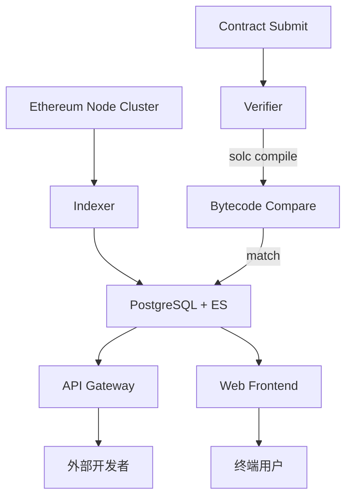

# Etherscan：架构、API、源码验证与标签

> **TL;DR**：Etherscan 是 2015 年 Matthew Tan 创立的以太坊区块浏览器，事实上是 EVM 生态最通用的链上数据入口。除浏览器页面外，Etherscan 提供 **Developer API**（REST / V2 多链聚合）、**Contract Verification**（源码验证）、**Token Approval Checker**、**Gas Tracker**、**Label Cloud / Nametag**（地址标签）、**Watchlist / Alerts** 等能力。Etherscan 的兄弟产品覆盖几十条链（BscScan、PolygonScan、Arbiscan、Optimistic Etherscan、Basescan、FTMScan、Snowtrace 早期等）。尽管近年 Blockscout、Phalcon Explorer、Arkham 崛起挑战，Etherscan 仍是开发者默认工具。

## 1. 背景与动机

2015 年以太坊主网上线后，社区缺乏一个友好浏览交易与合约的工具。Matthew Tan 以马来西亚独立开发者身份上线 `etherscan.io`，最初只是把 geth RPC 数据做 UI 渲染。随着 DApp 爆发（2017 ICO、2020 DeFi、2021 NFT），Etherscan 逐渐演进为：

- 交易/地址/Token/NFT 查询；
- 合约源码验证与 ABI 公开；
- 开发者 API（免费 + 付费限额）；
- 链上标签（Binance Hot Wallet / Tornado Router / Vitalik.eth）；
- 治理：Watch、Vote、Gas Tracker；
- 商业化：广告、企业 API 订阅、EtherScan Pro。

市场上存在开源替代（Blockscout）、更精美的 DeFi 专用（DeBank、Zapper）、更强情报的（Arkham、Nansen），但"合约源码+ABI+tx 追踪"这三件事上 Etherscan 仍是默认。

## 2. 核心原理

### 2.1 数据模型

Etherscan 的后端维护三类核心数据：

1. **链上数据**：Block、Transaction、Receipt、Log、State Diff、Trace（内部调用）；
2. **索引衍生**：Account 维度的 tx 列表、token transfer 列表、NFT 交易列表、Internal Tx 列表；
3. **链下元数据**：Contract Source Code、ABI、Verified Metadata、Name Tag、Label、Phishing Warning。

形式化地，每个地址 $a$ 维护：
- `txs(a)`：所有作为 from/to 的 tx；
- `tokenTxs(a, t)`：ERC-20/721/1155 转账；
- `meta(a)`：标签、name tag、phishing flag、源码信息。

### 2.2 源码验证（Contract Verification）

源码验证让合约字节码与用户提交的 Solidity/Vyper 源代码"可重现编译一致"。流程：

1. 用户提供：源码 / Compiler 版本 / Optimization 设置 / EVM version / Imports / Constructor args；
2. Etherscan 后端用对应 solc 编译；
3. 比对生成的 `runtime bytecode` 与链上 `eth_getCode(address)`（剥离 metadata hash 后比对）；
4. 若匹配 → 存储源码、ABI 对外公开；
5. 若不匹配 → 报告 "Bytecode does not match"。

支持 Single file / Multi-file / Flattened / JSON Standard Input 四种提交模式；Solidity 0.4.11+ 均支持。2023 起推广"**Sourcify** verification"作为补充，但 Etherscan 仍是核心。

### 2.3 Gas Tracker

Etherscan 的 Gas Tracker 监听 mempool 与最新区块，每 15 秒给出 Slow / Average / Fast 三档 Gwei 预测。算法（近似）：

- 统计最近 $N$ 个区块（典型 20）中 tx 的 `effectiveGasPrice`；
- Fast：上 25% 分位数；Average：中位数；Slow：下 25% 分位；
- 对 EIP-1559 链：Fast = $\text{baseFee} \times 1.125 + \text{priorityFee}_{p95}$。

### 2.4 Label / NameTag / Watchlist

Label Cloud 是 Etherscan 运营团队维护的地址标签库，包含：
- CEX 热钱包：Binance 14 / Kraken 6…
- 项目地址：Uniswap V3 Router
- 钓鱼地址 / Blackhole 标签
- ENS 域名映射（.eth）

Watchlist 允许用户订阅地址 → 邮件 / Webhook 告警。

### 2.5 子机制拆解

1. **Node Cluster**：自建 Erigon / geth 归档节点，提供历史 state 与 trace；
2. **Indexer**：把 block / tx / log / trace 写入主库 + 搜索引擎；
3. **Verification Service**：合约源码验证；
4. **API Gateway**：REST API，QPS 按订阅计费；
5. **Frontend**：Next.js 渲染。

### 2.6 参数与常量

- **Verification Compiler 范围**：Solidity 0.4.11 – 最新；Vyper 0.3.x+；
- **API 免费额度**：5 req/s，100,000 req/day；
- **Gas Tracker 刷新**：15s；
- **Internal Tx 覆盖**：trace 层面，依赖归档节点。

### 2.7 边界条件与失败模式

- **Metadata Hash 不一致**：solc 编译元数据末尾的 IPFS/Swarm hash 与 bytecode 中的不同，会导致假"验证失败"——Etherscan 会自动剥离；
- **Flatten 导致的 import 顺序变化**：某些版本 solc 对 flattened 源码编译结果与原始 multi-file 不同；
- **Proxy 合约**：Etherscan 会识别 EIP-1967 代理并提示"Read as Proxy"；
- **网络抖动**：Etherscan API 高峰期限流；大规模 scrape 需企业套餐。



## 3. 架构剖析

### 3.1 分层视图

1. **Node Layer**：自建 / 云端 Erigon、geth（归档 + 快照）；
2. **Ingestion Layer**：订阅 new-heads + trace_filter，ETL 到数据库；
3. **Storage Layer**：PostgreSQL（结构化数据）+ Elasticsearch（搜索）+ 对象存储（源码、ABI）；
4. **Service Layer**：REST API、Verifier、Gas Tracker；
5. **Presentation Layer**：Next.js SSR + CDN；
6. **Enterprise Layer**：企业套餐、私有 API Key、SLA。

### 3.2 核心模块清单

| 模块 | 职责 | 依赖 | 可替换性 |
| --- | --- | --- | --- |
| Node Cluster | 区块链数据源 | Erigon / geth | 可替换 |
| Block Indexer | 写入 DB | 自研 | 类 TheGraph subgraph |
| Tx Indexer | trace 级 | Erigon trace | 核心能力 |
| Verifier | 合约源码验证 | solc / vyper | 与 Sourcify 互补 |
| Gas Tracker | 费用预测 | mempool | 与 Blocknative 竞争 |
| Label DB | 人工 + 爬虫 | 内部 | 与 Arkham / Chainabuse 竞争 |
| Watchlist | 用户订阅 | 邮件 / Webhook | 可替换 Tenderly |
| API Gateway | 对外 API | Redis 限流 | 可替换 |

### 3.3 一次用户查询的生命周期

1. 用户访问 `etherscan.io/address/0xABC`；
2. 前端调用后端聚合 API：balance、tx count、token holdings、NFT holdings；
3. 后端并行从 PG / ES 取数据；
4. 若地址是合约且已验证 → 展示 Source / ABI / Read / Write Contract；
5. 若地址有 Label → 前端高亮；
6. Watchlist 用户在新 tx 到达时触发邮件。

### 3.4 参考实现 / 多链扩展

Etherscan 兄弟站（BscScan / PolygonScan / Arbiscan / Optimistic / Basescan / Snowtrace(早期) 等）共用同一代码基与运营团队。每条链需适配：

- 节点类型（OP Stack 需 op-geth + op-node 提供 L1→L2 deposit 追踪）；
- Gas 字段（ArbOS / OP 有不同 gas 结构）；
- EIP-1559 / blob；
- 资产列表。

### 3.5 扩展 / 互操作接口

- **REST API**：`api.etherscan.io/api?module=...&action=...&apikey=`；
- **V2 Multichain API**（2024+）：一个 Key 查询 50+ EVM 链；
- **Pro API**：更高限额、历史 OHLC；
- **Webhook/Alerts**：用户账号；
- **Sourcify 互认**：同一 metadata hash 可互相验证。

## 4. 关键代码 / 实现细节

Etherscan API 典型调用（文档：`docs.etherscan.io`）：

```bash
# 获取地址 ETH 余额
curl "https://api.etherscan.io/api?module=account&action=balance&address=0x...&tag=latest&apikey=$KEY"

# 获取 ERC-20 转账记录
curl "https://api.etherscan.io/api?module=account&action=tokentx&address=0x...&page=1&offset=100&sort=desc&apikey=$KEY"

# 获取合约 ABI
curl "https://api.etherscan.io/api?module=contract&action=getabi&address=0xUniswapV3Router&apikey=$KEY"

# V2 多链
curl "https://api.etherscan.io/v2/api?chainid=8453&module=account&action=balance&address=0x...&apikey=$KEY"
```

合约验证（Hardhat 插件 `hardhat-etherscan` 底层 HTTP POST）：

```bash
curl -X POST https://api.etherscan.io/api \
  -F "module=contract" \
  -F "action=verifysourcecode" \
  -F "apikey=$KEY" \
  -F "contractaddress=0xABC" \
  -F "sourceCode=@MyContract.sol" \
  -F "codeformat=solidity-standard-json-input" \
  -F "contractname=contracts/MyContract.sol:MyContract" \
  -F "compilerversion=v0.8.24+commit.e11b9ed9" \
  -F "optimizationUsed=1" \
  -F "runs=200" \
  -F "constructorArguements=0x..."
```

Hardhat 侧：

```js
// hardhat.config.js
require("@nomicfoundation/hardhat-toolbox");
module.exports = {
  etherscan: { apiKey: process.env.ETHERSCAN_KEY },
};
```

```bash
npx hardhat verify --network mainnet 0xABC "ConstructorArg1" "ConstructorArg2"
```

## 5. 演进与版本对比

| 里程碑 | 时间 | 变化 |
| --- | --- | --- |
| 主站上线 | 2015 | 基础浏览 |
| API v1 | 2016 | 免费 REST |
| Source Verify | 2017 | 合约透明度 |
| Multi-chain 家族 | 2018+ | BscScan / PolygonScan 等 |
| Gas Tracker | 2019 | 费用预测 |
| Nametag / Phishing | 2020+ | 风险提示 |
| V2 Multichain API | 2024 | 一个 Key 通吃 50+ EVM 链 |

## 6. 实战示例

脚本：查询一个地址过去 1000 笔 ERC-20 转账并输出最大笔：

```python
import requests, os
key = os.environ["ETHERSCAN_KEY"]
addr = "0xdAC17F958D2ee523a2206206994597C13D831ec7"  # USDT
r = requests.get("https://api.etherscan.io/api", params={
    "module": "account", "action": "tokentx",
    "address": addr, "offset": 1000, "page": 1,
    "sort": "desc", "apikey": key,
}).json()
txs = r["result"]
print(max(txs, key=lambda t: int(t["value"])))
```

合约开发者：部署后 `npx hardhat verify` 即可在 Etherscan 上点击 "Read/Write Contract" 与合约交互。

## 7. 安全与已知攻击

- **Phishing Verification 冒充**：攻击者用相同函数签名的"reverse engineered"版本伪装合约，Etherscan 通过 bytecode 字节级对比拦截；
- **Similar Token Name Scam**：ERC-20 允许重名，Etherscan 通过 Name Tag 标记官方合约；
- **Address Poisoning**：0-value 交易冒充地址前后缀；Etherscan 2023 起自动隐藏 0-value dust；
- **API Key 泄漏**：公共仓库泄漏导致限流；Etherscan 提供 IP 白名单；
- **API 依赖风险**：Etherscan 宕机时依赖其 API 的 DApp 降级体验，建议混合使用 Alchemy / Blockscout API。

## 8. 与同类方案对比

| 维度 | Etherscan | Blockscout | Phalcon (BlockSec) | Arkham | DeBank |
| --- | --- | --- | --- | --- | --- |
| 许可 | 闭源 | 开源（MIT/GPL）| 闭源 | 闭源 | 闭源 |
| 多链 | EVM 50+ | 公链 L1 / L2 自部署 | EVM | EVM + BTC + SOL 等 | EVM 多 |
| 合约验证 | 强 | 强（与 Sourcify 集成）| 与 Etherscan 同步 | 无 | 无 |
| Debug/Trace | 基础 trace | 高级 trace | 强（调试 IDE）| 中 | 无 |
| 标签情报 | 强 | 弱 | 中 | 最强（Intel）| 中（DeFi）|
| API 限额 | 免费 + Pro | 自部署无限 | 付费 | 付费 | 有 API |

## 9. 延伸阅读

- **API 文档**：`https://docs.etherscan.io`
- **Verification Guide**：`https://etherscan.io/verifyContract`
- **V2 API**：`https://docs.etherscan.io/etherscan-v2`
- **Blog**：`https://info.etherscan.com`
- **Sourcify**：`https://sourcify.dev/`
- **EIP-1967 Proxy Storage Slots**：用于 Etherscan 识别代理
- **Hardhat Etherscan Plugin**：`https://hardhat.org/hardhat-runner/plugins/nomicfoundation-hardhat-verify`

## 10. 术语表

| 术语 | 英文 | 释义 |
| --- | --- | --- |
| ABI | Application Binary Interface | 合约接口规范 |
| Trace | Trace | 内部调用记录 |
| Nametag | Nametag | 人类可读地址标签 |
| Verification | Source Verification | 字节码源码对照 |
| Metadata Hash | CBOR Metadata | solc 写入的元数据 IPFS 哈希 |
| Gas Tracker | Gas Tracker | 费用预测 |

---

*Last verified: 2026-04-22*
