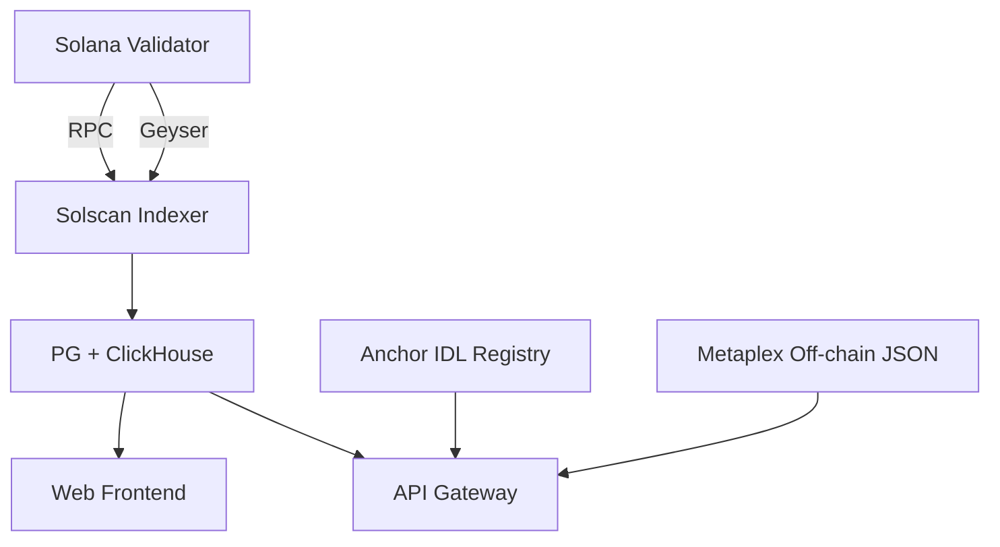

# Solscan：Solana 专属字段与 SolanaFM 对比

> **TL;DR**：Solscan 是 Solana 生态最早、也是最常用的区块浏览器，2021 年 DeFi Summer 期间迅速走红，后被 Etherscan 母公司 **Etherscan Global** 于 2024 年收购，成为 Etherscan 多链家族的一员。产品能力覆盖 Account/Token/NFT/Program 查询、Token Flow / Instruction 可视化、Solana 专属的 SPL Token Metadata / Priority Fee / Compute Units 追踪，以及 Public API 与 Pro API。主要竞品是开源 **Solana Explorer**（基金会官方，偏基础）与 **SolanaFM**（偏情报与开发者体验）。

## 1. 背景与动机

Solana 主网 2020 年 3 月上线，但高 TPS 与独特"账户模型 + Programs"设计使得传统 EVM 浏览器无法复用。2021 年 Solana DeFi/NFT 爆发，Magic Eden、Serum 催生对专业浏览器的需求。越南团队 Solscan 以"快、全、免费"取胜，抓住市场空白。其底层抓取 Solana RPC 的 `getBlock`、`getConfirmedSignaturesForAddress2`、`getTokenLargestAccounts` 等方法，结合 Anchor IDL 对 instruction 解码，解决了 Solana 日志解读难的问题。

2024 年 Etherscan 宣布收购 Solscan，整合品牌（Solscan 保留独立域名与 UI），同时提供跨 EVM 与 Solana 的统一 API 体验。

## 2. 核心原理

### 2.1 Solana 账户模型在浏览器中的表示

Solana 账户与 EVM 地址有几处关键差异，浏览器需要显式处理：

1. **Account vs Program vs Token Account**：一个 58 位 base58 地址可能是普通 SOL 钱包、可执行 Program、SPL Token Mint，或 PDA。Solscan 通过 `getAccountInfo` 的 `executable` 与 `owner` 字段识别：
   - `owner == System Program (11111111...)`：SOL wallet；
   - `owner == Token Program (Tokenkeg...)`：Token Account；
   - `owner == Token Metadata Program`：NFT / SPL Metadata；
   - `executable == true`：Program。
2. **关联 Token Account (ATA)**：每个 (wallet, mint) 对应一个 PDA 衍生 ATA，Solscan 的 "Tokens" 页展示该钱包下的所有 ATA 余额；
3. **PDA 解码**：若地址为某 Program 的 PDA，可反查 seeds（若 Program 提供 IDL）。

### 2.2 Instruction 解码（IDL-driven）

Solana 交易由 Instructions 组成，每条包含 `program_id`、`accounts[]`、`data`（字节码）。对 `data` 解码必须知道 Program 定义。Solscan 维护 Anchor IDL 库：

1. 当浏览器看到新 tx 中 `program_id = X`，查 IDL 库；
2. 若存在 IDL，则按 IDL 的 `instructions` 字段匹配 discriminator（前 8 byte）；
3. 根据 IDL 反序列化 `data`，展示"Swap(amount_in=100, amount_out_min=95)"而不是裸 hex。

SolanaFM 做类似事，但提供更丰富的 IDL + Anchor events 解码。

### 2.3 Token Flow 可视化

Solana 中一笔 tx 可以同时涉及多个 mint 与多个 token account 之间的转账。Solscan 对每笔 tx 展示 Token Flow：

- 输入：`getTransaction` 返回的 `preTokenBalances`、`postTokenBalances`；
- 对比得到"谁的 X mint 减少了 Y 数量"；
- 用箭头可视化，便于识别 Swap / Mint / Burn。

### 2.4 子机制拆解

1. **Archival RPC**：自建 Solana 归档节点（极高磁盘成本，单节点 10+ TB）；
2. **Geyser Plugin**：订阅 Solana Validator 的 Geyser 插件输出（account update / slot / tx），实时索引；
3. **SPL Token Registry**：维护 token 名字 / logo / verified 标签；
4. **Priority Fee 追踪**：Solana 交易可选 Priority Fee（Micro-lamports/Compute Unit），浏览器显示平均 CU 成本；
5. **Compute Unit Meter**：展示 tx 消耗的 CU（上限 1.4M / tx）；
6. **NFT Metadata**：对 Metaplex NFT 抓取 off-chain JSON metadata 并展示图像。

### 2.5 参数与常量

- **Slot 出块时间**：约 400ms；
- **CU 上限**：1,400,000 / tx；
- **Priority Fee 单位**：micro-lamports/CU；
- **Solscan Public API 免费限额**：5 req/s；
- **Solana 节点数据量**：全量 Ledger 日增约 80 GB。

### 2.6 边界条件与失败模式

- **RPC 丢数据**：Solana validator 可能丢弃 `getConfirmedSignaturesForAddress2` 的历史，浏览器需要归档节点；
- **Token Account Close**：SPL token close 后数据可能缺失；
- **Program Upgrade**：Program 可升级（BPFLoaderUpgradeable），IDL 可能过期；
- **Rust Enum 变体**：Anchor 对 enum 数据解码需要最新 IDL；老 tx 用新 IDL 解码可能错。



## 3. 架构剖析

### 3.1 分层视图

1. **节点层**：多个 Solana 归档节点 + Geyser 订阅；
2. **索引层**：把 account / tx / instruction / token balance 写入 ClickHouse；
3. **IDL 层**：Anchor / 非 Anchor 的 instruction decoder；
4. **API 层**：Public + Pro API；
5. **前端层**：React SPA；
6. **元数据层**：SPL token list、NFT metadata 镜像。

### 3.2 核心模块清单

| 模块 | 职责 | 依赖 | 可替换性 |
| --- | --- | --- | --- |
| Validator Fleet | 数据源 | 自建 + Helius / Triton | 可替换 |
| Geyser Indexer | 实时索引 | Solana Geyser API | 开源替代：Yellowstone gRPC |
| ClickHouse | 分析存储 | - | 可替换 |
| IDL Registry | Anchor / custom 解码 | Anchor IDL | 与 SolanaFM 互补 |
| Token Registry | SPL 资产元数据 | Jupiter / Solana Labs list | 可替换 |
| NFT Metadata Cache | 图像缓存 | IPFS / Arweave | 可替换 |
| Pro API | 付费高限额 | 订阅 | 与 Helius 竞争 |

### 3.3 一次 tx 展示的数据流

1. 用户访问 `solscan.io/tx/<sig>`；
2. 前端调用 `/api/transaction/<sig>`；
3. 后端组装：①`getTransaction`、② IDL 解码、③ pre/post balance 差分、④ 关联账户 label、⑤ program 名称；
4. 前端渲染 Token Flow、Instruction 列表、Logs。

### 3.4 参考实现 / 参考竞品

- **Solana Explorer**（基金会）：开源，偏底层；
- **SolanaFM**：偏开发者工具 + 情报；
- **XRAY**（Helius 出品）：更现代 UI；
- **Solana Beach**：偏网络层（validator 状态）。

### 3.5 扩展与互操作

- Pro API 返回 JSON，与 Dune / 自建分析栈对接；
- Webhook 订阅大额转账、NFT 交易；
- Solscan Chrome 插件显示地址风险提示。

## 4. 关键代码 / 实现细节

Solscan Public API 示例（`public-api.solscan.io/docs`）：

```bash
# 账户信息
curl -H "token: $SOLSCAN_KEY" \
  "https://public-api.solscan.io/account/7xKXtg2CW87d97TXJSDpbD5jBkheTqA83TZRuJosgAsU"

# SPL Token 持仓
curl -H "token: $SOLSCAN_KEY" \
  "https://public-api.solscan.io/account/tokens?account=..."

# Tx 细节
curl -H "token: $SOLSCAN_KEY" \
  "https://public-api.solscan.io/transaction/<signature>"
```

Anchor IDL 解码示例（Rust 伪代码）：

```rust
use anchor_lang::AnchorDeserialize;

fn decode(idl: &Idl, data: &[u8]) -> Option<Instruction> {
    let discriminator = &data[..8];
    let ix_def = idl.instructions.iter()
        .find(|ix| compute_discriminator(&ix.name) == discriminator)?;
    let args = ix_def.args.iter().map(|arg| {
        AnchorDeserialize::deserialize(&mut &data[8..])
    }).collect();
    Some(Instruction { name: ix_def.name.clone(), args })
}
```

典型 Solana JS 客户端读取 Token Account：

```ts
import { Connection, PublicKey } from "@solana/web3.js";
import { getParsedAccountInfo } from "@solana/spl-token";

const conn = new Connection("https://api.mainnet-beta.solana.com");
const ata = new PublicKey("...");
const info = await conn.getParsedAccountInfo(ata);
console.log(info.value?.data);
// -> { program: "spl-token", parsed: { info: { mint, owner, tokenAmount } } }
```

## 5. 演进与版本对比

| 里程碑 | 时间 | 变化 |
| --- | --- | --- |
| v1 | 2021 | 基础 SOL / Token 查询 |
| NFT 支持 | 2021 Q4 | Metaplex 解析 |
| Pro API | 2022 | 付费套餐 |
| IDL 解码增强 | 2023 | 更多 Program 原生解码 |
| Etherscan 收购 | 2024 | 进入 Etherscan 家族 |
| V2 Multichain API | 2024–2025 | 与 Etherscan V2 联动 |

## 6. 实战示例

场景：追踪某 NFT 的铸造与最近交易。

```
1. 访问 solscan.io/token/<mint>
2. 查看 "NFT Info"：image、creator royalty、collection
3. "Transfers" tab：所有 Mint / Transfer / Burn 记录
4. 点击 tx → 展示 instruction（如 "Mint via CandyMachine"）
5. 若是 Metaplex V2 compressed NFT，Solscan 会解析 Merkle Tree 并显示 leaf index
```

## 7. 安全与已知攻击

- **虚假 Token**：与 ERC-20 类似，任何人可创建同名 SPL token。Solscan 通过 Jupiter Verified List + 官方社区反馈维护 "Verified Tag"；
- **Scam NFT Airdrop**：攻击者 airdrop 假 NFT 至用户地址，URL 指向钓鱼站；Solscan 默认隐藏带可疑域名的 NFT；
- **Phantom / Backpack 钱包集成**：直接点击"查看交易"跳转 Solscan，提供链上验证体验；但 Solscan 自身若被攻破可作为钓鱼入口，需注意 Tempus 风险；
- **Program Upgrade 风险**：Program 升级可能改变 instruction 行为，Solscan 会更新 IDL，但历史 tx 语义按旧 IDL；
- **RPC 数据不一致**：部分查询可能出现 stale 数据，建议重要操作以 validator 为准。

## 8. 与同类方案对比

| 维度 | Solscan | Solana Explorer (基金会) | SolanaFM | XRAY (Helius) | Solana Beach |
| --- | --- | --- | --- | --- | --- |
| UI 友好度 | 高 | 中（偏官方简洁）| 高 | 最高（现代化）| 中 |
| IDL 解码 | 覆盖广 | 基础 | 深（事件 + 自定义）| 深 | 少 |
| 开发者 API | Public + Pro | 无 | API | Helius API | 基础 |
| NFT | 强 | 中 | 强 | 强 | 无 |
| 网络 / Validator 信息 | 少 | 中 | 少 | 少 | 强 |
| 归属 | Etherscan Global | Solana Foundation | 独立 | Helius | 独立 |

## 9. 延伸阅读

- **Solscan**：`https://solscan.io`
- **Public API Doc**：`https://public-api.solscan.io/docs`
- **Pro API**：`https://pro-api.solscan.io/`
- **SolanaFM**：`https://solana.fm`
- **Solana Explorer**：`https://explorer.solana.com`
- **XRAY**：`https://xray.helius.xyz`
- **Anchor IDL Spec**：`https://www.anchor-lang.com/docs/idl`
- **Geyser Plugin**：`https://docs.solana.com/validator/geyser`

## 10. 术语表

| 术语 | 英文 | 释义 |
| --- | --- | --- |
| PDA | Program Derived Address | 程序派生地址 |
| ATA | Associated Token Account | 关联 Token 账户 |
| IDL | Interface Definition Language | Anchor 接口定义 |
| CU | Compute Units | Solana tx 计算单元 |
| SPL | Solana Program Library | Solana 官方程序库 |
| Metaplex | Metaplex | NFT 标准与工具链 |
| Geyser | Geyser Plugin | Validator 数据订阅插件 |

---

*Last verified: 2026-04-22*
