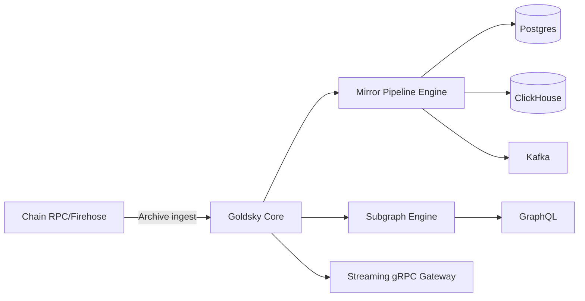

# Goldsky 流式索引与 Mirror

> **TL;DR**：Goldsky 是 2022 年推出的 Web3 数据基础设施公司，以"Subgraphs + Mirror + Streaming"三件套定位高吞吐实时索引。**Subgraphs**：托管 The Graph 兼容的 Subgraph（对已写好 Subgraph 的团队零迁移成本），并提供 Instant Subgraph（通过 ABI 一键生成）。**Mirror**：把链上事件直接 pipe 到 PostgreSQL / ClickHouse / BigQuery / Kafka / Elasticsearch 等目标表，类似"Fivetran for blockchain"。**Streaming**：基于 StreamingFast Firehose，提供 gRPC 级实时区块/事件流，延迟 <500ms。Goldsky 采用 Serverless + 列式 Archive 后端，支撑 Aave、Polymarket、Zora 等大 DApp 的实时数据层。

## 1. 背景与动机

The Graph Hosted Service 关停后，许多团队发现：Subgraph 开发体验好但 Decentralized Network 的定价（按查询付费 + Curator bonding curve 波动）、同步速度（Arbitrum 回填 >24h）难以接受；Subsquid 灵活但自托管。Goldsky 填补"**托管 + 低延迟 + 多目标 Sink**"的空位，尤其对"不想学 GraphQL，只想把事件塞进已有数仓"的团队极具吸引力。

创始人 Kevin Li、Jeff Ling，背景来自 Hudson River Trading 与 StreamingFast。2022 年种子轮，2023 年 A 轮由 Dragonfly 领投 $20M。

核心哲学：**"Data as a first-class primitive"**——以数据库视角看区块链，用户应当像管理 PostgreSQL 数据管道一样声明"某合约的某事件 → 某表"。这避开了 Subgraph 的 "entity model"，直接拥抱 SQL/OLAP。

## 2. 核心原理

### 2.1 Mirror 的数据流模型

形式化：`Mirror Pipeline = Source × Transform × Sink`：

- **Source**：Dataset（预制的 `erc20_transfers`, `uniswap_v3_swaps` 等）或 Subgraph Entity。
- **Transform**：SQL / JavaScript / GraphQL filter（可选 join、decimals 转换、价格富化）。
- **Sink**：Postgres、Snowflake、BigQuery、ClickHouse、Kafka、Elasticsearch、Webhook、S3。

Pipeline 以 YAML 声明：

```yaml
name: usdc_transfers_to_pg
sources:
  - type: dataset
    name: ethereum.erc20_transfers
    filter: "contract_address = '0xa0b86991...'"
sinks:
  - type: postgres
    host: db.example.com
    table: usdc_transfers
    mode: append
```

### 2.2 Subgraph 增强

Goldsky 对原生 Subgraph 做多项增强：

1. **Webhook on entity changes**：entity 写入触发 HTTP 回调，取代轮询。
2. **Instant Subgraph**：给一个 ABI + address，自动生成基础 Transfer/Swap subgraph，部署即查询。
3. **Subgraph Composability**：多个 Subgraph Union 聚合查询（实验性）。
4. **无需 IPFS 部署**：直接上传，自动进 Studio 般体验。
5. **Backfill 加速**：基于内部 Firehose-like Archive，速度 5-10x。

### 2.3 Streaming（Firehose）

Goldsky 授权 StreamingFast 的 Firehose，底层 `dfuse` 协议：区块以 Protobuf 序列化、通过 gRPC 流送到客户端。每 block 包含所有 tx/logs/trace，适合构建自有 Processor。延迟典型 <500ms（Ethereum slot 后 500ms 内到达客户端）。

### 2.4 Chain 覆盖

Ethereum、Arbitrum、Optimism、Base、Polygon、Avalanche、BSC、Fantom、Blast、Zora、Linea、Mantle、Gnosis、Celo、Scroll、Mode、Starknet（读）、Solana（Mirror）、Tron（Mirror）、Bitcoin（Runes 数据）、Sui（Beta）。

### 2.5 一致性语义

Mirror 支持三种交付语义：

- **at-least-once**（默认）：故障重放时可能重复，需 sink 端 upsert。
- **exactly-once**（Kafka, BigQuery Storage Write）：借助 sink 事务原语。
- **reorg-aware**：对 reorg 深度 ≤ N 自动发起补偿事件（带 `_reorg_` flag），要求 sink 能 UPDATE/DELETE。

### 2.6 参数

| 参数 | 值 |
| --- | --- |
| Reorg handling depth | 可配，默认 64 blocks |
| Streaming latency p50 | ~300ms |
| Firehose batch | 1 block / msg |
| Mirror max TPS | ~50k rows/s per pipeline |
| Subgraph 回填速度 | 5-10x Hosted |

### 2.7 失败模式

- **Sink 不可用**：buffer 到内部队列；超 retention（默认 24h）丢弃。
- **Schema Drift**：sink 表结构与源不匹配时 pipeline 暂停，需手动 reconcile。
- **Reorg 超深**：超过配置深度的 reorg 需手动 backfill。

### 2.8 数据富化（Enrichment）

Mirror 支持对事件流做"在线富化"——在写入 sink 前 join 元数据：

- **Decimals normalization**：ERC-20 原始 `value` 为 `uint256`，Mirror 可按 token metadata 转成 `decimal(38,18)`。
- **USD pricing**：与内置 `prices.usd_hourly` 表 join，实时换算美元金额。
- **ABI decoding on the fly**：上游 raw `logs` 未解码时，通过 ABI Registry 在线 decode。
- **Deduplication**：按 `(tx_hash, log_index)` 主键去重，保证 exactly-once。
- **JavaScript Transforms**（Beta）：写 JS 函数自定义字段映射。

富化步骤以 DAG 形式编排，Goldsky 内部用类似 Flink 的算子实现，事件乱序通过 `block_number` + `log_index` watermarks 处理。

### 2.9 与 Subgraph 的互补

Mirror ≠ Subgraph 的替代，而是互补：

- **Subgraph**：适合 entity 形态（Pool、Position、User），需要 GraphQL 关系查询。
- **Mirror**：适合事件流（Transfer、Swap），需要时序分析或接入 BI。
- **组合**：用 Subgraph 做业务层 state，用 Mirror 同步同一事件到数仓做分析，两边数据互为交叉验证。

### 2.10 架构图



## 3. 架构剖析

### 3.1 分层

```
L1  Ingest        自建 Archive + Firehose 客户端
L2  Storage       列式 Data Lake（Parquet on S3）
L3  Transform     Pipelines / Flink 风格流处理
L4  Sink Adapters JDBC / gRPC / HTTP / Kafka SDK
L5  API           Dashboard / CLI / REST API
```

### 3.2 模块清单

| 模块 | 职责 | 可替换性 |
| --- | --- | --- |
| Archive Ingestor | 同步链数据 | 可切 Firehose |
| Data Lake (Iceberg/Parquet) | 历史存储 | 自研 |
| Pipeline Engine | 声明式 YAML 执行 | 类 Flink |
| Subgraph Runtime | graph-node fork | 兼容开源 |
| Streaming Gateway | gRPC/WSS | 基于 Firehose |
| CLI (goldsky) | 部署、监控 | 必需 |

### 3.3 Pipeline 生命周期

1. `goldsky pipeline create` 提交 YAML。
2. Backfill 阶段：Goldsky 从 Archive 扫目标窗口（可 dry-run）。
3. Live 阶段：接入 Firehose 流，写 sink。
4. 监控：Lag、error rate、throughput。
5. 销毁：`goldsky pipeline delete`。

### 3.4 参考实现

全部闭源 SaaS（非开源），客户端 CLI 开源 `goldsky-cli`（Go）。

### 3.5 接口

- REST API：`/v1/pipelines`、`/v1/subgraphs`。
- CLI：YAML + `goldsky deploy`。
- gRPC Streaming。
- GraphQL（Subgraph 查询）。

### 3.6 客户端多样性与数据湖后端

Goldsky 内部使用 ClickHouse 作为主要 OLAP 引擎，Iceberg 作为数据湖表格式，Kafka 为事件总线，Flink-style job 作 Mirror 处理。对客户侧不暴露这些细节，但"resource_size"参数决定分配给 pipeline 的 worker CPU/RAM。对需要极低延迟的场景，客户可选 Streaming 订阅直接消费 gRPC 避免 sink 滞后。

### 3.7 Observability

Dashboard 展示：Backfill progress、Current lag（block 数、秒）、Error rate、Records per sec、Sink lag。CLI `goldsky pipeline monitor <name>` 输出实时 metrics；配合 Prometheus / Datadog 接入企业监控。

## 4. 关键代码 / 实现细节

Mirror Pipeline YAML（示例，文档：`https://docs.goldsky.com/mirror/create-a-pipeline`）：

```yaml
name: aave_v3_liquidations
resource_size: s
apiVersion: 3
sources:
  my_liquidations:
    type: dataset
    dataset_name: ethereum.decoded_logs
    filter: "contract_address = '0x87870Bca3F3fD6335C3F4ce8392D69350B4fA4E2' AND event_signature = 'LiquidationCall(address,address,address,uint256,uint256,address,bool)'"
    start_at: earliest
transforms: {}
sinks:
  my_pg:
    type: postgres
    table: aave_v3_liquidations
    schema: public
    secret_name: MY_PG
    from: my_liquidations
```

部署：

```bash
goldsky pipeline apply aave_v3_liquidations.yaml --use-ssh
goldsky pipeline monitor aave_v3_liquidations
```

Subgraph 部署命令：

```bash
goldsky subgraph deploy my-subgraph/1.0.0 --path ./build
goldsky subgraph webhook create --name on-new-pool ...
```

## 5. 演进与版本对比

| 版本 | 时间 | 关键变化 |
| --- | --- | --- |
| v0 | 2022 | Subgraph hosting |
| Mirror GA | 2023 | 声明式 sink |
| Streaming | 2023 Q4 | Firehose gRPC |
| Instant Subgraphs | 2024 | Auto-generate from ABI |
| Pipelines v3 | 2025 | Exactly-once sinks |

## 6. 实战示例

30 秒把 USDC Transfer 实时入 Postgres：

```bash
pnpm dlx @goldskycom/cli@latest login
cat > pipe.yaml <<'EOF'
name: usdc_live
apiVersion: 3
sources:
  s:
    type: dataset
    dataset_name: ethereum.erc20_transfers
    filter: "contract_address = '0xa0b86991c6218b36c1d19d4a2e9eb0ce3606eb48'"
    start_at: latest
sinks:
  pg:
    type: postgres
    table: usdc_transfers
    secret_name: PG
    from: s
EOF
goldsky pipeline apply pipe.yaml
```

预期：`SELECT count(*) FROM usdc_transfers;` 每秒增长。

## 7. 安全与已知问题

- **Secret 管理**：sink 凭证存在 Goldsky Vault，加密；用户需评估依赖第三方 key custody 的合规性。
- **Reorg 处理**：虽内置补偿，下游 BI 仪表要小心"回撤"，避免统计口径跳变。
- **Pipeline lag 雪崩**：sink 压力大时 lag 累积，需升级 resource_size。
- **Instant Subgraph 语义损失**：自动生成 entity 粗粒度，复杂业务仍需手写。

## 8. 与同类方案对比

| 维度 | Goldsky | The Graph | Subsquid | Flipside | Dune |
| --- | --- | --- | --- | --- | --- |
| 侧重 | 流式 + 数仓集成 | 去中心化索引 | 自托管灵活 | 免费 SQL | SQL 分析 |
| Sink 多样 | 最强 | 弱 | 中 | N/A | N/A |
| 实时延迟 | <500ms | 取决 Indexer | <1s | 分钟级 | 分钟级 |
| Subgraph 兼容 | 是 | 原生 | 否 | 否 | 否 |
| 去中心化 | 否 | 是 | 部分 | 否 | 否 |
| 定价 | 订阅 + CU | 查询费 | 免费+SaaS | 免费 | 订阅 |

## 9. 延伸阅读

- https://docs.goldsky.com/
- https://docs.goldsky.com/mirror/introduction
- Streaming: https://docs.goldsky.com/streaming-subscriptions/overview
- Dragonfly Blog：Goldsky 投资文
- Case Study: Polymarket scale with Goldsky

## 10. 术语表

| 术语 | 英文 | 释义 |
| --- | --- | --- |
| Mirror | Mirror | 流式数据管道 |
| Pipeline | Pipeline | 一条 Mirror 管道 |
| Dataset | Dataset | 预制源（ERC20、Swap 等） |
| Sink | Sink | 目的地数据库/消息队列 |
| Firehose | Firehose | StreamingFast gRPC 协议 |
| Instant Subgraph | Instant Subgraph | ABI 自动生成 Subgraph |

---

*Last verified: 2026-04-22*
