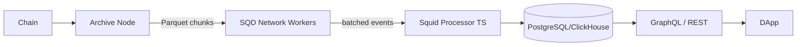

# Subsquid（SQD）索引框架

> **TL;DR**：Subsquid（2024 年改名为 SQD Network）是 The Graph 的强劲竞争者，主打"高吞吐 + TypeScript + 灵活后端"。核心由 **Archive Nodes**（压缩存储历史区块的专用节点）+ **Squid Framework**（TypeScript 处理器）+ **SQD Network**（去中心化数据湖，SQD 代币激励）组成。相比 Subgraph 的 AssemblyScript + GraphQL 固定范式，Squid 允许开发者使用完整 Node.js 生态（TypeORM、Prisma、自选数据库 PostgreSQL/ClickHouse/BigQuery），并通过 Archive 批量拉取数据（而非逐块），使得全历史回填速度快 10 – 100x。适合需要 ETL + SQL 分析、跨链聚合、以及非 EVM 链（Substrate、Solana、TRON）的场景。

## 1. 背景与动机

Subgraph 为"DApp 内嵌索引"而生，但有几个天花板：

1. **AssemblyScript 生态贫瘠**：无法直接用 npm 库、ORM、HTTP 请求。
2. **单一 PostgreSQL + GraphQL**：分析师更想要 SQL/ClickHouse。
3. **回填慢**：graph-node 必须顺序回放，Polygon 全历史需数周。
4. **非 EVM 支持有限**：Substrate 曾支持但生态窄。
5. **去中心化成本**：Indexer 最低 100K GRT，小团队运维成本高。

Subsquid 2021 年由 Dmitry Zhelezov（前 Parity 工程师）创立，以 Substrate 为起点，后扩展 EVM。核心洞察：**"把索引分两步：冷数据（Archive）+ 热处理（Squid Processor）"**——冷数据由 Archive 节点一次性压缩/列式存储 Parquet，Squid 直接批量读取数千区块，极大减少 RPC 开销。

2023 年推出 SQD Network（原 Subsquid Cloud），引入 $SQD 代币（SQD Network 子网），定位为"数据层 DePIN"。2024-2025 年主网上线，Worker 节点提供 Archive 数据块，Gateway 分发请求。

## 2. 核心原理

### 2.1 Archive–Processor 两层模型

形式化：Subsquid 将索引分解为 `Index = Extract(Archive) ∘ Transform(Squid) ∘ Load(DB)`：

- **Archive Node**：长驻同步全链原始数据（blocks + txs + logs + traces），按 10k-block chunk 压缩为 Parquet 存 S3/IPFS。索引 key 按 topic0、contract、block。
- **Squid Processor**：TS 程序，按 `EvmBatchProcessor` 声明订阅的 `(contract, topic)` 过滤器，Archive 返回批量事件（batch size 1000+），Processor 解码并写目标 DB。
- **API Layer**：可选 GraphQL Server（@subsquid/graphql-server）或 Squid 内置 OpenAPI，或完全自定义。

### 2.2 EvmBatchProcessor

```ts
import { EvmBatchProcessor } from '@subsquid/evm-processor'
const processor = new EvmBatchProcessor()
  .setGateway('https://v2.archive.subsquid.io/network/ethereum-mainnet')
  .setRpcEndpoint({ url: 'https://rpc.ankr.com/eth', rateLimit: 10 })
  .setFinalityConfirmation(75)
  .setBlockRange({ from: 12369621 })
  .addLog({
    address: [UNISWAP_V3_FACTORY],
    topic0: [factoryAbi.events.PoolCreated.topic],
  })
  .setFields({ log: { topics: true, data: true }, transaction: { hash: true } })
```

Archive Gateway 返回批量 `{ blocks: [...] }`，Processor 以 `processor.run(db, async ctx => { ... })` 迭代。

### 2.3 数据存储自由

- **PostgreSQL + TypeORM**（默认 Squid 模板）：适合 GraphQL 场景。
- **ClickHouse**：分析师聚合场景，支持亿级事件秒级 OLAP。
- **BigQuery**：跨链 + 链下数据联合分析。
- **自定义**：Processor 逻辑是普通 TS，你可以 write to Kafka / Elasticsearch / Kinesis。

### 2.4 SQD Network 去中心化数据湖

SQD Network 引入 Worker 节点质押 SQD 代币，承担 Archive 数据分片的存储与响应。核心机制：

- **DataChunks 分片**：10k 区块为一 chunk，hash 作 ID。
- **Erasure Coding**：数据以 5-of-10 erasure code 存储，提高可用性。
- **Worker 选举**：Gateway 按 Proximity + Reputation + Stake 选 Worker。
- **Challenge**：随机数据完整性挑战，失败 slash。

### 2.5 非确定性容忍

Squid Processor 可以调用 HTTP、读取链下 DB、使用任意库，因为不需要 PoI——Subsquid 中心化运营保证一致性（或由个人部署私有）。代价是去中心化程度弱于 The Graph，但灵活度高出一个数量级。

### 2.6 参数与常量

| 参数 | 值 | 说明 |
| --- | --- | --- |
| Archive chunk size | 10,000 blocks | 按链可调 |
| Finality confirmation | 75 blocks (EVM) | 防 reorg |
| Batch size | 1000-5000 events | 权衡延迟/吞吐 |
| SQD min stake (Worker) | 100,000 SQD | 去中心化网络 |
| Gateway fee | ~0.0001 SQD / req | 查询定价 |

### 2.7 失败模式

- **Processor crash**：重启从上次 checkpoint 继续，幂等性由开发者保证。
- **Archive lag**：Archive 晚于 chainhead 1-5 分钟，实时性要求高需切 RPC 补足 head。
- **Schema migration**：改实体需 `sqd db migration:generate && sqd db migration:apply`，非 The Graph 的"冷启动"。

### 2.8 Hot Block Reorg 处理

Subsquid 对尾部区块不走 Archive（因为 Archive 按 final block 批量）。Processor 通过 RPC endpoint 直接拉取尾部 N 个 block（`finalityConfirmation` 默认 75），对每个 entity 写入标记 `_block: number`。发生 reorg 时，Processor 检测到 parent hash 不连续，回滚最新 N block 的 entity ops，重放新链。TypeORM Store 用行级 snapshot 实现 revert。

### 2.9 多数据源 & Substrate/Solana

同一 Squid 可同时订阅 EVM + Substrate + 链下 API：

```ts
// 同时索引 ETH 和 Polkadot 跨链桥
const evm = new EvmBatchProcessor()...
const sub = new SubstrateBatchProcessor()...
```

Solana Processor 使用独立的 `@subsquid/solana-stream` 包，因 Solana 的账户模型与 EVM 差异大。

### 2.10 流程图



## 3. 架构剖析

### 3.1 分层视图

```
Layer 1  Archive Node          单独同步的压缩存储（S3/IPFS Parquet）
Layer 2  SQD Network Gateway   查询路由 + Worker 选择
Layer 3  Squid Processor       TypeScript 批处理器
Layer 4  Database              PostgreSQL/ClickHouse/BigQuery
Layer 5  API                   GraphQL/OpenAPI/自定义
```

### 3.2 模块清单

| 模块 | 包名 | 职责 | 可替换性 |
| --- | --- | --- | --- |
| evm-processor | `@subsquid/evm-processor` | EVM 批处理 | 换 substrate-processor / solana-processor |
| typeorm-store | `@subsquid/typeorm-store` | TypeORM 集成 | Prisma/Drizzle |
| graphql-server | `@subsquid/graphql-server` | GraphQL 自动生成 | 可用 Hasura |
| cli | `@subsquid/cli (sqd)` | 构建、部署、DB migration | 必需 |
| file-store | `@subsquid/file-store` | 输出到 S3/Parquet | 可选 |
| archive-gateway | 服务端 | Gateway API | 必需（托管或自建） |

### 3.3 生命周期

1. **sqd init** — 脚手架（EVM 模板、Substrate 模板、Solana 模板）。
2. **编写 schema.graphql + src/processor.ts + src/main.ts**。
3. **sqd codegen** — 生成 TypeORM entity。
4. **sqd build && sqd up** — 本地 docker-compose 启动 PG + Processor。
5. **sqd deploy** — 推送到 SQD Cloud（SaaS）。
6. **监控** — `sqd logs`、`sqd metrics`。

### 3.4 参考实现

官方开源全部工具链（MIT License），squid-sdk 是主仓库。还可自托管 Archive Node：

```bash
docker run -p 8888:8888 subsquid/eth-archive-worker:latest --data-dir /data ...
```

### 3.5 互操作接口

- **GraphQL** Hasura-style 自动生成（filter/orderBy/pagination）。
- **OpenAPI** 自定义 REST。
- **Arrow/Parquet** 直接导出给 DuckDB/Spark。

## 4. 关键代码 / 实现细节

完整 Squid Processor 示例——文档：`https://docs.subsquid.io/evm-indexing/`：

```ts
// src/main.ts
import { processor } from './processor'
import { TypeormDatabase } from '@subsquid/typeorm-store'
import { Pool } from './model'
import * as factoryAbi from './abi/UniswapV3Factory'

processor.run(new TypeormDatabase(), async ctx => {
  const pools: Pool[] = []
  for (const block of ctx.blocks) {
    for (const log of block.logs) {
      if (log.topics[0] !== factoryAbi.events.PoolCreated.topic) continue
      const e = factoryAbi.events.PoolCreated.decode(log)
      pools.push(new Pool({
        id: e.pool.toLowerCase(),
        token0: e.token0, token1: e.token1,
        fee: BigInt(e.fee),
        createdAt: BigInt(block.header.timestamp / 1000),
      }))
    }
  }
  await ctx.store.insert(pools)
})
```

GraphQL 查询：

```graphql
query { pools(limit: 5, orderBy: createdAt_DESC) { id token0 token1 fee } }
```

## 5. 演进与版本对比

| 版本 | 时间 | 关键变化 |
| --- | --- | --- |
| Subsquid v0 | 2021 | 仅 Substrate |
| v1 EVM | 2022 | 增加 EVM processor |
| FireSquid | 2023 | Archive v2，gRPC 流 |
| SQD Rebrand | 2024 | Subsquid → SQD，引入代币 |
| SQD Network | 2025 | Worker 主网、Erasure Coding |

## 6. 实战示例

Hello World Squid：

```bash
npx @subsquid/cli init my-squid -t evm
cd my-squid
npm install
sqd build
sqd up            # docker-compose 启 PG
sqd process       # 运行 processor
sqd serve         # 启动 GraphQL
```

访问 `http://localhost:4350/graphql`，查询 Transfer 事件。

## 7. 安全与已知问题

- **中心化风险**：SQD Cloud 托管有单点；生产建议自托管或使用 SQD Network。
- **Processor 崩溃丢失数据**：若 DB 事务与 checkpoint 不原子（老版本），会导致重启时跳块。新版已用单事务写入。
- **Archive 数据信任**：Archive 节点可能返回假数据，SQD Network 未来用签名 + 挑战机制；当前可对关键事件做 RPC 抽检。
- **Rate limit**：公共 Archive Gateway 有限流，生产需自建或付费 SaaS。

## 8. 与同类方案对比

| 维度 | Subsquid/SQD | The Graph | Goldsky | Ponder | Envio |
| --- | --- | --- | --- | --- | --- |
| 开发语言 | TypeScript | AssemblyScript | Subgraph/Mirror | TypeScript | TypeScript/ReScript |
| 数据库 | PG/ClickHouse/BQ | PG | PG/BigQuery | PG/SQLite | PG |
| 回填速度 | 极快（Archive） | 慢 | 快（Firehose） | 中 | 极快 |
| 去中心化 | 部分（SQD Network） | 完全 | 否 | 否 | 否 |
| 非 EVM | Substrate/Solana | 多链 | 多链 | EVM | EVM |
| 成本 | 免费自托管/SaaS | 查询费 | SaaS | 免费自托管 | SaaS |

## 9. 延伸阅读

- 官方：https://docs.subsquid.io/
- GitHub：https://github.com/subsquid/squid-sdk
- SQD Network 技术白皮书：https://www.sqd.dev/whitepaper
- 对比文章：Subsquid vs The Graph（官方 blog 2023）
- Substrate Indexing 教程

## 10. 术语表

| 术语 | 英文 | 释义 |
| --- | --- | --- |
| Squid | Squid | Subsquid 的索引单元 |
| Archive | Archive Node | 压缩历史数据节点 |
| Processor | Processor | 批处理器 TS 程序 |
| SQD | $SQD | SQD Network 代币 |
| Chunk | Data Chunk | 10k 区块打包 |

---

*Last verified: 2026-04-22*
