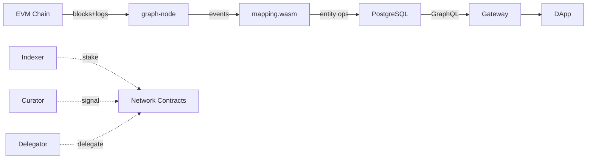

# The Graph 去中心化索引网络

> **TL;DR**：The Graph 是区块链数据的"Google"：通过 Subgraph 定义链上事件-to-实体映射（schema.graphql + mapping.ts + subgraph.yaml），由去中心化 Indexer 网络同步、索引并以 GraphQL 对外提供查询。其经济模型由 GRT 驱动，Indexer 质押服务查询、Delegator 委托 GRT 分享收益、Curator 为优质 Subgraph 信号站位、Consumer 通过查询费支付。2023 年"Sunrise of Decentralized Data"关停 Hosted Service，迫使所有 Subgraph 迁移至主网。技术上 graph-node 基于 Rust，支持 Ethereum、Arbitrum、Polygon、Optimism、Base、Avalanche、BSC、Gnosis、Celo、NEAR、Solana 等 30+ 链。Subgraph 适合事件驱动、关系明确的数据形态（DEX 交易、NFT 铸造、治理投票），但对 time-series 聚合、跨链关联等场景较弱，需搭配 Dune/Subsquid 等方案。

## 1. 背景与动机

区块链原始数据以 block/transaction/log 形式保存在 P2P 节点中，JSON-RPC 只能定位点读（by hash/number）或有限范围扫描（`eth_getLogs` + Bloom filter）。DApp 前端要展示"用户最近 100 笔 Uniswap Swap"或"NFT Collection 的地板价 & 持有者分布"，必须对 logs 二次索引、反范式化到关系数据库。早期项目（2017-2018）每家自建 ETL 管道 + PostgreSQL + REST API，重复投入且难以互通。

The Graph 由 Yaniv Tal、Jannis Pohlmann、Brandon Ramirez 于 2018 年创立，借鉴 Google PageRank 与传统 SQL/GraphQL 思维，提出"用声明式 Schema 映射链上事件"：把"定义数据模型"与"索引执行"解耦。开发者只需写 YAML 描述数据源（合约地址、事件 signature）、GraphQL schema、以及 AssemblyScript 映射函数，The Graph Node 负责回放链上历史、执行映射、存入 PostgreSQL，并以 GraphQL endpoint 暴露。

Hosted Service（2018-2024）免费托管，推动 Uniswap、Aave、Synthetix、Compound 等头部协议标准化其数据层。2020 年主网上线 GRT 代币，逐步切换到 Decentralized Network（由 Indexer 运行）。2023 年 4 月"Sunrise of Decentralized Data" 启动，2024 年中完全停止 Hosted，Subgraph Studio + Network 成为唯一路径。

## 2. 核心原理

### 2.1 形式化模型

Subgraph 可形式化为映射 `S = (D, E, M, Σ)`：
- `D` = Data Sources（合约地址 + ABI + startBlock）
- `E` = GraphQL Schema（实体及关系）
- `M` = Mapping 函数集合 `{ m : Event → ΔState }`
- `Σ` = 当前累计状态（存储于 PostgreSQL）

不变式：对任意区块高度 `h`，存在确定性状态 `Σ_h = Σ_0 + Σ_{i=1..h} M(events_i)`。Reorg 时需回滚至分叉点：`Σ_h → Σ_{h-k}`。

查询定义：`GraphQL(q, Σ_h) → result`，支持过滤、排序、嵌套关系。

### 2.2 Subgraph 三件套

1. **`subgraph.yaml`** — manifest，声明数据源与 trigger：

```yaml
specVersion: 1.0.0
schema: { file: ./schema.graphql }
dataSources:
  - kind: ethereum/contract
    name: UniswapV3Factory
    network: mainnet
    source:
      address: "0x1F98431c8aD98523631AE4a59f267346ea31F984"
      abi: UniswapV3Factory
      startBlock: 12369621
    mapping:
      kind: ethereum/events
      apiVersion: 0.0.7
      language: wasm/assemblyscript
      entities: [Pool, Token]
      abis: [{ name: UniswapV3Factory, file: ./abis/Factory.json }]
      eventHandlers:
        - event: PoolCreated(indexed address, indexed address, indexed uint24, int24, address)
          handler: handlePoolCreated
      file: ./src/factory.ts
```

2. **`schema.graphql`** — 实体：

```graphql
type Pool @entity {
  id: ID!
  token0: Token!
  token1: Token!
  fee: BigInt!
  liquidity: BigInt!
  createdAt: BigInt!
}
type Token @entity { id: ID!, symbol: String!, decimals: Int! }
```

3. **`mapping.ts`** — AssemblyScript 处理器：

```ts
import { PoolCreated } from '../generated/UniswapV3Factory/UniswapV3Factory'
import { Pool } from '../generated/schema'
export function handlePoolCreated(event: PoolCreated): void {
  const pool = new Pool(event.params.pool.toHex())
  pool.token0 = event.params.token0.toHex()
  pool.token1 = event.params.token1.toHex()
  pool.fee = BigInt.fromI32(event.params.fee)
  pool.liquidity = BigInt.zero()
  pool.createdAt = event.block.timestamp
  pool.save()
}
```

### 2.3 Indexer / Delegator / Curator / Consumer 四角色

- **Indexer**：质押 ≥ 100K GRT 成为 Indexer，提供索引与查询服务。分到查询费（Query Fee）+ 通胀奖励（Indexing Reward）。
- **Delegator**：把 GRT 委托给 Indexer，抽佣（Indexer 设置 10-100%）。无 slashing，但 unbonding 28 天。
- **Curator**：对 Subgraph 进行 GRT 信号（signal），绑定曲线（Bancor-like），早期 signal 获得的"curation share"按比例领取未来查询费的 10%。信号期内存在 bonding curve 风险。
- **Consumer**：DApp 通过 Gateway（如 Edge & Node Gateway）购买 Query Key，预付 GRT，按查询次数扣费。

### 2.4 经济学参数

| 参数 | 值 | 可治理 |
| --- | --- | --- |
| 通胀率 | 3% 年（Indexer 奖励） | 是（GIP 投票） |
| Curator 分成 | 10% of query fees | 是 |
| Indexer min stake | 100,000 GRT | 是 |
| Delegator unbond | 28 epochs (~28 天) | 是 |
| Epoch 长度 | ~6,646 blocks (1 天) | 是 |
| 协议 fee | 1% burned | 是 |

### 2.5 Proof of Indexing (PoI)

为防 Indexer 伪造索引结果，协议使用 PoI——基于所有实体状态构建 Merkle Root，Indexer 每个 epoch 必须提交其 PoI。被 Fisherman 挑战时若错误，Indexer 被 Slash 2.5% 质押。PoI 计算使用 SHA3 迭代所有 entity update。

### 2.6 Firehose & Substreams

StreamingFast 加入 The Graph 后引入 **Firehose**（区块流 gRPC 协议）与 **Substreams**（Rust + WASM 并行流式处理）。Substreams 允许以 DAG 形式组合映射逻辑，速度比 Subgraph 快 100x，但学习曲线更陡。Subgraph 可"sink to Substreams"反向复用。

### 2.7 失败模式

- **Reorg 深度超 50**：graph-node 默认 reorgThreshold 50，超出后 panic，需重同步。
- **Non-deterministic mapping**：`block.timestamp` 安全；随机、浮点、外部 HTTP 调用禁止（会导致 Indexer 间结果分歧，PoI 不一致）。
- **Schema Migration**：改 schema 需重新部署版本，历史索引无法无缝迁移。
- **Subgraph Fail**：handler throw 导致 subgraph 暂停，Indexer 需手动 `graphman unfail`。

### 2.8 数据流图



## 3. 架构剖析

### 3.1 分层视图

```
Layer 1  区块链客户端          JSON-RPC / Firehose / Trace
Layer 2  Ingestor              Block Polling / Stream
Layer 3  Runtime               WASM VM 执行 mapping.ts
Layer 4  Store                 PostgreSQL + IPFS (manifest)
Layer 5  Query Engine          GraphQL → SQL 翻译
Layer 6  Gateway + Network     Indexer selection / Auth / Billing
```

### 3.2 核心模块

| 模块 | 路径 | 职责 | 可替换性 |
| --- | --- | --- | --- |
| ethereum adapter | `graph-node/chain/ethereum` | 解析 blocks/logs/traces | 可替换为其他 chain adapter |
| runtime | `graph-node/runtime/wasm` | 宿主 mapping wasm | 强绑定 |
| store | `graph-node/store/postgres` | 实体持久化 + reorg 回滚 | 仅 PG |
| graphql | `graph-node/graphql` | GraphQL 解析 | 强绑定 |
| firehose | `substreams/firehose-*` | 流式区块源 | 可选 |
| indexer-agent | 独立仓库 | 部署 Subgraph / 参与拍卖 | 必需 |
| gateway | Edge & Node Gateway | 请求路由 + 签名 + 计费 | 可自建 |

### 3.3 Subgraph 生命周期

1. **开发** — `graph init` → 本地 `graph codegen` + `graph build`。
2. **部署到 Studio** — `graph deploy --studio <name>` → IPFS 上传清单，得到 subgraph-id。
3. **发布到 Network** — Studio UI "Publish" → on-chain 合约 `subgraphDeployed`。
4. **Curator Signal** — bonding curve 买 signal。
5. **Indexer 同步** — Indexer 选 signal 高的部署，本地 graph-node 同步至 chainhead。
6. **查询** — Consumer 通过 Gateway 请求，Gateway 根据 QoS（delay、freshness、price）选择 Indexer，签名微交易。
7. **争议** — Fisherman 挑战 PoI，Arbitrator 仲裁，Slash。

### 3.4 客户端多样性

- **graph-node**（Rust）官方唯一实现。
- Subsquid、Goldsky Mirror、Envio、SimpleHash 在 Subgraph 生态外建立替代，但互不兼容 manifest 格式。
- The Graph Studio 提供 Hosted Indexer（仍为中心化过渡）。

### 3.5 扩展接口

- GraphQL over HTTP & WS subscription。
- IPFS 存储 subgraph manifest 与 mapping WASM。
- Horizon 升级（2025）引入 Data Services 抽象，支持 Substreams 与 SQL Subgraphs（实验性）。

## 4. 关键代码 / 实现细节

`graph-node` 区块消费循环（简化）——仓库 `graphprotocol/graph-node`，文件 `chain/ethereum/src/chain.rs`：

```rust
// 参考: https://github.com/graphprotocol/graph-node
pub async fn process_block(&self, block: BlockWithTriggers<Chain>) -> Result<()> {
    let mut transaction = self.store.begin_transaction()?;
    for trigger in block.triggers {
        let outputs = self.runtime.handle_trigger(&trigger).await?;
        for entity_op in outputs.entity_operations {
            transaction.apply(entity_op)?;
        }
    }
    transaction.commit(block.ptr())?;
    Ok(())
}
```

GraphQL 查询示例（Uniswap v3 Subgraph）：

```graphql
{
  pools(first: 10, orderBy: totalValueLockedUSD, orderDirection: desc) {
    id
    token0 { symbol }
    token1 { symbol }
    feeTier
    totalValueLockedUSD
    volumeUSD
  }
}
```

Gateway 请求（The Graph Network 主网）——文档：`https://thegraph.com/docs/en/querying/querying-the-graph/`：

```bash
curl -X POST \
  -H "Content-Type: application/json" \
  -d '{"query":"{ pools(first:5) { id } }"}' \
  https://gateway.thegraph.com/api/${API_KEY}/subgraphs/id/${SUBGRAPH_ID}
```

## 5. 演进与版本对比

| 版本 | 时间 | 关键变化 |
| --- | --- | --- |
| Hosted Service | 2018 | 免费托管 |
| Mainnet v1 | 2020 | GRT / Indexer / Curator 上线 |
| L2 Gateway | 2021 | 支持 Arbitrum 索引 |
| Substreams | 2023 | StreamingFast 并入，gRPC 流式 |
| Sunrise | 2023-2024 | Hosted 关停，全部上主网 |
| Horizon | 2025 | Data Services 抽象、SQL Subgraphs Beta |

## 6. 实战示例

本地构建一个 ERC-20 Transfer Subgraph：

```bash
npm install -g @graphprotocol/graph-cli
graph init --from-contract 0xA0b86991c6218b36c1d19D4a2e9Eb0cE3606eB48 \
  --protocol ethereum --network mainnet --abi ./USDC.json my/usdc-transfers
cd usdc-transfers
graph codegen && graph build
graph auth --studio <DEPLOY_KEY>
graph deploy --studio usdc-transfers
```

预期：Subgraph Studio 显示 sync 进度，同步到 head 后可在 Playground 查询 `{ transfers(first:5) { from to value } }`。

## 7. 安全与已知问题

- **Non-deterministic handler** 会导致 Indexer PoI 分歧，查询失败；务必用 `log.info` 而非 `console.log` 并避免 `Date.now()`。
- **Reorg 超深度**：深分叉未回滚（如 Polygon Heimdall 曾出现 128 block reorg）触发 subgraph fail。
- **Front-running Attack on Curation**：2021 年有机器人在新 Subgraph 发布块抢购 signal，后抛售获利（改进后引入 min delay）。
- **GRT 通胀稀释**：早期 Delegator 收益被大量释放稀释，2023 GIP-0090 降低通胀。
- **Hosted Service 迁移风险**：Sunrise 后仍有 legacy DApp 使用 dead endpoint，需强制迁移。

## 8. 与同类方案对比

| 维度 | The Graph | Subsquid | Goldsky | Dune | SubQuery |
| --- | --- | --- | --- | --- | --- |
| 数据模型 | 实体 + GraphQL | SQL/TypeORM + GraphQL | Subgraph + Mirror(表) | SQL | Entity + GraphQL |
| 去中心化 | 是（GRT） | 否（中心化，计划中） | 否 | 否 | 是（SQT） |
| 性能 | 中 | 高（Archive Node 优化） | 高（Firehose） | 很高（数据仓库） | 中 |
| 跨链 | 多链各独立 | 多链+ETL | 多链 | 100+ 链 | 多链 |
| 成本 | 查询付费 | 自托管/SaaS | SaaS | 订阅 | 自托管/SaaS |
| 适用场景 | DApp 前端通用 | 复杂逻辑 + 自托管 | 高吞吐流式 | 分析师 SQL | 多 substrate |

## 9. 延伸阅读

- 官方文档：https://thegraph.com/docs/
- graph-node 源码：https://github.com/graphprotocol/graph-node
- Network Spec：https://thegraph.com/docs/en/network/overview/
- Substreams：https://substreams.streamingfast.io/
- GIP-0090 通胀调整：https://forum.thegraph.com/
- 经典教程：The Graph Academy

## 10. 术语表

| 术语 | 英文 | 释义 |
| --- | --- | --- |
| Subgraph | Subgraph | 索引定义单元 |
| Indexer | Indexer | 质押运行 graph-node 的节点 |
| Curator | Curator | 信号好 Subgraph 的角色 |
| Delegator | Delegator | 委托 GRT 者 |
| PoI | Proof of Indexing | 索引证明 |
| GRT | GRT | The Graph 代币 |
| Mapping | Mapping | Event → Entity 处理逻辑 |
| Firehose | Firehose | StreamingFast gRPC 流 |

---

*Last verified: 2026-04-22*
