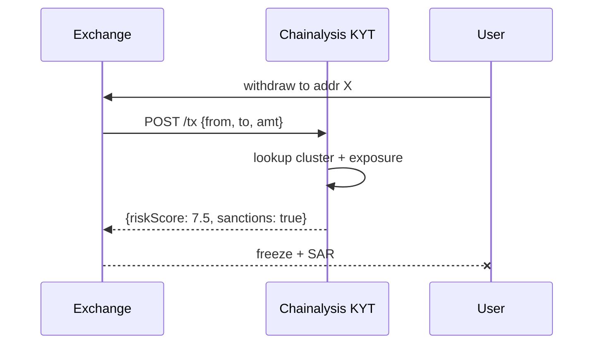

# Chainalysis KYT/Reactor 合规与执法调查

> **TL;DR**：Chainalysis 是加密合规领域的"Bloomberg + Palantir"，2014 年由 Michael Gronager（前 Kraken CTO）与 Jan Møller 创立于纽约/哥本哈根。旗舰产品：**KYT (Know Your Transaction)** 实时交易风险评分（CEX/OTC/Bank 集成）、**Reactor** 调查取证（IRS/FBI/警察与合规团队使用）、**Kryptos** 实体数据库、**Business Data** 宏观分析、**Address Screening API**。核心资产是覆盖 BTC/ETH/BSC/Polygon/Solana/TRON 等 25+ 链、超 **10 亿地址**的风险图谱，以及与 OFAC、EU、UK 制裁名单的实时同步。Chainalysis 数据被美国财政部、FinCEN、Europol 等执法机构引用，曾协助破获 Bitfinex 盗币案（2022 追回 $3.6B BTC）、Colonial Pipeline 勒索软件案、Ronin 桥 Lazarus Group 追踪。年营收 2024 年约 $150M，2021 年估值 $8.6B。

## 1. 背景与动机

2013 年 Silk Road 查封让执法机构意识到加密资产可被追踪。Chainalysis 提供"聚类分析 + 实体归因"工具，对 Bitcoin UTXO 使用 common-input-ownership、change-address heuristics 映射至 CEX/Mixer/Darknet。2015 年起陆续被 FBI、IRS 采购，2018 年扩展到 Ethereum / Token。

对金融机构而言，接收/发送加密资产必须满足 FATF Travel Rule、BSA（美国）、5AMLD/MiCA（欧盟）、FinCEN 指南。其核心要求：**发送端需 screen 接收地址是否涉及制裁/盗币/赌博/Mixer**。这是一个"链上 Compliance-as-a-Service"的刚需。

## 2. 核心原理

### 2.1 实体聚类与风险评分

Chainalysis 把地址归入 **Clusters**（同一 owner 地址集合）。核心启发式：

- **UTXO Common Input Ownership**：BTC 中同一 tx 的多输入归同主。
- **Change Address Heuristic**：精细度 + peel chain 追踪 change。
- **Behavioral Clustering**：on-chain pattern（频次、金额、counterparty）。
- **Off-chain Intel**：破获案件、泄露数据库、合作 CEX 的 KYC 共享。
- **Exchange Deposit Address Clustering**：某 CEX 为用户分配子地址，通过多次整合归入主 hot wallet。

每 cluster 标注 Category：

```
Exchange / Mining Pool / Gambling / Mixer / Darknet Market / Ransomware
Scam / Stolen Funds / Terrorism Financing / Sanctioned / P2P / DeFi
```

**Risk Score**：根据入/出方向与跳数（exposure depth）计算 0-10 分。例如：某钱包 2 跳内 5% 资金来自 Ransomware，得 8.5/10。

### 2.2 KYT（Know Your Transaction）

实时 API：CEX 在接收存款前/后调用，返回：

- `exposureReport`: 来源/去向的 category 占比；
- `riskScore`: 单次 tx 风险分；
- `sanctionsHits`: 是否命中 OFAC SDN 列表；
- `alerts`: 触发规则（如 "direct_exposure_to_mixer >$10k"）。

CEX 根据评分做 accept/review/reject，并记录 SAR（Suspicious Activity Report）。

### 2.3 Reactor（调查工具）

Reactor 是图形化调查平台，侦探输入一个地址/txhash，交互式展开：

- **Flow**：资金流向图，多跳追踪，过滤金额/时间；
- **Entity**：关联实体卡片（CEX/Mixer）；
- **Filters**：按 token、链、日期；
- **Cross-chain**：BTC → Wormhole → ETH 顺流；
- **Export**：generate PDF 取证报告。

Reactor + 链下司法手段（法庭传唤 CEX KYC）=> 大部分严重案件可追踪。

### 2.4 Screening API

轻量 API，仅返回 "sanction hit yes/no"，用于 DeFi 前端/桥合规检查。许多 L2 Sequencer（如曾引发争议的 Aave、dYdX）曾使用 Screening 禁止 OFAC 地址。

### 2.5 参数

| 参数 | 值 |
| --- | --- |
| 覆盖地址 | 10亿+ |
| 覆盖链 | 25+ |
| SDN 同步 | <24h |
| KYT API SLA | 99.9% |
| 定价 | 企业级，$50k+/年起 |

### 2.6 失败模式

- **误报 (False Positive)**：普通用户与被标"Scam"地址偶发交互即高 risk。
- **漏报 (False Negative)**：新 Mixer/bridge 未及时归类。
- **混币挑战**：Tornado Cash / Wasabi CoinJoin 阻断追踪；Chainalysis 2022 声明"Tornado 去匿名化可能"引发社区反驳。
- **cross-chain bridge 盲区**：对新 bridge 缺乏归因。
- **隐私 coins**：Monero / Zcash shielded pool 几乎无法追踪。

### 2.7 Kryptos 与 Storyline

- **Kryptos**：Chainalysis 的市场数据产品，提供 token classification（security vs utility）、流通供应、合规风险评级，被 Moody's 等评级机构集成。
- **Storyline**：2023 年推出，把复杂跨链资金流以"叙事图"展示——给调查员一键生成带时间轴的资金故事板。底层依赖 Chainalysis cross-chain attribution 模型。

### 2.8 合规规则引擎

KYT 支持自定义规则 DSL：

```
IF direct_exposure(category='Darknet Market') > 10% AND amount_usd > 1000
THEN severity='Severe' ACTION='Alert+Freeze'
```

规则可基于：
- `direct_exposure` 一跳；`indirect_exposure` N 跳；
- `cluster_category`、`sanctions_hit`；
- `behavioral_flag`（peel chain、round-numbered 多频）；
- `transfer_corridor`（from jurisdiction A to B）。

CEX 通常维护几十条规则，触发不同 severity → 不同审查流程。

### 2.9 Travel Rule 集成

Chainalysis 与 **Notabene、Sumsub** 合作支持 FATF Travel Rule：VASP 之间发送 >$1000 加密资产需附带 originator/beneficiary 信息。Chainalysis 负责地址-to-VASP 归因，Notabene 负责 off-chain messaging。

### 2.10 流程图



## 3. 架构剖析

### 3.1 分层

```
L1  Chain Ingest      全节点 + Archive（BTC, ETH, etc.）
L2  Cluster Engine    UTXO heuristics + ML
L3  Labels & Intel    OSINT + Case data + CEX partners
L4  Risk Engine       exposure graph + scoring
L5  Products          KYT / Reactor / Screening API / Kryptos
```

### 3.2 模块清单

| 模块 | 职责 |
| --- | --- |
| Chain Nodes | 覆盖 BTC/ETH/BSC/TRON/SOL etc. |
| Cluster DB | 地址 → 集群映射 |
| Label Pipeline | 自动 + 人工标注 |
| Graph DB | 实体/流动 graph |
| Rule Engine | 自定义规则 + SDN 同步 |
| Reactor UI | Electron/Web 调查工具 |
| Compliance API | REST、Webhook |

### 3.3 调查 Journey

1. 分析师输入 Tornado 入金地址。
2. Reactor 展开上游：前 3 跳至某 CEX 提现地址。
3. 法院传唤 CEX 取 KYC 记录。
4. 锁定自然人身份。
5. 生成 PDF 证据。

### 3.4 参考实现

闭源企业软件。部分 Chainalysis **Free Screening API**（sanctions-only）提供给小团队使用，无需合同。

### 3.5 接口

- REST API（KYT/Screening）
- SFTP 批量
- Reactor GUI
- Webhook（alert）
- OFAC/EU sanction list 直接同步

### 3.6 参考实现

全部闭源企业软件，但 Chainalysis 每年发布 **Crypto Crime Report**（数百页宏观报告）、Chainalysis Academy 免费课程，对合规工作者建立行业标准。

### 3.7 客户细分

- **Government**：FBI/IRS-CI/EUROPOL/UK NCA 等，使用 Reactor + Kryptos。
- **Financial Institutions**：银行、支付（Revolut/Wise）、stablecoin issuer（Circle）使用 KYT。
- **Crypto Native**：Coinbase、Kraken、BitGo、custody。
- **Insurance / Audit**：保险公司承保 crypto fund 前依赖 Chainalysis 评分。

### 3.8 数据更新节奏

- SDN 列表同步：OFAC 发布后 <24h。
- 新 Cluster 归因：从多日到数周（依赖新情报）。
- 新链接入：通常 Q 级别（bitcoin、eth 最快；Solana、Tron 2022-2024 陆续）。

## 4. 关键代码 / 实现细节

Screening API 示例——文档：`https://public.chainalysis.com/api/v1/`：

```bash
curl -X GET "https://public.chainalysis.com/api/v1/address/0x7F367cC41522cE07553e823bf3be79A889DEbe1B" \
  -H "X-API-Key: ${CHAINALYSIS_KEY}"
```

返回：

```json
{
  "identifications": [{
    "category": "sanctions",
    "name": "SDN: Tornado Cash",
    "description": "...",
    "url": "https://ofac.treasury.gov/..."
  }]
}
```

KYT API（伪，企业文档仅授权查看）：

```python
import requests
resp = requests.post('https://api.chainalysis.com/api/kyt/v2/users/UUID/transfers/received',
  headers={'Token': KYT_KEY},
  json=[{'network':'BTC','asset':'BTC','transferReference':'txhash','transactionHash':'...','outputAddress':'bc1...','assetAmount': 1.5, 'timestamp': '2026-04-22T00:00:00Z'}])
```

## 5. 演进与版本对比

| 版本 | 时间 | 关键变化 |
| --- | --- | --- |
| Reactor v1 | 2015 | BTC 调查工具 |
| KYT | 2018 | 实时合规 API |
| Token support | 2019 | ERC-20/ERC-721 |
| Solana / Tron | 2021-22 | 非 EVM |
| Crypto Crime Report | 年度 | 宏观分析报告 |
| Storyline | 2023 | 跨链资金叙事 |
| AI Alerts | 2024 | LLM 辅助分析 |

## 6. 实战示例

使用 Free Sanctions API 做前端防御：

```js
async function checkSanction(addr){
  const r = await fetch(`https://public.chainalysis.com/api/v1/address/${addr}`,{
    headers:{'X-API-Key':process.env.CHAINALYSIS_PUBLIC_KEY}
  })
  const d = await r.json()
  return d.identifications?.length > 0
}
```

前端在 `connect wallet` 后调用 `checkSanction`，若命中则禁用交易 UI。

## 7. 安全与已知事件

- **Bitfinex 2016 Hack 追回**：2022 年 FBI 借助 Chainalysis 追回 94k BTC。
- **Colonial Pipeline 2021**：追回 63.7 BTC。
- **Ronin/Lazarus**：追踪朝鲜洗币路径。
- **Tornado Cash 制裁**：OFAC 2022/8 列入 SDN，Chainalysis 同步更新。后续 Tornado 部分制裁被美国法院裁定越权（2024），Chainalysis 调整标签。
- **隐私社区抨击**：Chainalysis 被指"大规模 surveillance"，与加密去中心化精神冲突。
- **审计失误**：曾误判某 Lightning 节点为 Mixer 导致客户封禁，赔偿。

## 8. 与同类方案对比

| 维度 | Chainalysis | Elliptic | TRM Labs | Crystal | Arkham |
| --- | --- | --- | --- | --- | --- |
| 侧重 | KYT + 执法 | KYT + NFT | KYT + DeFi risk | KYT | Intel Graph |
| 覆盖链 | 25+ | 25+ | 30+ | 20+ | 20+ |
| 执法合作 | 最强 | 强 | 中 | 中 | 弱 |
| Free Tier | Sanctions Only | 无 | 无 | 无 | Alpha tier |
| UI | Reactor | Investigator | TRM Forensics | Crystal Expert | Visualizer |

## 9. 延伸阅读

- 官方：https://www.chainalysis.com/
- 文档：https://docs.chainalysis.com/
- Crypto Crime Report 每年：https://www.chainalysis.com/reports/crypto-crime-report/
- OFAC SDN list: https://home.treasury.gov/
- MiCA 法规文本
- 反对声音：EFF "Surveillance in Blockchain"

## 10. 术语表

| 术语 | 英文 | 释义 |
| --- | --- | --- |
| KYT | Know Your Transaction | 交易风险评分 |
| Reactor | Reactor | 调查工具 |
| Cluster | Cluster | 地址集群 |
| Exposure | Exposure | 暴露于风险类别的程度 |
| SAR | Suspicious Activity Report | 可疑活动报告 |
| SDN | Specially Designated Nationals | 美国制裁名单 |
| Travel Rule | Travel Rule | FATF 转账信息传递要求 |

---

*Last verified: 2026-04-22*
