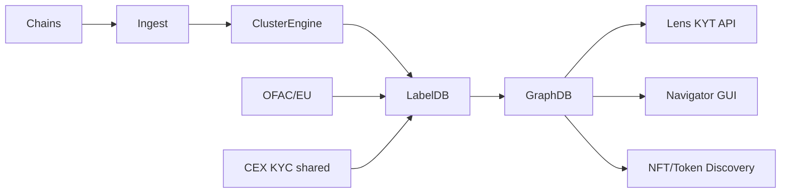

# Elliptic 合规监控与 NFT 反洗钱

> **TL;DR**：Elliptic 2013 年创立于伦敦，是与 Chainalysis 齐名的加密合规服务商之一，客户含 Revolut、Barclays、Circle、FTX（破产前）、Coinbase 等。产品线：**Navigator**（调查工具）、**Lens**（KYT 实时筛查）、**Discovery**（RWA/NFT 侦查）、**Tax**（税务合规）、**Holistic Screening**（跨链、DeFi、NFT、法币入金一体化）。差异化定位：更强的**跨链图分析**与**NFT 洗钱**检测；推出全球首个学术级加密资产分类（2013 与 MIT 合作发布 "Elliptic Data Set"，后成为机器学习反洗钱基准）。在欧盟 MiCA、英国 Travel Rule、新加坡 MAS 合规圈影响力尤大。

## 1. 背景与动机

Elliptic 创始人 James Smith、Adam Joyce、Tom Robinson（皇家学会院士背景），比 Chainalysis 更早诞生。早期偏学术 + 企业咨询，后随合规需求爆发转向 SaaS。

Elliptic 的三个历史性贡献：

1. **2013 年首个 BTC 地址 de-anonymization 论文**；
2. **2019 年 "Elliptic Data Set"** 开源发布（20 万比特币交易 + 49 类标签），至今仍是学界 AML GNN 模型基准；
3. **NFT Money Laundering 报告（2021 开始年度）** 把 NFT wash trading、盗版 NFT 销赃纳入主流视野。

与 Chainalysis "执法先行" 不同，Elliptic 更偏"持续 KYT + 欧盟合规咨询"。

## 2. 核心原理

### 2.1 跨链图（Holistic Graph）

Elliptic 的 Holistic Screening 把 BTC / ETH / Stablecoin / bridge 构成统一图：

- Node：Address 或 Cluster。
- Edge：Transfer（支持 cross-chain，通过 bridge heuristics 桥接）。
- Label：Entity (CEX/DeFi/Scam/Mixer)。

评分：`HolisticScore = f(exposure, cross_chain_jump, mixer_proximity)`。

跨链归因是核心壁垒——Wormhole/Stargate/Across bridge 事件被自动关联为同 entity 的两链地址。

### 2.2 NFT 反洗钱

NFT 洗钱方式：

- **Self-wash trading**：自买自卖抬价后卖给他人。
- **High-value sale at discount**：洗钱者把"脏钱"用高价购 NFT 转给共犯，变现合法。
- **Stolen NFT laundering**：盗 NFT 经多 hop 后抛售。

Elliptic 用图异常检测 + price oracle 识别：

```
NFT laundering score = anomaly(price_vs_floor) × counterparty_risk × self_trade_ratio
```

### 2.3 Lens KYT

面向 CEX / Fintech，RESTful：

- 地址筛查：`risk_score`, `exposure_breakdown`, `sanctions_check`.
- 交易筛查：inbound/outbound，支持 DeFi protocol enrichment（Uniswap swap、Aave borrow 等）。
- 客户归属：多 address 组绑定到一个 customer_id。

### 2.4 Navigator 调查

GUI 平台，侦探可交互展开 cross-chain graph，支持：

- 自动 bridge 解析；
- 时间过滤；
- Save-case / 协作标注；
- Export to PDF for court。

### 2.5 Elliptic Data Set（学术）

Elliptic1 数据集：203,769 BTC 交易，49 个特征，预标注 23 类标签（illicit/licit/unknown）。被论文 "Anti-Money Laundering in Bitcoin" (2019) 用作 GCN benchmark。2024 年发布 Elliptic2（扩展 cross-chain）。这使得 Elliptic 在学界知名度远高于 Chainalysis。

### 2.6 参数

| 参数 | 值 |
| --- | --- |
| 覆盖链 | 25+ |
| 地址库 | 10亿+ |
| SDN 同步 | 实时 |
| 数据集 | Elliptic1/2 开源 |
| 定价 | 企业，$30k+/年起 |

### 2.7 失败模式

- **DeFi enrichment 滞后**：新协议未解析则风险评估少信息。
- **Bridge heuristic 误差**：LayerZero/Wormhole 极速 bridge 归因难。
- **Mixer 新变种**：Railgun / Privacy Pool 尚无完整对策。
- **NFT wash detection**：跨集合 wash 链条长，漏检。

### 2.8 Discovery（RWA/NFT 深度分析）

Discovery 产品针对新兴资产类：

- **NFT Provenance**：一 NFT 铸造 → 交易历史 → 是否经 wash / mixer。
- **RWA Tokenization Audit**：链上代币化金融资产的发行路径审计（USDC/USDT 储备、BlackRock BUIDL 基金）。
- **DeFi Pool Exposure**：Uniswap/Curve 池子中的脏钱比例，为 LP 提供风控。

### 2.9 Elliptic Academy 与监管咨询

Elliptic Investigator Academy 提供官方认证培训，是执法机构必修；其 compliance team 与 FATF、MiCA 起草组、MAS 持续顾问，方法论直接影响立法。相比 Chainalysis 更多"产品供给"，Elliptic 更多"标准制定"。

### 2.10 高级检测：Peel Chain / Mixing Patterns

Peel Chain 是常见洗钱模式：大笔资金 → 每步剥离小额转向 CEX 兑换 → 残余继续剥离。Elliptic 通过图算法识别 peel chain 的 topology：同一 cluster 在固定时间窗口内产生 N 个相近金额的 outgoing，且绝大多数指向不同 CEX deposit address。

### 2.11 架构图



## 3. 架构剖析

### 3.1 分层

```
L1  Chain Ingest      BTC/ETH/BSC/TRON/SOL/Multi-L2
L2  Cluster & Label   heuristics + ML + OSINT
L3  Graph             Neo4j-like graph DB, cross-chain
L4  Risk Engine       rule + ML scoring
L5  Products          Lens API / Navigator / Discovery
```

### 3.2 模块清单

| 模块 | 职责 |
| --- | --- |
| Ingest | 多链全节点 |
| Cluster | heuristics (UTXO + change + behavior) |
| Label Pipeline | 自动 + 人工 + 监管同步 |
| Graph | cross-chain edge |
| Risk Scoring | 评分规则 |
| API / UI | Lens / Navigator |

### 3.3 案例 Journey

某 CEX 收到 10 BTC 存款：

1. Lens 调用，返回 `risk=5.5, exposure: mixer 20%`.
2. 合规 team 升级到 Navigator 细看路径。
3. 发现来自已制裁 mixer，5 跳内。
4. Freeze + SAR 报告至 FinTRAC。

### 3.4 参考实现

闭源。Elliptic Data Set 开源。

### 3.5 接口

- Lens REST API、Navigator Web、SFTP 批量、Webhook、Sanctions alert feed。

### 3.6 参考实现

核心系统闭源。Elliptic Data Set 开源于 Kaggle，Github 有 `elliptic-data-set` 样例 notebook（第三方）。PyTorch Geometric / DGL 社区常用它做 GNN benchmark。

### 3.7 部署模式

- **Cloud SaaS**：标准订阅。
- **On-premise**：受高度监管金融机构（如瑞士私行）可选本地部署 Lens/Navigator，数据不出境。
- **Hybrid**：地址图在云上，客户交易数据在本地 VPN 同步。

### 3.8 Investigation 集成

Navigator 可导出 PDF / i2 Notebook 格式（英国警方常用）、CSV 供 Palantir / MS Sentinel 进一步关联。

## 4. 关键代码 / 实现细节

Lens API 示例——文档：`https://docs.elliptic.co/reference`：

```bash
curl -X POST "https://aml-api.elliptic.co/v2/wallet/synchronous" \
  -H "x-access-key: ${KEY}" -H "x-access-sign: ${SIGN}" -H "x-access-timestamp: ${TS}" \
  -d '{"subject":{"asset":"holistic","hash":"0xabc...","type":"address"},"type":"source_of_funds","customer_reference":"cust-42"}'
```

返回：

```json
{
  "risk_score": 7.8,
  "contributions": [
    {"category":"mixer","percentage":18,"rule":"direct_exposure"},
    {"category":"darknet market","percentage":5,"rule":"indirect_2_hops"}
  ],
  "sanctions": []
}
```

Elliptic Data Set（学术分析示例）：

```python
import pandas as pd, networkx as nx
features = pd.read_csv('elliptic_txs_features.csv', header=None)
classes = pd.read_csv('elliptic_txs_classes.csv')  # illicit/licit/unknown
edges = pd.read_csv('elliptic_txs_edgelist.csv')
G = nx.from_pandas_edgelist(edges, 'txId1','txId2')
```

## 5. 演进与版本对比

| 版本 | 时间 | 关键变化 |
| --- | --- | --- |
| v1 | 2013 | BTC 分析 |
| Data Set | 2019 | 开源 AML 数据 |
| NFT AML | 2021 | 首份 NFT 洗钱报告 |
| Holistic | 2022 | 跨链统一图 |
| Lens | 2023 | 实时 KYT |
| Nexus | 2024 | LLM 辅助 |

## 6. 实战示例

对 NFT collection 做 wash trading 检测：

```python
# 伪代码：检测某 NFT 自洗
def detect_wash(collection_addr):
    trades = fetch_trades(collection_addr)
    clusters = cluster_addresses(trades)
    wash = [t for t in trades if clusters[t.buyer] == clusters[t.seller]]
    return len(wash) / len(trades)
```

## 7. 安全与已知事件

- **Elliptic 参与 Colonial Pipeline 追查**：协助 DoJ 追回 $2.3M BTC。
- **2022 Ronin/Lazarus 追踪报告**：用 cross-chain graph 定位 $625M 被盗路径。
- **FTX 破产后 forensic**：Elliptic 协助 Sullivan & Cromwell 清算团队追查 commingled funds。
- **误评分纠纷**：偶发将合法交易者高分，客户需 appeals 流程。
- **Privacy 抗衡**：Railgun / Aztec 等 zk privacy pool 挑战 Elliptic 追踪力。

## 8. 与同类方案对比

| 维度 | Elliptic | Chainalysis | TRM Labs | Crystal |
| --- | --- | --- | --- | --- |
| 总部 | London | NYC/Copenhagen | SF | London |
| 强项 | Cross-chain/NFT/Academic | 执法/全面 | DeFi 深度 | 欧/俄 市场 |
| 开源 | Data Set | 无 | 无 | 无 |
| 客户 | Revolut/Barclays | FBI/IRS/CEX | Circle/Binance | LE/CEX |
| NFT 支持 | 强 | 一般 | 中 | 中 |

## 9. 延伸阅读

- https://www.elliptic.co/
- 文档：https://docs.elliptic.co/
- Elliptic Data Set：https://www.kaggle.com/datasets/ellipticco/elliptic-data-set
- 论文 "Anti-Money Laundering in Bitcoin" (ICML 2019 workshop)
- NFT Money Laundering Report 年度
- MiCA AML guidance

## 10. 术语表

| 术语 | 英文 | 释义 |
| --- | --- | --- |
| Lens | Lens | KYT API 产品 |
| Navigator | Navigator | 调查 GUI |
| Holistic Screening | Holistic Screening | 跨链统一筛查 |
| Discovery | Discovery | NFT 风险识别 |
| Elliptic Data Set | Elliptic Data Set | 学术数据集 |
| Wash Trading | Wash Trading | 自买自卖虚增交易 |

---

*Last verified: 2026-04-22*
