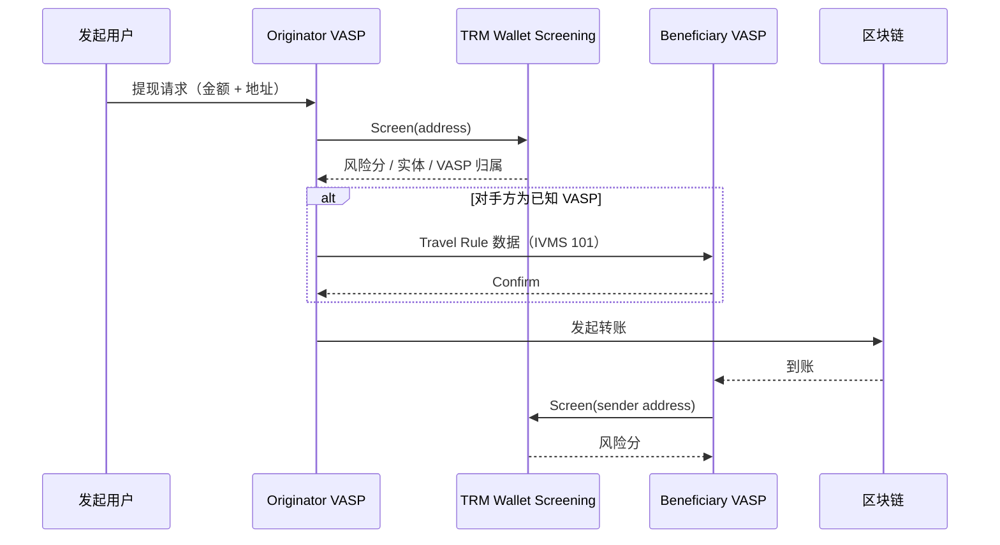
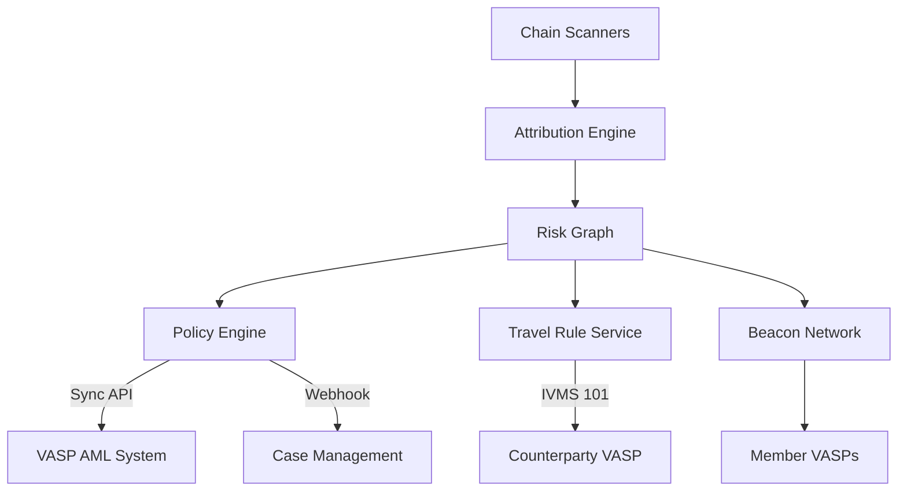

# TRM Labs 风险情报与 Travel Rule

> **TL;DR**：TRM Labs 是 2018 年成立、总部位于旧金山的区块链情报（blockchain intelligence）厂商，定位与 Chainalysis / Elliptic 并列为"三大链上风控"之一。核心产品覆盖 **Wallet Screening**（钱包筛查 API）、**Transaction Monitoring**（交易监控）、**Forensics**（取证分析）、**Travel Rule** 以及执法产品 **TRM Safe**，支持 30+ 条链与数百万个风险地址。TRM 的差异化卖点在于覆盖链范围、数据实时性（近实时分簇）以及 AI 威胁分类，被 USDC 发行方 Circle、Visa、FBI、美国财政部 OFAC 等客户使用。

## 1. 背景与动机

2018 年，前 FBI 分析师 Esteban Castaño 与工程师 Rahul Raina 在旧金山创立 TRM Labs，初衷是为合规团队提供覆盖多链、可编程查询的区块链情报平台。彼时市场上 Chainalysis 强势但价格高昂、Elliptic 偏重欧洲银行客户，而以太坊之外的"长尾公链"（BNB Chain、Tron、Polygon、Solana、Avalanche 等）缺乏统一覆盖。TRM 以"All-chain coverage on day one of launch"为口号，通过自研 Scanner 与启发式聚类，在新链主网上线后短期内就能上架。

在监管层面，2019 年 FATF 更新 Recommendation 15 / 16，对虚拟资产服务提供商（VASP）施加与银行相似的 AML/CFT 要求，其中 **Travel Rule** 要求 USD 1,000 / EUR 1,000 以上的跨境虚拟资产转账必须附带发起人与受益人信息。这一要求使得交易所、托管商、稳定币发行方等必须具备：① 对地址进行风险评估（KYT）；② 对对手方 VASP 进行识别（Counterparty VASP Attribution）；③ 在转账前后交换 IVMS 101 数据。TRM Labs 的产品线正是围绕这三件事展开：Wallet Screening 负责前两项，Travel Rule Solutions 负责第三项。

早期增长来自美国执法客户：FBI、IRS-CI、Secret Service、HSI、DOJ 多个部门签订企业协议，典型案例包括 2022 年的 Bitfinex 黑客 12 万 BTC 追缴、Ronin Bridge 追踪、以及对俄制裁名单相关地址扩展。2023 年 TRM 完成 D 轮融资（Thoma Bravo 领投 7,000 万美元），估值约 6 亿美元，同年推出 **TRM Beacon Network** 提供跨 VASP 的链上威胁情报共享。

## 2. 核心原理

### 2.1 地址归因（Address Attribution）与聚类

链上风控的基石是把海量 UTXO/EOA 聚合为可理解的"实体"（entity）。TRM 采用两层聚类：

1. **共享花费（Common Input Heuristic，CIH）**：Bitcoin / UTXO 链的经典启发式，任一交易的多个输入通常由同一私钥持有人签名，可视为同一钱包聚类。以形式化表达：若存在交易 $T$ 使得输入集 $I(T) = \{u_1, u_2, \dots, u_k\}$，则 $u_1, \dots, u_k \in \text{cluster}(C_j)$。
2. **行为相似性（Behavioral Fingerprinting）**：账户模型链（Ethereum、Tron、Solana）无 CIH 可用，TRM 通过 Gas 结算模式、交互合约分布、Nonce 间隔、资金闭环等指标训练模型，将行为相似的 EOA 合并为同一实体。
3. **标签来源**：① 公开爬取（交易所公告、Etherscan Label、监管报告）；② 线下调查（线报、执法合作、被罚机构披露）；③ 机器学习（混币器识别、DeFi 合约分类、诈骗合约聚类）；④ 客户反馈（误报修正）。

对每个实体，TRM 维护一个 **Entity Graph**，节点为钱包聚类与合约，边为资金流，边上附带金额、时间、链别和风险标签。这个图每隔数分钟增量更新。

### 2.2 风险评分（Risk Score）

Wallet Screening API 对任一地址返回 0–10 的风险分数，并拆分为两个维度：

- **Address Risk Score**：该地址本身是否属于制裁、黑客、勒索等高风险类别；
- **Entity Risk Score**：该地址所属实体的整体画像（例如 Binance 被识别为 "Exchange - Tier 1"）；
- **Counterparty Risk**：该地址历史上所有入金/出金的对手方风险均值，按时间衰减加权。

评分算法可简化为：

$$
R(a) = \max\bigl(R_{\text{direct}}(a),\ \alpha \cdot R_{\text{entity}}(a),\ \beta \cdot R_{\text{cp}}(a)\bigr)
$$

其中 $R_{\text{direct}}$ 为直接命中风险类别（如被制裁）的分数（通常 10），$\alpha, \beta$ 为衰减系数，默认约 0.7 / 0.5。客户可通过 Policy Engine 自定义阈值和类别权重。

### 2.3 风险类别分类（Risk Indicators）

TRM 标准类别集合包含几十种，典型包括：

- **Sanctioned Entity / Address**（OFAC、EU、UK、UN 名单）；
- **Child Sexual Abuse Material (CSAM)**；
- **Terrorist Financing**；
- **Ransomware**（LockBit、Conti、BlackCat…）；
- **Dark Market / Drug Market**（Hydra、AlphaBay 历史）；
- **Mixer / Tumbler**（Tornado Cash、Sinbad、ChipMixer）；
- **Scam / Phishing**（地址被钓鱼、Approval Drainer）；
- **High-Risk Exchange**（无 KYC 的 OTC / 灰名单 CEX）；
- **Gambling**（非受许可博彩合约）。

每一类别对应一个置信度（Confidence Level：Confirmed / Likely / Potential），以及来源元数据（Source：Law Enforcement / Open Source / ML Model）。

### 2.4 Travel Rule 架构

Travel Rule 要求 Originator VASP 在发起链上转账的同时，把 IVMS 101 数据（姓名、账户、地址、身份证件号、受益方同样信息）发送给 Beneficiary VASP。TRM 提供：

1. **Counterparty VASP Detection**：对待转账地址做归因，判断是否属于已知 VASP，以及是否加入 TRM Travel Rule 网络；
2. **Protocol Connectors**：桥接 TRP、Sygna Bridge、OpenVASP、Notabene、Shyft Veriscope 等主流 Travel Rule 协议；
3. **Data Transport**：符合 IVMS 101 数据格式，通过 TLS + mTLS + VASP 证书校验；
4. **Lookback / Self-Hosted Wallet**：对 Unhosted Wallet（自托管），FATF 要求不低于银行的信息采集强度，TRM 支持前端签名挑战（Proof of Ownership）。

### 2.5 Beacon Network 与威胁情报共享

TRM Beacon Network 是 2023 年推出的成员制威胁情报共享：会员 VASP 可以在检测到黑客资金流入时，近实时发布 ioc（Indicators of Compromise），其他会员立即收到告警并可冻结。网络设计要点：

- **去中心化订阅**：订阅/发布模型，不强制所有成员都看见所有告警；
- **证据上链**：告警元数据（地址、时间、类别）存证，降低滥发风险；
- **匿名化**：发布方可选择不透露被害机构名。

### 2.6 边界条件与失败模式

- **聚类误报**：CIH 在 CoinJoin、PayJoin、Lightning、以及多签钱包下会把不相关实体合并，需要检测机制（如 Wasabi Wallet 的 CoinJoin 模式）并标注为"低置信度"；
- **桥接资金断链**：跨链桥（Wormhole、LayerZero、CCTP）天然存在源链 burn / 目的链 mint 的"断点"，必须由 TRM 维护的桥映射表打通；
- **混币器法律争议**：2022 年 Tornado Cash 被 OFAC 制裁，但因其为不可变合约，部分学者主张制裁地址而非代码；TRM 把 Tornado 相关池子标记为 Sanctioned Mixer，并对下游资金执行 "5 hops" 衰减评估；
- **隐私链盲区**：Monero、Zcash Shielded Pool 缺乏链上可见性，TRM 依赖侧信道（交易所出金时间关联、IP 关联、metadata）做弱归因，置信度显著更低。



## 3. 架构剖析

### 3.1 分层视图

TRM Labs 平台自底向上分为五层：

1. **Chain Scanners**：节点 + indexer 集群，覆盖 30+ 条链（Bitcoin / Ethereum / Solana / Tron / BNB Chain / Polygon / Avalanche / Arbitrum / Optimism / Base / Cosmos Hub / Stellar / XRP Ledger / Litecoin / Bitcoin Cash / Zcash transparent / Algorand / Near / TON / Sui / Aptos / zkSync / Scroll / Linea / Mantle / Cronos 等）。每条链维护一个历史重放器与近实时订阅。
2. **Attribution & Clustering Engine**：Spark / Flink 批流一体，周期性重跑聚类；CIH 增量算法确保 O(log N) 合并；账户模型链使用 GNN 推断相似性。
3. **Risk Graph Service**：把聚类、标签、评分合并为可查询图。底层使用 PostgreSQL + ClickHouse + 自研图引擎（类似 JanusGraph 风格）。
4. **API Gateway & Policy Engine**：面向客户的 REST / GraphQL API、Webhook、以及客户自定义策略的规则引擎。
5. **应用层**：Web UI（Forensics Explorer 图形化追踪）、Case Management、Reporting 模版、Travel Rule 门户、Beacon Network 客户端。

### 3.2 核心模块清单

| 模块 | 职责 | 依赖 | 可替换性 |
| --- | --- | --- | --- |
| Wallet Screening API | 单地址风险查询（同步）| Risk Graph | 与 Chainalysis KYT、Elliptic Navigator 可替换 |
| Transaction Monitoring | 事件流 + 规则引擎，生成 Alert | Kafka + Policy Engine | 可替换，但规则迁移成本高 |
| Forensics | 可视化图追踪、跳数分析 | Risk Graph | 与 Chainalysis Reactor / Arkham Intel 部分重叠 |
| Travel Rule | IVMS 101 消息桥接 | 外部 Travel Rule 协议 | 可由 Notabene / Sumsub 替换 |
| TRM Beacon | 成员制威胁情报 | Pub/Sub | 独有 |
| TRM Safe | 执法产品，Warrant / Subpoena | Forensics | 与 Chainalysis Crypto Investigations 竞品 |
| Sanctions Feeds | 制裁名单集成 OFAC / EU / UN | 外部名单 | 可替换为 Refinitiv / Dow Jones |

### 3.3 一次 Screening 的端到端生命周期

1. 客户 VASP 在提现审核流水线调用 `POST /v2/addresses/screening`；
2. API Gateway 校验 API Key、QPS 配额；
3. Risk Graph Service 从缓存读取地址的聚类与风险数据（P50 < 150ms）；
4. 若缓存未命中，触发在线重算：读取链上历史（ClickHouse）+ 标签库 + 规则；
5. 返回 JSON，包含 `riskScore`、`addressRiskIndicators[]`、`entity`、`counterpartyRisk`；
6. 客户 Policy Engine 根据阈值返回 Approve / Review / Block；
7. 异步事件写入客户的 Case Management，如果触发高危则生成 Alert 并发送 Webhook。

### 3.4 客户端多样性与 SDK

官方 SDK 包括 Node.js、Python、Go，均为开源 thin wrapper（GitHub：`trmlabs/trm-node-sdk` 等）。亦提供 OpenAPI spec 方便自定义客户端。企业客户可选择 **On-prem Gateway** 缓解跨境数据传输合规问题（对欧洲 GDPR 客户常见）。

### 3.5 扩展与互操作

TRM 提供：

- **Webhooks**：事件驱动的告警推送（Alert、Case Status、Beacon Signal）；
- **Data Feeds**：日/月粒度批量 CSV/Parquet，供客户在数据湖内二次加工；
- **Power BI / Tableau Connectors**：面向合规报表；
- **ISO 20022 适配器**：金融机构把链上数据合并到传统反洗钱系统（如 SAS AML、NICE Actimize）。



## 4. 关键代码 / 实现细节

以下是 Wallet Screening v2 的典型调用（参考 docs.trmlabs.com `/api/v2/screening-addresses`）：

```bash
# 官方示例：curl 直接调用
curl -X POST https://api.trmlabs.com/public/v2/screening/addresses \
  -u "$TRM_KEY:$TRM_SECRET" \
  -H "Content-Type: application/json" \
  -d '[{
    "address": "0x7F367cC41522cE07553e823bf3be79A889DEbe1B",
    "chain": "ethereum",
    "accountExternalId": "user-123"
  }]'
```

典型响应（节选，docs.trmlabs.com）：

```json
[{
  "address": "0x7F367cC41522cE07553e823bf3be79A889DEbe1B",
  "addressRiskIndicators": [
    {
      "category": "Sanctions",
      "categoryRiskScoreLevel": 10,
      "riskType": "OWNERSHIP",
      "source": "public"
    }
  ],
  "addressSubmitted": "0x7F367cC41522cE07553e823bf3be79A889DEbe1B",
  "chain": "ethereum",
  "entities": [{
    "category": "Sanctioned Entity",
    "entity": "OFAC SDN List"
  }],
  "trmAppUrl": "https://my.trmlabs.com/..."
}]
```

对应 Node.js SDK 封装（`trmlabs/trm-node-sdk`，简化）：

```ts
import { TRMClient } from "@trmlabs/trm-sdk";

const client = new TRMClient({ apiKey: process.env.TRM_KEY, apiSecret: process.env.TRM_SECRET });

async function screen(address: string) {
  const [res] = await client.screenAddresses([
    { address, chain: "ethereum", accountExternalId: "user-123" },
  ]);
  const maxRisk = Math.max(
    0,
    ...res.addressRiskIndicators.map((r) => r.categoryRiskScoreLevel),
  );
  if (maxRisk >= 8) return "BLOCK";
  if (maxRisk >= 5) return "REVIEW";
  return "APPROVE";
}
```

## 5. 演进与版本对比

| 版本/里程碑 | 时间 | 关键变化 | 对外部影响 |
| --- | --- | --- | --- |
| v1 API | 2019 | 仅 BTC / ETH 支持，批量 CSV 为主 | 功能基础，主要政府客户 |
| v2 API | 2021 | REST JSON，引入 Entity Graph 与 Counterparty | 被 Circle 等 Stablecoin 发行方采用 |
| Travel Rule | 2022 | 加入 TRP / OpenVASP | 亚洲/欧洲 VASP 采纳 |
| Beacon Network | 2023 | 会员制情报共享 | 多个大型交易所加入 |
| AI Classifiers | 2024 | ML 驱动的 phishing / drainer 识别 | 钓鱼识别率提升 |
| TRM Safe | 2024–2025 | 面向执法的重构 | 政府侧使用替代 Chainalysis Reactor |

## 6. 实战示例

场景：Exchange 在用户提现 1 ETH 到外部地址时做实时筛查。

```ts
// 1. 用户点击 Withdraw
const address = "0xSomeExternalAddr";

// 2. 后端调用 TRM
const decision = await screen(address); // 见 §4

// 3. 根据决策路由
if (decision === "BLOCK") {
  await rejectWithdrawal(userId, "Risk violation");
  await fileSAR(userId, address); // Suspicious Activity Report
} else if (decision === "REVIEW") {
  await queueManualReview(userId, address);
} else {
  // 4. 若对手方也是 VASP，发送 Travel Rule
  const tr = await client.getTravelRuleCounterparty(address);
  if (tr.isVasp) {
    await sendTravelRule(tr.vaspId, buildIVMS101(user, beneficiary));
  }
  await broadcastTx(...);
}
```

预期输出：高危地址（如 Tornado Cash router）返回 `addressRiskIndicators` 包含 `Sanctions / Mixer`，决策为 BLOCK；普通用户地址返回空 indicators，决策为 APPROVE。

## 7. 安全与已知攻击

- **标签污染**：攻击者故意让资金流经某合法交易所热钱包再回流，试图让下游地址"漂白"。TRM 通过"历史一致性检测"识别这类异常模式；
- **归因争议**：2022 年 Tornado Cash 被 OFAC 加入 SDN 后，大量 DeFi 用户反馈被误判为 Sanctioned Exposure，TRM 引入"间接暴露阈值"减少误报；
- **Poisoning Attack**：对手故意向目标地址发送 1 wei 并附带 Tornado 标签，试图触发风控。主流方案是忽略 0 金额或低金额的 dust；
- **数据泄露风险**：合规数据（客户 KYC + 地址关联）敏感，TRM 遵循 SOC 2 Type II；
- **已发生事件**：Ronin Hack、Euler、Wintermute、Multichain Exit、WazirX Hack 等多起黑客资金流中，TRM 协助链上冻结与追缴。

## 8. 与同类方案对比

| 维度 | TRM Labs | Chainalysis | Elliptic | Crystal Intelligence |
| --- | --- | --- | --- | --- |
| 覆盖链数量 | 30+（偏多新链）| 25+（成熟大链优先）| 25+ | 15+ |
| 实时性 | 分钟级 | 分钟级 | 小时级 | 分钟级 |
| 政府客户 | FBI / OFAC / IRS / HSI 等强 | 最强，历史悠久 | 较少 | 强（英国 NCA）|
| 价格 | 中高 | 高 | 中 | 中 |
| Travel Rule | 自建 + 对接 | KYT + Reactor，独立模块 | 第三方合作 | 自建 |
| 威胁共享 | Beacon Network | Crypto Incident Response | 无原生 | 无 |
| 开源/可见性 | 闭源 | 闭源 | 闭源 | 闭源 |

结论：若 VASP 业务覆盖非主流链（Solana 生态、Tron USDT、TON）或强监管市场，TRM 的覆盖与 Beacon 有优势；若主要业务在 BTC/ETH 且预算充足，Chainalysis 的历史数据库更深；Elliptic 则在欧洲银行客户中更常见。

## 9. 延伸阅读

- **官方文档**：`https://docs.trmlabs.com`
- **产品页**：`https://www.trmlabs.com/products`
- **Beacon Network 简介**：`https://www.trmlabs.com/beacon`
- **FATF Travel Rule 指南**：`https://www.fatf-gafi.org`
- **IVMS 101 数据标准**：`https://intervasp.org/`
- **Notabene Travel Rule 指南**：`https://notabene.id/`
- **TRM Annual Crypto Crime Report**：TRM Labs 每年 2 月发布

## 10. 术语表

| 术语 | 英文 | 释义 |
| --- | --- | --- |
| KYT | Know Your Transaction | 交易级反洗钱筛查 |
| VASP | Virtual Asset Service Provider | 虚拟资产服务提供商 |
| IVMS 101 | InterVASP Messaging Standard 101 | Travel Rule 数据格式 |
| CIH | Common Input Heuristic | UTXO 共享输入启发式聚类 |
| Entity | Entity | 同一实际控制人拥有的地址簇 |
| Indicator | Risk Indicator | 风险标签类别 |
| Beacon | Beacon Network | TRM 成员威胁情报 |
| SAR | Suspicious Activity Report | 可疑活动报告 |
| OFAC SDN | Specially Designated Nationals | 美国财政部制裁名单 |

---

*Last verified: 2026-04-22*
