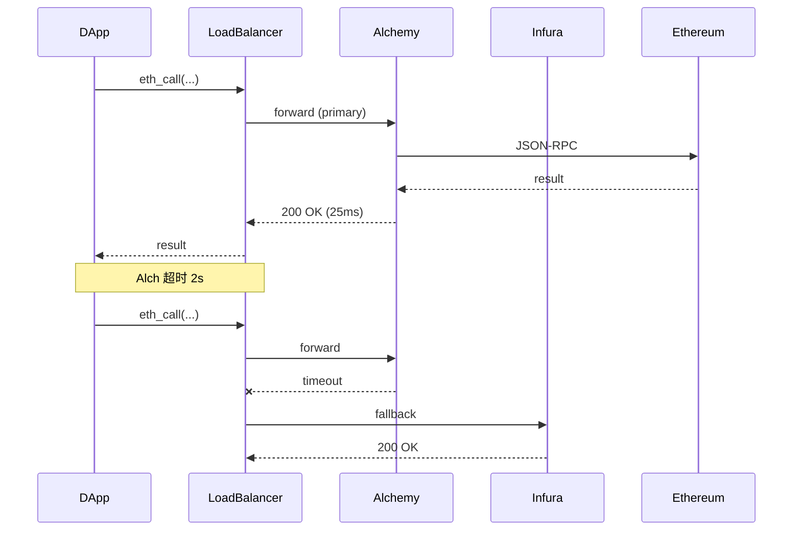

# RPC 节点服务商对比：Infura / Alchemy / QuickNode / Ankr / Chainstack

> **TL;DR**：RPC 节点服务商（RPC-as-a-Service）通过托管 Geth / Reth / Erigon / Solana Validator 等客户端，向 DApp 提供 JSON-RPC、WebSocket、gRPC、Firehose/Streaming、Archive 与 Trace 接口，免去团队自行维护同步节点与存储快照的负担。主流提供商沿两条路径分化：**中心化托管型**（Infura、Alchemy、QuickNode、Chainstack）偏向企业级 SLA、增强 API 与开发者工具链；**去中心化型**（Ankr、Pocket Network、dRPC、Blast API）通过 P2P 路由与 Staking 激励把流量分发到全球节点。选型需综合考量：链覆盖度、Archive/Trace 支持、WebSocket 稳定性、Rate Limit 模型（CU vs RPM vs Compute Score）、地理就近度、隐私合规（无钱包追踪 vs 钱包分析）、以及多 RPC 负载均衡策略。

## 1. 背景与动机

自 2017 年 DApp 爆发以来，前端直接依赖 `window.ethereum.send` 或链上 RPC 已不足以支撑主网规模的读请求。以太坊主网 Archive Node 全量数据（含 `eth_getStorageAt` 历史快照）已超过 18 TB，Geth + Reth 全同步耗时 3 – 10 天，硬件成本 $5K – $15K，更棘手的是 7×24 监控、版本升级、分叉切换与 DDoS 防护。这为 RPC 托管服务创造了刚需。

Infura 诞生于 2016 年（后被 ConsenSys 收购，2024 年剥离），首创 "MetaMask 默认 RPC" 的分发模式，让钱包/DApp 无需感知节点基础设施。Alchemy 2017 年成立于斯坦福，以"增强 API（Enhanced API）"切入，用 `alchemy_getAssetTransfers`、`alchemy_getTokenBalances`、`alchemy_getNFTs` 等聚合接口替代原生多次 RPC，解决索引和 UX 瓶颈。QuickNode 走"多链 + 低延迟 + Marketplace"路线，支持 60+ 链并以 Add-on 市场（QuickAlerts、Streams）扩展功能。Ankr 是去中心化阵营代表，2020 年引入 ANKR 质押与 Premium RPC 双轨制。Chainstack 定位"企业级私有节点 + 托管 Subgraph"，以弹性容器（Elastic Node）与 Dedicated Node 卖点。

从 2023 年 Dencun 升级起，L2 与 Rollup 极大扩张了 RPC 需求面——每条 L2 都需要独立的 Sequencer RPC、Archive、以及 Blob 查询（EIP-4844）。同时 Solana、Sui、Aptos、TON 等非 EVM 链的原生 RPC 协议差异巨大，促使提供商从"EVM 单链 SaaS"进化为"全链 Gateway"。

## 2. 核心原理

### 2.1 RPC 服务抽象模型

一个 RPC Provider 的逻辑架构可抽象为四层：

```
┌─────────────────────────────────────┐
│ API Gateway（Auth / Rate / Cache）  │  ← HTTP/WSS/gRPC 前端
├─────────────────────────────────────┤
│ Router & Load Balancer              │  ← 基于 method/chain/region
├─────────────────────────────────────┤
│ Enhanced API Layer                  │  ← NFT/Token/Trace/Subscription
├─────────────────────────────────────┤
│ Node Fleet（Geth/Erigon/Reth/...）  │  ← 全节点 + Archive + Trace
└─────────────────────────────────────┘
```

形式化地定义 RPC 请求的服务质量元组：`Q = (latency p50, latency p99, success_rate, freshness_lag, throughput, cost_per_cu)`。企业级 SLA 通常规定 p99 ≤ 300 ms（EVM 主网）、success ≥ 99.9%、freshness ≤ 2 blocks（约 24 s for Ethereum）。

### 2.2 Rate Limiting 模型

主流提供商采用三种计量模型：

1. **Compute Unit (CU)**：Alchemy 使用。每个 method 有不同 CU 权重（`eth_call` = 26 CU，`eth_getLogs` = 75 CU，`trace_block` = 135 CU）。定价按 CUPS（Compute Units Per Second）与总月 CU。
2. **Credit**：QuickNode。权重 1 – 50 credits/request，月度总额配额 + 并发 cap。
3. **Request**：Infura 采用 "Daily Request" 简单计数（3M 请求/天 Free Tier）。Chainstack 类似。
4. **去中心化 Session**：Ankr Premium 按订阅 + 质押；Pocket Network 按 Relay Count。

关键不变式：`cost = Σ weight(method_i) × count_i`，失败请求是否计费因厂商而异（Alchemy 不计失败，QuickNode 计）。

### 2.3 Archive 节点与 Trace 接口

`eth_getBalance(addr, blockNumber)`、`eth_getStorageAt`、`debug_traceTransaction` 等历史查询需要 Archive 节点——即保留每个区块后完整状态 Trie。以太坊 Archive 通常基于 Erigon（数据压缩至 ~2 TB）或 Reth（snapshot）。`debug_traceCall`、`trace_block`、`trace_filter`（OpenEthereum trace）是 DeFi 分析、Tenderly Simulation 与 MEV bot 的刚需。Infura 对 `trace_*` 仅 Growth 及以上计划开放，Alchemy 通过 `alchemy_simulateExecution` 变种开放，QuickNode 通过 Trace Mode Add-on。

### 2.4 WebSocket 与订阅语义

`eth_subscribe` 支持 `newHeads / logs / newPendingTransactions / syncing`。WebSocket 稳定性差异主要体现在：

- **心跳与重连**：Alchemy 默认 5 min idle timeout，需在客户端实现 ping/reconnect；Infura WSS 连接上限 Free Tier 仅 10，Growth 100。
- **pending tx 流量**：全网每秒上百条 pending，Free Tier 常限流或 subsample。
- **顺序保证**：WSS 不保证严格顺序，需结合 `blockNumber/logIndex` 客户端排序。

### 2.5 多 RPC 负载均衡与 Failover

生产级 DApp 通常组合 2 – 4 个 RPC 提供商以消除单点：

```
Strategy A: Round-Robin  → 请求轮询
Strategy B: Fastest      → 首个返回赢（浪费配额）
Strategy C: Fallback     → 主 provider 失败后切备份
Strategy D: Method-based → 读分散，写集中（nonce 一致性）
```

Ethers.js v6 `FallbackProvider` 默认采用 quorum 仲裁；viem `fallback` transport 顺序切换。注意：**写交易不能并行发送**，否则会出现 replacement-tx underpriced 错误；读-写混合 RPC 场景需锁定 nonce 到单一上游。

### 2.6 去中心化 RPC（Decentralized RPC）

Pocket Network、Ankr Decentralized、dRPC 的核心机制：

- **Staking & Servicer**：节点运营方质押代币（POKT / ANKR），接入网关后根据 Relay 数量获得奖励。
- **Routing**：Gateway 对每次请求随机抽样 n 个节点并取多数，或按延迟就近。
- **签名响应（Signed RPC）**：部分协议要求节点对响应签名，客户端可验证。实际 Pocket v1 不强制签名，依赖 sampling & slashing。

失败模式：延迟更高（多节点仲裁）、写 tx 广播可能去中心化路由导致 nonce 混乱、数据新鲜度滞后 1 – 2 blocks。

### 2.7 参数对照

| 参数 | Infura | Alchemy | QuickNode | Ankr | Chainstack |
| --- | --- | --- | --- | --- | --- |
| EVM 链覆盖 | 20+ | 25+ | 60+ | 35+ | 30+ |
| 非 EVM | StarkNet / Solana / Palm | Solana / Arbitrum Nova | Solana / Aptos / Sui / TON / Bitcoin | Solana / BTC / Polkadot | Solana / NEAR / Ronin |
| Archive | Growth+ | all plans | Add-on | Premium | Dedicated |
| Trace | Growth+ | simulate | Trace Add-on | Premium | Dedicated |
| Subgraph Hosting | 否 | Subgraphs (beta) | 否 | 否 | 是 |
| WSS 并发 | 10 / 100 | 20 / 200 | 40 / 400 | 100 | unlimited (Dedicated) |
| Free Tier | 3M req/day | 300M CU/mo | 10M credits/mo | 30 req/s | 3M req/mo |
| 去中心化 | 否 | 否 | 否 | Public RPC | 否 |

### 2.8 状态流程图



## 3. 架构剖析

### 3.1 分层架构

```
Layer 1  Edge / CDN       Cloudflare + 自建 PoP （亚太/欧美/南美）
Layer 2  API Gateway      Kong / Envoy / 自研
Layer 3  Auth + Billing   API Key / JWT / CU 计费
Layer 4  Enhanced API     GraphQL / 索引数据库 / WebHook
Layer 5  Core Node Fleet  Geth/Erigon/Reth/Nethermind/Besu/Solana Validator
Layer 6  Storage          Archive (2-18TB)/Snapshot/Trace DB
```

### 3.2 模块清单

| 模块 | 职责 | 依赖 | 可替换性 |
| --- | --- | --- | --- |
| API Gateway | TLS / 路由 / 限流 | Envoy/Kong | 易替换 |
| Auth Service | Key/JWT 校验，项目归属 | Redis | 易替换 |
| Rate Limiter | CU/Credit 计量 | Redis + TimeSeries DB | 中 |
| Node Pool Manager | 健康检查、版本切换 | Kubernetes | 中 |
| Enhanced API | NFT / Token / Trace 封装 | Node + DB | 难 |
| Webhook / Streams | 推送 logs、address activity | Kafka | 中 |
| Analytics Dashboard | 用户可视化监控 | Grafana / 自研 | 易 |

### 3.3 端到端请求生命周期

以 `eth_getLogs` 为例：

1. **Client → Edge**（2 – 20 ms）：HTTPS，TLS 1.3，HTTP/2 复用。
2. **Edge → Gateway**（1 – 5 ms）：Envoy 路由到区域集群。
3. **Auth + Rate**（<1 ms）：Redis KV 原子 `INCRBY`，若超限返回 429。
4. **Method Routing**：`eth_getLogs` 需要 indexed event log，路由到 Erigon Log-Indexed Pool 而非普通 Geth。
5. **Cache Layer**（0 – 50 ms）：对 `blockNumber:finalized` 查询命中 Memcached/Redis。
6. **Node Query**（20 – 300 ms）：Erigon `eth_getLogs` 扫描 Bloom + 状态。
7. **Response 序列化 + 回流**（5 – 30 ms）。

### 3.4 客户端多样性

Infura 主要依赖 Geth + Besu（Hyperledger），历史问题：2020 年 11 月因 Geth bug 导致 Infura 宕机数小时。Alchemy 自研 Supernode（内部分片 + 多客户端代理）以消除单客户端风险。Chainstack 对企业用户开放 Erigon / Nethermind / Reth 多选项以规避 consensus bug 蔓延。

### 3.5 扩展接口

- **EIP-4337 Bundler RPC**：`eth_sendUserOperation` / `eth_estimateUserOperationGas`，Alchemy & Stackup & Pimlico 集成。
- **Flashbots Relay**：`eth_sendPrivateTransaction`，可绕过公共 mempool。
- **Firehose / Streaming**：StreamingFast Firehose 协议，Goldsky / QuickNode Streams 支持事件推流。
- **Blob RPC (EIP-4844)**：`engine_getBlobsV1`，QuickNode / Infura 已支持。

## 4. 关键代码 / 实现细节

多 RPC FallbackProvider（ethers v6）——文档：`https://docs.ethers.org/v6/api/providers/#FallbackProvider`：

```typescript
import { ethers } from 'ethers'
const providers = [
  { provider: new ethers.JsonRpcProvider(`https://eth-mainnet.g.alchemy.com/v2/${ALCHEMY_KEY}`), priority: 1, stallTimeout: 1500, weight: 2 },
  { provider: new ethers.JsonRpcProvider(`https://mainnet.infura.io/v3/${INFURA_KEY}`), priority: 2, stallTimeout: 2000, weight: 1 },
  { provider: new ethers.JsonRpcProvider(`https://rpc.ankr.com/eth/${ANKR_KEY}`), priority: 3, stallTimeout: 3000, weight: 1 },
]
const fallback = new ethers.FallbackProvider(providers, 'mainnet', { quorum: 1, eventQuorum: 1 })
const block = await fallback.getBlock('latest')
```

viem `fallback` transport——文档：`https://viem.sh/docs/clients/transports/fallback`：

```typescript
import { createPublicClient, fallback, http } from 'viem'
import { mainnet } from 'viem/chains'
const client = createPublicClient({
  chain: mainnet,
  transport: fallback([
    http('https://eth-mainnet.g.alchemy.com/v2/xxx'),
    http('https://mainnet.infura.io/v3/yyy'),
    http('https://rpc.ankr.com/eth/zzz'),
  ], { rank: { interval: 60_000, sampleCount: 10, timeout: 500, weights: { latency: 0.3, stability: 0.7 } } }),
})
```

Alchemy Enhanced API（`alchemy_getAssetTransfers`）——文档：`https://docs.alchemy.com/reference/alchemy-getassettransfers`：

```typescript
const res = await fetch(`https://eth-mainnet.g.alchemy.com/v2/${KEY}`, {
  method: 'POST',
  body: JSON.stringify({
    jsonrpc: '2.0', id: 1, method: 'alchemy_getAssetTransfers',
    params: [{ fromBlock: '0x0', toBlock: 'latest', fromAddress: '0xabc...', category: ['erc20','erc721','external'], maxCount: '0x64' }]
  })
})
```

## 5. 演进与版本对比

| 阶段 | 时间 | 关键变化 |
| --- | --- | --- |
| Infura 起步 | 2016 | 首个以太坊公共 RPC；MetaMask 默认 |
| Alchemy Enhanced | 2019 | `getNFTs` / `getAssetTransfers` API |
| 多链扩张 | 2021 | QuickNode 支持 15+ 链 |
| 去中心化 RPC | 2021 | Pocket 主网；Ankr ANKR staking |
| L2 时代 | 2023 | Arbitrum/Optimism/Base/zkSync Sequencer RPC |
| 4844 Blob | 2024 | Blob RPC 支持、EIP-4337 Bundler |
| Dencun 后 | 2025 | EIP-7702 交易、Reth 成 mainstream 客户端 |

## 6. 实战示例

构建带 Failover 的 NFT 列表查询（Alchemy NFT API v3）：

```bash
curl -X POST "https://eth-mainnet.g.alchemy.com/nft/v3/${KEY}/getNFTsForOwner" \
  -H "accept: application/json" \
  -G --data-urlencode "owner=0xd8dA6BF26964aF9D7eEd9e03E53415D37aA96045"
```

预期：返回 vitalik.eth 持有的 NFT 列表（含 contract/tokenId/metadata）。

启动本地代理聚合多 RPC（示例：`drpc-proxy`）：

```bash
drpc-proxy --config ./upstreams.yaml --listen :8545
# upstreams.yaml 定义 alchemy/infura/quicknode 权重
```

## 7. 安全与已知事件

- **2020/11/11 Infura Geth Bug 宕机**：Geth v1.9.9 hard fork 问题导致 Infura 节点分叉，MetaMask 读数据错误约 6 小时。复盘：单客户端风险。
- **2022 Ankr BNB Bridge Exploit**：Ankr BNB Chain 桥漏洞（非 RPC 本身，但与其品牌相关），aBNBc 铸造无限，损失 $5M。
- **密钥泄露**：RPC key 写入前端 bundle 被抓取，触发 CU 配额爆炸。最佳实践：后端代理 + 按 referrer 限制。
- **Privacy Leakage**：Infura 因 IP 记录被指控可关联用户钱包，引发 MetaMask 2023 起提供多 RPC 选项。
- **429 Rate Limit 雪崩**：未实现退避导致重试风暴，需 Exponential Backoff + Jitter。

## 8. 与同类方案对比

| 维度 | Infura | Alchemy | QuickNode | Ankr | Chainstack | 自建（Erigon） |
| --- | --- | --- | --- | --- | --- | --- |
| 易用性 | 高 | 最高（工具链强） | 高 | 中 | 中 | 低 |
| 链覆盖 | 中 | 中 | 最广 | 广 | 中 | 取决于运维 |
| Archive | 是 | 是 | 是 | 是 | 是 | 是 |
| 去中心化 | 否 | 否 | 否 | 是 | 否 | 是 |
| 成本（百万 req） | $0.05-$0.2 | $0.05-$0.15 | $0.05-$0.2 | $0.01-$0.1 | $0.05-$0.3 | $0 运行 $$$ 硬件 |
| 隐私 | 有日志 | 有日志 | 有日志 | 混合 | 可私有 | 完全私有 |

## 9. 延伸阅读

- 官方：https://docs.infura.io/ / https://docs.alchemy.com/ / https://www.quicknode.com/docs / https://www.ankr.com/docs/ / https://docs.chainstack.com/
- Ethers.js FallbackProvider：https://docs.ethers.org/v6/api/providers/#FallbackProvider
- viem fallback transport：https://viem.sh/docs/clients/transports/fallback
- EIP-1474 JSON-RPC Method Specification
- Vitalik "How can we control user-facing risks of centralized RPCs" 2022
- a16z crypto "Decentralized RPC" 2023

## 10. 术语表

| 术语 | 英文 | 释义 |
| --- | --- | --- |
| RPC | Remote Procedure Call | 远程过程调用接口 |
| CU | Compute Unit | Alchemy 的计费单位 |
| Archive Node | Archive Node | 保留全历史状态的节点 |
| WSS | WebSocket Secure | 基于 TLS 的 WebSocket |
| Trace | Trace / Debug API | 执行级别调用回溯 |
| Failover | Failover | 故障切换 |
| Relay | Relay | 去中心化 RPC 的转发 |

---

*Last verified: 2026-04-22*
