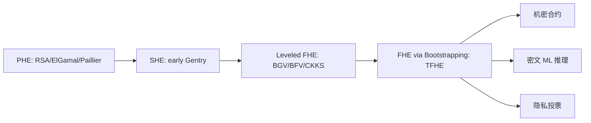

# 全同态加密全景（FHE Overview）

> **TL;DR**：同态加密（Homomorphic Encryption，HE）允许对密文直接计算并得到与明文计算等价的结果。按可支持的操作分为 PHE（单操作）、SHE（有限深度）、FHE（任意深度）。主流 FHE 方案包括整数运算的 BFV/BGV、近似实数运算的 CKKS、以及 bit-level 布尔电路的 TFHE。2026 年的工业级库（TFHE-rs / OpenFHE / SEAL）已能在秒级完成简单推理，Zama、Fhenix、Inco 等项目正在把 FHE 落地到 EVM 与 RPC 层。

## 1. 背景与动机

传统密码学的信任模型是"存储加密 + 计算明文"：数据在传输（TLS）与静态（AES-GCM）时加密，但只要进入 CPU 的寄存器必须解密。这意味着云服务商、合约执行节点、验证者都能看到明文——与 Web3 的 permissionless 价值观形成尖锐矛盾。零知识证明（ZKP）可以在 **有一方知道明文** 的前提下做可验证计算，但无法让一组互不信任的节点 **共同在密文上运算**。FHE 正是填补这一空白的密码学原语。

1978 年 Rivest、Adleman 与 Dertouzos 首次提出"privacy homomorphism"的概念，即加密函数 $E$ 满足 $E(a) \oplus E(b) = E(a \cdot b)$。此后三十年，研究者只找到了 **部分同态（PHE）** 方案：RSA 与 ElGamal 支持乘法，Paillier 支持加法。直到 2009 年 Craig Gentry 在博士论文中给出第一个 FHE 构造（基于理想格 + Bootstrapping），才证明"任意深度电路的密文计算"在理论上可行。之后的演进呈三条主线：

- **整数/模 p 运算**：BGV (2011)、BFV (2012)，以 RLWE 为基础，适合精确计算、投票、交集求解。
- **近似实数运算**：CKKS (2016)，允许把浮点向量打包为密文，适合机器学习推理与统计分析，牺牲精度换性能。
- **布尔/查找表**：GSW (2013)、FHEW (2015)、TFHE (2016)，Bootstrapping 成本降至毫秒级，适合任意函数 via LUT。

Web3 场景下，FHE 的价值主要体现在：
- **机密合约**（confidential smart contract）：合约状态保持密文，任何验证者都无法读出余额或出价。
- **去信任预言机**：喂价节点对密文价格做聚合，避免前置攻击。
- **隐私投票**：累加 yes/no 票时不暴露单票。
- **AI + DePIN**：在用户私钥加密的模型参数上微调，不泄露训练数据。

与 ZK 的关系并非竞争而是互补：FHE 提供"不解密的计算"，ZK 提供"计算过程正确的证明"。Zama、Mind Network 等项目同时使用二者——FHE 做 state transition，ZK 做 proof-of-correct-execution。

## 2. 核心原理

### 2.1 形式化定义

一个（公钥）同态加密方案由四元组 $(\mathrm{KeyGen}, \mathrm{Enc}, \mathrm{Dec}, \mathrm{Eval})$ 构成：

- $\mathrm{KeyGen}(1^\lambda) \to (pk, sk, evk)$：输入安全参数，输出公钥、私钥、求值密钥。
- $\mathrm{Enc}(pk, m) \to c$：将明文 $m \in \mathcal{M}$ 加密为密文 $c \in \mathcal{C}$。
- $\mathrm{Dec}(sk, c) \to m$：解密。
- $\mathrm{Eval}(evk, f, c_1, \dots, c_n) \to c_f$：输入电路 $f$ 与 $n$ 个密文，输出新密文。

**同态性**（Correctness under Evaluation）：对任意合法 $f$ 与 $m_i$，
$$
\Pr\big[\mathrm{Dec}(sk, \mathrm{Eval}(evk, f, \mathrm{Enc}(pk, m_1), \dots)) = f(m_1, \dots, m_n)\big] \ge 1 - \mathrm{negl}(\lambda).
$$

按 $f$ 的表达能力划分：
- **PHE**：$f$ 仅限单一操作（+ 或 ×）。
- **SHE (Somewhat HE)**：支持有限深度的 + 与 ×。
- **LHE (Leveled HE)**：在 KeyGen 时固定最大乘法深度 $L$。
- **FHE**：通过 Bootstrapping 支持任意深度。

**紧凑性（Compactness）**：$|c_f|$ 不随 $f$ 的规模增长，否则"不动脑地把电路附在密文后"也算同态，定义就失去意义。

### 2.2 安全性假设：LWE 与 RLWE

几乎所有现代 FHE 都建立在 **Learning With Errors (LWE)** 或其环版本 **RLWE** 上。

- **LWE 假设** (Regev 2005)：给定均匀随机 $A \in \mathbb{Z}_q^{m \times n}$、随机向量 $s \in \mathbb{Z}_q^n$、小误差 $e \leftarrow \chi^m$，区分 $(A, As + e)$ 与 $(A, u)$（$u$ 均匀随机）在计算上困难。
- **RLWE**：将 $\mathbb{Z}_q$ 替换为多项式环 $R_q = \mathbb{Z}_q[x]/(x^N + 1)$，$N$ 通常取 $2^{12}$ 或 $2^{15}$。

RLWE 的困难性可归约到理想格上的 Shortest Vector Problem（SVP）近似版本。参数取法参见 Homomorphic Encryption Standard v1.1 (homomorphicencryption.org)：如 $N = 16384, q \approx 2^{438}$ 对应 128 位安全。

被动敌手模型：FHE 默认只抗 IND-CPA，因为 Eval 把任意密文组合都视为合法操作，不可能抗 CCA2。需要 CCA 级安全时通常套一层非交互零知识（NIZK）证明密文是诚实生成的。

### 2.3 噪声与 Bootstrapping

RLWE 密文形式为 $c = (a, b) \in R_q^2$，解密等式 $b - a \cdot s = \Delta m + e$（$\Delta$ 是缩放因子）。每次同态加法/乘法都让噪声 $e$ 增长——加法线性增长，乘法几何增长。一旦 $|e|$ 超过 $q/(2\Delta)$ 阈值，解密错误。

**Bootstrapping**（Gentry 2009）是 FHE 的"再生"技术：把解密电路 $\mathrm{Dec}(sk, \cdot)$ 自身表达为可同态求值的电路，输入 "密文 c + 密文形式的 sk"，输出一个新密文 $c'$，解密为同一明文但噪声被压回初始水平。成本极高，早期方案要 30 分钟；TFHE 借助程序化 Bootstrapping（Programmable Bootstrapping, PBS）把时间降到 ~10ms，并顺带可以做任意 LUT 查表。

### 2.4 子方案拆解

- **BGV/BFV**：整数模 $t$ 运算，支持 SIMD（CRT batching）一次把 $N$ 个整数打包。适合投票、求交集、布尔电路整包运算。
- **CKKS**：把向量当作 $\mathbb{C}^{N/2}$ 元素编码进多项式，支持近似加法乘法和 rescale（控制精度）。适合机器学习推理、密文统计。精度从参数 $\Delta$ 决定，典型 30~40 bit。
- **TFHE**：单 bit 密文 + PBS。在布尔电路上每个门约 10ms，但可转化任意函数为 LUT。适合决策树、比较、激活函数。
- **GSW/FHEW**：TFHE 的前身，基于 approximate eigenvector，现已被 TFHE 取代。

### 2.5 关键参数与常量

| 方案 | 多项式度 N | 密文模 q | 明文模 t | 典型安全 | 源 |
| --- | --- | --- | --- | --- | --- |
| BFV | 8192 | 218 bit | 65537 | 128-bit | SEAL default |
| CKKS | 16384 | 438 bit | 浮点 Δ=2^40 | 128-bit | HE Std v1.1 |
| TFHE | 1024 (LWE) | 2^32 | binary | 128-bit | TFHE-rs params_default |

所有参数可在具体库的 `params.rs` / `parms.h` 中找到，升级 bit-安全水平需同步加大 N 与 q。

### 2.6 失败模式

- **参数错配**：开发者任意选小 N，被格攻击破解（LWE-estimator 需每次复核）。
- **Circular Security**：Bootstrapping 依赖 sk 被 Enc(pk, sk) 公开，需额外"循环安全"假设，目前无已知攻击但也无严格证明。
- **侧信道**：Ring 乘法的 NTT 在 cache 上存在 timing 泄露，TFHE-rs 正引入 constant-time 实现。
- **伪随机噪声**：若随机数生成器被破坏，误差可预测，整系统崩溃。



```
Plaintext m  --Enc-->  Ciphertext c0  --Eval(f)-->  Ciphertext cf
                                                       |
                                  bootstrap (refresh)  |
                                                       v
                                              Dec ---> f(m1,...,mn)
```

## 3. 架构剖析

### 3.1 分层视图

一个生产级 FHE 库通常分为 5 层：
1. **Arithmetic Backend**：大整数、NTT、RNS（residue number system）分解。
2. **RLWE Primitives**：密钥生成、加密、解密、relinearization key、galois key。
3. **Scheme Layer**：BFV / CKKS / TFHE 各自的 Eval 算法与噪声管理。
4. **Compiler / Frontend**：Concrete、EVA、HELib AST，将用户代码编译为 RLWE 电路。
5. **Bindings & Services**：Python / JS / Solidity 包装，或 fhEVM 的 precompile。

### 3.2 模块清单

| 模块 | 职责 | 依赖 | 代表库路径 |
| --- | --- | --- | --- |
| NTT | 多项式乘法 FFT | SIMD intrinsics | `SEAL/native/src/seal/util/ntt.cpp` |
| KeySwitch | 切换 sk | RNS | `openfhe-development/src/pke/lib/keyswitch/` |
| Bootstrap | 噪声刷新 | BlindRotate | `tfhe-rs/tfhe/src/core_crypto/algorithms/lwe_bootstrap_key*.rs` |
| Encoder | 浮点/整数 → 多项式 | FFT | `SEAL/native/src/seal/ckks.cpp` |
| Compiler | 高级语言 → 电路 | Scheme | `zama-ai/concrete` Rust crate |
| FFI / Solidity | 合约访问 FHE | Scheme + Precompile | `fhevm/contracts/lib/TFHE.sol` |

### 3.3 数据流：一次密文乘法

1. 用户 SDK 调 `client.encrypt(42)` → 得到 LWE ciphertext `ct_a`。
2. 上链广播 `ct_a` 到合约存储（约 ~30KB，TFHE-rs default）。
3. 合约调用 `TFHE.mul(ct_a, ct_b)`，precompile 进入 `fhe-core` library。
4. Library 执行：`KeySwitch(ct_a ⊗ ct_b)` → `Rescale` → `Bootstrap`（如果深度超阈）。
5. 新密文 `ct_c` 写回 storage，gas ≈ 几 M（Fhenix 目前收 ~100k scaled gas）。
6. 用户再发 `reencrypt` 请求到 gateway，拿到自己 pk 加密的结果，本地解密。

### 3.4 参考实现

- **SEAL**（Microsoft）C++，BFV/BGV/CKKS，论文级参数。
- **OpenFHE**（社区，Duality 维护）C++，支持 BGV/BFV/CKKS/TFHE/FHEW 全家桶。
- **TFHE-rs**（Zama）Rust，TFHE 与 shortint/integer 封装，工业级性能。
- **Concrete**（Zama）Rust+Python，提供 compiler。
- **HELib**（IBM）较早，更多用于研究。

### 3.5 对外接口

- SEAL：C++ Class API，KeyGenerator / Encryptor / Evaluator / Decryptor。
- TFHE-rs：`ClientKey`、`ServerKey`、`FheUint8` 重载算符。
- fhEVM（Zama）：Solidity library，`TFHE.asEuint32(input)`，`TFHE.allow(addr)`。版本兼容策略：fhEVM 每 minor release 冻结 params hash，升级需全量 re-encrypt。

## 4. 关键代码 / 实现细节

以 TFHE-rs v0.8 为例，一次密文加法：

```rust
// tfhe-rs/tfhe/examples/tutorial_integer.rs
use tfhe::integer::{gen_keys_radix, ServerKey};
use tfhe::shortint::parameters::PARAM_MESSAGE_2_CARRY_2_KS_PBS;

fn main() {
    let num_block = 4; // 4 * 2 bit = u8
    let (cks, sks) = gen_keys_radix(PARAM_MESSAGE_2_CARRY_2_KS_PBS, num_block);

    let a = cks.encrypt(123u8);
    let b = cks.encrypt(45u8);

    let c = sks.add_parallelized(&a, &b); // 核心：KeySwitch + PBS
    let res: u8 = cks.decrypt(&c);
    assert_eq!(res, 168);
}
```

内部 `add_parallelized` 对每个 radix block 并行调用 `smart_add`，必要时触发 Programmable Bootstrapping（`crates/tfhe/src/shortint/server_key/bootstrapping.rs`）。

## 5. 演进与版本对比

| 方案 | 年份 | 贡献 | 对外影响 |
| --- | --- | --- | --- |
| Gentry | 2009 | 首个 FHE | 开山之作，速度不可用 |
| BGV | 2011 | Modulus switching 替代部分 Bootstrap | 变 LHE 可实用 |
| BFV | 2012 | Scale-invariant | SEAL 默认 |
| GSW | 2013 | Approximate eigenvector | TFHE 前驱 |
| FHEW | 2014 | < 1s Bootstrap | OpenFHE 实装 |
| CKKS | 2016 | Approximate 实数 | ML 推理爆款 |
| TFHE | 2016 | 10ms PBS | 工业级网关 |
| TFHEpp / Concrete | 2020+ | 工程优化 | fhEVM 基础 |

## 6. 实战示例

```bash
# 安装 TFHE-rs
cargo add tfhe --features "integer,x86_64-unix"
# 运行示例
cargo run --release --example tutorial_integer
# 预期输出：123 + 45 = 168，耗时约 200ms（Apple M3）
```

## 7. 安全与已知攻击

- **2016 CKKS 浮点泄露**（Li & Micciancio 2020）：CKKS 近似解密噪声含关于 sk 的信息，导致 IND-CPA 漏洞。修复方案：加额外噪声（noise flooding），OpenFHE 已默认启用。
- **LWE-estimator 漂移**：2023 年 Matzov 攻击改进使某些参数安全性下降 15 bit，主流库已上调默认参数。
- **fhEVM gateway 信任**：re-encryption gateway 若被攻破可解密用户数据，Zama 计划用 MPC 阈值 KeySwitch 代替。

## 8. 与同类方案对比

| 维度 | FHE | ZK-SNARK | TEE (SGX) | MPC |
| --- | --- | --- | --- | --- |
| 是否可公开计算 | 是（密文即结果） | 是（证明+公开输入） | 受硬件保护 | 多方交互 |
| 计算方是否知明文 | 否 | 至少一方需知 | 硬件内看得见 | 各方看片 |
| 通信复杂度 | 低（离线） | O(log n) | 远程证明 | O(n) rounds |
| 性能 | 慢 | 中 | 快 | 中 |
| 信任假设 | LWE | 密码学+可信 setup 或透明 | 硬件厂商 | ≥ t+1 诚实 |

## 9. 延伸阅读

- **Spec**：Homomorphic Encryption Standard v1.1 (homomorphicencryption.org)
- **论文**：Gentry 2009 Thesis；CKKS 2016；TFHE Chillotti et al. 2020
- **博客**：Zama Blog "Deep Dive into TFHE"；Vitalik "Exploring Fully Homomorphic Encryption" 2020
- **视频**：Simons Institute Lattice Crypto lecture series

## 10. 术语表

| 术语 | 英文 | 释义 |
| --- | --- | --- |
| 同态加密 | Homomorphic Encryption | 密文上可计算的加密 |
| 噪声 | Noise | RLWE 密文中的小误差项 |
| Bootstrapping | Bootstrapping | 压缩噪声的自我解密运算 |
| PBS | Programmable Bootstrapping | 可顺带执行 LUT 的 bootstrap |
| SIMD Batching | Slot Packing | 单密文并行多明文槽 |

---

*Last verified: 2026-04-22*
