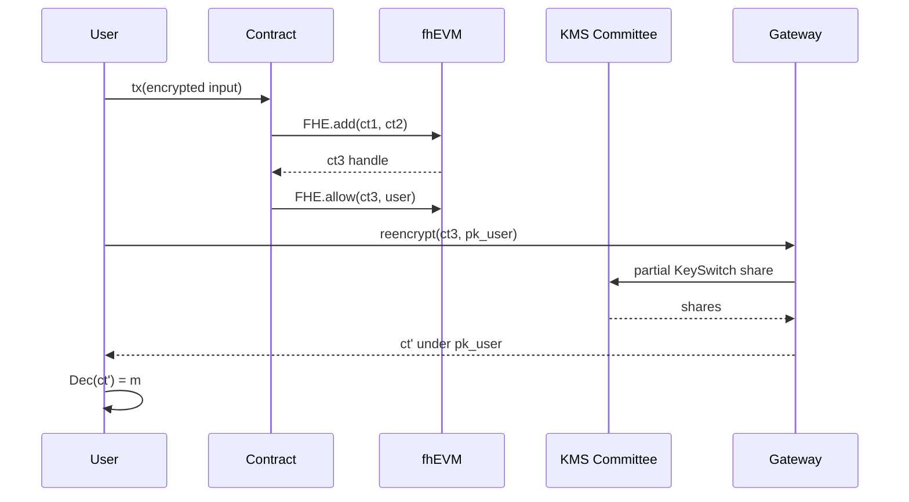

# FHE 在区块链上的落地（Zama fhEVM / Fhenix / Inco / Mind Network）

> **TL;DR**：2023–2026 年 FHE 从学术走向链上，四大代表项目：Zama fhEVM 提供 Solidity 级 `euintN` 类型与 precompile 库；Fhenix 在以太坊 L2 部署基于 fhEVM 的 rollup；Inco Network（现 Inco Lightning）作为 modular FHE 协处理器服务 L1/L2；Mind Network 主打 FHE-based restaking 与 AI 推理。这类系统通常组合 TFHE（整数运算）、阈值解密网关（Threshold KeySwitch）、以及与 ZK 协作的 state transition 证明。

## 1. 背景与动机

ZK Rollup 能让交易在公开数据下可验证，但 **输入与状态本身仍可见**——余额、出价、NFT 归属、DeFi 头寸谁都能读。FHE 补上这一空白：合约状态存为密文，任何验证者都无法解密，却可以同态地执行业务逻辑。

为何在 2024 年前才真正落地？三个条件刚刚齐备：
- TFHE Programmable Bootstrapping 把一次 8-bit 比较压到 ~10ms。
- ASIC/GPU 加速（Zama Concrete GPU, Fhenix FHERMA）让 Tx 级延迟从分钟到秒。
- 阈值解密（Threshold KeySwitching）让"谁持有 sk"问题分散到 MPC 委员会，避免单点信任。

主流应用方向：
- **机密稳定币 & DeFi**：余额、借贷仓位、MEV 不可见。
- **暗拍（Sealed-bid Auction）**：出价 in-flight 密文，仅获胜者曝光。
- **机密投票**：DAO 大额提案、链上选举。
- **合规性 + 隐私**：白名单、AML 查询在密文上完成。
- **AI 推理 + 用户数据**：用户只上传密文特征，模型推理结果返回同一密文密钥。

## 2. 核心原理

### 2.1 fhEVM 的形式化

fhEVM 定义为标准 EVM 的扩展：状态 $\sigma$ 中部分 storage slot 存储 RLWE 密文 $\mathrm{ct} \in R_q^2$ 的哈希或指针。合约接口暴露类型 $\texttt{euint8}, \texttt{euint16}, \texttt{euint32}, \texttt{ebool}, \texttt{eaddress}$。每个操作通过 precompile 调用底层 TFHE-rs：

$$\mathrm{Op}_{\mathrm{fhe}}: (\mathrm{ct}_1, \dots, \mathrm{ct}_k) \xrightarrow{\text{precompile}} \mathrm{ct}_{\mathrm{result}}, \quad \text{gas}(\mathrm{Op}) \propto |\mathrm{Op}|_{\mathrm{PBS}}.$$

安全性由 **底层 TFHE 的 IND-CPA**（依赖 LWE 假设）加上 **阈值 KeySwitch 委员会的诚实多数**（MPC 假设）共同保证。只要不泄漏 sk 且解密请求经过 ACL，链上 storage 对任何观测者保持不可区分。

**Access Control List (ACL)**：fhEVM 额外维护 $(owner, ct\_handle) \to \text{allowed\_contracts}$ 映射；只有被授权合约才能把密文传入其他合约或 `reencrypt` 出链。

### 2.2 阈值解密（Threshold KeySwitching）

用户 A 想读取属于自己的密文 $\mathrm{ct}$：
1. A 在本地生成一次性公钥 $pk_A$。
2. A 发送 `reencrypt(ct_handle, pk_A, sig_A)` 到 gateway。
3. Gateway 检查 ACL，将请求分发给 KMS 委员会的 $n$ 节点。
4. 每节点用自己持有的份额 $sk_i$ 执行 partial KeySwitch：$\mathrm{ct} \to \mathrm{Share}_i$。
5. 收集 $\ge t$ 份额，线性组合得到在 $pk_A$ 下的密文 $\mathrm{ct}'$。
6. A 本地解密 $\mathrm{ct}'$ 得明文。

分布式密钥生成（DKG）基于 Rabin-Gentry，RLWE 版本由 Mouchet 等 2021 年给出。

### 2.3 子机制拆解

- **Encrypted Types (`euintN`)**：Solidity library 封装 ct handle（bytes32），重载算符。
- **Precompile 集合**：`FHEAdd`、`FHEMul`、`FHECmp`、`FHESelect`（条件赋值，底层 CMUX），每个映射到 TFHE-rs 函数。
- **Gas Model**：fhEVM 用"scaled gas" = CPU cycles / 固定常数；一次 32-bit 加法约 400k scaled gas，乘法约 2M，cmp 约 1M。
- **ZK Proof of Input**：用户把明文加密到 ct 时附带 NIZK 证明 "该密文加密的是合法范围内的值"，防止恶意入参溢出到噪声区破坏解密。
- **State Sync**：密文存储会急剧增加 state growth，Fhenix 设计 state expiry + off-chain DA（EIP-4844 blobs）。
- **Coprocessor 模式 vs L1 集成**：Inco 选 coprocessor（其他链发送密文请求，Inco 执行、返回结果 + ZK 证明）；Fhenix 选 L2 全链路 FHE。

### 2.4 参数与治理

- fhEVM TFHE 参数：`PARAM_MESSAGE_2_CARRY_2_KS_PBS`（4-bit msg + 4-bit carry），SK length 630 LWE + 1024 GLWE。
- KMS 委员会大小：Fhenix 公测 5-of-7，长期目标 n=100 BFT。
- 解密延迟：on-chain `FHE.decrypt(handle)` 异步通过 oracle，回调 1~2 blocks。
- 重加密吞吐：gateway 并发 ~200 QPS。

### 2.5 失败模式

- **KMS 合谋** → 泄漏所有用户余额；缓解：委员会多样化 + Slashing。
- **ACL bug**：某合约误调 `TFHE.allow()` 授予错误地址，导致密文被读。
- **Side-channel 网关**：gateway 响应时间随明文变化泄漏信息。
- **存储爆炸**：密文是明文几百倍，需要 blob + state rent。
- **参数误配**：开发者选错 params → 解密失败或安全下降。



## 3. 架构剖析

### 3.1 分层视图

1. **TFHE Core (Rust)**：zama-ai/tfhe-rs —— 所有链都基于此。
2. **Precompile / Coprocessor**：go-ethereum fork 或独立 service (fhevm-coprocessor)。
3. **Solidity Library**：`TFHE.sol`，提供 `euintN`、`asEuintN`、`add`、`select`、`decrypt`。
4. **Gateway & KMS**：解密服务，使用 TSS + MPC。
5. **Application**：Confidential ERC-20、Blind Auction、Encrypted DAO。

### 3.2 核心模块清单

| 模块 | 职责 | 依赖 | 路径 |
| --- | --- | --- | --- |
| TFHE core | RLWE 原语 | — | `tfhe-rs/tfhe/src/core_crypto` |
| fhevm-go | go-ethereum fork precompile | TFHE | `zama-ai/fhevm-go/fhevm/` |
| TFHE.sol | Solidity 接口 | fhevm-go | `fhevm-solidity/lib/TFHE.sol` |
| KMS | 阈值 KeySwitch | TFHE + MPC | `zama-ai/kms-core` |
| Gateway | reencrypt 路由 | KMS | `zama-ai/fhevm-gateway` |
| Fhenix rollup | L2 序列 + FHE | fhevm | `FhenixProtocol/nitro-fhe` |

### 3.3 数据流：密文加法 tx 的生命周期

1. 用户 dApp 调 SDK `fhevmjs.encrypt8(42, contractAddress)` → 附带 ZK 证明 → 返回 `inputHandle`。
2. 用户签名 tx 调合约函数 `add(euint8 a, euint8 b)`。
3. 节点 mempool 收到 tx，执行前检查 ZK 证明；失败则 revert，gas 退还不完整。
4. EVM 进入合约 bytecode，遇到 `FHEAdd` precompile (0x5B)，传入两个 ct handle。
5. Precompile 查 storage，把 ct 字节取出，调用 TFHE-rs 执行 add；结果写回 storage，handle 更新。
6. ACL 记录：`sender` 可访问新 handle；若合约 `FHE.allow(user)` 则用户也可。
7. 块打包、共识。
8. 用户 post-tx 通过 gateway reencrypt → 本地解密查看结果。

### 3.4 客户端多样性 / 参考实现

- **Zama fhEVM**：官方参考实现，go-ethereum fork。
- **Fhenix Network**：Arbitrum Nitro fork + fhEVM，EVM-compatible L2。
- **Inco Network**：Cosmos SDK + Tendermint + TFHE coprocessor，为 L1/L2 提供外包计算。
- **Mind Network**：Restaking 基础设施 + FHE 验证，专注 AI + DePIN。
- **Sunscreen**：编译器框架，Rust `#[sunscreen::fhe_program]`。

### 3.5 扩展接口

- `fhevmjs` NPM：浏览器 / Node SDK，封装 encrypt/reencrypt。
- `@zama-fhe/relayer-sdk`：gateway 通信。
- Fhenix Hardhat plugin：本地测试链。
- Inco RPC：`inco_reencrypt`、`inco_decrypt` 扩展。

## 4. 关键代码 / 实现细节

Confidential ERC-20 的 fhEVM Solidity（参考 `fhevm-solidity/examples/EncryptedERC20.sol`）：

```solidity
// SPDX-License-Identifier: BSD-3-Clause-Clear
pragma solidity ^0.8.24;

import "fhevm/lib/TFHE.sol";
import "fhevm/config/ZamaFHEVMConfig.sol";

contract EncryptedERC20 is SepoliaZamaFHEVMConfig {
    mapping(address => euint64) internal balances;

    function transfer(address to, einput encAmount, bytes calldata proof)
        external
    {
        euint64 amount = TFHE.asEuint64(encAmount, proof);
        ebool ok = TFHE.le(amount, balances[msg.sender]);

        // select(ok, amount, 0)：若失败则转 0，保证条件分支在密文上
        euint64 delta = TFHE.select(ok, amount, TFHE.asEuint64(0));
        balances[msg.sender] = TFHE.sub(balances[msg.sender], delta);
        balances[to] = TFHE.add(balances[to], delta);

        // 允许收款人查看自己的余额
        TFHE.allow(balances[to], to);
        TFHE.allow(balances[msg.sender], msg.sender);
    }
}
```

## 5. 演进与版本对比

| 项目 | 版本 | 里程碑 | 说明 |
| --- | --- | --- | --- |
| Zama fhEVM | v0.4 (2023) | 首个 TFHE-on-EVM | 本地 devnet |
| Zama fhEVM | v0.7 (2024) | ACL + NIZK input | Sepolia 公测 |
| Zama fhEVM | v0.8 (2025) | Coprocessor 架构 | Inco 集成 |
| Fhenix | Frontier (2024) | L2 testnet | Arbitrum Nitro fork |
| Fhenix | Helium (2025) | Mainnet candidate | GPU PBS |
| Inco | Gentry (2024) | L1 testnet | IBC 支持 |
| Inco | Lightning (2025) | Coprocessor on Base | EigenLayer AVS |
| Mind Network | v1 (2024) | Restaking | BTC-aligned |

## 6. 实战示例

```bash
# Fhenix localnet
git clone https://github.com/FhenixProtocol/fhenix-hardhat-example
cd fhenix-hardhat-example
pnpm install
pnpm hardhat node:local &
pnpm hardhat deploy --network localfhenix
pnpm hardhat test
# 日志显示密文加法 gas ~2M，结果仅持有者可解密
```

## 7. 安全与已知攻击

- **Fhenix testnet Sep 2024**：relinearization key 未广播，部分 tx revert；修复后重新部署。
- **KMS 单点信任**：早期 fhEVM KMS 仅 1-of-1，计划演进到 BFT 委员会。
- **Gateway DoS**：reencrypt 端点未 rate-limit，可被刷；部署 API key + onchain 支付。
- **LWE 参数 Matzov 攻击**：2023 版参数被上调至 N=32768 for 128-bit。
- **Input ZK 缺失**：2024 早期版本允许任意密文传入，导致解密崩溃；v0.7 强制 NIZK。

## 8. 与同类方案对比

| 维度 | fhEVM | ZK Rollup | TEE (Oasis Sapphire) | MPC (Nillion) |
| --- | --- | --- | --- | --- |
| 机密状态 | Yes | No (公开 state) | Yes (硬件) | Yes |
| 性能 | 慢 (秒级) | 快 | 快 | 中 |
| 信任 | LWE + KMS 委员会 | 透明 setup | 硬件厂商 | MPC 多方 |
| 可组合 | Solidity 原生 | ZK-compatible | EVM-compatible | SDK only |
| 抗量子 | Yes | 部分 | No | 部分 |

## 9. 延伸阅读

- Zama, "Confidential EVM Smart Contracts using Homomorphic Encryption"，2023
- Inco whitepaper 2024 v1.2
- Fhenix Litepaper "Encrypted Computation for Web3" 2023
- Mouchet et al., "Multiparty Homomorphic Encryption from Ring-Learning-with-Errors"，2021
- Vitalik Buterin, "What do I think about Fully Homomorphic Encryption?"，2024

## 10. 术语表

| 术语 | 英文 | 释义 |
| --- | --- | --- |
| fhEVM | Fully Homomorphic EVM | Zama 设计的 TFHE-on-EVM |
| euintN | Encrypted uint N | Solidity 加密整数类型 |
| ACL | Access Control List | 密文授权表 |
| Reencrypt | Re-encryption | 把密文切换到用户 pk |
| Coprocessor | FHE coprocessor | 外包 FHE 计算的独立网络 |

---

*Last verified: 2026-04-22*
