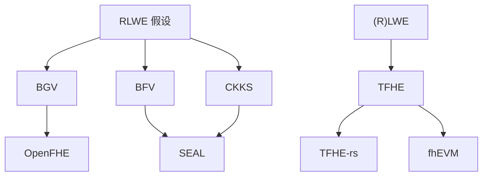

# 全同态加密（BGV / BFV / CKKS / TFHE）

> **TL;DR**：现代 FHE 四大方案按用途分工——BGV 与 BFV 处理模 t 整数并支持 SIMD batching，CKKS 做近似实数/浮点向量（ML 推理首选），TFHE 处理 bit-level 布尔电路并用可编程 Bootstrapping 支持任意 LUT。四者均建立在 RLWE 假设上，核心差异在噪声管理方式（modulus switching vs scale-invariant vs approximate vs blind-rotation）。主流实现：SEAL (BFV/CKKS)、OpenFHE（全家桶）、TFHE-rs (Zama)。

## 1. 背景与动机

2009 年 Gentry 的 "Fully Homomorphic Encryption Using Ideal Lattices" 开创了 FHE，但一次 Bootstrapping 要 30 分钟，加密一个 bit 需要几十 MB 密文，完全不可用。此后十余年工程师与密码学家合作，把 FHE 从"理论存在性证明"推进到工业级库：

- **2011 BGV** (Brakerski, Gentry, Vaikuntanathan)：首次不依赖理想格，直接基于 RLWE；提出 modulus switching 控制噪声，让 leveled FHE 成为可能。
- **2012 BFV** (Fan, Vercauteren)：scale-invariant 变种，更易实现，SEAL 默认选择。
- **2016 CKKS** (Cheon, Kim, Kim, Song)：允许近似浮点运算，密文槽直接放复数向量，机器学习推理吞吐提升两个数量级。
- **2016 TFHE** (Chillotti, Gama, Georgieva, Izabachène)：binary LWE + Blind Rotation，Bootstrapping 降到 ~10ms 并可顺带做 LUT，被称为"可编程 Bootstrapping (PBS)"。

Web3 场景按方案划分：
- 机密投票、密文平均数 → BFV/BGV。
- 密文 ML 模型推理 → CKKS。
- 智能合约中的比较、分支、整数算术 → TFHE（Zama fhEVM）。

## 2. 核心原理

### 2.1 形式化：RLWE 与密文结构

设 $R = \mathbb{Z}[x]/(x^N + 1)$，$N = 2^k$，$R_q = R / qR$。RLWE 分布：选 $s \in R$（小系数），$a \leftarrow R_q$，$e \leftarrow \chi$（高斯离散），输出 $(a, b = a s + e) \in R_q^2$。

**RLWE 假设**：给定多样本 $(a_i, b_i)$ 与均匀随机 $(a_i, u_i)$ 计算不可区分。安全性归约到环上理想格 SVP 近似问题。

一个 RLWE 密文形如 $\mathrm{ct} = (c_0, c_1) \in R_q^2$，满足：
$$c_0 + c_1 \cdot s = \Delta \cdot m + e \pmod q, \quad \Delta = \lfloor q / t \rfloor \quad (\text{BFV/BGV})$$

### 2.2 BGV / BFV：整数同态

**BGV**：明文空间 $R_t$，噪声在下层 $t$，用 modulus switching 从 $q_i$ 降到 $q_{i-1}$ 压缩噪声。

**BFV** scale-invariant：明文编码为 $\Delta m$，乘法后噪声不随模数变化，实现更简洁。

**关键运算**：
- **加法**：$(c_0 + c_0', c_1 + c_1')$。噪声线性。
- **乘法**：先张量 $(c_0 c_0', c_0 c_1' + c_1 c_0', c_1 c_1')$，再通过 **Relinearization**（用 evk = $\mathrm{Enc}(s^2)$）降回 2 分量密文。噪声近似平方。
- **SIMD Batching**：用 CRT 把 $\mathbb{Z}_t^N$ 分解为 $\prod \mathbb{F}_{t^d}$，单密文并行 N 槽。

**参数**：SEAL v4.1 默认 $N = 8192, q \approx 2^{218}, t = 65537$，128-bit 安全。

### 2.3 CKKS：近似实数

明文编码：$\mathbf{z} \in \mathbb{C}^{N/2}$ → $R$ via inverse canonical embedding，再乘缩放因子 $\Delta$ 得到 $\Delta \cdot \pi^{-1}(\mathbf{z}) \in R$。

**特色**：解密等式 $c_0 + c_1 s = \Delta m + e$，CKKS 不"舍去" $e$，而是把 $e$ 视为 **消息精度** 的一部分。
- **Rescale**：乘法后执行 $\mathrm{ct} \to \lfloor \mathrm{ct} / \Delta \rceil \pmod{q/\Delta}$，把 $\Delta^2 m^2$ 降回 $\Delta m^2$ 并相应降噪。
- **Bootstrapping**：把 CKKS 密文重新升级到高模数，成本高但有 FullRNS 与 Meta-BTS 优化，2023 年已降至 ~1s/slot。

**应用**：卷积神经网络推理（CryptoNets 升级版），Microsoft 2021 在 SEAL 上跑 ResNet-20 约 250s 一张图。

### 2.4 TFHE：Bit-level 与 PBS

TFHE 核心对象：
- **LWE ciphertext**：$(a, b = \langle a, s \rangle + e + \Delta m) \in \mathbb{Z}_q^{n+1}$，n=630 左右。
- **GLWE / GGSW**：Ring 版 LWE，用于 bootstrap key。
- **Bootstrap key (BSK)**：$\mathrm{Enc}_{GLWE}(s_i)$ for each sk bit。

**Blind Rotation (Programmable Bootstrapping)**：
1. 把 LWE 密文看作指针，旋转测试多项式 $v(x) = \sum_i v_i x^i$（编码目标 LUT）。
2. 通过 BSK 累积 CMUX（controlled mux）加密地旋转 $v$。
3. Sample Extraction → 新 LWE 密文，噪声被替换为 bootstrap 固有常量。

TFHE 最大卖点：LUT 可以编码 **任意** 1-in-1-out 函数（sign、ReLU、比较），代价仍是 ~10ms。

### 2.5 关键参数与常量

| 方案 | N | log q | t / Δ | Bootstrap | 安全 |
| --- | --- | --- | --- | --- | --- |
| BGV | 8192~32768 | 180~800 | t=65537 | optional (leveled) | 128 bit |
| BFV | 8192 | 218 | 65537 | optional | 128 bit |
| CKKS | 16384 | 438 | Δ=2^40 | required for deep | 128 bit |
| TFHE | 1024 (GLWE) | 32 | binary | every gate | 128 bit |

参数来源：Homomorphic Encryption Standard v1.1 Table 1。升级安全水平需联动调大 N 与 logq，并减小噪声分布方差。

### 2.6 失败模式

- **CKKS IND-CPA-D 漏洞** (Li-Micciancio 2020)：对外暴露解密结果时，泄露 sk。修复：噪声淹没（noise flooding）或 Silent 调用。
- **LWE 参数过时**：Matzov 攻击使某些参数降到 ~115 bit；OpenFHE 2023 上调默认值。
- **Circular Security**：Bootstrapping 需 $\mathrm{Enc}(s)$ 公开，没有严格证明仅依赖假设。
- **Randomness 失败**：$a, e$ 使用非 CSPRNG 导致崩溃。



```
密文生命周期（BFV）
Enc → [noise ≈ B_clean] → Mul → [B²] → Relin → Mod Switch → [B·sqrt(t)] → ...
               ↑ when noise > q/(2Δ), 解密失败
```

## 3. 架构剖析

### 3.1 分层视图

1. **Ring Arithmetic Backend**：NTT (Number Theoretic Transform)、RNS (Residue Number System) 分解。
2. **Key Layer**：SecretKey、PublicKey、RelinKey、GaloisKey、BootstrapKey。
3. **Scheme Layer**：BFV / BGV / CKKS / TFHE 各自 Evaluator。
4. **Compiler / DSL**：Concrete (Rust/Python)、EVA、HEAAN → 自动 rescale & relin 位置。
5. **Application**：ML 推理、SQL、智能合约 precompile。

### 3.2 核心模块清单

| 模块 | 职责 | 依赖 | 路径 |
| --- | --- | --- | --- |
| NTT | 多项式快乘 | SIMD | `SEAL/native/src/seal/util/ntt.cpp` |
| RNS | 大整数分解为小素数 | — | `openfhe/src/core/lib/math/hal/bigintbackend/` |
| Encoder | 明文编码 | NTT | `SEAL/native/src/seal/ckks.cpp` |
| Evaluator | HE operations | Keys | `SEAL/native/src/seal/evaluator.cpp` |
| Bootstrap | 噪声刷新 | BSK | `tfhe-rs/tfhe/src/core_crypto/algorithms/lwe_bootstrap_key.rs` |
| Concrete | DSL 编译 | all | `zama-ai/concrete/crates/concrete` |

### 3.3 数据流：一次 CKKS 乘法

1. `cc.Encrypt(pk, pt_a)` → RLWE ciphertext $\mathrm{ct}_a$，size ~几百 KB。
2. `cc.EvalMult(ct_a, ct_b)` → tensor 3 components, relin → 2 components。
3. `cc.Rescale(ct)` → 降一层 modulus chain（chain depth 消耗 1）。
4. 超阈值 → `cc.EvalBootstrap(ct)` → ~1s in OpenFHE 1.1 (Apple M3)。
5. `cc.Decrypt(sk, ct)` → 明文向量（浮点）。

### 3.4 参考实现

- **Microsoft SEAL 4.1**：C++，BFV/BGV/CKKS，无 TFHE，无 Bootstrapping CKKS（社区 fork 有）。
- **OpenFHE 1.1**：C++，全家桶，继承 PALISADE + HElib + HEAAN + FHEW。
- **TFHE-rs 0.8**：Rust（Zama），TFHE + integer wrapper。
- **Concrete 2.x**：Rust + Python，MLIR 编译器。
- **HElib**：IBM 学术参考。

### 3.5 扩展接口

- SEAL C# / Python binding。
- OpenFHE Python binding、WASM binding。
- TFHE-rs：`no_std` 支持、WASM target、fhEVM precompile。
- Concrete Python：装饰器式 DSL：`@fhe.compile`。

## 4. 关键代码 / 实现细节

CKKS 近似乘法（基于 OpenFHE 1.1）：

```cpp
// openfhe-development/src/pke/examples/simple-real-numbers.cpp
std::vector<double> x1 = {0.25, 0.5, 0.75, 1.0};
std::vector<double> x2 = {5.0, 4.0, 3.0, 2.0};
auto pt1 = cc->MakeCKKSPackedPlaintext(x1);
auto pt2 = cc->MakeCKKSPackedPlaintext(x2);
auto ct1 = cc->Encrypt(keyPair.publicKey, pt1);
auto ct2 = cc->Encrypt(keyPair.publicKey, pt2);

auto ctMul = cc->EvalMult(ct1, ct2);      // tensor + relin
ctMul = cc->Rescale(ctMul);                // 调整精度

Plaintext result;
cc->Decrypt(keyPair.secretKey, ctMul, &result);
result->SetLength(4);
std::cout << *result << std::endl;
// 预期：(1.25, 2.0, 2.25, 2.0) 附近带 2^-30 误差
```

TFHE-rs 任意 LUT（`accumulator` 即 test polynomial）：

```rust
// tfhe-rs/tfhe/src/shortint/server_key/bootstrap.rs
let lut = server_key.generate_accumulator(|x| (x * x) % 4);
let out = server_key.apply_lookup_table(&ciphertext, &lut);
```

## 5. 演进与版本对比

| 方案 | 年份 | 亮点 | 局限 |
| --- | --- | --- | --- |
| Gentry | 2009 | 首个 FHE | 不可用 |
| BGV | 2011 | 不依赖理想格 + Mod Switch | 慢 |
| BFV | 2012 | scale-invariant | 整数-only |
| GSW | 2013 | Approximate Eigenvector | 1-bit |
| FHEW | 2014 | 亚秒 bootstrap | 固定 LUT |
| CKKS | 2016 | 近似实数 | IND-CPA-D 风险 |
| TFHE | 2016 | 10ms PBS | 单 bit |
| CKKS bootstrapping | 2018 | 完整 FHE 级 CKKS | 1~10s |
| Concrete | 2020+ | MLIR 编译 | 仍在迭代 |

## 6. 实战示例

```bash
# TFHE-rs：密文加法
cargo new fhe-demo && cd fhe-demo
cargo add tfhe --features "integer,x86_64-unix"
# 在 src/main.rs 写入本文件 §4 代码，运行：
cargo run --release
# 输出：168，耗时 ~200ms
```

## 7. 安全与已知攻击

- **2020 CKKS 解密泄露**（Li & Micciancio）：噪声淹没为默认修复。
- **2023 Matzov 攻击**：格攻击常数改善，参数表上调。
- **Fhenix testnet bug 2024**：relinKey 未广播 → 某些 tx revert。
- **Side-channel**：NTT timing 泄漏 sk bits，TFHE-rs constant-time 实装进行中。

## 8. 与同类方案对比

| 维度 | BGV | BFV | CKKS | TFHE |
| --- | --- | --- | --- | --- |
| 明文 | 整数 mod t | 整数 mod t | 近似复数 | bit |
| 典型乘法 | ~ms | ~ms | ~ms | ~10ms PBS |
| SIMD | Yes | Yes | Yes | No (slow batch) |
| Bootstrap | 可选 | 可选 | 必要深度 | 每门 |
| 适用 | 投票/密文整数 | 整数 ML | 浮点 ML | 通用布尔/LUT |

## 9. 延伸阅读

- Brakerski, Gentry, Vaikuntanathan, "(Leveled) Fully Homomorphic Encryption without Bootstrapping"，ITCS 2012
- Cheon, Kim, Kim, Song, "Homomorphic Encryption for Arithmetic of Approximate Numbers"，ASIACRYPT 2017
- Chillotti et al., "TFHE: Fast Fully Homomorphic Encryption over the Torus"，J. Cryptology 2020
- Zama 文档：https://docs.zama.ai
- Homomorphic Encryption Standard v1.1

## 10. 术语表

| 术语 | 英文 | 释义 |
| --- | --- | --- |
| NTT | Number Theoretic Transform | 模多项式快乘 |
| RNS | Residue Number System | 大整数分解到小素数 |
| Relin | Relinearization | 乘法后 3→2 分量 |
| PBS | Programmable Bootstrapping | TFHE 顺带 LUT 的 bootstrap |
| Rescale | Rescale | CKKS 乘后降精度 |

---

*Last verified: 2026-04-22*
