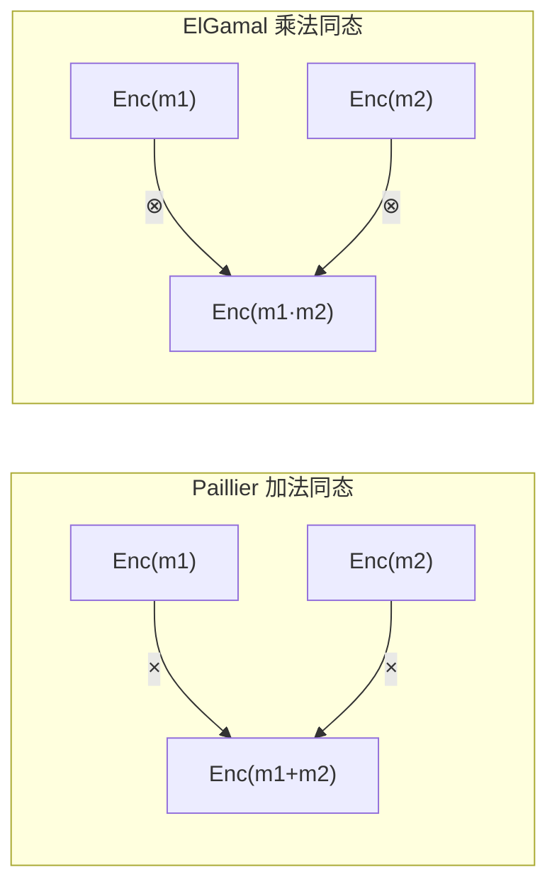

# 部分同态加密（Partial HE：Paillier / ElGamal / RSA）

> **TL;DR**：Partial HE (PHE) 只支持一种代数操作：Paillier 支持加法（基于决策复合剩余性假设，DCRA），ElGamal 支持乘法（基于 DDH），RSA 也支持乘法但确定性强、不抗 IND-CPA。它们在 2009 年 FHE 诞生之前是 "可实用同态" 的唯一选项，至今仍广泛用于 e-voting、阈值签名（GG20/CGGMP 里的 MtA）、链上隐私加总等不需要任意电路的场景，性能显著优于 FHE。

## 1. 背景与动机

全同态加密（FHE）在 2009 年才诞生，但 "同态" 思想可追溯到 1978 年 RSA 论文——Rivest 等观察到 $E(a) \cdot E(b) = E(ab) \bmod N$ 的性质，并首次提出 "privacy homomorphism" 概念。对于仅需一种操作的应用（电子投票累加、秘密分享重构、阈值签名），部分同态既简单又高效：Paillier 加密一个数只需 2~3 次模幂运算，RSA-2048 参数下 < 1ms，而 BFV 加密要 10~20ms。

Web3 典型用例：
- **Threshold ECDSA（GG18/GG20/CGGMP）**：签名协议中 Paillier 同态加法用于 "乘法 → 加法" 转换（MtA）。
- **链上密文加总**：Mind Network 早期用 Paillier 做匿名投票累加，证明链上 tally 正确。
- **RSA Accumulator**：Boneh-Bünz 2018 用 RSA 模乘的同态性构造可除式累加器，适合状态压缩。
- **私有 RFQ / 拍卖**：ElGamal 乘法同态用于密文价格比值检查。
- **Web2 场景**：Google PSI（Private Set Intersection）、Microsoft Sealed Bid 拍卖。

PHE 的 **限制是单操作**——一旦需要加法 **和** 乘法同时，就要走 SHE/FHE 路线。但正因为限制，它能给出紧凑密文（Paillier 约 2 × |N| 位）和可用性能。

## 2. 核心原理

### 2.1 Paillier 加密（加法同态）

**KeyGen**：选两个大素数 $p, q$，$N = pq$，$\lambda = \mathrm{lcm}(p-1, q-1)$。公钥 $(N, g)$，$g = N + 1$。私钥 $\lambda$ 或 $(p, q)$。

**Enc**：对 $m \in \mathbb{Z}_N$ 选随机 $r \in \mathbb{Z}_N^*$，
$$c = g^m \cdot r^N \bmod N^2 = (1 + mN) \cdot r^N \bmod N^2.$$

**Dec**：$m = L(c^\lambda \bmod N^2) \cdot \mu \bmod N$，其中 $L(x) = (x-1)/N$，$\mu = L(g^\lambda \bmod N^2)^{-1} \bmod N$。

**加法同态**：
$$\mathrm{Enc}(m_1) \cdot \mathrm{Enc}(m_2) = g^{m_1 + m_2} r_1^N r_2^N \bmod N^2 = \mathrm{Enc}(m_1 + m_2).$$

也支持标量乘 $\mathrm{Enc}(m)^k = \mathrm{Enc}(km)$，但两个密文相乘 **不等于** 密文的乘积——所以 Paillier 不支持 HE 乘法。

**安全性假设（DCRA, Decisional Composite Residuosity Assumption）**：给定 $N = pq$，区分 "$z$ 是 $N$ 次剩余" 与均匀随机 $z \in \mathbb{Z}_{N^2}^*$ 在多项式时间内不可行。等价于 Factoring 的变体，密切关联 RSA 问题。

**IND-CPA**：在 DCRA 下 Paillier 是 IND-CPA 的，但 **不抗 CCA**；需要加 NIZK（Fiat-Shamir Schnorr 证明）抵御恶意密文注入。

### 2.2 ElGamal 加密（乘法同态）

选素数阶循环群 $G = \langle g \rangle$，阶 $q$。私钥 $x \in \mathbb{Z}_q$，公钥 $h = g^x$。

**Enc**：$(c_1, c_2) = (g^r, m \cdot h^r)$，$r \leftarrow \mathbb{Z}_q$。
**Dec**：$m = c_2 \cdot c_1^{-x}$。

**乘法同态**：$(c_1^{(1)} c_1^{(2)}, c_2^{(1)} c_2^{(2)}) = \mathrm{Enc}(m_1 m_2)$。

**加性 ElGamal** 变体：把明文编码为 $g^m$，$c_2 = g^m h^r$；解密用 babystep-giantstep 取离散对数（仅适合小范围 $m$），这样可支持加法同态，用于投票累加。

**安全性假设（DDH, Decisional Diffie-Hellman）**：区分 $(g, g^a, g^b, g^{ab})$ 与 $(g, g^a, g^b, g^c)$ 在多项式时间内不可行。secp256k1、curve25519 均满足 DDH 变体。

### 2.3 RSA 加密（乘法同态）

$N = pq$，$e$ 公开指数，$d = e^{-1} \bmod \varphi(N)$。$\mathrm{Enc}(m) = m^e \bmod N$。
$\mathrm{Enc}(m_1)\mathrm{Enc}(m_2) = (m_1 m_2)^e = \mathrm{Enc}(m_1 m_2)$。

但 **确定性加密**（不带随机性）→ 不抗 IND-CPA；现代场景基本用 RSA-OAEP 消灭同态性换 CCA 安全。故 RSA 的同态性今天主要出现在 accumulator 与理论场景。

**安全性假设（RSA Problem）**：给 $(N, e, c)$ 求 $m = c^{1/e} \bmod N$ 困难；归约到 Factoring。

### 2.4 加法 vs 乘法的代数对偶

| 方案 | 群结构 | 同态操作 | 明文空间 | 密文大小 | 随机化 |
| --- | --- | --- | --- | --- | --- |
| Paillier | $\mathbb{Z}_{N^2}^*$ | 加法 | $\mathbb{Z}_N$ | 2|N| bit | Yes (r) |
| ElGamal | $G$ of order q | 乘法 | G | 2|G| bit | Yes (r) |
| Additive ElGamal | 同上 | 加法 | small int | 2|G| bit | Yes |
| RSA (plain) | $\mathbb{Z}_N^*$ | 乘法 | $\mathbb{Z}_N^*$ | |N| bit | No |

### 2.5 零知识证明配套

PHE 常需要 **证明密文的格式正确**：
- **Range Proof**：证明 $m \in [0, 2^\ell)$，如 Bulletproofs、Borromean。
- **Proof of Plaintext Equality**：证明两个密文加密同一明文。
- **Proof of Correct Encryption**：Schnorr-like Σ-协议，对 Paillier 有 Damgård-Jurik 风格证明。

### 2.6 失败模式

- **Paillier 短 r**：若 $r$ 取值小，$r^N \bmod N^2$ 可被 Coppersmith 求解。SDK 必须使用 CSPRNG。
- **确定性 RSA**：可被字典攻击击穿。
- **加性 ElGamal 范围过大**：离散对数不可解。
- **模重用**：两实例共享 $N$ 可经 GCD 攻击泄露 $p$。
- **阈值 Paillier safe prime**：要求 $p = 2p' + 1, q = 2q' + 1$，否则份额计算错误。



```
Paillier 密文结构
+--------- N^2 ----------+
|  c = (1+mN) · r^N mod N^2  |
+------------------------+
   ↑加法          ↑随机性
```

## 3. 架构剖析

### 3.1 分层视图

PHE 实现分四层：
1. **大整数 / 椭圆曲线后端**（GMP、secp256k1-rs、openssl bn）。
2. **核心原语**：ModExp、模逆、素数测试（Miller-Rabin）、CRT 优化。
3. **方案层**：Paillier/ElGamal/RSA API。
4. **协议层**：Threshold Paillier、ZK Range Proof、MtA。

### 3.2 核心模块清单

| 模块 | 职责 | 依赖 | 典型路径 |
| --- | --- | --- | --- |
| BigInt | 大整数模运算 | CPU | `rust-gmp`, `num-bigint-dig` |
| Prime Gen | safe prime 生成 | BigInt | `openssl/crypto/bn/bn_prime.c` |
| Paillier Core | Enc/Dec/Add | BigInt | `github.com/mikeivanov/paillier/paillier.go` |
| Threshold | n-of-n split sk | Shamir | `ZenGo-X/multi-party-ecdsa/src/utilities/mta` |
| ZK NIZK | correctness proof | Fiat-Shamir | `zkcrypto/bulletproofs` |
| EC backend | ElGamal curve ops | secp256k1 | `libsecp256k1-zkp` |

### 3.3 数据流：阈值 ECDSA 中的 MtA

GG20 签名协议核心子过程 "Multiplicative to Additive"：
1. Alice 有秘密 $a$，Bob 有秘密 $b$，目标是各得 $\alpha, \beta$ 使 $\alpha + \beta = ab \bmod q$。
2. Alice 用自己的 Paillier 公钥发 $\mathrm{Enc}_A(a)$ 给 Bob。
3. Bob 选 $\beta'$，计算 $c = \mathrm{Enc}_A(a)^b \cdot \mathrm{Enc}_A(-\beta') = \mathrm{Enc}_A(ab - \beta')$，回传。
4. Alice 解密得 $\alpha = ab - \beta' \bmod q$；Bob 的 $\beta = \beta' \bmod q$。
5. Bob 同时给 Alice 发范围证明，确保 $b, \beta'$ 合法（否则可提取 $a$）。

整个过程用掉 1 次 Paillier Enc、2 次 Eval、1 次 Dec 以及 Range Proof（Zengo 的 `RangeProofNi`）。

### 3.4 参考实现

- **OpenSSL** C：RSA 原语、BN 大数。
- **paillier.go** Go：教学级实现，~1K 行。
- **multi-party-ecdsa** Rust (ZenGo-X)：生产级阈值协议，含 Paillier + EC ElGamal。
- **threshold_crypto** Rust：BLS 阈值版 ElGamal。

### 3.5 对外接口

- Ethereum precompile `0x05`（EIP-198 modExp）：可用于链上 Paillier/RSA 验证。
- Foundry 脚本可直接 `eth_call` 验证 accumulator 证明。

## 4. 关键代码 / 实现细节

Paillier 加密的 Rust 实现（参考 ZenGo `paillier` crate v0.4）：

```rust
// multi-party-ecdsa/src/utilities/paillier/mod.rs (简化)
pub fn encrypt(pk: &EncryptionKey, m: &BigInt) -> BigInt {
    let n = &pk.n;
    let nn = n * n;
    let r = sample_below(n);
    // c = (1 + m*n) * r^n mod n^2
    let gm = (BigInt::one() + m * n) % &nn;
    let rn = BigInt::mod_pow(&r, n, &nn);
    (gm * rn) % nn
}

pub fn add(pk: &EncryptionKey, c1: &BigInt, c2: &BigInt) -> BigInt {
    let nn = &pk.n * &pk.n;
    (c1 * c2) % nn
}
```

## 5. 演进与版本对比

| 版本/方案 | 年份 | 关键改进 | 影响 |
| --- | --- | --- | --- |
| RSA | 1978 | 首个公钥+乘法同态 | 启发后续 |
| ElGamal | 1985 | 随机化、乘法同态 | 影响 DSA |
| Goldwasser-Micali | 1982 | 首个 IND-CPA PHE（XOR 同态） | 1-bit only |
| Benaloh | 1994 | 小明文加法 | 电子投票 |
| Paillier | 1999 | 完整加法 | 主流选择 |
| Damgård-Jurik | 2001 | 变长明文 Paillier | 扩展带宽 |
| Threshold Paillier | 2001 (Fouque) | n-of-n | 阈值 ECDSA |

## 6. 实战示例

```python
# pip install phe  (python-paillier)
from phe import paillier
pk, sk = paillier.generate_paillier_keypair(n_length=2048)
a, b = pk.encrypt(100), pk.encrypt(234)
c = a + b                  # 同态加法
print(sk.decrypt(c))       # -> 334
print(sk.decrypt(a * 3))   # -> 300，标量乘
```

## 7. 安全与已知攻击

- **CVE-2019-14859（Damgård-Jurik）**：部分实现未检查 $c < N^{s+1}$，攻击者可提交越界密文污染解密。
- **2022 阈值 ECDSA 漏洞（Fireblocks 披露）**：GG18/GG20 实现范围证明错误，恶意参与者可窃取私钥，现已升级到 CGGMP。
- **Bleichenbacher RSA-PKCS#1**：确定性 RSA 下 padding oracle，主流方案放弃 plain RSA 同态性。
- **共享 N 攻击**：DocuSign 等早期 RSA 服务共用 N 被大规模 GCD 扫描分解。

## 8. 与同类方案对比

| 维度 | Paillier | 加性 ElGamal | BFV (FHE) | Pedersen 承诺 |
| --- | --- | --- | --- | --- |
| 操作 | + | + (小范围) | +, × | + (hiding) |
| 密文大小 | ~4096 bit | ~512 bit | 数 KB | 256 bit |
| 解密速度 | ~ms | ~μs | ~ms | 不可解密 |
| 依赖 | DCRA | DDH | RLWE | DL |

## 9. 延伸阅读

- Paillier P., "Public-Key Cryptosystems Based on Composite Degree Residuosity Classes"，EUROCRYPT 1999
- Damgård & Jurik, "A Generalisation, a Simplification and Some Applications of Paillier's Probabilistic Public-Key System"，PKC 2001
- Boneh, Bünz, Fisch, "Batching Techniques for Accumulators with Applications to IOPs and Stateless Blockchains"，2018
- Gennaro, Goldfeder, "Fast Multiparty Threshold ECDSA with Fast Trustless Setup"（GG18/GG20）

## 10. 术语表

| 术语 | 英文 | 释义 |
| --- | --- | --- |
| DCRA | Decisional Composite Residuosity | Paillier 安全性假设 |
| DDH | Decisional Diffie-Hellman | ElGamal 安全性假设 |
| MtA | Multiplicative to Additive | 阈值 ECDSA 子协议 |
| Safe Prime | p=2p'+1, p' 也是素数 | Paillier 阈值需求 |

---

*Last verified: 2026-04-22*
