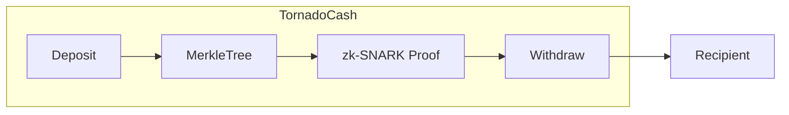

# 混币器与隐私币（Tornado Cash / Monero / Zcash）

> **TL;DR**：链上隐私的两条流派——**智能合约混币器**（Tornado Cash：Merkle + zk-SNARK，单资产匿名集合）与 **隐私原生链**（Monero：环签名 + 隐身地址 + RingCT；Zcash：Sapling/Orchard zk-SNARK shielded pool）。2022 年 Tornado Cash 被 OFAC 制裁，凸显"隐私币"面临的合规张力；2024–2026 年的继承者包括 Privacy Pools (Buterin 2023)、Railgun 与 Aztec。

## 1. 背景与动机

Bitcoin 的"伪匿名" UTXO 模型结合公开账本+链上分析工具（Chainalysis、TRM）可还原大多数交易轨迹。匿名研究分两路：
1. 在透明链上用密码学工具"洗散"资金——混币器。
2. 在协议层直接隐藏金额/发送方/接收方——隐私币。

典型推动力：
- 用户隐私权与链上分析的军备竞赛。
- 薪资、捐赠、商业支付希望隐藏数额。
- 监管合规与 AML 之间的冲突：Tornado Cash 被 Lazarus Group 洗 ~4.5 亿美元 → OFAC 制裁 → Alexey Pertsev 被荷兰法院判罪。

本文聚焦三个代表项目：**Tornado Cash**（合约混币器）、**Monero**（CryptoNote 后裔，环签名+RingCT）、**Zcash**（基于 SNARK 的 shielded pool）。

## 2. 核心原理

### 2.1 Tornado Cash

用户把 1/10/100 ETH 存入合约，后续可用 zk-SNARK 证明 "我知道某个承诺在 Merkle 树中"。关键组件：

**Note 承诺**：$C = H(\mathrm{nullifier} \parallel \mathrm{secret})$，用户选随机 $(k, r)$，deposit 写入 Merkle 树叶。

**Withdraw 电路**（Circom）：
- 私有输入：$k, r, \text{Merkle path}$。
- 公开输入：Merkle root、nullifier hash $h = H(k)$、接收者地址。
- 约束：叶 $H(k, r)$ 在树中；$h$ 正确。

**双花保护**：合约记录所有已披露的 nullifier hash，重复的 revert。

**形式化安全**：zk-SNARK 的知识可靠性 + 非恶意 trusted setup (Powers of Tau ceremony) + Keccak256 碰撞困难。

**匿名集合**：所有存入同额度的地址；实际攻击面远比理论小，因为时间关联、金额标签、relayer 关联等。

### 2.2 Monero：RingCT + Stealth

**核心原语**：
- **环签名 (MLSAG / CLSAG)**：发送方在 N 个公钥中产生一个签名，无法判断哪个是真实。形式化："Any-of-N 知识"，验证：
  $$\exists i \in [N] : \sigma = \mathrm{Sign}(sk_i, m).$$
- **Stealth Address**：接收者用长期公钥 $(A, B)$ 派生一次性公钥 $P = H(rA) G + B$，$r$ 是发送者随机数。区块浏览器看不到收款地址。
- **RingCT**：把金额隐藏为 Pedersen 承诺 $C = r G + a H$；用 Bulletproofs 证明金额非负且和平衡（输入金额和 = 输出 + fee）。

**安全性假设**：DL、DDH、哈希随机预言。

**环大小**：Monero v17 (2024) 固定 16；早期越小越易追踪。

### 2.3 Zcash：zk-SNARK Shielded Pool

Zcash 分 **transparent pool** 与 **shielded pool**。Shielded tx 用 zk-SNARK：

**Sapling (2018)**：基于 BLS12-381 + Groth16。Spend 电路约束"发票钞票 note" 的 nullifier 正确、commitment 在 Merkle；output 电路约束新 note 的承诺格式。
**Orchard (2022)**：基于 Pallas/Vesta 曲线 + Halo2（无 trusted setup）；统一 spend/output 成 "action"；支持更灵活匿名集合。

**Notes**：$(\rho, r, v, pk_d)$，承诺 $cm = \mathrm{Pedersen}(\rho, r, v, pk_d)$。发送方知道 $\rho$ → 产 nullifier $nf = \mathrm{PRF}(nk, \rho)$。

**安全性**：Halo2 的 knowledge-soundness（假设 polynomial commitment binding）、BLS12-381 AGM、Pedersen binding。

### 2.4 子机制拆解

- **Merkle 累加器**（Tornado、Zcash）：叶为承诺，插入 append-only；Tornado 用 MiMC 哈希，Zcash 用 Pedersen。
- **Nullifier**：全局 set；防双花；需公开不可关联。
- **Relayer**：Tornado 用 relayer 支付 gas，隐藏 withdraw 发起者 IP。
- **View Key**：Monero/Zcash 支持给审计方 view key，只读。
- **Turnstile 检测**：Zcash 在升级前后检查 shielded pool 总和一致（防 SNARK 漏洞偷造币）。

### 2.5 关键参数与常量

| 项目 | 环/树大小 | 哈希 | 曲线 | 证明大小 |
| --- | --- | --- | --- | --- |
| Tornado | 2^20 叶 | MiMC | BN254 | ~256 B |
| Monero | N=16 | Keccak/Blake256 | Ed25519 | ~2 KB RingCT |
| Zcash Sapling | 2^32 | Pedersen/Blake2s | BLS12-381 | 192 B |
| Zcash Orchard | 2^32 | Sinsemilla | Pallas | ~550 B |

### 2.6 失败模式

- **SNARK 反例 / Counterfeiting bug (Zcash 2018)**：Sapling 早期 trusted setup 漏洞允许造币；检查 turnstile 才发现。
- **环签名弱匿名**：早期 Monero 环 5，被统计分析锁定真实输入。
- **Tornado relayer 共谋**：relayer 可把发起者 IP 与 withdraw 关联。
- **Chainalysis de-mix**：时间 + 金额 + relayer metadata 聚合。
- **OFAC 合规风险**：法币出入金被冻。



```
Monero tx structure
  inputs:  { ring:[P_1,...,P_16], key_image=kI }  (kI 唯一防重花)
  outputs: { stealth_addr, Pedersen commit C }
  RingCT proof: Bulletproofs + CLSAG
```

## 3. 架构剖析

### 3.1 分层视图（以 Zcash 为例）

1. **Consensus**：zcashd fork of Bitcoin Core，PoW (Equihash) → 转 PoS 计划。
2. **P2P**：Bitcoin-like。
3. **Mempool**：shielded tx 额外验证 SNARK。
4. **Script / Transaction types**：v5 tx 支持 Orchard action。
5. **Crypto libs**：librustzcash、halo2。
6. **Wallet**：zebrad、Zashi、Nighthawk。

### 3.2 核心模块

| 模块 | 职责 | 依赖 | 路径 |
| --- | --- | --- | --- |
| Tornado verifier | Groth16 on-chain | bn254 | `tornado-core/contracts/Verifier.sol` |
| Tornado circuit | Circom | snarkjs | `tornado-core/circuits/withdraw.circom` |
| Monero daemon | core | wallet2 | `monero-project/monero/src/ringct/` |
| Monero CLSAG | ring sig | Ed25519 | `src/ringct/rctSigs.cpp` |
| Zcash Orchard | action circuit | halo2 | `zcash/orchard/src/circuit.rs` |
| librustzcash | shared crypto | halo2 | `zcash/librustzcash` |

### 3.3 数据流：Tornado Withdraw

1. 用户本地 derive note $(k, r)$，deposit 1 ETH。
2. 记录 leaf index 与 Merkle path。
3. 想提现时：运行 snarkjs 生成 zk proof（witness 含 k, r, path）。
4. 通过 relayer 发 `withdraw(proof, root, nullifierHash, recipient, relayer, fee, refund)`。
5. 合约验证 root 在历史、nullifier 未曾用；转出 1 ETH - fee。

### 3.4 参考实现

- **Tornado Core**：Solidity + Circom。
- **Monero**：C++ monerod、CLI、GUI。
- **Zcash**：zcashd (C++) + zebrad (Rust) + zashi-ios。
- **衍生**：Railgun (EVM shielded pool)、Aztec (zk-rollup shielded)、Privacy Pools、Penumbra (Cosmos)。

### 3.5 扩展接口

- Tornado：合约 ABI、relayer API、Compliance Tool。
- Monero RPC：wallet-rpc / daemon-rpc。
- Zcash lightwalletd gRPC。

## 4. 关键代码 / 实现细节

Tornado withdraw 验证合约（简化自 `tornado-core/contracts/Tornado.sol`）：

```solidity
function withdraw(
    bytes calldata _proof,
    bytes32 _root,
    bytes32 _nullifierHash,
    address payable _recipient,
    address payable _relayer,
    uint256 _fee,
    uint256 _refund
) external payable nonReentrant {
    require(!nullifierHashes[_nullifierHash], "note spent");
    require(isKnownRoot(_root), "bad root");
    require(
        verifier.verifyProof(
            _proof,
            [uint256(_root), uint256(_nullifierHash),
             uint256(_recipient), uint256(_relayer), _fee, _refund]
        ),
        "invalid proof"
    );
    nullifierHashes[_nullifierHash] = true;
    _processWithdraw(_recipient, _relayer, _fee, _refund);
    emit Withdrawal(_recipient, _nullifierHash, _relayer, _fee);
}
```

## 5. 演进与版本对比

| 协议/版本 | 时间 | 关键事件 |
| --- | --- | --- |
| Bitcoin CoinJoin | 2013 | 初代混币思路 |
| CryptoNote | 2012 | 环签名奠基 |
| Monero Ring 3→7→11→16 | 2014–2022 | 增强匿名 |
| Bulletproofs (Monero 2018) | 2018 | 替代范围证明 |
| CLSAG (Monero v16) | 2020 | 简化 RingCT |
| Zcash Sapling | 2018 | Groth16 |
| Zcash Orchard (NU5) | 2022 | Halo2 无 setup |
| Tornado Cash | 2019 | EVM 混币 |
| Tornado OFAC ban | 2022-08 | 合规事件 |
| Privacy Pools | 2023 | Vitalik 联合提议 |

## 6. 实战示例

```bash
# Monero 本地测试
monerod --regtest --fixed-difficulty 1 --non-interactive &
monero-wallet-cli --generate-new-wallet alice --regtest
# 转账: transfer <addr> <amount>
# 查看混淆：print_ring <txid>
```

## 7. 安全与已知攻击

- **Zcash 2018 Counterfeit Bug**：Sapling trusted setup 允许造币，开发团队 20 个月静默修复，未发现被利用。
- **Monero Chainalysis 关联**（2017）：环大小 < 7 + 0-decoy 输入可还原。
- **Tornado IP 泄漏**（2021 Nova v1）：relayer 中心化可关联。
- **Tornado OFAC 制裁**（2022）：被 sanction 的地址不能与合约交互。
- **Sapling Transcript bug 2023**：shard 升级时 rollback 攻击 PoC（无实战）。

## 8. 与同类方案对比

| 维度 | Tornado | Monero | Zcash shielded | Aztec (2024) |
| --- | --- | --- | --- | --- |
| 基础 | EVM 合约 | 独立链 | 独立链 | zk-rollup |
| 匿名集 | 同池 deposit | 所有 Monero tx | shielded pool | rollup 状态 |
| 隐私范围 | 金额固定 | 金额 + 收发方 | 金额 + 收发方 | 任意金额 + DeFi |
| 合规 | 被制裁 | 无 backdoor | 有 view key | opt-in |
| 性能 | ~200k gas/withdraw | 2 分钟出块 | 75 秒出块 | L2 |

## 9. 延伸阅读

- Pertsev et al., Tornado Cash whitepaper v1.4
- Noether S., "Ring Confidential Transactions"，MRL-0005
- Hopwood et al., Zcash Protocol Specification
- Vitalik Buterin, "Privacy Pools: Improving Privacy While Helping with Regulation"，2023
- Möser et al., "An Empirical Analysis of Traceability in the Monero Blockchain"，PETS 2018

## 10. 术语表

| 术语 | 英文 | 释义 |
| --- | --- | --- |
| Note | Note | 代表 UTXO 的隐藏承诺 |
| Nullifier | Nullifier | 防双花的公开不可关联标记 |
| Ring Signature | Ring Signature | any-of-N 签名 |
| Stealth Address | Stealth Address | 单次接收地址 |
| View Key | View Key | 审计用只读密钥 |

---

*Last verified: 2026-04-22*
