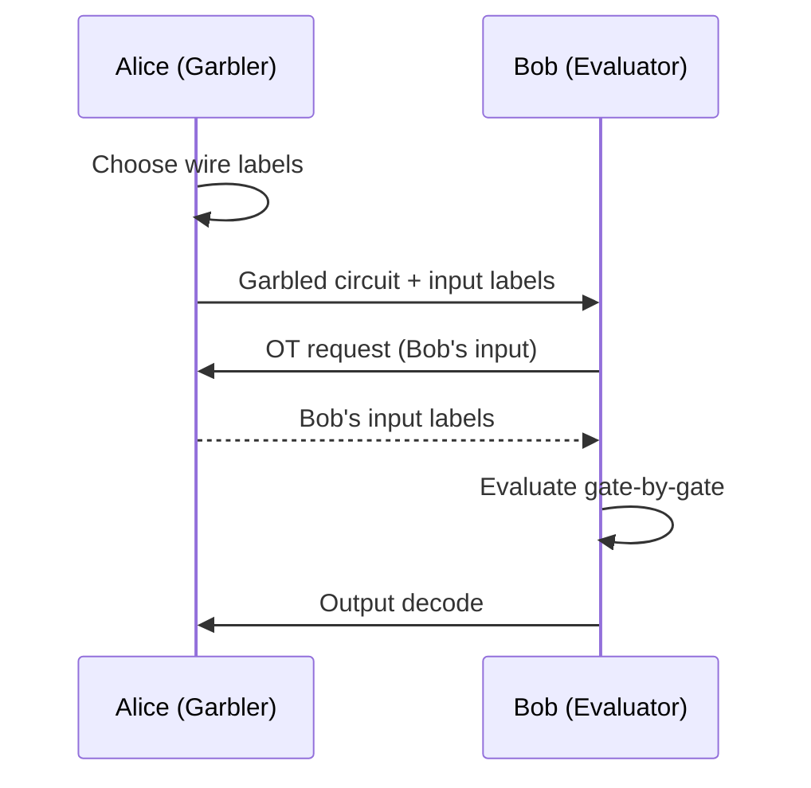

# MPC 协议（GMW / BGW / SPDZ / Yao's Garbled Circuits）

> **TL;DR**：多方安全计算（MPC）让 $n$ 方联合计算 $f(x_1,\dots,x_n)$ 而不泄露各自输入。四大经典：**Yao GC**（1986，2PC 布尔电路，一次通讯）、**GMW**（1987，n-party 布尔，每门 1 轮）、**BGW**（1988，n-party 算术电路 + Shamir，基于诚实多数）、**SPDZ**（2012，恶意模型 + preprocessing + MAC）。现代实践多用 SPDZ + OT extension（MP-SPDZ、EMP）；阈值签名、FHE 阈值解密、密文 ML 均构建于此。

## 1. 背景与动机

1982 年 Yao 提出"百万富翁问题"：两位富翁想比较财富却不愿暴露具体数额。解法是将比较函数编译为加密布尔电路（Garbled Circuits），由一方构造另一方求值。这是 MPC 的开端。

MPC 的工程动机：
- **私钥托管替代**：将 ECDSA 私钥分散到 MPC 网络，任意子集无法单独签名（Fireblocks、Fordefi、Safeheron）。
- **联邦学习 & 数据协作**：银行联合风控模型，不交换客户数据。
- **FHE 阈值解密**：多方共同执行 KeySwitch。
- **TSS 钱包**：Coinbase MPC wallet、Zengo。
- **隐私 Rollup 协处理器**：Nillion Network Model。
- **联邦撮合**：链上暗池、秘密拍卖。

与 FHE 相比：MPC 通讯量大但计算简单、交互多但不需重型密码；与 ZKP 相比：MPC 保护 **所有方输入**，ZKP 至少有一方知道全部。

## 2. 核心原理

### 2.1 形式化

**真实-理想模型 (Real-Ideal Paradigm)**：
- Ideal world：一个可信第三方 $\mathcal{F}$ 收集 $x_i$、计算并广播 $y = f(x_1, \dots, x_n)$。
- Real world：只有 $n$ 方互传消息，按协议 $\pi$ 执行。

**安全定义**：$\pi$ secure iff 对任意 real-world 敌手 $\mathcal{A}$ 存在 ideal-world 模拟器 $\mathcal{S}$，使
$$\mathrm{REAL}_{\pi, \mathcal{A}}(x_1, \dots) \stackrel{c}{\approx} \mathrm{IDEAL}_{f, \mathcal{S}}(x_1, \dots).$$

即 real 协议不比理想世界泄露更多。

**敌手模型**：
- **Semi-honest (HbC)**：按协议执行但观察流量。
- **Malicious**：可任意偏离协议。
- **Covert**：偏离可能被以概率 $\epsilon$ 检测。
- **腐败门限**：$t < n/2$（诚实多数）、$t < n$（全部但一个）。

### 2.2 安全性假设

- Yao GC：对称加密 + OT 安全（OT 基 DDH/LWE）。
- GMW：OT 安全（单机 PRG）。
- BGW：信息论安全（诚实多数，基于 Shamir）。
- SPDZ：somewhat HE（或 OT）安全 + MAC 伪造困难（IT 到统计安全）。

### 2.3 Yao's Garbled Circuits

**2 方**（Alice 电路构造者 Bob 求值者）：
1. 把 $f$ 编译成布尔电路。
2. 每根 wire 上选两个随机标签 $(W^0, W^1)$，编码 0 与 1。
3. 每个门由 4-行密文表（garbled table）表示：$E_{W_a^i, W_b^j}(W_c^{f(i,j)})$ 打乱。
4. Alice 发电路 + 自己输入对应标签；Bob 用 OT 获得自己输入的标签。
5. Bob 逐门解密，最后映射输出。

优化：Free-XOR (Kolesnikov 2008)、Half-gates (Zahur 2015)、Row Reduction。

**通讯**：2 轮（OT + 电路发送），$|garbled|\approx 2\kappa$ 每门（Half-gates）。

### 2.4 GMW 协议

**n-party bit-XOR-AND 电路**：
- 每位 wire 的值 $w$ 用 XOR 秘密分享 $w = \bigoplus w_i$。
- XOR 门：各方本地 $w_i \oplus u_i$。
- AND 门：需要 1 轮 OT 或 Beaver triple。$n$ 方两两 OT 交互。

**成本**：每 AND 门 $O(n^2)$ OT；用 OT extension（IKNP03）降至摊销常数。

### 2.5 BGW 协议

**n-party 算术电路**，基于 Shamir SS $(t, n), t < n/2$：
- Add：份额逐项加。
- Mul：份额两两乘得 $2t$ 次多项式，需 degree-reduction（各方重新分享积）。
- 基于 perfect / information-theoretic 安全。

适合大 $n$ + 诚实多数，如 Danish sugar beet auction (2009)。

### 2.6 SPDZ（"Speedz"）协议

设计目标：**恶意模型 + 全腐败（n-1）**。

- 预处理阶段：生成 additive 分享的 Beaver 三元组 $\langle a \rangle, \langle b \rangle, \langle c = ab \rangle$ 与随机 MAC 值。
- Online 阶段：每个 share 附带 MAC $\gamma = \alpha \cdot x$，其中 $\alpha$ 是全局密钥（也被分享）。
- Add / Mul 与 additive SS 同，但需要定期 **MAC check** 验证完整性。
- 任何欺骗（改 share 或 MAC）都在 MAC check 时被发现。

**Preprocessing 实现**：原始论文用 somewhat HE，现代实现多用 OT extension (MASCOT, Overdrive, LowGear)。

### 2.7 关键参数

| 协议 | 诚实门限 | 轮数 | 通讯 / gate | 适合 |
| --- | --- | --- | --- | --- |
| Yao GC | 2PC，恶意均可 | O(1) | 2κ bits | 小型函数 |
| GMW | n-1 腐败 | depth | O(κ) OT | 并行友好 |
| BGW | < n/2 | depth | O(n²) | 大 n，IT 安全 |
| SPDZ | n-1 | depth | 几 kB | 恶意模型、大规模 |

### 2.8 失败模式

- **OT 实现错误**：实现 MtA/OT extension 时偏置，可恢复输入。Fireblocks 2022 GG20 事件。
- **MAC 密钥泄漏**：SPDZ global α 若被 n-1 方拼出 → 破坏 MAC。
- **恶意 dealer**：VSS 未检查 → 错误 share。
- **侧信道**：同步回合 timing 暴露分支。
- **Setup phase 作恶**：非法 triples 污染 online。



```
SPDZ Pipeline
Offline (slow):  ZKP-backed HE/OT  ->  Beaver triples + MAC
Online (fast):   Local adds  ->  Opened mults  ->  MAC check  ->  Output
```

## 3. 架构剖析

### 3.1 分层视图

1. **Network & sync layer**：broadcast、point-to-point TLS。
2. **Crypto primitives**：OT, OT extension, HE, VSS。
3. **Share layer**：Shamir / Additive / Garbled wire label。
4. **Protocol layer**：具体 GMW/BGW/SPDZ/Yao。
5. **Compiler**：高级 DSL → arithmetic/boolean circuit。
6. **Application**：TSS、密文 ML、私有数据库 JOIN。

### 3.2 核心模块清单

| 模块 | 职责 | 依赖 | 路径 |
| --- | --- | --- | --- |
| OT extension | 大量 OT | seed OT | `emp-toolkit/emp-ot` |
| Garbler | 构造 Garbled | OT | `emp-toolkit/emp-tool/emp-tool/circuits` |
| SPDZ offline | Beaver triples | HE/OT | `data61/MP-SPDZ/Protocols/Mascot.cpp` |
| MAC check | 批量验证 | Commit | `MP-SPDZ/Protocols/MalRep.hpp` |
| Compiler | MAMBA / MP-SPDZ Python | — | `MP-SPDZ/Compiler/` |
| Bench | 吞吐测试 | network | `MP-SPDZ/Scripts/` |

### 3.3 数据流：SPDZ 一次密文乘法

1. Offline：生成三元组 $\langle a \rangle, \langle b \rangle, \langle c \rangle$ 与 MAC shares。
2. 输入：Alice share $\langle x \rangle$, Bob share $\langle y \rangle$。
3. 计算 $\langle d \rangle = \langle x \rangle - \langle a \rangle$；**打开** $d$（公布，各方验证）。
4. $\langle e \rangle = \langle y \rangle - \langle b \rangle$；打开 $e$。
5. $\langle xy \rangle = \langle c \rangle + d \langle b \rangle + e \langle a \rangle + de$。
6. 继续下游或 MAC check + 输出。

### 3.4 参考实现

- **MP-SPDZ** C++：支持 ~30 种 MPC 协议 + 高级 DSL。
- **EMP-toolkit** C++：2PC GC 研究级。
- **ABY** C++：混合 GC+GMW+Arith（arithmetic）。
- **Microsoft SEAL-EVA / PSI**：特定任务。
- **MPC 库 in Rust**：`zk-mpc`、`swanky` (Galois)。
- **Nillion Petnet SDK**：商业化 MPC 基础设施。

### 3.5 扩展接口

- MP-SPDZ 支持 Python 前端，把高阶数据操作编译为电路。
- Nillion SDK：类 TypeScript。
- Sharemind 是工业 MPC 全家桶。

## 4. 关键代码 / 实现细节

MP-SPDZ Python DSL：

```python
# MP-SPDZ/Programs/Source/millionaire.mpc
a = sint.get_input_from(0)   # Alice 私有输入
b = sint.get_input_from(1)   # Bob 私有输入
res = (a > b).reveal()       # 秘密比较，公开结果
print_ln('richer = %s', res)
```

运行：
```bash
./compile.py millionaire
./mascot-party.x -p 0 millionaire &
./mascot-party.x -p 1 millionaire
```

编译器生成汇编 → MASCOT 协议运行时执行 offline+online。

## 5. 演进与版本对比

| 协议 | 年份 | 关键改进 |
| --- | --- | --- |
| Yao GC | 1986 | 2PC 通用 |
| GMW | 1987 | n-party 布尔 |
| BGW | 1988 | 算术 + IT 安全 |
| CCD | 1988 | BGW 的另一 IT 方案 |
| BDOZ / SPDZ | 2011/12 | 恶意 + preprocessing |
| MASCOT | 2016 | Fast offline via OT |
| Overdrive | 2018 | Offline via HE |
| LowGear/HighGear | 2018 | 压缩 HE |
| Turbospeedz | 2020 | 预计算矩阵 |
| Le Mans | 2022 | 可选分层 |

## 6. 实战示例

```bash
git clone https://github.com/data61/MP-SPDZ
cd MP-SPDZ && make -j mascot-party.x
echo 1 > Player-Data/Input-P0-0 ; echo 2 > Player-Data/Input-P1-0
./Scripts/mascot.sh tutorial
# 预期：在恶意模型 SPDZ 下完成加法乘法 demo
```

## 7. 安全与已知攻击

- **Fireblocks GG20 2022**：MtA 使用的 OT range proof 被绕过，可提取 sk 的一小部分；升级 CGGMP21。
- **PSI 漏洞 2020**：OT extension 的 PRG 实现非抗量子，未来风险。
- **BDOZ MAC attack**：某实现 MAC reuse nonce，可伪造。
- **GC 输入泄露 via selective abort**：对方输入依赖时 Bob 提前中断揭示 Alice 输入；混淆方案需 full-security 变体。

## 8. 与同类方案对比

| 维度 | Yao GC | GMW | BGW | SPDZ |
| --- | --- | --- | --- | --- |
| 方数 | 2 | n | n | n |
| 模型 | malicious 可 | HbC default | IT 安全 | malicious |
| 轮数 | O(1) | depth | depth | depth |
| 通讯/gate | ~2κ | ~κ OT | O(n²) | ~kB + MAC |
| Preprocess | 无 | 无 | 无 | 重型 |

## 9. 延伸阅读

- Yao A., "Protocols for Secure Computations"，FOCS 1982
- Goldreich, Micali, Wigderson, "How to Play ANY Mental Game"，STOC 1987
- Ben-Or, Goldwasser, Wigderson, "Completeness Theorems for Non-cryptographic Fault-tolerant Distributed Computation"，STOC 1988
- Damgård, Pastro, Smart, Zakarias, "Multiparty Computation from Somewhat Homomorphic Encryption"，CRYPTO 2012
- Ivan Damgård MPC 课程 (Aarhus University)

## 10. 术语表

| 术语 | 英文 | 释义 |
| --- | --- | --- |
| OT | Oblivious Transfer | 不经意传输 |
| GC | Garbled Circuits | 混淆电路 |
| Beaver triple | Beaver triple | 预计算乘法辅助 |
| MAC check | Message Authentication Check | SPDZ 完整性检查 |
| HbC | Honest-but-Curious | 半诚实敌手 |

---

*Last verified: 2026-04-22*
