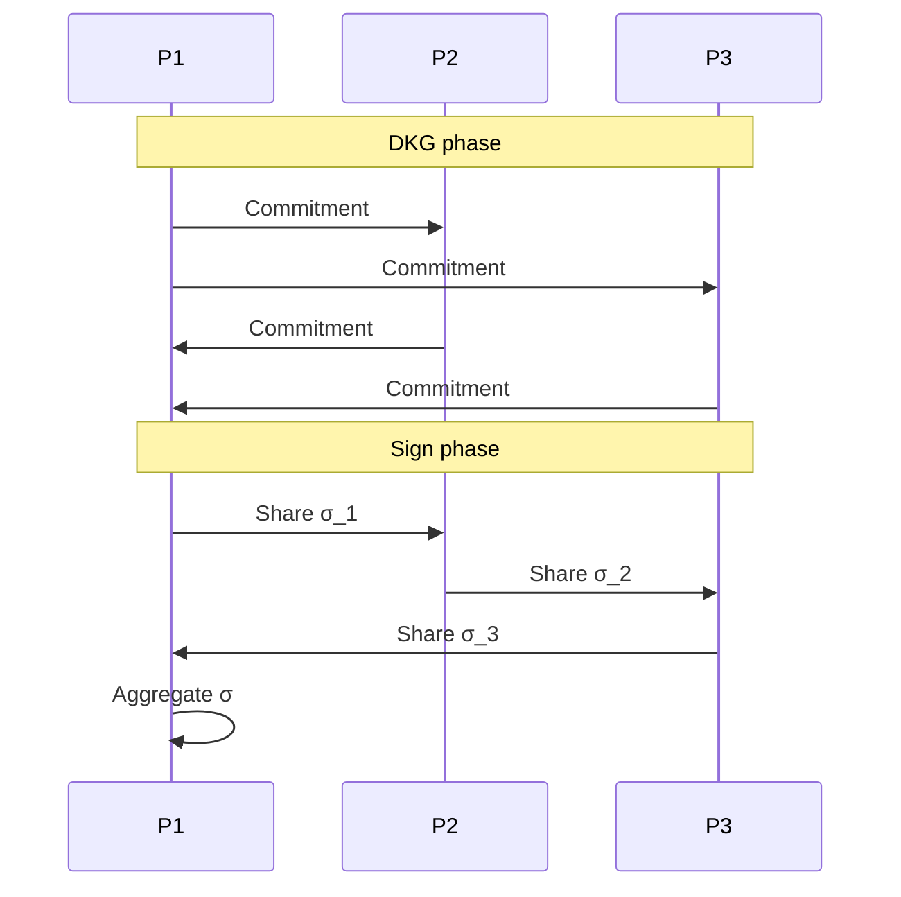

# 门限签名（Schnorr TSS / GG20 / FROST / ROAST / CGGMP）

> **TL;DR**：门限签名（TSS, Threshold Signature Scheme）让 $t$-of-$n$ 个份额持有者协同产生与单密钥不可区分的签名。**Schnorr / EdDSA 阈值**（FROST、ROAST）天然线性、友好；**ECDSA 阈值**（GG18/20、CGGMP21）因 $k^{-1}$ 非线性需 Paillier/Oblivious Transfer 辅助。门限签名是 MPC 钱包（Fireblocks、Safeheron、ZenGo）、跨链桥（ICS-23、Axelar）、去中心化预言机（Chainlink OCR2）、分布式验证人（Obol、SSV）的核心。

## 1. 背景与动机

传统多签（Bitcoin `OP_CHECKMULTISIG`、Gnosis Safe）需要 **链上聚合多个签名**——gas 随 $n$ 线性、隐私差（可见参与者结构）、且链上脚本各异不可跨链移植。门限签名在链下执行 MPC 协议得到 **单一签名**，链上验证与普通 ECDSA/Schnorr 一致。优势：
- 隐私：签名者结构不可见。
- 兼容：任何支持该曲线的链（Bitcoin、Ethereum、Cosmos）自然接受。
- Gas 经济：与单签相同。
- 钥匙生命周期可控：refresh、revoke 更灵活。

Web3 关键应用：
- **MPC 钱包**：Fireblocks (MPC CMP)、Safeheron (GG+Paillier)、Zengo (2PC)。
- **跨链桥**：Thorchain、Axelar、Wormhole 的 guardian 签名聚合。
- **DVT (Distributed Validator Tech)**：Obol Charon、SSV Network 用 BLS TSS 为以太坊验证人密钥防丢。
- **Decentralized Oracle**：Chainlink OCR2 使用 BLS TSS 报价。
- **FHE 阈值解密**：Zama KMS 使用 RLWE 阈值密钥切换。

## 2. 核心原理

### 2.1 形式化

一个 $(t, n)$ 阈值签名方案：
- $\mathrm{DKG}() \to (pk, (sk_1, \dots, sk_n))$：分布式密钥生成，产生公钥 $pk$ 与份额 $sk_i$。
- $\mathrm{Sign}(\text{msg}, \{sk_i\}_{i \in S}) \to \sigma$：$|S| \ge t$ 方协作签名。
- $\mathrm{Verify}(pk, \text{msg}, \sigma) \to \{0, 1\}$：普通单签验证。

**安全定义**（Unforgeability under Threshold Corruption, UF-TC）：任意 PPT 敌手腐败至多 $t-1$ 方，在 CMA 查询后产生新消息有效签名的概率可忽略。

**可模拟性**（Simulatability）：存在模拟器，在已知 $pk$ 与 $t-1$ 份 corrupted views 下，生成与 real 协议同分布的 transcript。

**安全性假设**：
- Schnorr / EdDSA 基：DLP / EDDSA 假设。
- ECDSA 基：ECDSA 的非标准 "GGM" 假设 + Paillier DCRA（或 OT-based）。
- BLS 基：Co-CDH + pairing。

### 2.2 Schnorr / EdDSA TSS：线性友好

标准 Schnorr 签名 $\sigma = (R, s)$，$s = k + e \cdot x$，$R = k G$，$e = H(R, \mathrm{msg}, pk)$。因为 $s$ 关于 $k$ 与 $x$ 线性，只要 $k$ 与 $x$ 都以 Shamir share 持有，$\sigma_i = k_i + e \cdot x_i$，Lagrange 插值后直接恢复 $s$。

**FROST (2020, Komlo-Goldberg)**：
1. DKG (Pedersen-VSS): 每方广播多项式系数承诺，交叉验证，得出 $sk_i$ 与 $pk$。
2. 预签名 nonce：每方生成两个 nonce $(d_i, e_i)$ 与承诺 $(D_i, E_i)$。
3. 聚合：$R = \sum \rho_i (D_i + e_i \cdot E_i)$，$\rho_i = H(i, \mathrm{msg}, B)$ 防 Wagner 攻击。
4. 部分签名 $z_i = d_i + e_i \rho_i + \lambda_i \cdot x_i \cdot c$，$\lambda_i$ Lagrange 系数。
5. 聚合 $z = \sum z_i$；输出 $(R, z)$。

FROST 为 **2 轮**（preprocessing + sign），比前代 3-round 方案快。

**ROAST (2022)**：FROST 在异步且存在恶意 signer 时可能 stall；ROAST 通过动态调度子集 $S$ 避免死锁。

### 2.3 ECDSA TSS：非线性难题

ECDSA 签名 $\sigma = (r, s)$，$s = k^{-1}(H(m) + r x)$。$k^{-1}$ 与 $kx$ 两项乘法在门限下需要 MPC 子过程。

**GG18/GG20 (Gennaro-Goldfeder)**：
- DKG (Feldman) → $x_i$ 持有。
- 每次签名：
  1. 各方本地 $k_i, \gamma_i$；通过 **MtA (Multiplicative to Additive)** 利用 Paillier 同态得出 $\delta_i$ 使 $\sum \delta_i = k \gamma$。
  2. 类似 $\sigma_i$ 使 $\sum \sigma_i = kx$。
  3. 打开 $\delta = k\gamma$，计算 $k^{-1} = \gamma \delta^{-1}$ (各方仍持 share)。
  4. 每方 $s_i = m k_i + r \sigma_i$，打开聚合。

**MtA 依赖 Paillier 加密 + Range Proof**，是 GG20 的主要成本与风险来源。

**CGGMP21 (Canetti-Gennaro-Goldfeder-Makriyannis-Peled)**：用 Pedersen VSS + 新设计的 **non-interactive zero-knowledge** 对 MtA 每步严格证明，修复 GG20 的所有已知攻击（包括 Fireblocks 2022 披露的 "Bitforge"）。生产级 MPC 钱包 2024 年起几乎都升级到 CGGMP。

### 2.4 BLS 阈值

BLS 签名 $\sigma = H(m)^x$，天然线性（签名是群元素），阈值直接通过 Lagrange 插值：
$$\sigma = \prod_{i \in S} \sigma_i^{\lambda_i}, \quad \sigma_i = H(m)^{x_i}.$$

无需多轮 MPC，单轮足够。Chainlink OCR2、Ethereum DVT 普遍采用 BLS TSS，但需要 pairing-friendly 曲线（BLS12-381）。

### 2.5 关键参数与常量

| 方案 | DKG 轮数 | 签名轮数 | 每方通讯 | 依赖 |
| --- | --- | --- | --- | --- |
| FROST | 2 | 2 (w/ preproc.) | O(n) | Schnorr |
| ROAST | 2 | adaptive | O(n²) WC | Schnorr |
| GG20 | ~3 | 8 | 数 MB / 签 | Paillier + ZK |
| CGGMP21 | 3 | 3+identification | ~1 MB | Paillier + Pedersen |
| BLS TSS | 2 | 1 | O(1) pairing | Co-CDH |

### 2.6 失败模式

- **Rogue Key attack**：DKG 中恶意方选择公钥使聚合 pk 已知私钥；缓解：Pedersen / Joint-Feldman。
- **Biased Nonce (Wagner)**：非随机 $k$ 产生可关联签名；FROST 的 $\rho_i$ 即为此防护。
- **Paillier Range Proof Bug**：GG20 Bitforge 事件；需 CGGMP 修复。
- **Stalling / Denial-of-signing**：ROAST 的问题所在。
- **Key Refresh Bugs**：Proactive resharing 实现错误可导致旧份额失效失败。



```
ECDSA TSS Signing flow (GG20)
    sk = Σ x_i
    k  = Σ k_i (each secret)
    δ = kγ = Σ δ_i (MtA-computed)
    k^{-1} = γ / δ
    s_i = m k_i + r σ_i
    s = Σ s_i (publicly)
    ↑ Paillier encrypt per pair + Range Proof
```

## 3. 架构剖析

### 3.1 分层视图

1. **Crypto primitive**：椭圆曲线 + 哈希 + Paillier + VSS。
2. **DKG engine**：Joint-Feldman、Pedersen DKG。
3. **Signing protocol**：GG20 / FROST / BLS。
4. **Transport**：WebSocket / gRPC over TLS，异步。
5. **Orchestrator**：请求路由、MPC 节点协同、resharing、monitoring。
6. **Integration**：钱包 UI、托管 API、Smart Contract。

### 3.2 核心模块清单

| 模块 | 职责 | 依赖 | 代表路径 |
| --- | --- | --- | --- |
| Keygen | DKG | VSS | `ZenGo-X/multi-party-ecdsa/src/protocols/multi_party_ecdsa/gg_2020/state_machine/keygen.rs` |
| Signing | MtA + sign | Paillier | `.../gg_2020/state_machine/sign.rs` |
| FROST core | Schnorr agg | Curve | `ZcashFoundation/frost/frost-core/` |
| CGGMP | ZK-heavy sign | Paillier+Ped | `taurushq-io/multi-party-sig/pkg/protocols/cmp` |
| Transport | rounds sync | WS | `entropy-core/crates/mpc-server` |
| Resharing | Proactive | Shamir | internal wallet MPC |

### 3.3 数据流：Safeheron 一次 ECDSA 签名

1. 客户端调用 `signTx(tx)`，请求发到 orchestrator。
2. Orchestrator 选择 $t$ 个在线节点。
3. 节点执行 CGGMP round 1：生成 $k_i, \gamma_i$ + Paillier ciphertexts + NIZK。
4. Round 2/3：MtA + identification proof。
5. 组装 $s = \sum s_i$，返回。
6. 客户端得到 `(r, s, v)`，广播到目标链。

### 3.4 参考实现

- **ZenGo-X/multi-party-ecdsa** Rust：GG18/GG20，仍维护但新项目推荐 CGGMP。
- **taurushq-io/multi-party-sig** Go：CGGMP21。
- **ZcashFoundation/frost** Rust：IETF FROST Draft（RFC 9591 2024）。
- **Obol Charon** Go：Ethereum BLS TSS + SSV。
- **Threshold BLS** by DFINITY：chain key signature。

### 3.5 扩展接口

- FROST Rust lib 支持 ed25519, ristretto, secp256k1, P-256。
- Bitcoin Taproot 原生 Schnorr 支持，使 FROST 成为多签替代方案（BIP-340）。
- Ethereum EOF / 7702 未来可直接 `ecrecover` 验证聚合。

## 4. 关键代码 / 实现细节

FROST Rust 聚合（参考 `frost-ristretto255/src/lib.rs` v2.0）：

```rust
// frost-core/src/lib.rs (简化)
pub fn aggregate<C: Ciphersuite>(
    signing_package: &SigningPackage<C>,
    signature_shares: &HashMap<Identifier<C>, SignatureShare<C>>,
    pubkeys: &PublicKeyPackage<C>,
) -> Result<Signature<C>, Error<C>> {
    let group_commitment = compute_group_commitment(signing_package, &binding_factor_list)?;
    let z: Scalar<C> = signature_shares.values()
        .map(|ss| ss.share)
        .sum();
    Ok(Signature { R: group_commitment.to_element(), z })
}
```

## 5. 演进与版本对比

| 方案 | 年份 | 改进 | 风险修复 |
| --- | --- | --- | --- |
| GG18 | 2018 | 首个实用 ECDSA TSS | — |
| Lindell17 | 2017 | 2PC ECDSA (Zengo) | — |
| GG20 | 2020 | 更快 MtA | 未修 range bug |
| CGGMP21 | 2021 | 恶意完整证明 | 修 Bitforge |
| FROST | 2020 | Schnorr 2-round | — |
| FROST RFC 9591 | 2024 | IETF 标准 | — |
| ROAST | 2022 | 异步抗拒绝 | — |
| Doerner-Kondi | 2024 | 新 2PC ECDSA | — |

## 6. 实战示例

```bash
# FROST 三方签名 demo
git clone https://github.com/ZcashFoundation/frost
cd frost && cargo run --release --example signing
# 输出三方 DKG + 签名 + 单签级别验证成功
```

## 7. 安全与已知攻击

- **Bitforge (2022)**：Fireblocks 披露 GG20/Lindell17 实现中 Paillier 提示泄漏，可提取私钥；升级到 CGGMP21 才安全。
- **Ledger Recover 争议 (2023)**：MPC 托管恢复私钥引起社区担忧。
- **Key Refresh bug (Curv 2021)**：Feldman 零系数未检查。
- **Wagner's attack**：随机数复用可线性代数攻击签名。
- **Subset forge (Lindell17 early)**：DKG 响应消息未签名。

## 8. 与同类方案对比

| 维度 | TSS | Multisig (链上) | MPC + HSM | Account Abstraction |
| --- | --- | --- | --- | --- |
| 链上成本 | 单签 gas | n 倍签名 gas | 单签 | 中 |
| 跨链兼容 | 所有曲线链 | 仅支持链 | 所有 | ERC-4337 only |
| 用户体验 | 一致 | 明显多签 | 一致 | 钱包感知 |
| 信任模型 | t-of-n MPC | 智能合约 | 硬件厂商+MPC | Paymaster |

## 9. 延伸阅读

- Gennaro & Goldfeder, "One Round Threshold ECDSA with Identifiable Abort"，2020
- Canetti et al., "UC Non-Interactive, Proactive, Threshold ECDSA with Identifiable Aborts"，2021
- Komlo & Goldberg, "FROST: Flexible Round-Optimized Schnorr Threshold Signatures"，2020
- IETF RFC 9591 FROST
- Fireblocks Bitforge advisory 2022

## 10. 术语表

| 术语 | 英文 | 释义 |
| --- | --- | --- |
| TSS | Threshold Signature Scheme | 门限签名 |
| DKG | Distributed Key Gen | 分布式密钥生成 |
| MtA | Multiplicative to Additive | ECDSA 关键子协议 |
| Identifiable Abort | Abort identification | 中止可追责 |
| Proactive Refresh | Proactive share update | 周期性重分享 |

---

*Last verified: 2026-04-22*
