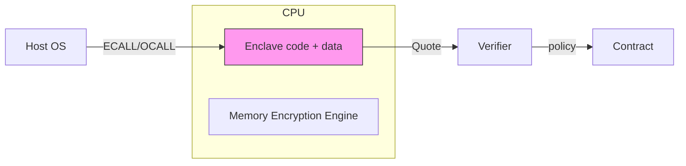

# 可信执行环境（Intel SGX / AMD SEV / Intel TDX）与区块链整合

> **TL;DR**：TEE（Trusted Execution Environment）用 CPU 硬件把一段进程或整虚拟机的内存隔离加密，外部 OS/Hypervisor 无法读写；远程证明（Remote Attestation）让客户验证 "代码在真实 TEE 中运行"。Web3 用 TEE 做机密合约（Oasis Sapphire、Secret Network、Phala）、隐私 rollup（Taiko SGX prover）、合规去中心化预言机（Chainlink DECO）、MEV-Boost-SGX。2018–2023 间 Foreshadow / Plundervolt / Downfall / ÆPIC Leak 多次击穿 SGX，安全假设从"完全信任"变为"硬件 + 运营方诚信"。

## 1. 背景与动机

区块链节点若要处理机密数据（密码、身份、机密报价），要么依赖昂贵的密码学（FHE/MPC/ZK），要么依赖硬件隔离（TEE）。TEE 在性能 - 安全之间提供了另一个权衡点：

- 性能几乎等同普通 CPU（< 10% overhead）。
- 通用编程模型（SGX：libOS 方式；TDX/SEV：整 VM 方式）。
- 缺点：信任硬件厂商 + 侧信道攻击历史。

Web3 代表用例：
- **机密合约平台**：Oasis Sapphire ParaTime、Secret Network。
- **机密预言机**：Chainlink DECO、Ted'DS。
- **隐私 L2 / Prover**：Automata、Taiko SGX prover、Scroll Prover-in-TEE。
- **机密 MEV**：Flashbots SUAVE 的 Kettle 使用 SGX 隔离订单流。
- **身份 / 聚合**：zkLogin + TEE、Succinct/OP Succinct + TDX attestor。

## 2. 核心原理

### 2.1 形式化：理想 TEE 抽象

把 TEE 视为函数 $\mathcal{F}_{\mathrm{TEE}}$：
- $\mathrm{Provision}(code, manifest) \to (\mathrm{MRENCLAVE}, pk_\mathrm{enclave})$。
- $\mathrm{Attest}(nonce) \to \mathrm{Quote}$：由 Intel/AMD 签名的硬件证明（含 MRENCLAVE、vendor signature）。
- $\mathrm{Execute}(input, state) \to (output, state', sig)$：内部计算，输出受 enclave 私钥签名。
- $\mathrm{Verify}(\mathrm{Quote})$：验证方用根 CA 公钥验证报告。

**安全性假设**：
- CPU 硬件诚实（密钥不被泄漏）。
- 硅片未被物理攻破 / glitching。
- 固件与 microcode 无漏洞。
- 侧信道（cache, timing, voltage）不被利用。
- Intel/AMD 根密钥不被泄漏。

理论模型：Universal Composability + 硬件 oracle。但这层"oracle"一次次被现实打脸（Foreshadow 2018、Plundervolt 2019、LVI 2020、ÆPIC Leak 2022、Downfall 2023、SinkClose/AMD 2024）。

### 2.2 Intel SGX：Enclave 模型

- **MEE (Memory Encryption Engine)**：Skylake 起在 MMU 后端对 EPC (Enclave Page Cache) 内存加密。
- **EPCM (EPC Metadata)**：每页附加 tag 防 replay。
- **Enclave**：用户进程内的隔离区域，只能通过 `ECALL` / `OCALL` 边界进出。
- **Attestation**：
  - Local：两个 enclave 用 `REPORT` 指令互认。
  - Remote：经 Quoting Enclave 签名，EPID 或 DCAP（现主流 DCAP + PCK）。
- **Limit**：早期 EPC ≤ 128 MB（v2 提升到 512MB/1TB via SGX-Scalable）。

### 2.3 Intel TDX：整 VM 隔离

SGX 是进程内隔离，TDX 把整个 Trust Domain VM 隔离：
- **SEAM (Secure Arbitration Mode)**：新特权层高于 VMX root，运行 Intel 签名的 TDX Module。
- **加密整 VM 内存**：每 TD 独立 key。
- **Attestation**：类似 SGX DCAP，MRTD + RTMR 测量 TD 启动状态。
- 优势：不需重写应用为 enclave、libOS；直接跑 Linux。

2023 年 5 月随 Sapphire Rapids 出货；大规模云厂商（Azure, GCP Confidential VM）采用。

### 2.4 AMD SEV / SEV-SNP

- SEV (Naples, 2017)：加密 VM 内存，不防 hypervisor replay。
- SEV-ES：加密寄存器状态。
- **SEV-SNP** (Milan+)：加上完整性保护 RMP，防 replay/rollback。
- Attestation：VCEK（chip-unique）→ ASK → ARK 证书链。
- Use：Azure Confidential VM、Google Confidential VM 默认。

### 2.5 子机制拆解

- **密封 (Sealing)**：用 enclave-specific key 把数据加密保存，跨重启复用。
- **Monotonic Counter**：防 rollback（SGX 有 PSE；TDX 需软件或 TPM 辅助）。
- **远程证明格式**：IAS JSON (deprecated) → DCAP EPID → DCAP ECDSA。Web3 多选 DCAP。
- **On-chain attestation 验证**：需要存 Intel 根 CA 证书；Automata 把证书链上验证做成 DA/rollup 服务。
- **Confidential VM vs Enclave**：前者迁移友好；后者 TCB 更小。

### 2.6 关键参数

| TEE | 单位 | 内存加密 | 证明 | 生态 |
| --- | --- | --- | --- | --- |
| SGX v1 | 进程 | AES-CTR + HMAC | EPID/DCAP | Oasis, Secret, Phala |
| SGX v2 | 进程 | AES-XTS | DCAP | Automata, Flashbots |
| TDX | VM | AES-XTS + MKTME | DCAP Quote v4 | SUAVE Kettle |
| SEV-SNP | VM | AES-XEX | VCEK/ARK | Phala SEV pod |

### 2.7 失败模式

- **Side-channel**：Foreshadow (L1TF, 2018)、Plundervolt (undervolting, 2019)、LVI, ÆPIC Leak (APIC register leak, 2022)、Downfall (Gather AVX, 2023)。多要求 microcode + OS 补丁，且可能降 10–30% 性能。
- **Rollback**：Monotonic counter 被破坏则状态可 replay。
- **Key Provisioning Facility 漏洞**：Intel EPID 私钥若泄漏，整批 CPU 假冒可能。
- **Hardware supply chain**：假冒芯片、FIBBing。
- **TDX SEAM module 漏洞**：CVE-2024-0762 等。
- **社工**：运营节点方强制关闭 Enclave / 提交 OCALL 诱导泄漏。



```
Oasis Sapphire request lifecycle
[Client Tx (encrypted)] -> [Sapphire Node] -> [SGX Enclave] -> Execute EVM -> [State + Attestation] -> Consensus
```

## 3. 架构剖析

### 3.1 分层视图（Oasis Sapphire 为例）

1. **Consensus Layer**：Cosmos-SDK-like BFT。
2. **ParaTime Runtime**：Sapphire EVM-compatible，强制 TEE 执行。
3. **TEE Host**：SGX + Gramine libOS。
4. **Crypto**：KeyManager enclave 生成 secret、分发到 compute enclaves。
5. **RPC**：Web3-compatible JSON-RPC，但 tx payload 可 encrypted。
6. **Application**：机密 ERC-20、Oracles、Fair ordering。

### 3.2 核心模块清单

| 模块 | 职责 | 依赖 | 路径 |
| --- | --- | --- | --- |
| Gramine | SGX libOS | SGX SDK | `gramineproject/gramine` |
| Oasis Core | BFT + ParaTime | Gramine | `oasisprotocol/oasis-core` |
| Sapphire Runtime | EVM in enclave | Oasis Core | `oasisprotocol/sapphire-paratime` |
| Secret Network enclave | Cosmwasm | SGX | `scrtlabs/SecretNetwork/x/compute` |
| Phala Worker | Substrate + Gramine | polkadot-sdk | `Phala-Network/phala-blockchain` |
| Automata DCAP verifier | On-chain Intel cert | Solidity | `automata-network/automata-dcap-attestation` |

### 3.3 数据流：Secret Network 机密合约执行

1. 用户用 network pub key 加密输入 msg。
2. Tx 发送 validator；validator 在 SGX enclave 执行 cosmwasm。
3. enclave 拿 master seed（shared among validators via key sharing），解密 msg。
4. 执行 contract，state 加密写回 store。
5. 广播 tx hash + state root + attestation。
6. Light client 验证 attestation + state root。

### 3.4 参考实现

- **Oasis Sapphire**：SGX + Gramine，EVM 兼容。
- **Secret Network**：SGX + cosmwasm。
- **Phala Network**：Substrate + Gramine + SEV。
- **Automata**：DCAP attestation service，提供其他链调用。
- **Flashbots SUAVE Kettle**：SGX 内部撮合订单流。
- **Taiko SGX Prover**：提供廉价 "硬件" 证明作为 ZK proof 的补充。

### 3.5 扩展接口

- `oasis.encryptCallData(tx)`：Sapphire Web3 SDK。
- Gramine manifest：定义 enclave 白名单。
- Automata DCAP Solidity library：on-chain attestation verify。

## 4. 关键代码 / 实现细节

DCAP quote 验证 Solidity（基于 Automata v0.6）：

```solidity
// automata-dcap-attestation/contracts/v3/AutomataDcapV3Attestation.sol (简化)
function verifyAttestation(bytes calldata rawQuote)
    external view returns (bool)
{
    (
        Header header,
        EnclaveReport report,
        bytes memory signature,
        bytes memory authData
    ) = parseQuote(rawQuote);

    require(header.version == 3, "bad version");
    // 1. 验证 quoting enclave signature
    require(verifyQESig(report, signature, authData), "QE sig fail");
    // 2. 验证 PCK 证书链至 Intel SGX Root CA
    require(verifyCertChain(authData), "cert chain fail");
    // 3. 检查 TCB 是否过期
    require(tcbInfoValid(report.cpuSvn), "TCB revoked");
    return true;
}
```

## 5. 演进与版本对比

| 里程碑 | 年份 | 事件 |
| --- | --- | --- |
| Intel SGX 发布 | 2015 (Skylake) | 最早的 commodity TEE |
| AMD SEV | 2017 | VM 级加密 |
| Oasis Mainnet | 2020 | TEE-based ParaTime |
| Secret Network | 2020 | 首个 TEE cosmwasm 链 |
| Foreshadow | 2018 | SGX 首次重大漏洞 |
| SEV-SNP | 2021 | 修 SEV 弱点 |
| Intel TDX | 2023 (SPR) | 整 VM TEE |
| Phala + SEV-SNP | 2023 | 多 TEE 支持 |
| Downfall | 2023 | SGX/TDX 新 leak |
| Automata L2 | 2024 | 证书链 rollup |
| SUAVE Kettle | 2024 | Flashbots TEE |

## 6. 实战示例

```bash
# 在 Ubuntu 22.04 + SGX 机器启动 Oasis Sapphire 本地网络
docker run -it -p 8545:8545 ghcr.io/oasisprotocol/sapphire-dev
# 部署机密合约
cast wallet new
forge create --rpc-url http://localhost:8545 Secret.sol:Secret
# tx payload 通过 sapphire.wrap() 加密
```

## 7. 安全与已知攻击

- **Foreshadow (L1TF) 2018**：L1 data cache 泄漏 enclave 秘密。
- **Plundervolt 2019**：undervolt CPU 让 AES 出错，破解 sealing key。
- **ÆPIC Leak 2022**：APIC 寄存器残留泄漏 128 bit。
- **Downfall 2023**：Gather 指令跨 SMT 泄漏 ymm。
- **SinkClose (AMD 2024)**：SMM 执行 ring-2 入侵 SEV。
- **Secret Network Nov 2022**：SGX node 运营者被社工导出 seed，需 network reboot。

## 8. 与同类方案对比

| 维度 | TEE | FHE | ZK | MPC |
| --- | --- | --- | --- | --- |
| 性能 | ~本机 | 慢 | 中 | 中 |
| 信任 | 硬件厂商 | LWE | 密码学 | t-of-n |
| 侧信道 | 存在 | 少 | 少 | 网络侧 |
| 升级 | microcode 补丁 | 参数 | 电路 | 协议 |
| Web3 成熟度 | 中 | 早期 | 高 | 中高 |

## 9. 延伸阅读

- Costan & Devadas, "Intel SGX Explained"，2016 (ePrint 2016/086)
- Intel TDX White Paper v1.5, 2023
- AMD SEV-SNP White Paper, 2020
- Van Bulck et al., "Foreshadow"，USENIX 2018
- Zhang et al., "Town Crier: An Authenticated Data Feed for Smart Contracts" (TEE + Oracle 起点), 2016

## 10. 术语表

| 术语 | 英文 | 释义 |
| --- | --- | --- |
| Enclave | Enclave | SGX 内隔离区域 |
| MRENCLAVE | MRENCLAVE | Enclave 代码度量值 |
| Attestation | Remote Attestation | 硬件签名证明 |
| TD | Trust Domain | TDX 整 VM 隔离单元 |
| VCEK | Versioned Chip Endorsement Key | SEV-SNP 芯片密钥 |

---

*Last verified: 2026-04-22*
