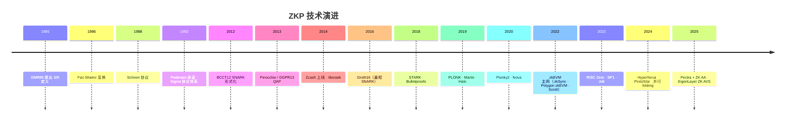
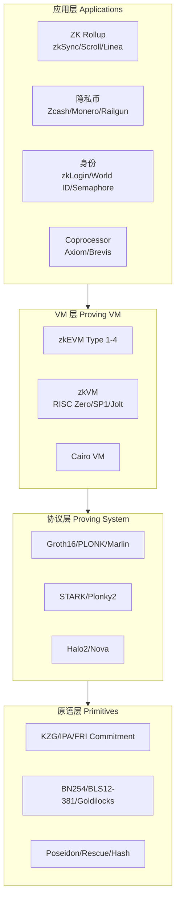

# 零知识证明全景与技术谱系

> **TL;DR**：零知识证明（Zero-Knowledge Proof, ZKP）允许证明者 P 在不泄露 witness 的前提下让验证者 V 相信某条 NP 语句为真。自 1985 年 GMR 奠基以来，技术谱系经历了"交互 → 非交互（Fiat-Shamir）→ 简洁证明（SNARK）→ 透明证明（STARK）→ 递归折叠（Halo/Nova）→ 通用 VM（zkEVM）"六次范式跃迁。本页作为 07-privacy/zkp/ 索引，提供发展史、分类地图与子页导航。

## 1. 背景与动机

### 1.1 为什么需要零知识证明

现代密码学的核心矛盾之一：**如何向他人"证明你知道某信息"而又不让对方学到该信息本身**。传统数字签名只解决了"你持有私钥"，但无法表达"我知道一个哈希原像"、"我拥有 100 万美元但不披露账户"、"我是某国公民但不披露身份证号"等更复杂命题。ZKP 正是对这一需求的通用解答。

在 Web3 场景中，ZKP 的价值被进一步放大：

- **扩容（Scaling）**：L2 Rollup 把链下状态转移压缩为一张简洁证明上链，Layer 1 从"重执行"变成"轻验证"。
- **隐私（Privacy）**：Zcash、Aztec、Tornado Cash、Railgun 等以 ZKP 保护交易金额、地址、图关系。
- **互操作（Interop）**：ZK Light Client、ZK Bridge 以证明替代多签，把跨链信任降到密码学假设。
- **身份与合规（Identity & Compliance）**：zkLogin、Semaphore、World ID 允许匿名但可审计的身份证明。
- **协处理器（Coprocessor）**：Axiom、Brevis 让链下计算可证明地复用链上历史数据。

### 1.2 与相关概念的边界

| 概念 | 与 ZKP 的关系 |
| --- | --- |
| MPC（多方计算） | ZKP 是单方"我知道 x"；MPC 是多方"共同算 f(x₁,…,xₙ)"而不互相泄露输入 |
| FHE（全同态加密） | FHE 在密文上直接计算；ZKP 证明明文计算的正确性。二者常结合 |
| TEE（可信执行环境） | TEE 依赖硬件（SGX/TDX），信任根是芯片厂商；ZKP 信任根是数学假设 |
| 数字签名 | 签名是 ZKP 的特例（证明"知道 sk 使得 pk = g^sk"），但只能表达离散对数语句 |

## 2. 核心原理（深度要求：≥1500 字）

### 2.1 形式化定义

设 $\mathcal{R} \subseteq \{0,1\}^* \times \{0,1\}^*$ 是一个多项式时间可判定的二元关系，语言 $L_{\mathcal{R}} = \{x \mid \exists w, (x, w) \in \mathcal{R}\}$ 属于 NP 类。其中 $x$ 称为 **statement / instance**，$w$ 称为 **witness**。

一个零知识证明系统是一对交互算法 $(P, V)$，满足下述三条性质（Goldwasser-Micali-Rackoff, 1985）：

1. **完备性（Completeness）**：若 $(x, w) \in \mathcal{R}$，诚实证明者 P 与诚实验证者 V 交互后，V 以不可忽略的概率接受。通常要求概率 $\geq 1 - \text{negl}(\lambda)$。
2. **可靠性（Soundness）**：若 $x \notin L_{\mathcal{R}}$，任何（甚至计算无界的）恶意证明者 $P^*$ 使 V 接受的概率 $\leq \varepsilon$，$\varepsilon$ 称为 **soundness error**。当 $\varepsilon$ 对计算有界的 $P^*$ 才成立时，称为 **argument of knowledge**（计算可靠）。
3. **零知识性（Zero-Knowledge）**：存在一个模拟器 $\mathcal{S}$，对任意恶意验证者 $V^*$，$\mathcal{S}^{V^*}(x)$ 的输出分布与真实交互 $\langle P(w), V^*\rangle(x)$ 的转录在多项式时间内不可区分。区分能力分三级：Perfect / Statistical / Computational ZK。

**知识提取性（Knowledge Soundness / Proof of Knowledge, PoK）**：更强的可靠性——存在一个 PPT 提取器 $\mathcal{E}$，若恶意证明者能让 V 以概率 $p$ 接受，则 $\mathcal{E}$ 可在期望 $\text{poly}(\lambda)/p$ 时间内从 $P^*$ 提取出 witness $w$ 使得 $(x,w) \in \mathcal{R}$。Web3 场景下几乎所有协议都要求 PoK。

**简洁性（Succinctness）**：证明长度 $|\pi| = O(\text{polylog}(|C|))$（$C$ 是算术电路规模），验证时间同样 polylog。满足简洁性的非交互 ZK 称为 **zk-SNARK**（Succinct Non-interactive ARgument of Knowledge）。

### 2.2 四大技术谱系

从实现路径看，现代 ZKP 可分为四大谱系：

| 谱系 | 代表协议 | 密码学假设 | Setup | 证明尺寸 | 验证复杂度 | 抗量子 |
| --- | --- | --- | --- | --- | --- | --- |
| Pairing-based SNARK | Groth16, PLONK, Marlin | DLog + KoE + Pairing | Trusted | ~200 B | ~3 次 pairing | 否 |
| FRI/Hash-based STARK | STARK, Plonky2 | Collision-resistant hash | Transparent | 50–200 KB | $O(\log^2 n)$ | 是 |
| Bulletproofs / IPA | Bulletproofs, Halo/Halo2 | Discrete Log | Transparent | $O(\log n)$ | $O(n)$ | 否 |
| Folding / Accumulation | Nova, SuperNova, HyperNova | Discrete Log | Transparent | $O(1)$ amortized | $O(1)$ amortized | 否 |

Groth16 和 PLONK 属于 **pairing-based**，利用双线性配对 $e: G_1 \times G_2 \to G_T$ 把多项式同态映射到目标群；STARK 利用 FRI（Fast Reed-Solomon IOP of Proximity）协议，只依赖抗碰撞哈希，因此 post-quantum 安全；Bulletproofs 基于 Pedersen 承诺和 Inner Product Argument；Folding 是 2021 年后的新范式，不再生成"一次性 SNARK"，而是把多步计算累积为一个 relaxed R1CS 实例逐步吸收。

### 2.3 关键数据结构与原语

**算术化（Arithmetization）**：把计算问题转化为"多项式方程可满足性"问题。主流三种：

- **R1CS（Rank-1 Constraint System）**：每约束形如 $(A \cdot z) \circ (B \cdot z) = (C \cdot z)$，其中 $z$ 是包含 witness 和 public input 的向量，$\circ$ 是 Hadamard 积。Groth16 使用。
- **PLONKish / Gate Constraints**：每一行代表一个 custom gate，满足 $q_L \cdot a + q_R \cdot b + q_M \cdot a b + q_O \cdot c + q_C = 0$ 以及 **copy constraint**（Permutation Argument）。PLONK、Halo2、zkEVM 使用。
- **AIR（Algebraic Intermediate Representation）**：以"执行轨迹（trace）表 + 转移约束多项式"描述，适合 VM 循环。STARK、Plonky2、RISC Zero 使用。

**承诺方案（Commitment Scheme）**：ZKP 的基础原语。两大类：

- **KZG / Kate Commitment**：基于 pairing，$\text{Com}(p) = [p(\tau)]_1 = g^{p(\tau)}$，$\tau$ 为 trusted setup 产生的"toxic waste"。PLONK、Marlin 采用。
- **FRI / Merkle-based**：将多项式在 low-degree extension 上求值，构造 Merkle tree，用低度测试代替"真值"。STARK 采用。

**Fiat-Shamir 变换**：把交互式 public-coin 协议变为非交互式。V 的随机挑战被替换为 $\text{Hash}(\text{transcript})$。在随机预言机模型（ROM）下可证安全。这是所有 NIZK 的通用骨架。

### 2.4 子机制拆解

ZKP 协议通常由如下六大模块组装：

1. **Arithmetization** — 把高级语言（Solidity/Rust）编译为 R1CS/PLONKish/AIR。
2. **Commitment** — 对 witness 多项式或 trace 哈希/KZG 承诺。
3. **Interactive Oracle Proof (IOP)** — V 查询 P 承诺的多项式若干点，验证代数关系。
4. **Low-Degree Test** — 证明承诺多项式度 ≤ d（FRI 或 polynomial opening）。
5. **Fiat-Shamir** — 去交互。
6. **Batching / Aggregation / Recursion** — 多个证明压缩为一个。

### 2.5 系统参数与取舍

| 参数 | 典型值 | 影响 |
| --- | --- | --- |
| 电路规模 $|C|$ | 2²⁰–2²⁸ gates | 影响 Prover 时间 $O(\|C\| \log \|C|)$ |
| 域大小 $\|\mathbb{F}\|$ | 256 bit（BN254/BLS12-381）或 64 bit（Goldilocks） | 小域显著加速 FFT，但影响安全边际 |
| 安全参数 $\lambda$ | 100–128 bit | 决定 FRI 查询次数、soundness error |
| Blowup factor | 2, 4, 8, 16 | STARK/FRI 中 trace 扩张比，越大证明越小但 Prover 越慢 |

### 2.6 发展史时序图



## 3. 架构剖析（深度要求：≥1200 字）

### 3.1 分层视图：ZKP 技术栈

从"理论 → 工程 → 产品"四层拆解：



- **L1 原语层**：椭圆曲线、pairing、哈希函数、承诺方案。
- **L2 协议层**：把 R1CS/AIR 编译为 succinct proof 的具体方案。
- **L3 VM 层**：把高级程序（Solidity / Rust / RISC-V）转为 L2 协议可证明的约束。
- **L4 应用层**：面向最终用户的隐私、扩容、身份场景。

### 3.2 核心模块清单

| 模块 | 职责 | 依赖 | 代表实现 | 可替换性 |
| --- | --- | --- | --- | --- |
| Circuit DSL | 高级语言描述约束 | — | Circom / Halo2 / Noir / Leo | 高 |
| Frontend 编译器 | DSL → R1CS/PLONKish | DSL AST | circom → r1cs, halo2-cli | 中 |
| Backend Prover | 生成证明 | Curve + FFT + MSM | bellperson, arkworks, plonky2 | 中 |
| Verifier | 验证证明 | pairing / hash | Solidity verifier, precompile | 低（on-chain 固化） |
| Trusted Setup Ceremony | 生成 CRS | MPC | Powers of Tau, KZG Ceremony | 一次性 |
| Recursive Layer | 证明的证明 | inner verifier 电路化 | Halo2 recursion, Nova folding | 高 |
| HW Acceleration | MSM/FFT 加速 | GPU/FPGA/ASIC | ICICLE, Cysic, Ingonyama | 高 |

### 3.3 端到端生命周期

以一次 ZK Rollup 交易为例：

```
1. 用户签名 tx，发到 L2 sequencer
2. Sequencer 把 tx 批量执行，生成 state trace
3. Prover 把 trace → witness → arithmetic circuit
4. Prover 生成 π（zkEVM 1 万笔 ~10 分钟，高端 GPU 集群）
5. π + new state root 上链 L1
6. L1 verifier 合约验证（PLONK ~250K gas / Groth16 ~500K）
7. 状态终局，withdrawal 可用
```

关键耗时点：MSM（Multi-Scalar Multiplication）占 Prover 70–90% 时间，是硬件加速首要目标。

### 3.4 参考实现

- **arkworks**（Rust）：学术界通用库，覆盖 Groth16/Marlin/Plonky2。
- **gnark**（Go）：ConsenSys 出品，PLONK/Groth16 生产级。
- **halo2**（Rust）：zcash 开发，PLONK + IPA，被 Scroll/Taiko/Axiom 广泛复用。
- **plonky3**（Rust）：Polygon/Succinct 出品，Goldilocks/Mersenne31 + FRI。
- **risc0**（Rust）：RISC-V zkVM，基于 Plonky2 + FRI。

### 3.5 扩展与互操作

- **Proof Aggregation**：多条证明聚合为一条（Plonky2 aggregation、SnarkPack）。
- **Universal Verifier**：EIP-4844、EIP-7212（secp256r1 precompile）、EIP-2537（BLS12-381 precompile）降低链上验证成本。
- **Proof Market**：RiscZero Bonsai、Succinct Prover Network、=nil; Foundation proof market 把 proving 作为可交易服务。

## 4. 关键代码 / 实现细节

以 `arkworks-rs/groth16`（tag `v0.4.0`，`src/prover.rs`）展示 Groth16 证明生成的主循环（简化）：

```rust
// arkworks-rs/groth16/src/prover.rs（简化）
pub fn create_proof<E, C>(
    circuit: C,
    pk: &ProvingKey<E>,
    r: E::ScalarField,
    s: E::ScalarField,
) -> Result<Proof<E>, SynthesisError>
where E: Pairing, C: ConstraintSynthesizer<E::ScalarField>
{
    // 1) 合成电路，填充 witness
    let cs = ConstraintSystem::new_ref();
    circuit.generate_constraints(cs.clone())?;
    cs.finalize();
    let witness = cs.witness_assignment;

    // 2) QAP 求值
    let h = calculate_h(&cs)?;  // H(x) = (A·B - C)/Z(x)

    // 3) 计算证明三元组 (π_A, π_B, π_C)
    let pi_a = pk.alpha_g1 + msm(&pk.a_query, &witness) + pk.delta_g1 * r;
    let pi_b = pk.beta_g2  + msm(&pk.b_query, &witness) + pk.delta_g2 * s;
    let pi_c = msm(&pk.h_query, &h)
             + msm(&pk.l_query, &witness[public_len..])
             + pi_a * s + pk.beta_g1 * r - pk.delta_g1 * (r*s);

    Ok(Proof { a: pi_a, b: pi_b, c: pi_c })
}
```

验证者检查（Groth16 Thm 1）：

$$
e(\pi_A, \pi_B) = e(\alpha, \beta) \cdot e(\sum_{i=0}^{\ell} a_i \cdot [\psi_i(\tau)/\gamma]_1, \gamma) \cdot e(\pi_C, \delta)
$$

只需 3 次 pairing，证明大小 = 2 个 G1 + 1 个 G2 ≈ 200 字节。

> 上述代码省略了 domain 扩张、FFT 与并行化细节。

## 5. 演进与版本对比

| 版本 | 年份 | 关键贡献 | 改进点 | 局限 |
| --- | --- | --- | --- | --- |
| GMR85 | 1985 | IZK 定义 | 理论奠基 | 仅交互式 |
| Fiat-Shamir | 1986 | NIZK | 去交互 | ROM 假设 |
| Pinocchio/GGPR13 | 2013 | QAP + pairing | 首个可用 SNARK | Per-circuit setup |
| Groth16 | 2016 | 最短证明 | 3 pairing / 200B | Per-circuit setup，难升级 |
| SONIC/PLONK | 2019 | Universal + updatable | 一次 setup 支持任意电路 | 仍需 setup |
| STARK | 2018 | Transparent + PQ | 无 setup | 证明 50KB+ |
| Halo | 2019 | 无 setup + 递归 | 打破 pairing cycle | Verifier O(n) |
| Plonky2 | 2022 | FRI over Goldilocks | 毫秒级递归 | 证明 ~100 KB |
| Nova/HyperNova | 2021/2023 | Folding | O(1) 增量证明 | 最终仍需 SNARK wrap |
| Jolt | 2024 | Lookup-only zkVM | 简单指令极快 | 需大表预计算 |

## 6. 实战示例

以 Circom + SnarkJS 证明"我知道两个数相加等于 11"：

```bash
npm install -g snarkjs
cargo install --git https://github.com/iden3/circom

cat > add.circom <<'CIRCOM'
pragma circom 2.1.0;
template Add() {
    signal input a;
    signal input b;
    signal output c;
    c <== a + b;
}
component main = Add();
CIRCOM

circom add.circom --r1cs --wasm --sym
snarkjs powersoftau new bn128 12 pot12_0000.ptau
snarkjs powersoftau prepare phase2 pot12_0000.ptau pot12_final.ptau
snarkjs groth16 setup add.r1cs pot12_final.ptau add_0000.zkey
echo '{"a":5,"b":6}' > input.json
node add_js/generate_witness.js add_js/add.wasm input.json witness.wtns
snarkjs groth16 prove add_0000.zkey witness.wtns proof.json public.json
snarkjs groth16 verify verification_key.json public.json proof.json
# 预期：OK!
```

## 7. 安全与已知攻击

- **Trusted Setup 泄露**：若 τ 未销毁，攻击者可伪造任意证明。Zcash Sapling ceremony 曾被研究员发现存在低概率实现漏洞（已修复）。
- **Frozen Heart / Fiat-Shamir 转录缺字段**：Trail of Bits 2022 发现 PlonK/Bulletproofs/Spartan 多个实现漏洞（CVE-2022-40195），transcript 未包含全部 public input 导致可伪造。
- **电路 bug**：Tornado Cash Nova 2023 治理升级漏洞（非 ZK 本身，但利用 verifier 可替换性）。
- **侧信道**：Prover 本地生成证明时 witness 可能经功耗/时序泄露。硬件 prover 需 constant-time MSM。

## 8. 与同类方案对比

| 维度 | SNARK (Groth16) | STARK | Bulletproofs | Folding (Nova) |
| --- | --- | --- | --- | --- |
| Setup | Trusted, per-circuit | Transparent | Transparent | Transparent |
| Prover | 最慢 | 慢（大 blowup） | 中等 | 最快（增量） |
| 证明尺寸 | 最小 (~200B) | 大 (~100KB) | 中 (O(log n)) | 小（累积折叠） |
| Verifier | O(1)，3 pairing | O(log² n) | O(n) | O(1) + 最终 SNARK |
| 抗量子 | 否 | 是 | 否 | 否 |
| 最佳场景 | 上链验证 | L2 批处理 + PQ | 小范围证明 | 长序列递归 |

## 9. 延伸阅读

- **论文**：GMR85《The Knowledge Complexity of Interactive Proof Systems》、Groth16、PLONK、STARK (eprint 2018/046)、Halo/Halo2、Nova (eprint 2021/370)。
- **博客**：Vitalik《Quadratic Arithmetic Programs from Zero to Hero》、Matter Labs《Awesome Zero Knowledge Proofs》、0xPARC course、ZK Hack。
- **书籍**：Thaler《Proofs, Arguments, and Zero-Knowledge》（2023 PDF 开源）。
- **视频**：ZKProof Workshop、Stanford CS355、RareSkills ZK Bootcamp。
- **Spec**：`zkproof.org` Community Reference、EIP-196/197/2537。

## 10. 术语表

| 术语 | 英文 | 释义 |
| --- | --- | --- |
| 证明者 | Prover (P) | 生成证明的一方，持有 witness |
| 验证者 | Verifier (V) | 验证证明的一方，只看 statement |
| 见证 | Witness | 使关系成立的秘密输入 w |
| 语句 | Statement / Instance | 公开的 x |
| 简洁性 | Succinctness | 证明长度 polylog(\|C\|) |
| 可靠性误差 | Soundness Error | 作弊成功概率上界 ε |
| 知识提取 | Knowledge Extraction | 可从成功证明者提取 witness |
| 可信设置 | Trusted Setup | 生成 CRS 的一次性仪式 |
| 透明 | Transparent | 无 trusted setup |
| 算术化 | Arithmetization | 计算 → 代数约束 |
| 折叠 | Folding | 把多个实例累积为一个 |

---

*Last verified: 2026-04-22*
