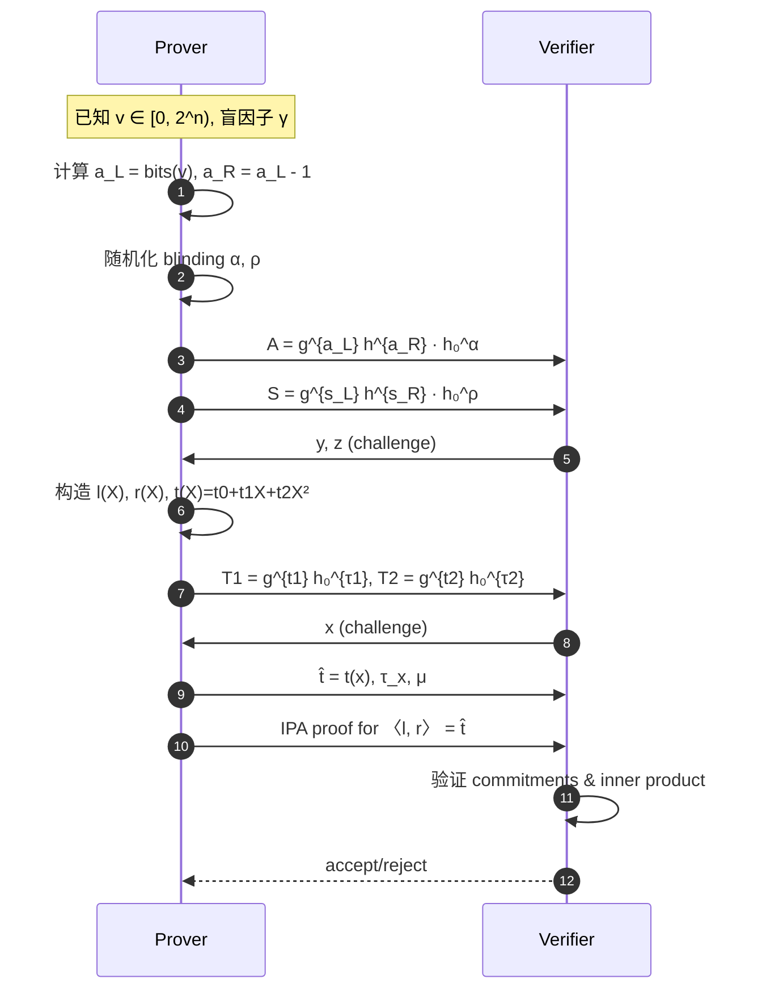
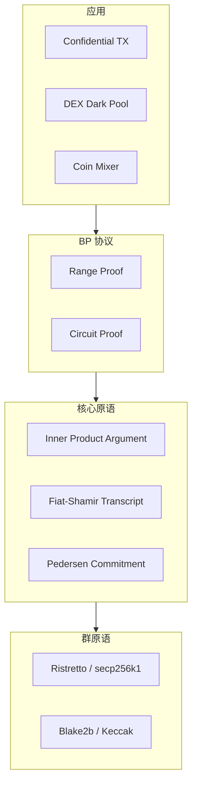

# Bulletproofs：Inner Product Argument、Range Proof 与隐私币应用

> **TL;DR**：Bulletproofs（Bünz-Bootle-Boneh-Poelstra-Wuille-Maxwell, 2018）是一类 **无 trusted setup、仅依赖离散对数假设** 的 ZKP 协议，核心创新是 **Inner Product Argument（IPA）**——将"内积相等"的证明从 $O(n)$ 压缩到 $O(\log n)$。主场景是 **range proof**：证明一个 Pedersen 承诺对应的值 $v \in [0, 2^n)$ 而不泄露 $v$。被 Monero（2018 Oct 硬分叉，tx 体积降 80%）、Grin、BEAM、Zcash Orchard（部分组件）广泛采用，是隐私币的"共同语言"。

## 1. 背景与动机

### 1.1 为什么需要 range proof

在 Confidential Transactions（保密交易，Maxwell 2015）中，金额被 Pedersen 承诺 $\text{Com}(v, r) = g^v h^r$ 隐藏。验证者要确保：
- 输入 = 输出（通过 $\sum \text{Com}_{\text{in}} = \sum \text{Com}_{\text{out}}$ 加法同态直接验证）；
- **每个金额 $v \geq 0$**——否则攻击者可造"负输出"凭空铸币。

后一条即 **range proof**：证明 $v \in [0, 2^{64})$。早期方案（Maxwell CT、Borromean ring signatures）体积 ~2.5 KB / output，占 Monero 交易 ~80% 体积。Bulletproofs 把这个降到 ~600 字节 / output，并且 batch 多个 output 时几乎线性合并（e.g., aggregate proof for 16 outputs 只多占一点）。

### 1.2 与 SNARK 的定位差异

| 维度 | Bulletproofs | SNARK (Groth16) |
| --- | --- | --- |
| Setup | 透明 | trusted |
| 证明大小 | $O(\log n)$ | $O(1)$ |
| Verifier | $O(n)$ | $O(1)$ |
| 适用电路 | 小（< 2²⁰ gates 还可接受） | 任意大 |
| 用例 | 隐私币 range proof | L2 扩容 |

Bulletproofs 的甜点：**不需要 setup，但电路不能太大**。因此隐私币、DEX dark pool、小型 mixer 首选。

## 2. 核心原理（深度要求：≥1500 字）

### 2.1 Inner Product Argument：从 O(n) 到 O(log n)

**目标**：给定两个长度 $n$ 的向量承诺 $P = g^{\vec{a}} h^{\vec{b}} u^{\langle \vec{a}, \vec{b}\rangle}$（$g, h$ 是向量基，$u$ 独立生成元），证明知道 $(\vec{a}, \vec{b})$ 使其成立，而不泄露向量。

**递归折叠**（Bootle et al. 2016）：每轮把长度 $n$ 减半到 $n/2$，重复 $\log n$ 轮。

第 $k$ 轮：
1. P 把 $\vec{a} = (\vec{a}_L, \vec{a}_R)$、$\vec{b} = (\vec{b}_L, \vec{b}_R)$ 二分。
2. P 计算
   $$
   L = g_R^{\vec{a}_L} h_L^{\vec{b}_R} u^{\langle \vec{a}_L, \vec{b}_R\rangle},\quad R = g_L^{\vec{a}_R} h_R^{\vec{b}_L} u^{\langle \vec{a}_R, \vec{b}_L\rangle}
   $$
3. V 发送挑战 $x$，双方更新：
   $$
   \vec{a}' = \vec{a}_L + x \vec{a}_R,\quad \vec{b}' = x^{-1} \vec{b}_L + \vec{b}_R
   $$
   $$
   g' = g_L^{x^{-1}} \cdot g_R,\quad h' = h_L \cdot h_R^{x}
   $$
   新承诺 $P' = L^{x^2} \cdot P \cdot R^{x^{-2}}$，向量长度减半。

$\log n$ 轮后，向量压为标量 $a, b$，P 发送 $(a, b)$，V 验证 $P^* = g'^a h'^b u^{ab}$。

**证明大小**：每轮 2 个群元素 $(L, R)$，最后 2 个标量 = $2 \log n + 2$ 元素。

**Soundness**：在 discrete log 假设下，可通过 rewinding 三个分支提取 witness。原论文 Thm 1.

### 2.2 Range Proof：把 $v \in [0, 2^n)$ 编码为 IPA

**关键技巧**：$v = \sum_{i=0}^{n-1} v_i \cdot 2^i$ 当且仅当
- $\vec{v}_L \in \{0,1\}^n$（即 $\vec{v}_L \circ (\vec{v}_L - \vec{1}) = \vec{0}$）；
- $\langle \vec{v}_L, \vec{2}^n \rangle = v$（其中 $\vec{2}^n = (1, 2, 4, \ldots, 2^{n-1})$）。

Prover 构造向量 $\vec{a}_L = \vec{v}_L$，$\vec{a}_R = \vec{v}_L - \vec{1}^n$，然后证明：

$$
\vec{a}_L \circ \vec{a}_R = \vec{0} \quad \land \quad \langle \vec{a}_L, \vec{2}^n \rangle = v
$$

用 V 的随机挑战 $y, z$ 把这些约束聚合为一个**单一内积等式**（详见原论文 §4.2）：

$$
\langle \vec{l}(X), \vec{r}(X) \rangle = t(X) = t_0 + t_1 X + t_2 X^2
$$

其中 $\vec{l}, \vec{r}$ 是与挑战和 witness 相关的向量多项式。Prover 承诺 $t_1, t_2$，V 发送 $x$ 做 evaluation，最后用 IPA 证明内积等式。

**Aggregation**：对 $m$ 个 range proof，只需把 $\vec{a}_L, \vec{a}_R$ 拼接成长度 $mn$，复用同一个 IPA；证明大小 $2 \log(mn) + O(1)$——比独立证明 $m \cdot (2 \log n + O(1))$ 小得多。

### 2.3 通用算术电路证明

Bulletproofs §6 给出把任意 R1CS / arithmetic circuit 转为 IPA 的方法。每个 gate 展开为 $\vec{a}_L \circ \vec{a}_R = \vec{a}_O$，约束通过 Hadamard 积和线性约束表达，最终归约到"向量多项式内积相等"。证明 $2 \log(n) + O(1)$，但 Prover $O(n \log n)$、Verifier $O(n)$。

### 2.4 子机制拆解

1. **Pedersen 承诺**：$\text{Com}(v; r) = g^v h^r$，加法同态。
2. **向量承诺**：$\vec{g}^{\vec{a}} \vec{h}^{\vec{b}}$，独立生成元 $\vec{g}, \vec{h}$ 通过"nothing-up-my-sleeve"哈希生成（避免 trusted setup）。
3. **Inner Product Argument**：递归折叠。
4. **Fiat-Shamir transcript**：Merlin/STROBE 标准实现。
5. **Batch Verification**：多个证明合并为一次 multi-exponentiation，验证大幅加速。

### 2.5 参数

| 参数 | 取值 | 说明 |
| --- | --- | --- |
| 曲线 | ristretto255 (Monero), secp256k1 (Grin) | 128-bit 安全 |
| Range width | 64 bit（Monero）/ 32 bit（Grin） | 覆盖原生币单位范围 |
| Aggregation | 1, 2, 4, 8, 16, 32 | 幂次，影响证明大小 |
| Hash | Blake2b / Keccak | transcript 用 |

### 2.6 协议流程



### 2.7 边界与失败模式

- **小 base point 攻击**：若 $\vec{g}, \vec{h}$ 包含 low-order 元素，可伪造。ristretto255 避免此问题。
- **Verifier 慢**：$O(n)$ 向量基重计算；实现上用 "basepoint tables" 预计算 + Pippenger MSM 加速。
- **Frozen Heart (CVE-2022-40195)**：早期 Dalek/Monero 实现 Fiat-Shamir 缺字段。

## 3. 架构剖析（深度要求：≥1200 字）

### 3.1 分层视图



### 3.2 核心模块清单

| 模块 | 职责 | 代表实现 | 可替换性 |
| --- | --- | --- | --- |
| curve25519-dalek | 群运算 | dalek | 中（可换 secp256k1） |
| merlin | transcript | dalek | 高 |
| bulletproofs crate | IPA + range + circuit | dalek-cryptography/bulletproofs | 高 |
| monero::ringct | Range proof 调用层 | monero-project/monero | 低 |
| mimblewimble | 整合 CT + BP | grin, BEAM | 中 |

### 3.3 端到端流程：Monero 一笔交易

```
1. 用户发起转账 to Alice 0.5 XMR + Bob 0.3 XMR
2. 钱包生成两个 Pedersen commits + 两个 range proof (aggregated)
3. 构造 one-time output key + ring signature (CLSAG)
4. 把 tx broadcasted → 矿工
5. 矿工验证：
   - ring signature 合法
   - Pedersen commits 同余（输入=输出+fee）
   - range proofs 合法（~10 ms / tx）
6. tx 进入 mempool → 区块
```

Aggregated range proof for 2 outputs：~674 bytes；若非 aggregate 则 ~1298 bytes。

### 3.4 参考实现

- **dalek-cryptography/bulletproofs**（Rust）：事实上的参考实现，被 Grin、Interstellar、多个 L2 复用。
- **monero-project/monero**（C++）：`src/ringct/bulletproofs.cc`、`bulletproofs_plus.cc`。
- **ElementsProject/libsecp256k1-zkp**：secp256k1 上的 bulletproof 实现（实验）。
- **b-g-p/bulletproofs**（Go）：Ing Bank 实现。

### 3.5 扩展：Bulletproofs+

Chung-Han-Ko 2020 提出 **Bulletproofs+**：用对数规模的 weighted inner product argument 取代原始 IPA，证明更小 ~10%、验证更快 ~15%。Monero 2022 硬分叉（v16）切换到 BP+。

## 4. 关键代码 / 实现细节

`dalek-cryptography/bulletproofs`（tag `v4.0.0`，`src/range_proof/mod.rs:L120-L200`）：

```rust
// bulletproofs/src/range_proof/mod.rs（简化）
impl RangeProof {
    pub fn prove_single(
        bp_gens: &BulletproofGens,
        pc_gens: &PedersenGens,
        transcript: &mut Transcript,
        v: u64,
        v_blinding: &Scalar,
        n: usize,  // range width e.g. 64
    ) -> Result<(RangeProof, CompressedRistretto), ProofError> {
        // 1. a_L = bits(v), a_R = a_L - 1
        let (a_L, a_R) = build_bit_vectors(v, n);
        let alpha = Scalar::random(rng);
        let A = bp_gens.H[0] * alpha + dot_product(&bp_gens.G[..n], &a_L) + dot_product(&bp_gens.H[..n], &a_R);

        // 2. Blinding S = g^{s_L} h^{s_R} H^rho
        let s_L = random_vec(n); let s_R = random_vec(n);
        let rho = Scalar::random(rng);
        let S = bp_gens.H[0] * rho + dot_product(&bp_gens.G[..n], &s_L) + dot_product(&bp_gens.H[..n], &s_R);

        // 3. challenge y, z
        transcript.append_point(b"A", &A.compress());
        transcript.append_point(b"S", &S.compress());
        let y = transcript.challenge_scalar(b"y");
        let z = transcript.challenge_scalar(b"z");

        // 4. compute l(X), r(X), t(X)
        let (l_poly, r_poly, t_poly) = compute_poly(&a_L, &a_R, &s_L, &s_R, y, z, v, n);

        // 5. T1, T2 commitments
        let (T1, tau1) = commit(&t_poly[1]);
        let (T2, tau2) = commit(&t_poly[2]);

        // 6. challenge x
        let x = transcript.challenge_scalar(b"x");

        // 7. evaluate l, r, t at x
        let t_hat = t_poly.eval(x);
        let tau_x = tau2 * x*x + tau1 * x + z*z * v_blinding;
        let mu    = alpha + rho * x;

        // 8. run IPA for <l(x), r(x)> = t_hat
        let ipa = InnerProductProof::create(transcript, &bp_gens.G, &bp_gens.H, &l_poly.eval(x), &r_poly.eval(x), ...);

        Ok((RangeProof { A, S, T1, T2, t_hat, tau_x, mu, ipa }, V))
    }
}
```

## 5. 演进与版本对比

| 版本 | 年份 | 改进 |
| --- | --- | --- |
| Bootle et al. IPA | 2016 | $O(\log n)$ 内积证明 |
| Bulletproofs v1 | 2018 | Range proof + aggregate + circuit |
| Monero Bulletproofs | 2018-10 | 硬分叉启用，tx size -80% |
| Grin Bulletproofs | 2019-01 | 主网默认 |
| Bulletproofs+ | 2020 | WIPA 优化，证明 -10% |
| Monero BP+ | 2022-08 v16 硬分叉 | 升级到 BP+ |

## 6. 实战示例

使用 Rust `bulletproofs` crate：

```rust
use bulletproofs::{BulletproofGens, PedersenGens, RangeProof};
use curve25519_dalek::scalar::Scalar;
use merlin::Transcript;
use rand::thread_rng;

fn main() {
    let pc_gens = PedersenGens::default();
    let bp_gens = BulletproofGens::new(64, 1);

    let secret_value = 1037578891u64;
    let blinding = Scalar::random(&mut thread_rng());

    // Prove
    let mut t = Transcript::new(b"rangeproof example");
    let (proof, committed_value) = RangeProof::prove_single(
        &bp_gens, &pc_gens, &mut t, secret_value, &blinding, 64,
    ).unwrap();

    // Verify
    let mut t = Transcript::new(b"rangeproof example");
    assert!(proof.verify_single(&bp_gens, &pc_gens, &mut t, &committed_value, 64).is_ok());
    println!("range proof OK, size = {} bytes", proof.to_bytes().len());
}
```

## 7. 安全与已知攻击

- **Frozen Heart (Trail of Bits 2022, CVE-2022-40195)**：Monero / dalek 实现 FS 转录缺字段，可伪造证明；已紧急修复。
- **Borromean / CT 已知漏洞**（历史 Monero bug 2017）：非 Bulletproofs 本身。
- **Subgroup attack**：非 ristretto 曲线（如 raw curve25519）cofactor 8，需 clamp；ristretto 免疫。
- **Low-entropy blinding**：若 $\gamma$ 熵不足（弱 RNG），可暴力恢复 $v$。

## 8. 与同类方案对比

| 维度 | Bulletproofs | Groth16 | STARK | MLSAG/CLSAG |
| --- | --- | --- | --- | --- |
| Setup | 透明 | trusted | 透明 | 透明 |
| 证明（1 output range） | ~670 B | ~200 B | ~50 KB | N/A（不同问题） |
| Verifier | O(n) | O(1) | O(log² n) | O(ring size) |
| Prover | 中 | 快 | 慢 | 快 |
| 典型场景 | 隐私币 range proof | L2 | L2 + PQ | ring signature |

## 9. 延伸阅读

- **论文**：Bünz et al. 2018 "Bulletproofs"、Bootle et al. 2016 IPA、Bulletproofs+ (eprint 2020/735)、ethSTARK。
- **博客**：Cathie Yun《Building on Bulletproofs》、Henry de Valence《Ristretto》。
- **代码**：`dalek-cryptography/bulletproofs`、`monero-project/monero/src/ringct/bulletproofs.cc`。
- **视频**：Real World Crypto 2018 Bünz talk、ZK Study Club。

## 10. 术语表

| 术语 | 英文 | 释义 |
| --- | --- | --- |
| Bulletproof | Bulletproof | 透明对数证明 |
| IPA | Inner Product Argument | 内积证明 |
| Pedersen 承诺 | Pedersen Commitment | $g^v h^r$ |
| Range proof | Range Proof | 证明 $v \in [0, 2^n)$ |
| CT | Confidential Transactions | 保密交易 |
| Aggregation | Aggregation | 多证明合并 |
| ristretto255 | ristretto255 | 素数阶点群编码 |
| Bulletproofs+ | Bulletproofs Plus | BP 优化版 |

---

*Last verified: 2026-04-22*
