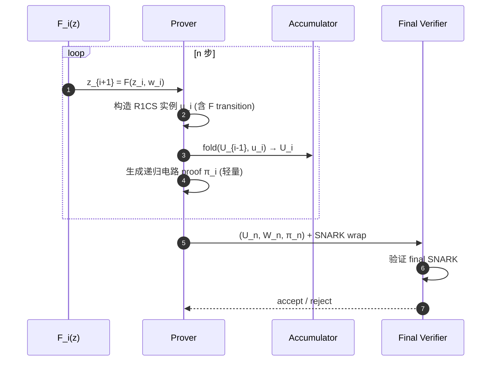
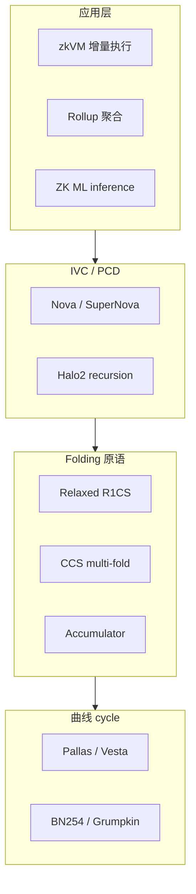

# 递归证明与 Folding：Halo / Halo2 / Nova / SuperNova / HyperNova / ProtoStar

> **TL;DR**：递归证明（proof recursion）让"Verifier 成为一段代码"——把一个证明的验证电路化，再用另一个证明证明它。这有两条路线：(1) **Accumulation / Halo 风格**：通过延迟 IPA 终检把递归成本摊平；(2) **Folding scheme / Nova 风格**：把多个实例"折叠"成一个 relaxed R1CS，最后只做一次 SNARK。2021 年 Nova 开启 folding 时代，SuperNova（2022）支持非一致步骤、HyperNova（2023）支持 CCS 通用约束、ProtoStar（2023）进一步泛化。Folding 使增量可验证计算（IVC）成本接近线性，是 zkVM、长链聚合、ZK ML 的共用底座。

## 1. 背景与动机

### 1.1 递归的用途

- **证明聚合**：1000 条 rollup batch → 1 条 final proof 上链。
- **增量可验证计算（IVC）**：无限循环证明，每一步只多付 $O(1)$ 成本。区块链状态机天然需要 IVC。
- **长计算分片**：把巨大电路切成小块分布式证明。
- **混合协议**：STARK Prover（快）→ SNARK Wrap（小证明），二者通过 recursion 衔接。

### 1.2 经典难题："两个曲线配对循环"

传统递归需要 **pairing-friendly cycle of curves**（MNT4/MNT6, Pasta=Pallas/Vesta）——两个曲线的标量域互为另一条的 base field，才能把一条的 Verifier 高效编码为另一条的电路。这种曲线 setup 少、阶小、安全性低。

**Halo（Hopwood-Bowe-Grigg, 2019）** 的突破：**不需要 pairing**，用 IPA（Inner Product Argument）+ **延迟验证（accumulation scheme）** 实现递归，仅需单条曲线。Halo2 把它发扬光大，结合 PLONKish 成为主流框架。

**Nova（Kothapalli-Setty-Tzialla, 2021）** 的突破：**不做 SNARK 的递归**，而是**折叠 R1CS 实例**——把两个"实例+见证"合并成一个新实例，每步仅需若干 MSM。最后统一出一个 SNARK 证明。代价大幅低于传统递归。

## 2. 核心原理（深度要求：≥1500 字）

### 2.1 Halo / Accumulation Scheme

**核心观察**：IPA Verifier 在 $\log n$ 折叠后剩下的检查是
$$
P^* \stackrel{?}{=} g_0^a h_0^b u^{ab}
$$
其中 $g_0, h_0$ 是折叠后的向量基（本身是 $O(\log n)$ 个挑战的线性组合）。**这一步 $O(n)$ 的计算**可以被**延迟**——Verifier 不立刻算 $g_0, h_0$，而是输出一个 "accumulator"（代表"这些折叠挑战合法"），以后一次性验证。

形式化：
- **acc := (g_0, h_0, cross-terms)** 作为证明的"欠条"。
- **accumulate(acc_old, new_proof) → acc_new**：把新 proof 吸收进累加器。
- **decide(acc) → 0/1**：最终一次验证累加器。

因为 accumulate 只做 $O(\log n)$ 群运算，Verifier 在电路中可以高效实现；decide 留到最后。

**递归构造**：把 accumulate 编码为电路 $C$；生成 proof $\pi_i$ 证明"我跑了 $C$"，同时输出新的 $acc_i$。如此无限累积，只在终点做一次 decide（$O(n)$）。

**Halo2**：在 Halo 之上叠加 PLONKish 算术化 + custom gates + lookup table。Zcash Orchard、Scroll zkEVM、Axiom、Taiko、Penumbra 都使用 Halo2。

### 2.2 Nova：Folding 的优雅

**Relaxed R1CS**：原始 R1CS $(A z)(B z) = C z$ 引入松弛 $u$ 和误差 $E$：
$$
(A z) \circ (B z) = u (C z) + E
$$
两个 relaxed 实例 $(U_1, W_1), (U_2, W_2)$ 可通过挑战 $r$ 线性组合：
$$
U = U_1 + r U_2,\quad W = W_1 + r W_2,\quad E = E_1 + r \cdot T + r^2 E_2
$$
其中交叉项 $T = (A z_1)(B z_2) + (A z_2)(B z_1) - u_1 (C z_2) - u_2 (C z_1)$ 由 Prover 计算并 commit。

**结果**：新实例 $(U, W)$ 仍是 relaxed R1CS，折叠成本仅 2 次 MSM + 1 次 transcript challenge。

**IVC（Incrementally Verifiable Computation）**：每一步函数 $F$ 产生新 R1CS 实例 $u_i$，折叠进累积器 $U_{i-1}$ 得到 $U_i$。证明 $\pi_i$ 仅包含 commitment 到 $U_i, W_i$ 和一个"递归电路"的 zkSNARK（证明折叠正确性 + 上一步正确性）。

```mermaid
flowchart LR
    I[instance u_i] -->|fold| A[(U_{i-1})]
    A --> B[(U_i)]
    B -->|fold next| C[(U_{i+1})]
    C -->|... n steps| Z[(U_n)]
    Z -->|SNARK proof| Out[π_final]
```

**成本**：每步 folding ~O(|F|) field ops + 2 MSM；最终一次 SNARK 证明折叠后的 relaxed R1CS。相比传统递归（每步要证完整 SNARK Verifier），成本低一个数量级。

### 2.3 SuperNova：非一致步骤

Nova 要求每步都是同一个函数 $F$。SuperNova 允许从 $L$ 种函数 $\{F_1, \ldots, F_L\}$ 中选一个——即 zkVM 的每条指令对应一个 $F_j$。通过"程序计数器 + 多 R1CS 折叠"实现，只折叠被执行的那个 $F_{pc}$，成本与 $L$ 无关（SuperNova Thm 1）。

### 2.4 HyperNova：CCS 通用约束

HyperNova（Kothapalli-Setty, 2023）把 folding 从 R1CS 扩展到 **CCS（Customizable Constraint System）**——任意次多项式约束，涵盖 PLONKish、AIR 等。通过 multi-folding 的 sumcheck protocol 实现，证明更紧凑。

### 2.5 ProtoStar：通用 folding 框架

Bünz-Chen 2023 给出 **ProtoStar**——任意 special-sound protocol 都可以被"折叠化"。这让 folding 不再绑定 R1CS，而成为 first-class 通用技术。支持高阶约束、lookup、permutation 一体化。

### 2.6 子机制拆解

| 子机制 | Halo | Nova |
| --- | --- | --- |
| 算术化 | PLONKish | R1CS / CCS |
| 承诺 | IPA | Pedersen（Pallas/Vesta） |
| 递归机制 | Accumulation of IPA | Folding of relaxed instance |
| 最终成本 | 1 次 IPA decide (O(n)) | 1 次 SNARK proof (O(n log n)) |
| Setup | 透明 | 透明 |
| 曲线 | Pallas + Vesta (Pasta cycle) | Pallas + Vesta |

### 2.7 参数与取舍

| 参数 | 典型 | 说明 |
| --- | --- | --- |
| 曲线 cycle | Pallas / Vesta | Halo/Nova 都用；Pasta 是 Zcash 开发，255-bit 素数阶 |
| 每步约束数 | $2^{15}$–$2^{20}$ | 折叠电路 + F 的电路 |
| Nova 每步成本 | ~2 MSM of size |C| | 线性在 F 规模 |
| 最终 SNARK | Spartan / Groth16 | 把 U_n 压成短证明 |

### 2.8 时序图



### 2.9 边界与失败模式

- **Folding cross term error**：若 $T$ 不正确，relaxed R1CS 不成立，但折叠后可能"看起来对"。Nova 的 soundness 证明保证在 DLog + ROM 下不可发生。
- **Deep recursion stack overflow**：电路深度受约束，Nova 实现用"outer/inner"结构避免。
- **Curve cycle security**：Pallas/Vesta 约 127-bit 安全；若选错曲线可能低于 128-bit。
- **Prover memory**：折叠要保存 $W_i$（witness），长链场景需要流式存储。

## 3. 架构剖析（深度要求：≥1200 字）

### 3.1 分层视图



### 3.2 核心模块清单

| 模块 | 职责 | 代表实现 | 可替换性 |
| --- | --- | --- | --- |
| Folding core | R1CS/CCS 折叠 | `microsoft/Nova`, `privacy-scaling-explorations/sonobe` | 中 |
| Step circuit | F + fold verifier | nova-snark `TrivialTestCircuit` | 高 |
| Curve cycle | Pallas/Vesta | `halo2curves`, `pasta_curves` | 低 |
| Accumulator | Halo2 | `halo2_proofs::plonk::verifier` | 中 |
| Final SNARK | 压缩 U_n | Spartan, Groth16 wrap | 高 |
| zkVM adapter | SuperNova multi-F | `nexus-zkvm`, `arecibo` | 高 |

### 3.3 端到端：一条 Nova IVC 链

```
1. 定义 StepCircuit F:  (z_i, w_i) → z_{i+1}
2. 初始 z_0，U_0 = ⊥
3. for i in 1..n:
     a. witness w_i = F(z_i)
     b. 构造 R1CS 实例 u_i
     c. RecursiveSNARK::prove_step → 折叠 u_i into U_{i-1}
     d. 得到 (z_{i+1}, U_i, W_i, π_i)
4. 最终 CompressedSNARK::prove → Spartan proof over U_n
5. submit CompressedSNARK + z_n 到 Verifier（链上或离线）
6. Verifier O(1) 时间验证
```

### 3.4 参考实现

- **microsoft/Nova**（Rust）：原始实现，R1CS + Pasta + Spartan wrap。
- **arecibo**（Rust）：Lurk Lab fork of Nova，生产优化。
- **privacy-scaling-explorations/sonobe**（Rust）：EF 出品，HyperNova / Nova / Nova-over-BN254 统一框架。
- **halo2 / halo2_proofs**（Rust）：PSE fork，生态最广。
- **microsoft/Spartan**（Rust）：Nova 的最终 SNARK wrap 选项。

### 3.5 扩展接口

- **Nova + BN254**：传统 Pasta 不是 pairing-friendly，无法直接在 EVM 验证。Sonobe 支持 Nova-over-BN254 + Grumpkin cycle，可以直接 Groth16 wrap 到 EVM。
- **多线程 folding**：HyperNova 支持并行折叠多个实例（tree folding），加速大规模聚合。
- **跨 VM folding**：SuperNova 允许 RISC-V, EVM, 自定义 opcode 混合 folding。

## 4. 关键代码 / 实现细节

`microsoft/Nova`（tag `v0.38`，`src/lib.rs::RecursiveSNARK::prove_step`）：

```rust
// nova-snark/src/lib.rs（简化）
impl<G1, G2, C1, C2> RecursiveSNARK<G1, G2, C1, C2> {
    pub fn prove_step(
        &mut self,
        pp: &PublicParams<G1, G2, C1, C2>,
        step_circuit_primary: &C1,
        step_circuit_secondary: &C2,
        z0_primary: &[G1::Scalar],
        z0_secondary: &[G2::Scalar],
    ) -> Result<(), NovaError> {
        // 1. 在 primary curve 上执行 F_1 并生成 R1CS 实例 u_{i,1}
        let (u_primary, w_primary) = execute_step(step_circuit_primary, self.zi_primary.clone())?;

        // 2. 折叠 u_primary 进 U_{i-1,1}
        let (T, comm_T) = NIFS::compute_cross_term(&self.U_primary, &u_primary, &pp.ck_primary)?;
        let r_primary = Self::fiat_shamir(&self.U_primary, &u_primary, &comm_T);
        self.U_primary = NIFS::fold(&self.U_primary, &u_primary, r_primary, &T);
        self.W_primary = NIFS::fold_w(&self.W_primary, &w_primary, r_primary, &T);

        // 3. 在 secondary curve 上执行"fold verifier 电路"
        //    这个电路把 primary fold 再 attest 一次，保证正确性
        let (u_secondary, w_secondary) = execute_fold_verifier_circuit(
            step_circuit_secondary, &self.U_primary, &u_primary, r_primary, &comm_T,
        )?;

        // 4. 折叠 u_secondary 进 U_{i-1,2}
        let (T2, comm_T2) = NIFS::compute_cross_term(&self.U_secondary, &u_secondary, &pp.ck_secondary)?;
        let r_secondary = Self::fiat_shamir(&self.U_secondary, &u_secondary, &comm_T2);
        self.U_secondary = NIFS::fold(&self.U_secondary, &u_secondary, r_secondary, &T2);
        self.W_secondary = NIFS::fold_w(&self.W_secondary, &w_secondary, r_secondary, &T2);

        self.i += 1;
        self.zi_primary = next_z_primary;
        Ok(())
    }
}
```

注意双曲线 (primary/secondary) 互为另一条的 scalar field，这样才能把每一侧的 scalar 运算编码为另一侧的电路。Halo / Nova 都采用此结构。

## 5. 演进与版本对比

| 方案 | 年份 | 创新 | 最终成本 | 实现 |
| --- | --- | --- | --- | --- |
| Halo | 2019 | 无 pairing 递归 / accumulation | 1 次 IPA decide | zcash |
| Halo2 | 2021 | + PLONKish + lookups | 1 IPA + pairing wrap | zcash / PSE |
| Nova | 2021 | Folding R1CS | 1 SNARK wrap | microsoft/Nova |
| SuperNova | 2022 | 非一致步骤 | 1 SNARK wrap | Lurk |
| HyperNova | 2023 | CCS multi-fold | 1 SNARK wrap | sonobe |
| ProtoStar | 2023 | 通用 folding 框架 | 1 SNARK wrap | 研究 |
| NeutronNova | 2024 | sumcheck-based folding | 1 SNARK wrap | 研究 |

## 6. 实战示例

Nova IVC demo：

```rust
use nova_snark::{
    PublicParams, RecursiveSNARK, CompressedSNARK,
    traits::{Group, circuit::StepCircuit, snark::RelaxedR1CSSNARKTrait},
    provider::{PallasEngine, VestaEngine},
};

#[derive(Clone)]
struct Fib;
impl<F: PrimeField> StepCircuit<F> for Fib {
    fn arity(&self) -> usize { 2 }
    fn synthesize<CS: ConstraintSystem<F>>(
        &self, cs: &mut CS, z: &[AllocatedNum<F>],
    ) -> Result<Vec<AllocatedNum<F>>, SynthesisError> {
        let a = z[0].clone(); let b = z[1].clone();
        let c = a.add(cs.namespace(|| "a+b"), &b)?;
        Ok(vec![b, c])
    }
}

fn main() {
    type G1 = PallasEngine; type G2 = VestaEngine;
    let pp = PublicParams::<G1,G2,Fib,TrivialCircuit<_>>::setup(&Fib, &TrivialCircuit::default(), ...).unwrap();
    let mut rs = RecursiveSNARK::<G1,G2,_,_>::new(&pp, &Fib, &TrivialCircuit::default(), &[F::zero(),F::one()], &[F::zero()]).unwrap();
    for _ in 0..1000 { rs.prove_step(&pp, &Fib, &TrivialCircuit::default(), &[F::zero(),F::one()], &[F::zero()]).unwrap(); }
    let cs = CompressedSNARK::<G1,G2,_,_,SpartanSNARK,_>::prove(&pp, &pk, &rs).unwrap();
    cs.verify(&vk, 1000, &[F::zero(),F::one()], &[F::zero()]).unwrap();
}
```

## 7. 安全与已知攻击

- **Halo2 IPA soundness**：在 AGM + DLog 下证明；实际依赖 Pasta 安全。
- **Nova soundness (KST21 Thm 1)**：在 DLog + ROM 下 knowledge-sound。
- **Frozen Heart 变种**：folding 多个 transcript 若 domain separation 不足有潜在漏洞（尚未公开事件）。
- **Pallas/Vesta 曲线**：1.5 年内未发现降级攻击；但非 pairing-friendly，wrap 到 EVM 需额外曲线。

## 8. 与同类方案对比

| 维度 | Halo2 | Nova | SNARK recursion (Groth16-over-Groth16) | STARK recursion (Plonky2) |
| --- | --- | --- | --- | --- |
| Setup | 透明 | 透明 | trusted | 透明 |
| 每步成本 | PLONK prove + accum | 2 MSM + 1 circuit | full SNARK prove（昂贵） | full STARK prove |
| 最终成本 | 1 IPA + wrap | 1 SNARK | — | 1 STARK |
| 灵活度 | 任意 PLONKish | R1CS | 任意 | AIR |
| 生态 | Zcash, Scroll, Axiom | Lurk, Nexus, EF | — | Polygon Zero |

## 9. 延伸阅读

- **论文**：Halo (2019/1021)、Halo2 book、Nova (2021/370)、SuperNova (2022/1758)、HyperNova (2023/573)、ProtoStar (2023/620)。
- **博客**：Daira Hopwood《Recursive SNARKs》、Justin Drake ETHResearch 帖子、a16z ZK 系列。
- **代码**：`microsoft/Nova`, `privacy-scaling-explorations/sonobe`, `lurk-lab/arecibo`, `zcash/halo2`。
- **视频**：ZK Study Club 2021 Nova、0xPARC Nova bootcamp。

## 10. 术语表

| 术语 | 英文 | 释义 |
| --- | --- | --- |
| IVC | Incrementally Verifiable Computation | 增量可验证计算 |
| PCD | Proof-Carrying Data | 携证数据，IVC 推广 |
| Accumulation | Accumulation Scheme | 延迟验证累加器 |
| Folding | Folding Scheme | 实例折叠 |
| Relaxed R1CS | Relaxed R1CS | 松弛 R1CS，含 u 和 E |
| CCS | Customizable Constraint System | 通用多项式约束 |
| Curve cycle | Curve Cycle | 两条曲线 scalar 互为 base |
| Pasta | Pasta curves | Pallas + Vesta |
| Grumpkin | Grumpkin | BN254 的 cycle companion |
| NIFS | Non-Interactive Folding Scheme | Nova 的折叠原语 |

---

*Last verified: 2026-04-22*
