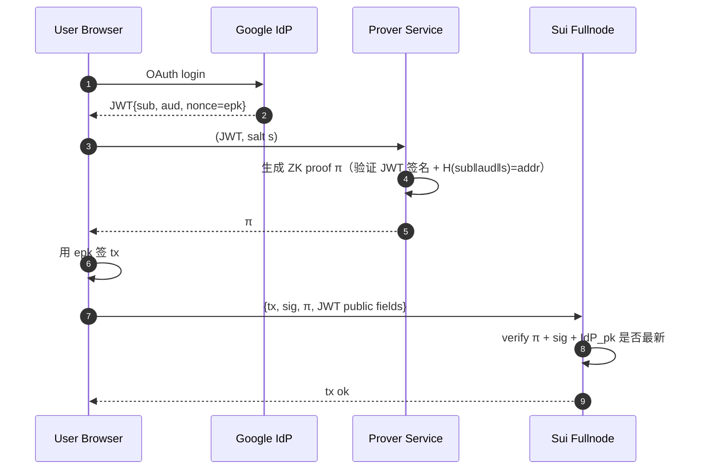
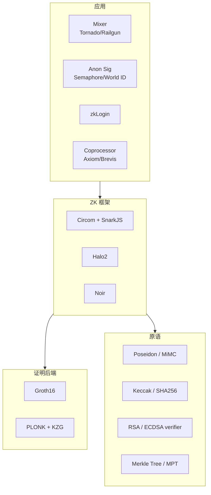

# ZKP 应用：Tornado Cash、Semaphore、zkLogin、ZK Coprocessor

> **TL;DR**：ZKP 走出学术圈、渗入亿级用户场景，依赖四类典型应用：(1) **Mixer**（Tornado Cash）打破交易图关联；(2) **匿名成员证明**（Semaphore、World ID）支持匿名投票 / Sybil-resistant 身份；(3) **zkLogin**（Sui / Aptos）把 Web2 OAuth 登录映射到链上地址而不泄露 email；(4) **ZK Coprocessor**（Axiom、Brevis、Herodotus）把 EVM 历史数据查询的结果以 ZK 证明交付。本篇逐一拆解其电路结构、部署范式与已知攻击。

## 1. 背景与动机

四类应用对应四类需求：
- **隐私**：链上转账图是公开的，交易所 KYC 可反向追踪。Tornado/Railgun 打断追踪链。
- **反女巫 + 匿名**：DAO 投票需要"一人一票"但不暴露身份。Semaphore / World ID 提供匿名 membership proof。
- **无密钥钱包体验**：普通人不懂保管私钥，但信任 Google/Apple。zkLogin 让 OAuth token 直接成为"身份证明"。
- **链下计算 + 链上信任**：合约 gas 限制 30M，不可能查 5 万区块历史。Coprocessor 用 ZK 证明把历史查询结果"带回链上"。

## 2. 核心原理（深度要求：≥1500 字）

### 2.1 Tornado Cash：Commitment-Nullifier 模型

**核心数据结构**：一棵 **Merkle 承诺树** $T$（深度 20，容量 ~1M 存款）+ 一套 **nullifier 集合** $N$。

**存款**：用户选择 secret $s$、nullifier $k$，计算
$$
\text{commitment} = H(k \| s)
$$
把 $\text{commitment}$ 存入合约（作为树 $T$ 的新叶）。合约锁定固定金额（0.1 / 1 / 10 / 100 ETH）。

**提款**：用户（可用新地址）证明：
- 知道 $(k, s)$ 使 $H(k \| s) \in T$（Merkle path 合法）；
- $H(k)$ 未出现在 nullifier 集合 $N$；
- 并在合约里把 $H(k)$ 加入 $N$（阻止二次提款）。

**关系**：
$$
\mathcal{R}_{\text{TC}} = \{(root, nullifier, recipient), (k, s, \text{path}) : H(k\|s) \in MerkleTree(root) \land nullifier = H(k)\}
$$

Tornado v1 用 Groth16 + Circom 写电路，Pedersen hash 做 commitment、MiMC hash 做 Merkle。每次提款 ~300K gas。

**隐私性**：只要 deposit 池子里有足够多用户，attacker 无法把 deposit 与 withdrawal 关联——这叫 **k-anonymity set**。

### 2.2 Semaphore：匿名信号

**目标**：允许一群用户匿名发送消息，每人每次只能签一次（防重放）。

**构造**：
1. 用户生成 identity = $(trapdoor, nullifier)$ 对，公钥 $pk = H(nullifier \| trapdoor)$。
2. 加入 identity tree（每个 DAO / 应用一棵）。
3. 发信号时证明：
   - 知道 $(trapdoor, nullifier)$ 使 $pk \in tree$；
   - 输出 $H(nullifier \| externalNullifier)$ 作为 nullifierHash（$externalNullifier$ = epoch ID）；
   - 签名 $signal$（公开）。

**关系**：
$$
\mathcal{R}_{\text{Sem}} = \{(root, signalHash, extNullHash, nullifierHash), (trapdoor, nullifier, path) : ...\}
$$

Semaphore v3+ 用 Groth16 + Circom + Poseidon hash。Worldcoin 的 World ID 基于 Semaphore 构建，额外集成"生物识别 orb"作为唯一性源。

### 2.3 zkLogin：OAuth → 链上地址

**痛点**：普通用户不会管理私钥。zkLogin（Sui, Aptos, 后续 EIP-7702 变体）让用户用 Google/Apple/Facebook 账号直接发链上交易，而不泄露 email 或 OAuth token 内容。

**核心流程**：
1. 用户与 IdP（Google）做标准 OIDC 登录，得到 **JWT token**（含 header.payload.signature）。
2. 客户端取 $JWT$ + 用户 salt $s$，计算 address = $H(sub \| aud \| s)$（$sub$ = 用户 ID、$aud$ = 应用 ID）。
3. 生成 ZKP 证明：
   - JWT signature 验证通过（IdP 公钥链上已知）；
   - JWT payload 中 $sub, aud$ 满足哈希关系；
   - ephemeral session key 在 JWT nonce field 中（绑定会话）。
4. 用 session key 签交易，附带 proof。合约验证：从 JWT 得出 address 合法 + session key 授权。

**关系**（zkLogin 论文 §3.2）：
$$
\{(addr, epk, IdP_{pk}, epoch), (JWT, s) : \text{VerifyJWT}(IdP_{pk}, JWT) \land addr = H(sub\|aud\|s) \land epk \in JWT.nonce\}
$$

**电路**：最贵部分是 RSA-2048 签名验证（Google 用 RSA）和 Base64 解码 JWT。Sui zkLogin 用 Groth16 + Circom，电路 ~2M gates，Prover ~10 s in browser（需要云端 prover 协助）。

### 2.4 ZK Coprocessor

**Axiom** 让合约查询"过去 2000 万区块中所有 Uniswap v3 0.05% 池子的 TVL"等复杂历史计算，以 ZK 证明交付结果。

**构造**：
- L1 历史通过 **block header hash chain**（每个 header 包含 parent hash）形成承诺链。
- 任何区块 $B_n$ 的 state root 都可通过 $n-k$ 个 header hash 追溯到近期 $B_k$（Ethereum block hash opcode 支持最近 256）。
- 从 state root 出发，走 MPT 证明可读取任意 account / storage slot。
- 在 ZK 电路里验证"一路 hash 合法 + MPT path 合法 + 业务逻辑计算 f(inputs) = output"。

Axiom v2 电路 ~500 个 sub-circuit（keccak、MPT、RLP、header chain），最终 Halo2 PLONK + KZG wrap。每次查询 gas ~200–400K on L1 Verifier。

**Herodotus / Relic / Lagrange**：类似的基础设施，侧重不同（Herodotus 跨链、Lagrange SQL-like 查询）。

### 2.5 子机制拆解（共性）

所有四类应用共享以下组件：

1. **Merkle tree / 累加器**：成员资格证明。
2. **Nullifier / uniqueness tag**：防重放、防 double-spend。
3. **Commitment**：隐藏 witness。
4. **Fiat-Shamir NIZK**：去交互。
5. **Signature-in-circuit**：验证 OAuth 或 EVM 签名。
6. **Precompile**：Poseidon / Keccak / RSA / EC 签名。

### 2.6 时序图

**Tornado Cash 流程**：

```mermaid
sequenceDiagram
    autonumber
    participant U as User
    participant C as Tornado.sol
    participant R as Relayer
    U->>U: (k, s) ← random; com = H(k‖s)
    U->>C: deposit(com) + 1 ETH
    C->>C: tree.insert(com); emit Deposit
    Note over U: 等待 k-anonymity 积累
    U->>U: 构造 Merkle path 到 com
    U->>U: nullifierHash = H(k)
    U->>U: π = prove(com ∈ tree ∧ H(k)=nullifierHash ∧ signedRecipient)
    U->>R: (π, nullifierHash, recipient, fee)
    R->>C: withdraw(π, nullifierHash, recipient, fee)
    C->>C: verify(π); require !nullifiers[nullifierHash]; nullifiers[nullifierHash]=true
    C->>U: send(recipient, 1 ETH - fee)
    C->>R: send(R, fee)
```

**zkLogin 流程**：



### 2.7 参数与取舍

| 应用 | 电路规模 | Prover 成本 | 合约 gas |
| --- | --- | --- | --- |
| Tornado Cash | ~30K constraints | 1 s in browser | 300K |
| Semaphore v4 | ~35K | 1-2 s | 350K |
| zkLogin | ~2M constraints | 5-30 s | 400-700K |
| Axiom query | ~2M-20M | 分钟级在集群 | 200-400K |
| World ID | ~50K | 2 s in browser | 400K |

## 3. 架构剖析（深度要求：≥1200 字）

### 3.1 分层视图



### 3.2 核心模块清单

| 模块 | 职责 | 代表 | 可替换性 |
| --- | --- | --- | --- |
| Frontend DSL | 写电路 | Circom / Halo2-lib / Noir | 高 |
| Merkle tree lib | 承诺集合 | `tornadocash/tornado-core`, `@zk-kit/incremental-merkle-tree` | 高 |
| Signature-in-circuit | RSA/ECDSA verifier | `halo2-ecc`, `circom-rsa-verify` | 中 |
| Prover SDK | 生成证明 | snarkjs, halo2 CLI | 高 |
| Relayer | 帮用户发 tx（隐藏 gas 来源） | Tornado relayer, Hopr | 高 |
| Verifier Contract | 链上验证 | Solidity verifier | 低 |

### 3.3 生命周期（Axiom 查询）

```
1. 开发者在前端用 Axiom SDK 定义 query：getStorageAt(uniswap_pool, slot, block_n)
2. 提交 query 到 Axiom backend
3. Axiom:
   a. 收集历史 header + MPT proof
   b. 在 halo2 电路中验证链条 + 计算 f(inputs)
   c. 聚合所有 sub-circuit → final PLONK proof
4. Axiom 把 (output, proof) 回调到用户合约
5. AxiomVerifier.sol 验证 proof；用户合约拿到可信 output
```

### 3.4 参考实现

- **Tornado**：`tornadocash/tornado-core`（archived 2022 OFAC 事件后）、后继 **Privacy Pools**（Chainway/Buterin et al. 2023）。
- **Semaphore**：`semaphore-protocol/semaphore`（v4 Halo2 版开发中）；World ID 基于其构建。
- **zkLogin**：Sui `sui-foundation/zklogin`、Mysten Labs `fastcrypto-zkp`。
- **Axiom**：`axiom-crypto/axiom-v2-contracts`、halo2-ecc、axiom-halo2。
- **Brevis / Herodotus / Lagrange**：竞品 coprocessor。

### 3.5 扩展接口

- **Railgun / Aztec Connect（废弃）**：不止 mixer，支持"隐私 DeFi"——在 shielded pool 里 swap、lend。
- **Privacy Pools（2023）**：Vitalik 等提出的"合规 mixer"——allow users to prove membership in a subset of deposits excluding OFAC-sanctioned ones。
- **Passkey + zkLogin**：与 WebAuthn 结合，未来可无需密码完全无感登录。

## 4. 关键代码 / 实现细节

**Tornado Cash 提款电路核心**（`tornadocash/tornado-core`，commit `8bbe72b`，`circuits/withdraw.circom`）：

```circom
pragma circom 2.0.0;
include "merkleTree.circom";
include "commitmentHasher.circom";

template Withdraw(levels) {
    signal input root;                   // 公开：当前 Merkle root
    signal input nullifierHash;          // 公开：H(k)
    signal input recipient;              // 公开
    signal input relayer;                // 公开
    signal input fee;                    // 公开
    signal input refund;                 // 公开

    signal input nullifier;              // 私有：k
    signal input secret;                 // 私有：s
    signal input pathElements[levels];   // 私有
    signal input pathIndices[levels];    // 私有

    // 1. commitment = H(k, s)，nullifierHash = H(k)
    component hasher = CommitmentHasher();
    hasher.nullifier <== nullifier;
    hasher.secret    <== secret;
    hasher.nullifierHash === nullifierHash;

    // 2. Merkle 路径成立
    component tree = MerkleTreeChecker(levels);
    tree.leaf <== hasher.commitment;
    tree.root <== root;
    for (var i = 0; i < levels; i++) {
        tree.pathElements[i] <== pathElements[i];
        tree.pathIndices[i]  <== pathIndices[i];
    }

    // 3. 绑定接收者（防签名被替换）：让 recipient 进入电路（无功用，但阻止 malleability）
    signal recipientSquare <== recipient * recipient;
}

component main {public [root, nullifierHash, recipient, relayer, fee, refund]} = Withdraw(20);
```

**Semaphore v3 的信号电路**（`semaphore-protocol/semaphore/packages/circuits/semaphore.circom`，简化）：

```circom
template Semaphore(nLevels) {
    signal input identityNullifier;       // 私有
    signal input identityTrapdoor;        // 私有
    signal input treePathIndices[nLevels]; signal input treeSiblings[nLevels];
    signal input signalHash;              // 公开
    signal input externalNullifier;       // 公开（epoch/app id）

    signal output root;                   // 公开（commitment tree root）
    signal output nullifierHash;          // 公开

    component idCommit = Poseidon(2);
    idCommit.inputs[0] <== identityNullifier;
    idCommit.inputs[1] <== identityTrapdoor;
    // Merkle tree 校验 idCommit.out ∈ tree
    component tree = MerkleProof(nLevels);
    tree.leaf <== idCommit.out;
    for (var i = 0; i < nLevels; i++) {
        tree.pathIndices[i] <== treePathIndices[i];
        tree.siblings[i]    <== treeSiblings[i];
    }
    root <== tree.root;

    // nullifierHash = Poseidon(externalNullifier, identityNullifier)
    component nh = Poseidon(2);
    nh.inputs[0] <== externalNullifier;
    nh.inputs[1] <== identityNullifier;
    nullifierHash <== nh.out;

    // 绑定 signalHash
    signal signalHashSquared <== signalHash * signalHash;
}
```

## 5. 演进与版本对比

| 方案 | 年份 | 关键特性 |
| --- | --- | --- |
| Zerocoin | 2013 | 第一代 mixer（非实用） |
| Zcash Sprout | 2014 | Groth16 shielded pool |
| Tornado Cash v1 | 2019 | ETH mixer 上线 |
| Semaphore v1 | 2020 | 匿名 membership sig |
| Zcash Sapling | 2018 | Groth16 + 更小 proof |
| Tornado Nova | 2021 | 可变金额 + 递归 |
| Railgun | 2022 | Privacy DeFi on Ethereum |
| Semaphore v3 | 2022 | Poseidon 优化 |
| World ID | 2023 | Semaphore + biometric |
| Sui zkLogin | 2023-Q3 | OAuth → address |
| Axiom v1 | 2023 | ZK Coprocessor on Ethereum |
| Privacy Pools | 2023 (whitepaper) | 合规 mixer |
| Axiom v2 | 2024 | 全历史查询 |

## 6. 实战示例

**用 Semaphore SDK 发匿名信号**：

```typescript
import { Identity } from "@semaphore-protocol/identity"
import { Group } from "@semaphore-protocol/group"
import { generateProof, verifyProof } from "@semaphore-protocol/proof"

// 1. 用户生成 identity
const identity = new Identity()
console.log(identity.commitment)  // push 到合约的 Group

// 2. 加入 group（例：DAO）
const group = new Group(32)
group.addMember(identity.commitment)

// 3. 生成匿名信号
const externalNullifier = 42n       // epoch id
const signal = "I approve proposal X"
const { proof, publicSignals } = await generateProof(
    identity, group, externalNullifier, signal,
    { zkeyFilePath: "semaphore.zkey", wasmFilePath: "semaphore.wasm" }
)

// 4. 链上 verify
const ok = await verifyProof({ proof, publicSignals }, 32)
console.log("anon vote accepted:", ok)
```

## 7. 安全与已知攻击

- **Tornado Cash v1 governance 漏洞（2023-05）**：攻击者通过 DAO 治理提案合约升级伪造 proposal，提走 ETH。非 ZK 本身，是治理+合约组合漏洞（见 Immunefi postmortem）。
- **OFAC 制裁（2022-08）**：Tornado Cash 被美国 OFAC 列入 SDN 名单，开发者 Alexey Pertsev 被捕；代码仓库被 GitHub 下架。随后 Buterin 等人提出 Privacy Pools 作为合规变体。
- **zkLogin JWT 信任链**：若 Google IdP 私钥泄露可伪造任意地址。Sui 通过链上登记 IdP 公钥 + epoch 轮换降低风险。
- **Semaphore nullifier 碰撞**：若 identity 生成使用弱 RNG，不同人可能撞上同一个 $pk$。v3+ 要求 256-bit 熵。
- **Axiom 数据可用性**：依赖 Ethereum block header hash，EIP-2935 historical_hashes 精简后方案需升级。
- **Privacy set 坍塌**：Mixer k-anonymity 依赖活跃存款者；低流动性池子 k→1，可被反推。

## 8. 与同类方案对比

| 维度 | Tornado | Railgun | Aztec Connect（已下线） | Privacy Pools |
| --- | --- | --- | --- | --- |
| 类型 | Fixed-denom mixer | Shielded DeFi | Private rollup | 合规 mixer |
| Setup | Groth16 trusted | Groth16 | Plonk | 类 Tornado |
| EVM 级别 | L1 / L2 | L1 / L2 | L2 rollup | L1 |
| 合规机制 | 无 | 可选 viewing key | 无 | 子集成员证明（排除黑名单） |
| 状态 | 禁令 | 活跃 | 已下线 2024 | 研究 → 小规模部署 |

| 维度 | Semaphore | World ID | BrightID | Proof of Humanity |
| --- | --- | --- | --- | --- |
| 匿名 | 是 | 是 | 部分 | 公开 |
| 唯一性源 | 社区/OAuth | 生物识别 orb | 社交图 | 人工视频 |
| Sybil 强度 | 中 | 强 | 中 | 强 |
| 隐私 | 强 | 强 | 弱 | 无 |

## 9. 延伸阅读

- **论文**：Tornado Cash whitepaper、Semaphore v3 paper、zkLogin (2023/857)、Axiom paper、Privacy Pools (Buterin et al. 2023/1750)。
- **博客**：Vitalik《Privacy Pools》、Matter Labs《Anonymous credentials》、Worldcoin whitepaper。
- **代码**：`tornadocash/tornado-core`、`semaphore-protocol/semaphore`、`mystenlabs/fastcrypto-zkp`、`axiom-crypto/axiom-v2-contracts`、`Privacy-Scaling-Explorations/semaphore-scaling-experiments`。
- **文章**：Chainalysis Tornado 报告、OFAC SDN 公告、Immunefi Tornado governance PM。

## 10. 术语表

| 术语 | 英文 | 释义 |
| --- | --- | --- |
| Mixer | Mixer | 打断交易图关联的服务 |
| Commitment tree | Commitment Tree | 存款承诺 Merkle 树 |
| Nullifier | Nullifier | 防双花的标签 |
| k-anonymity | k-Anonymity | k 个不可区分的 deposit |
| Semaphore | Semaphore | 匿名成员签名协议 |
| External nullifier | External Nullifier | epoch/应用 ID 防 replay |
| zkLogin | zkLogin | OAuth → ZK 地址 |
| Coprocessor | Coprocessor | 链下可证明计算 |
| MPT | Merkle Patricia Trie | Ethereum 状态树 |
| Privacy Pools | Privacy Pools | 合规 mixer 方案 |

---

*Last verified: 2026-04-22*
