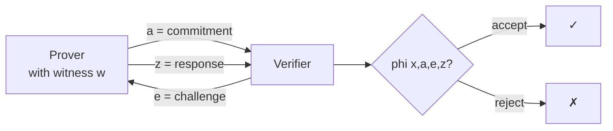
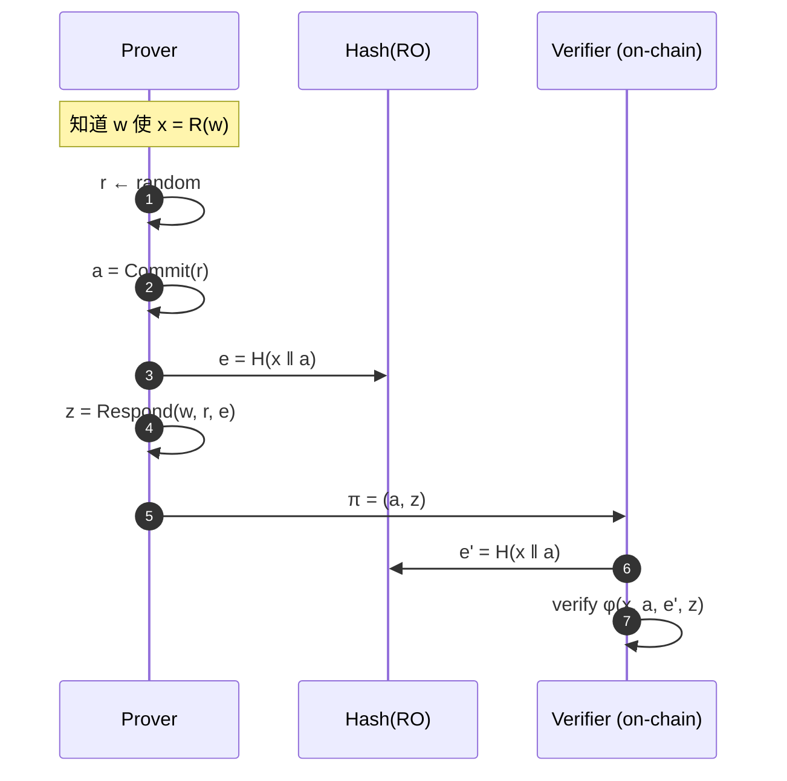
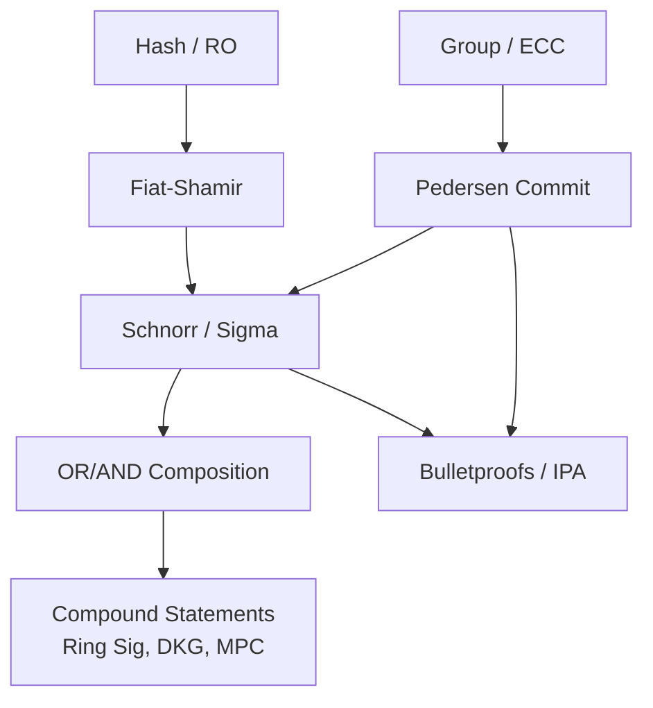

# ZKP 基础：Sigma 协议、Schnorr、Fiat-Shamir 与承诺方案

> **TL;DR**：所有现代 SNARK/STARK 都站在 1980s–90s 的四块基石之上——Goldwasser-Micali-Rackoff 的 IZK 模型、Fiat-Shamir 的去交互变换、Schnorr 的离散对数证明、Pedersen 的同态承诺。这四件套构成了"Sigma 协议"生态，定义了什么是"三步 public-coin 协议"、如何随机化、如何加承诺把它升级成零知识。本篇深入这四项原语的数学、可靠性误差分析与实现细节，是读懂 Groth16/PLONK/Bulletproofs 前的必修课。

## 1. 背景与动机

在 1985 年 GMR 论文出现之前，"证明"只有 NP 概念——存在一个多项式大小的见证。GMR 的革命在于引入**交互式证明（IP）**：V 可以向 P 抛随机挑战，大幅扩展了证明能力（后来 IP = PSPACE，Shamir 1992）。紧接着他们提出**零知识**要求——交互转录不泄露 witness。

但 IZK 的第一个实用障碍是**交互本身**：区块链场景下验证者是千千万万个节点，无法逐一 challenge。解决这个问题的是 1986 年 Fiat-Shamir 提出的启发式变换——把 V 的随机挑战替换为 Hash(transcript)，在**随机预言机模型（ROM）** 下可证安全。

第二个障碍是**表达力**：最早的 ZKP 协议（如 GMR 的二次剩余证明）只能处理非常狭窄的语句。1988 年 Schnorr 协议让"离散对数等式"这个在密码学中最普遍的语句变得可证。再加上 Pedersen 1991 年的加法同态承诺，我们有了**组合能力**——任意代数关系都能被切成 Sigma 协议的片段，再用 AND/OR composition 组合。

这整套基础被称为 **Sigma protocol**（Σ-protocol），因为其三步流程 commit-challenge-response 形似希腊字母 Σ。它是后来 Bulletproofs、Halo、Schnorr signature、Ed25519、各类 DKG 协议的"语法"。

## 2. 核心原理（深度要求：≥1500 字）

### 2.1 形式化：Sigma 协议三条性质

**定义（Σ-protocol）**：对于 NP 关系 $\mathcal{R}$，一个 Σ-protocol 是一个三轮公开抛币协议 $(a, e, z)$，其中：

1. P 依据 witness $w$ 和随机数 $r$ 计算 **commitment** $a \leftarrow A(x, w, r)$，发送给 V。
2. V 发送均匀随机 **challenge** $e \leftarrow \{0,1\}^t$。
3. P 计算 **response** $z \leftarrow Z(x, w, r, e)$，发送给 V。V 根据 $\phi(x, a, e, z) \in \{0, 1\}$ 判定接受与否。

要求：

- **完备性（Completeness）**：诚实 P 总能使 V 接受。
- **特殊可靠性（Special Soundness）**：给定同一个 $a$ 下的两个不同挑战 $e \neq e'$ 和对应的接受 response $z, z'$，存在 PPT 提取器 $\mathcal{E}(x, a, e, e', z, z')$ 输出 witness $w$ 使 $(x, w) \in \mathcal{R}$。此性质保证 soundness error $\leq 2^{-t}$。
- **诚实验证者零知识（HVZK）**：存在模拟器 $\mathcal{S}$，对任意 $x \in L$ 和均匀 $e$，$\mathcal{S}(x, e)$ 输出分布与真实交互 $(a, e, z)$ 相同。

注意 Sigma 协议只保证**对诚实验证者的零知识**（HVZK）；升级到恶意 V 需要 Fiat-Shamir（NIZK）或 commit-challenge trick。

### 2.2 Schnorr 协议详解

**语句**：给定循环群 $\mathbb{G} = \langle g \rangle$，阶为素数 $q$，和 $y \in \mathbb{G}$，证明"我知道 $w \in \mathbb{Z}_q$ 使得 $y = g^w$"。

**协议**：

1. P 选随机 $r \in \mathbb{Z}_q$，计算 $a = g^r$，发送给 V。
2. V 选随机挑战 $e \in \mathbb{Z}_q$（或 $\{0,1\}^t$）。
3. P 计算 $z = r + e \cdot w \pmod{q}$，发送给 V。
4. V 验证 $g^z \stackrel{?}{=} a \cdot y^e$。

**正确性证明**：$g^z = g^{r + ew} = g^r \cdot (g^w)^e = a \cdot y^e$。

**Special Soundness 证明**：若 P 对同一个 $a$ 对两个不同 $e, e'$ 都给出正确 $z, z'$，则：

$$
g^{z-z'} = y^{e - e'} \implies w = \frac{z - z'}{e - e'} \pmod q
$$

提取器直接输出 $w$。✓

**HVZK 模拟器**：$\mathcal{S}$ 先选 $e$ 和 $z$，再置 $a = g^z / y^e$。这个 $(a, e, z)$ 与真实转录分布相同（$r = z - ew$ 也是均匀的）。✓

**Schnorr 签名**：把 $e$ 替换为 $\text{Hash}(a \| m)$ 得到 Schnorr 签名 $(a, z)$，即今天 Bitcoin Taproot（BIP-340）和 Ed25519 的原型。

### 2.3 Fiat-Shamir 变换

**目标**：把交互式 public-coin 协议变为非交互式。

**变换**：在 ROM 下，把验证者的随机挑战 $e_i$ 替换为

$$
e_i = H(\text{statement} \| a_1 \| \cdots \| a_i \| \text{ctx})
$$

其中 $\text{ctx}$ 包含协议标识、公共参数等。

**安全性**：在 ROM 下，若原协议是公开抛币且具有 negligible soundness error，则变换后的非交互协议对所有 PPT 作弊者仍是 sound 的（Pointcheval-Stern 94 "Forking Lemma"）。

**实现陷阱——"弱 Fiat-Shamir"**：
- 只 hash 最后一轮消息而漏掉 statement 或早期消息 → **Frozen Heart**（Trail of Bits 2022）。PlonK、Bulletproofs、Spartan 多个实现曾中招。
- 多 domain separation 不足 → 跨协议 replay。

**正确做法（zkproof.org Transcript 规范）**：
1. 每次吸收（absorb）一条消息都必须记入 transcript。
2. 用 Merlin/STROBE/Poseidon-sponge 这类 "transcript protocol"，强制按顺序 absorb。
3. 每个 challenge 之前 domain-separate（如加入 label "challenge_1"）。

### 2.4 承诺方案：Pedersen 与 KZG

**承诺方案**必须满足：

- **Hiding**：$\text{Com}(m; r)$ 不泄露 $m$（信息论或计算意义下）。
- **Binding**：给定 $\text{Com}(m; r)$，找到 $(m', r')$ 使 $m' \neq m$ 且 $\text{Com}(m'; r') = \text{Com}(m; r)$ 在计算上不可行。

**Pedersen 承诺**：$\text{Com}(m; r) = g^m \cdot h^r$，其中 $h = g^s$ 但 $s$ 未知。
- Perfectly hiding（$r$ 均匀时 $g^m \cdot h^r$ 分布与 $m$ 无关）。
- Computationally binding（打破 binding = 求解 $\log_g h$）。
- **加法同态**：$\text{Com}(m_1; r_1) \cdot \text{Com}(m_2; r_2) = \text{Com}(m_1 + m_2; r_1 + r_2)$。

**Pedersen 向量承诺**：$\text{Com}(\vec{m}; r) = g_1^{m_1} \cdots g_n^{m_n} \cdot h^r$，是 Bulletproofs 的基础。

**KZG 多项式承诺**（Kate-Zaverucha-Goldberg 2010）：对多项式 $p(X) = \sum c_i X^i$，给定 trusted setup $\{[\tau^i]_1, [\tau^i]_2\}$：

$$
\text{Com}(p) = [p(\tau)]_1 = \sum c_i \cdot [\tau^i]_1
$$

Opening in point $z$：输出 $v = p(z)$ 和商多项式 $q(X) = (p(X) - v)/(X - z)$ 的承诺 $\pi = [q(\tau)]_1$。验证：

$$
e(\pi, [\tau]_2 - [z]_2) \stackrel{?}{=} e(\text{Com}(p) - [v]_1, [1]_2)
$$

KZG 是 PLONK、Marlin 的核心，也是 EIP-4844 blob 承诺的基础。

### 2.5 AND / OR 组合与 compound statements

给定两个 Σ-protocol $\Sigma_0, \Sigma_1$ 证明 $x_0 \in L_0, x_1 \in L_1$：

**AND 组合**：并行运行两个子协议，共享同一个 challenge $e$。得到证明 $(x_0, x_1) \in L_0 \times L_1$。

**OR 组合（Cramer-Damgård-Schoenmakers 94）**：P 真正知道其中之一的 witness（比如 $w_0$），对另一个（$\Sigma_1$）用模拟器预生成 $(a_1, e_1, z_1)$，然后 V 发出总挑战 $e$，P 设 $e_0 = e \oplus e_1$，正常跑 $\Sigma_0$ 得到 $z_0$。V 检查 $e = e_0 \oplus e_1$ 且两个转录都接受。这样就证明了"知道 $w_0$ 或 $w_1$"而不暴露是哪个——**Ring signature** 的雏形。

### 2.6 子机制拆解：一个 ZKP 系统的最小构件





**边界条件**：
- 若 challenge 空间太小（$t$ 比特），soundness error $2^{-t}$；t ≥ 128 是最低标准。
- 若 transcript 没有 binding statement，存在 rewinding 攻击。
- 若 Fiat-Shamir 的 hash 不是 ROM-like（如使用可预测 PRF），安全性不再成立。

## 3. 架构剖析（深度要求：≥1200 字）

### 3.1 分层视图：从原语到协议



- **L0**：哈希（Keccak/SHA-3/Poseidon/Rescue）+ 椭圆曲线（secp256k1/ristretto255/BLS12-381）。
- **L1**：Pedersen/KZG 承诺方案。
- **L2**：Σ-protocol（Schnorr / DLEQ / chaum-pedersen）。
- **L3**：Fiat-Shamir 后的 NIZK，组合成签名、证明、多方协议。

### 3.2 核心模块清单

| 模块 | 职责 | 代表实现 | 可替换性 |
| --- | --- | --- | --- |
| Curve arith | 群运算 | curve25519-dalek, arkworks-bls12-381 | 高 |
| Transcript | Fiat-Shamir 吸收 | merlin, halo2-transcript, Poseidon-sponge | 中 |
| Sigma DSL | 高阶组合 | `zkp` crate (Rust), Charm (Py) | 高 |
| Proof serializer | 点/标量编码 | SEC1, compressed Edwards | 低 |

### 3.3 数据流：Schnorr 签名的一次调用

```
msg = "Hello"         ← app 输入
(sk, pk) ← Gen()      ← key gen
r ← rand()            ← nonce (RFC6979 推荐确定性)
a = g^r               ← commit
e = H(a ‖ pk ‖ msg)   ← Fiat-Shamir
z = r + e*sk mod q    ← response
σ = (a, z) or (e, z)  ← 签名（两种编码）
验证：g^z ?= a * pk^e
```

每一步的时耗（secp256k1、Intel Ice Lake）：
- 点乘：~40 µs
- Hash：~200 ns
- 标量加/乘：~30 ns

### 3.4 客户端多样性

- **libsecp256k1**（C）：Bitcoin Core 用，BIP-340 Schnorr 参考。
- **curve25519-dalek**（Rust）：ristretto255，广泛用于 Monero/Signal/ZCash。
- **arkworks**（Rust）：学术全家桶。
- **RELIC / MIRACL**（C/C++）：pairing-friendly 曲线参考。

### 3.5 扩展接口

- **BIP-340 Schnorr**：Bitcoin Taproot 激活（2021）。
- **EdDSA (RFC 8032)**：Ed25519，常用于 SSH/Tor/Solana。
- **ZKPoK composition**：`libzkp`、`dalek-zkp`。

## 4. 关键代码 / 实现细节

以 `dalek-cryptography/schnorrkel`（commit `v0.11`）的核心签名代码为例（`src/sign.rs:L120-L170`，简化）：

```rust
// schnorrkel/src/sign.rs（简化）
pub fn sign(sk: &SecretKey, msg: &[u8]) -> Signature {
    let mut t = Transcript::new(b"SigningContext");
    t.append_message(b"sign-bytes", msg);

    // 1) 生成 nonce（witness 随机性）
    let mut r_bytes = [0u8; 64];
    t.build_rng()
        .rekey_with_witness_bytes(b"signing", &sk.nonce)
        .finalize(&mut rand::thread_rng())
        .fill_bytes(&mut r_bytes);
    let r = Scalar::from_bytes_mod_order_wide(&r_bytes);

    // 2) commitment a = r * G
    let a = &r * &RISTRETTO_BASEPOINT_TABLE;

    // 3) Fiat-Shamir challenge e = H(transcript ‖ a ‖ pk)
    t.commit_point(b"sign:R", &a.compress());
    t.commit_point(b"sign:pk", &sk.public.compressed);
    let e = t.challenge_scalar(b"sign:c");

    // 4) response z = r + e * sk
    let z = r + e * sk.key;

    Signature { R: a.compress(), s: z }
}
```

注意三个细节：
1. **确定性 nonce**：用 `rekey_with_witness_bytes` 把 $\text{sk.nonce}$ 混入 RNG，防止 PRNG 失效导致 nonce 重用（Sony PS3 2010 事件）。
2. **Merlin transcript**：层层 `append_message` + `challenge_scalar`，自动 domain separation。
3. **Compressed point**：传输 32 字节压缩形式，签名总长 64 字节。

## 5. 演进与版本对比

| 协议 | 年份 | 进展 |
| --- | --- | --- |
| GMR IZK | 1985 | 交互式 ZK 定义 |
| Fiat-Shamir | 1986 | NIZK 变换 |
| Schnorr | 1988/91 | DLog Sigma |
| Chaum-Pedersen | 1992 | DLEQ（两个底等 log） |
| Pedersen Commit | 1991 | 加法同态承诺 |
| CDS OR-proof | 1994 | 不泄露分支 |
| Pointcheval-Stern | 1996 | FS 安全证明（Forking Lemma） |
| KZG Commit | 2010 | 多项式承诺 |
| BIP-340 | 2021 | Bitcoin Taproot Schnorr |

## 6. 实战示例

使用 Python `cryptography` + `py_ecc` 手写 Schnorr：

```python
from hashlib import sha256
from py_ecc.secp256k1 import secp256k1 as k1
import secrets

G = k1.G
q = k1.N

def H(*xs):
    h = sha256()
    for x in xs: h.update(x if isinstance(x, bytes) else str(x).encode())
    return int.from_bytes(h.digest(), 'big') % q

# 密钥生成
sk = secrets.randbelow(q)
pk = k1.multiply(G, sk)

# 签名 msg
msg = b"hello zk"
r   = secrets.randbelow(q)
a   = k1.multiply(G, r)
e   = H(a[0], a[1], pk[0], pk[1], msg)
z   = (r + e * sk) % q
sig = (a, z)

# 验证
a_v, z_v = sig
e_v = H(a_v[0], a_v[1], pk[0], pk[1], msg)
lhs = k1.multiply(G, z_v)
rhs = k1.add(a_v, k1.multiply(pk, e_v))
assert lhs == rhs, "bad sig"
print("OK")
```

## 7. 安全与已知攻击

- **Nonce reuse**：同一个 $r$ 对两个消息签名，直接泄露 $sk = (z_1 - z_2)/(e_1 - e_2)$。Sony PS3 2010 因 ECDSA 使用常量 $r$ 导致签名私钥泄露。
- **Low-order subgroup attack**：未检查 $pk$ 在主子群。secp256k1 cofactor = 1 免疫，curve25519 cofactor = 8 需注意（ristretto255 解决此问题）。
- **Forgery via malleability**：ECDSA 签名 $(r, s)$ 和 $(r, -s)$ 等效；Schnorr 无此问题。
- **Frozen Heart（Trail of Bits 2022）**：FS transcript 未 bind statement。CVE-2022-40195/40196。
- **Weak RNG**：Debian OpenSSL 2008 只输出 32768 种 key。

## 8. 与同类方案对比

| 维度 | Schnorr | ECDSA | Ed25519 | BLS |
| --- | --- | --- | --- | --- |
| 基础难题 | DLog | DLog | DLog (EdDSA) | co-CDH + pairing |
| 签名大小 | 64 B | 72 B (DER) | 64 B | 48 B (compressed) |
| Deterministic | 推荐（BIP-340） | RFC6979 | 天然 | 天然 |
| 聚合 | MuSig2 支持 | 难 | 困难 | 天然支持 |
| Web3 用例 | BTC Taproot, Cosmos | ETH pre-3074 | Solana, Monero | ETH2 BLS, Filecoin |

## 9. 延伸阅读

- **论文**：GMR85、Fiat-Shamir 86、Schnorr 91、Pedersen 91、CDS 94、Pointcheval-Stern 96、Kate-Zaverucha-Goldberg 2010。
- **书籍**：Boneh-Shoup《A Graduate Course in Applied Cryptography》Ch19-20；Thaler《Proofs, Arguments, and ZK》Ch12。
- **课程**：Stanford CS355、ZK Learning MOOC（UC Berkeley）。
- **Spec**：BIP-340、RFC 8032、IETF OPRF、draft-irtf-cfrg-frost。

## 10. 术语表

| 术语 | 英文 | 释义 |
| --- | --- | --- |
| Sigma 协议 | Sigma Protocol | 三步 commit-challenge-response public-coin 协议 |
| 特殊可靠性 | Special Soundness | 同 commit 不同 challenge 可提取 witness |
| HVZK | Honest-Verifier ZK | 仅对诚实 V 零知识 |
| Fiat-Shamir | Fiat-Shamir Transform | H(transcript) 代替 V 挑战 |
| ROM | Random Oracle Model | 理想随机 hash 模型 |
| Pedersen 承诺 | Pedersen Commitment | $g^m h^r$ 同态承诺 |
| KZG | Kate-Zaverucha-Goldberg | 配对多项式承诺 |
| DLEQ | Discrete Log Equality | 证明 $g_1^x = h_1$ 且 $g_2^x = h_2$ |
| 前叉引理 | Forking Lemma | FS 安全性归约工具 |

---

*Last verified: 2026-04-22*
