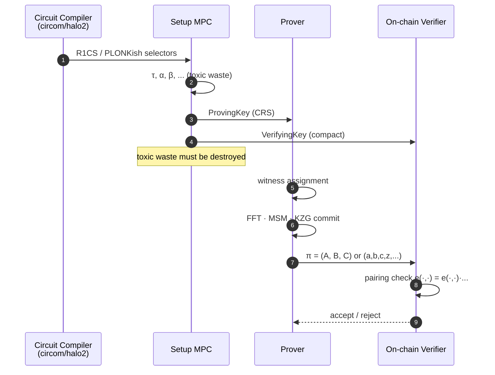
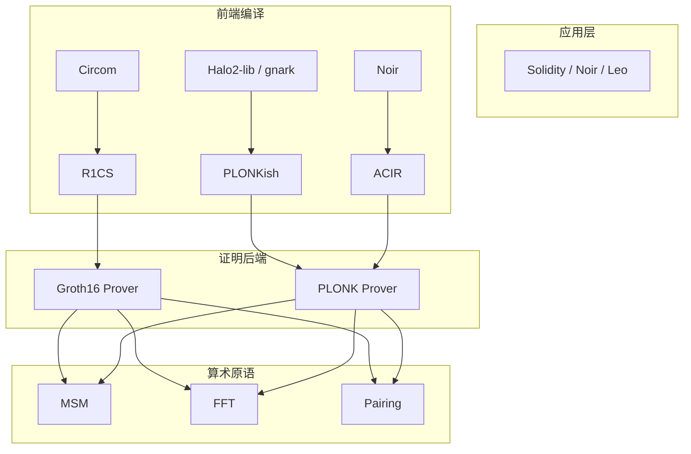

# zk-SNARK 深入：Groth16 · PLONK · Marlin

> **TL;DR**：zk-SNARK（Succinct Non-interactive Argument of Knowledge）是 Web3 中 **最主流** 的证明族：证明 200–1000 字节、验证 ~3 次 pairing、可上链。Groth16（2016）做到最短，但 per-circuit trusted setup 难升级；PLONK（2019）用 universal + updatable setup + PLONKish 算术化让一次 ceremony 通吃所有电路；Marlin（2019）在 PLONK 之前同期给出 universal 方案，适合小电路。本篇从 QAP → pairing → trusted setup → universal setup 一路推导，附 arkworks/gnark/barretenberg 的实现指针。

## 1. 背景与动机

### 1.1 从 IZK 到 SNARK

Fiat-Shamir 让 Sigma 协议去交互，但**证明长度仍然正比于 witness**——对一个 10 万门的电路，Schnorr 风格的证明要数 MB。2012 年 Bitansky、Chiesa、Canetti 等人形式化了 **SNARG / SNARK** 概念：证明长度 polylog(|C|)、验证常数时间。2013 年 Pinocchio（Parno-Howell-Gentry-Raykova）给出首个实用 SNARK，引入 **QAP**（Quadratic Arithmetic Programs）算术化。

2014 年 Zcash Sprout 把 Pinocchio 投入生产。2016 年 Groth 在论文《On the Size of Pairing-based Non-interactive Arguments》给出当时最短的 SNARK——3 个群元素、200 字节，这就是沿用至今的 **Groth16**。

### 1.2 Groth16 的不足

Groth16 每个电路要做一次 trusted setup（称 "ceremony"），CRS ~几百 MB，不能升级。Zcash Sapling 升级电路时不得不重做整个 MPC ceremony（2018 年花费数周）。PLONK/Marlin/SONIC（2019）解决了两个痛点：

- **Universal**：一次 setup 支持所有 $\leq$ 某 degree 的电路。
- **Updatable**：任何人可以接力添加随机性，只要有一方诚实即安全。

自 PLONK 起，主流 L2（zkSync Era、Scroll、Linea、Polygon zkEVM、Aztec）都转向 universal SNARK。

## 2. 核心原理（深度要求：≥1500 字）

### 2.1 关系形式化：R1CS 与 QAP

一个 NP 语句 $(x, w) \in \mathcal{R}$ 被编译为 R1CS：

$$
(A \vec{z}) \circ (B \vec{z}) = (C \vec{z})
$$

其中 $\vec{z} = (1, \vec{x}, \vec{w})$，$A, B, C \in \mathbb{F}^{m \times n}$ 是稀疏约束矩阵，$\circ$ 是 Hadamard 积。$m$ 是约束数，$n$ 是变量数。

把 R1CS 映射到多项式：选择 domain $H = \{\omega^0, \omega^1, \ldots, \omega^{m-1}\}$（$m$ 次单位根），定义 **Lagrange 插值** 多项式 $A_i(X), B_i(X), C_i(X)$ 使得 $A_i(\omega^j) = A_{ji}$。令

$$
A(X) = \sum_i z_i A_i(X),\quad B(X) = \sum_i z_i B_i(X),\quad C(X) = \sum_i z_i C_i(X)
$$

则 R1CS 可满足 $\iff$ $\forall j \in [m], A(\omega^j) \cdot B(\omega^j) = C(\omega^j)$ $\iff$ **vanishing polynomial** $Z(X) = \prod (X - \omega^j)$ 整除 $A(X) B(X) - C(X)$，即存在 $H(X)$ 使

$$
A(X) B(X) - C(X) = H(X) \cdot Z(X)
$$

这就是 **QAP**。SNARK 要证的正是"我知道 $\vec{w}$ 使得上式成立"。

### 2.2 Groth16 的 pairing 实例化

利用 Type-3 pairing $e : G_1 \times G_2 \to G_T$，Groth16 的 CRS（trusted setup）包含：

$$
\{[\tau^i]_1, [\tau^i]_2, [\alpha \tau^i]_1, [\beta \tau^i]_1, [\beta \tau^i]_2\}_{i=0}^{d-1}
$$

还有与电路相关的 `L_query`、`H_query` 等。Prover 通过 witness 线性组合计算三个群元素：

$$
\pi_A = [\alpha + A(\tau) + r \delta]_1,\quad \pi_B = [\beta + B(\tau) + s \delta]_2,\quad \pi_C = \left[\frac{\text{proof terms} + AS + rB - rs\delta}{\delta}\right]_1
$$

Verifier 检查一个 pairing 等式：

$$
e(\pi_A, \pi_B) = e([\alpha]_1, [\beta]_2) \cdot e(\sum a_i \cdot [\psi_i(\tau)/\gamma]_1, [\gamma]_2) \cdot e(\pi_C, [\delta]_2)
$$

本质：通过 pairing 把 $A(\tau) \cdot B(\tau) - C(\tau) = H(\tau) Z(\tau)$ 转移到群上，$\tau$ 是 trusted setup 生成的"未知随机值"（toxic waste）。**$\alpha, \beta, \gamma, \delta$** 是 knowledge-of-exponent 的"守卫"，强制 Prover 只能用 CRS 元素线性组合。

**安全性**（Thm 1 in Groth16）：在 AGM（Algebraic Group Model）+ q-DLOG 假设下，Groth16 是 sound argument of knowledge。

### 2.3 PLONK：universal setup + PLONKish 算术化

PLONK（Gabizon-Williamson-Ciobotaru 2019）做了两个关键升级：

**(a) 算术化升级：PLONKish gate**

每一行是一个 custom gate：

$$
q_L(X) a(X) + q_R(X) b(X) + q_M(X) a(X) b(X) + q_O(X) c(X) + q_C(X) = 0
$$

$q_*$ 是 selector 多项式（与电路绑定，setup 一次性计算）；$a, b, c$ 是 witness 列。一条约束能同时表达加法、乘法、常量、甚至通过 selector 开关选择。

**(b) 线连接：Permutation Argument（copy constraint）**

要求同一变量在不同行的取值相等，用置换多项式验证 $\prod \frac{a_i + \beta \cdot \sigma_1(i) + \gamma}{a_i + \beta \cdot i + \gamma} = 1$。本质是证明两个多重集相等。

PLONK setup 只依赖 $\{[\tau^i]_1, [\tau^i]_2\}_{i \leq d}$——即 Ethereum KZG Ceremony 产物（也用于 EIP-4844）。任何满足 $|C| \leq d$ 的电路都能复用。

Prover 通过 KZG 承诺 $a(X), b(X), c(X), z(X)$，Verifier 用 KZG opening + pairing 等式检查。证明 ~400 字节，验证 5 次 pairing。

### 2.4 Marlin：R1CS-to-Universal

Marlin（Chiesa-Hu-Maller-Mishra-Vesely-Ward 2019）保留 R1CS 算术化，但通过 "holographic" 技巧实现 universal setup。核心思想：setup 只发布 KZG 通用承诺；对每个电路，Verifier 能高效验证"它的 index (A,B,C) 是否合法"。Marlin 证明 ~900 字节，被 Aleo 用作核心。

### 2.5 子机制拆解

| 子机制 | Groth16 | PLONK | Marlin |
| --- | --- | --- | --- |
| 算术化 | R1CS → QAP | PLONKish | R1CS |
| 承诺方案 | KZG-like（内置在 CRS） | KZG | KZG |
| 约束验证 | 单个 pairing 等式 | Grand product argument | Holographic lincheck |
| Setup | per-circuit | universal + updatable | universal + updatable |
| 证明大小 | 3 群元素 (~200B) | ~400B | ~900B |
| Prover 时间 | $O(n \log n)$ | $O(n \log n)$ | $O(n \log n)$ |

### 2.6 参数与曲线选择

| 参数 | 典型值 | 说明 |
| --- | --- | --- |
| 曲线 | BN254 (alt-bn128), BLS12-381, BW6-761 | EVM precompile (EIP-196/197) 只支持 BN254，L2 倾向 BLS12-381 |
| 域 | $\|\mathbb{F}_r\|$ ~254/255 bit | FFT friendly 要求 $2^k \| r - 1$ |
| 最大 degree $d$ | $2^{26} \sim 2^{28}$ | 受 ceremony 产物限制 |
| Security | 128-bit | BN254 实际 ~100-bit post-exTNFS |

### 2.7 交互流程图



### 2.8 边界条件与失败模式

- **Toxic waste 泄露**：任何参与 MPC 的一方保留 $\tau$ 即可伪造任意证明。Zcash Sapling MPC 60+ 参与者，仅需 1 人诚实即可。
- **BN254 安全降级**：Kim-Barbulescu 2016 exTNFS 攻击将 BN254 从 128-bit 降到 ~100-bit，L2 普遍迁移至 BLS12-381 或 BN254 升级曲线。
- **Verifier contract bug**：Solidity verifier 生成逻辑历史上出过编码错误（eg. 2019 aztec 的 public input hash）。

## 3. 架构剖析（深度要求：≥1200 字）

### 3.1 分层视图



### 3.2 核心模块清单

| 模块 | 职责 | 依赖 | 代表实现 | 可替换性 |
| --- | --- | --- | --- | --- |
| Circuit frontend | DSL → 约束 | 编译器 | circom, halo2-lib, gnark DSL | 高 |
| Constraint system | R1CS/PLONKish IR | — | bellperson, arkworks-relations | 中 |
| Trusted setup | 生成 CRS / KZG SRS | MPC + RNG | snarkjs powersoftau, KZG Ceremony | 一次性 |
| Prover core | 生成证明 | FFT, MSM, Pairing | rapidsnark, gnark, barretenberg | 中 |
| Verifier 合约 | 链上验证 | EVM precompile | solidity-verifier.sol | 低 |
| Aggregator | 多证明聚合 | recursion | snarkpack, halo2 accumulator | 高 |

### 3.3 端到端生命周期（PLONK）

```
1. 开发者写 circuit.noir
2. nargo compile → ACIR → PLONKish
3. 本地 prover（barretenberg）生成 π
4. π + public input 提交到 verifier 合约
5. 合约调用 BN254 pairing precompile（EIP-197）
6. 返回 0/1
```

关键耗时（BN254，AWS r7i.24xlarge）：

| 阶段 | 1M gate | 10M gate |
| --- | --- | --- |
| Witness gen | 0.5 s | 5 s |
| FFT | 2 s | 22 s |
| MSM | 8 s | 85 s |
| Total Prover | ~12 s | ~120 s |
| Verifier | ~3 ms | ~3 ms |

MSM 是瓶颈，硬件方案（ICICLE GPU、Cysic FPGA）可加速 5–10 倍。

### 3.4 参考实现

- **arkworks-rs/groth16**（Rust）：学术最完整实现。
- **iden3/snarkjs**（JS）：Circom 生态主力。
- **ConsenSys/gnark**（Go）：PLONK + Groth16，生产级。
- **AztecProtocol/barretenberg**（C++）：UltraPLONK，Noir 默认后端。
- **matter-labs/bellman**（Rust）：早期 Zcash/zkSync。

### 3.5 扩展接口

- **EVM Precompile**：EIP-196 (BN254 add/mul)、EIP-197 (BN254 pairing)、EIP-2537 (BLS12-381)。
- **Proof Aggregation**：SnarkPack (2021)、Nova+PLONK wrap。
- **Recursion**：Halo2 把 PLONK Verifier 本身写成电路。

## 4. 关键代码 / 实现细节

`ConsenSys/gnark`（tag `v0.10.0`，`std/groth16_bn254/verifier.go`）展示 Verifier 核心：

```go
// gnark/backend/groth16/bn254/verify.go（简化）
func Verify(proof *Proof, vk *VerifyingKey, publicWitness []fr.Element) error {
    // 1) 计算 vk_x = sum_i a_i * gamma_abc_i
    var vkX bn254.G1Affine
    if _, err := vkX.MultiExp(vk.G1.K, publicWitness); err != nil {
        return err
    }

    // 2) 多重 pairing 检查：
    //    e(A, B) · e(-vkX, gamma) · e(-C, delta) · e(-alpha, beta) = 1
    result, err := bn254.PairingCheck(
        []bn254.G1Affine{proof.Ar, vkX.Neg(&vkX), proof.Krs.Neg(&proof.Krs), vk.G1.Alpha.Neg(&vk.G1.Alpha)},
        []bn254.G2Affine{proof.Bs, vk.G2.Gamma,           vk.G2.Delta,               vk.G2.Beta},
    )
    if !result { return ErrInvalidProof }
    return nil
}
```

PLONK prover 核心（`gnark/backend/plonk/bn254/prove.go`，简化）：

```go
// 1. 承诺 (a, b, c) witness 多项式
commit(a, b, c)
// 2. challenge beta, gamma
beta, gamma := FS.Challenge(), FS.Challenge()
// 3. 构造 z(X) 累积 permutation product
z := buildGrandProduct(a, b, c, beta, gamma)
commit(z)
// 4. challenge alpha
alpha := FS.Challenge()
// 5. 线性化多项式 L(X) = gate_constraint + alpha*perm_constraint
L := linearize(a, b, c, z, alpha)
commit(t := L / Z_H)   // quotient
// 6. challenge zeta
zeta := FS.Challenge()
// 7. opening：KZG batch open at zeta
pi := KZG_BatchOpen({a,b,c,z,t,...}, zeta)
```

## 5. 演进与版本对比

| 系统 | 年份 | Setup | 证明 | Verifier | 备注 |
| --- | --- | --- | --- | --- | --- |
| Pinocchio | 2013 | per-circuit | 8 G1 | 12 pairings | 首个 SNARK |
| Groth16 | 2016 | per-circuit | 2 G1 + 1 G2 | 3 pairings | 最短证明 |
| SONIC | 2019 | universal | 20 G1 | 13 pairings | 首个 universal |
| PLONK | 2019 | universal | 7 G1 + 7 fr | 2 pairings | SONIC 简化 |
| Marlin | 2019 | universal | ~900 B | AHP check | R1CS-native |
| UltraPLONK | 2020 | universal | +lookups | — | barretenberg 默认 |
| PLONKup | 2022 | universal | +lookups | — | gnark 默认 |

## 6. 实战示例

用 gnark 在 Go 里证明 Merkle 成员资格：

```go
package main

import (
    "github.com/consensys/gnark-crypto/ecc"
    "github.com/consensys/gnark/backend/groth16"
    "github.com/consensys/gnark/frontend"
    "github.com/consensys/gnark/frontend/cs/r1cs"
    "github.com/consensys/gnark/std/accumulator/merkle"
)

type Circuit struct {
    Leaf frontend.Variable `gnark:",secret"`
    Path [32]frontend.Variable `gnark:",secret"`
    Root frontend.Variable `gnark:",public"`
}

func (c *Circuit) Define(api frontend.API) error {
    mp := merkle.MerkleProof{ RootHash: c.Root, Path: c.Path[:] }
    mp.VerifyProof(api, &merkle.MiMCHasher{Api: api}, c.Leaf)
    return nil
}

func main() {
    var circuit Circuit
    ccs, _ := frontend.Compile(ecc.BN254.ScalarField(), r1cs.NewBuilder, &circuit)
    pk, vk, _ := groth16.Setup(ccs)
    // prove / verify omitted
    _ = pk; _ = vk
}
```

## 7. 安全与已知攻击

- **Trusted Setup 泄露**：Zcash Sprout 早期仅 6 人 MPC；Sapling 60+ 人；KZG Ceremony（ETH）140k+ 参与者，是目前最大的 MPC。
- **Frozen Heart (CVE-2022-40195)**：PlonK/Bulletproofs Fiat-Shamir 实现缺字段。
- **Aurora bug**：Groth16 prover 若 witness 未做 field reduction 会产生伪证。
- **Malleability**：Groth16 proof 天然 malleable（$(A, B, C) \to (A + d\delta, B, C - dA)$），NIZK 合约需要绑定 nonce。

## 8. 与同类方案对比

| 维度 | Groth16 | PLONK | Marlin | STARK |
| --- | --- | --- | --- | --- |
| Setup | per-circuit | universal | universal | transparent |
| 证明大小 | ~200 B | ~400 B | ~900 B | 50–200 KB |
| Verifier | 3 pairings | 2-5 pairings | 4-8 pairings | O(log² n) hashes |
| Prover 时间 | 最快（电路小时） | 稍慢（+lookups） | 稍慢 | 最慢 |
| 抗量子 | 否 | 否 | 否 | 是 |
| EVM gas | ~250K | ~350K | ~400K | ~500K+ |

## 9. 延伸阅读

- **论文**：Groth16、PLONK、Marlin、Pinocchio/GGPR13、KZG10、Plonk-Up、Plookup。
- **博客**：Vitalik《QAP from Zero to Hero》、Dan Boneh 的 Stanford ZK 课件、Matter Labs PLONK 实现博客。
- **代码**：`arkworks-rs/groth16`、`iden3/snarkjs`、`AztecProtocol/barretenberg`、`ConsenSys/gnark`。
- **Ceremony**：`ethereum/kzg-ceremony`、`zcash/powersoftau`。
- **Spec**：EIP-196、EIP-197、EIP-2537、EIP-4844。

## 10. 术语表

| 术语 | 英文 | 释义 |
| --- | --- | --- |
| SNARK | Succinct NIARK | 简洁非交互知识论证 |
| QAP | Quadratic Arithmetic Program | R1CS 的多项式化 |
| R1CS | Rank-1 Constraint System | $(Az)(Bz) = Cz$ |
| KZG | Kate-Zaverucha-Goldberg | 配对多项式承诺 |
| CRS | Common Reference String | trusted setup 输出 |
| Toxic Waste | Toxic Waste | 必须销毁的随机数 $\tau$ |
| Pairing | Bilinear Pairing | $e: G_1 \times G_2 \to G_T$ |
| Universal Setup | Universal SRS | 一次 setup 通用 |
| Updatable Setup | Updatable SRS | 可追加参与者 |
| Permutation Argument | Permutation Argument | PLONK 线连接证明 |

---

*Last verified: 2026-04-22*
