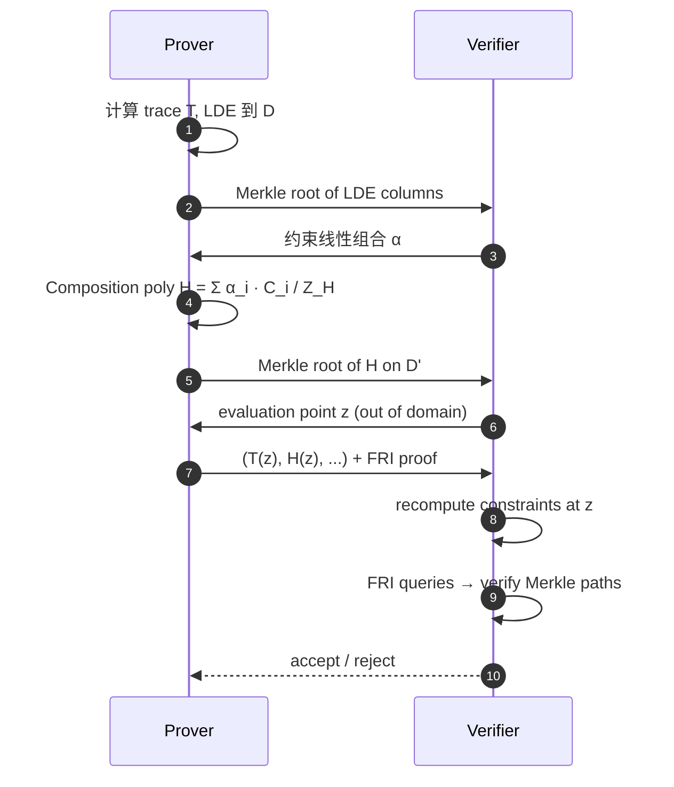
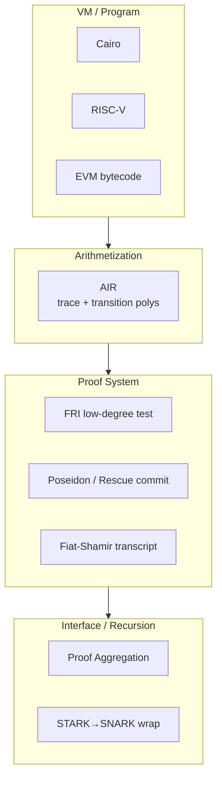

# ZK-STARK：FRI、AIR、Reed-Solomon 与透明无 Setup 证明

> **TL;DR**：STARK（Scalable Transparent ARgument of Knowledge）由 Ben-Sasson 等 2018 年提出，是唯一达到 **transparent（无 trusted setup）+ post-quantum + 可扩展到海量计算** 三者并存的证明族。核心机制是 **FRI（Fast Reed-Solomon IOP of Proximity）**——把"多项式有界度"问题通过递归折叠归约到常数规模。代价是证明大（50–200 KB）、Verifier ~O(log² n) 次哈希。在 L2 领域，StarkNet（Cairo）、Polygon zkEVM Plonky2 后端、RiscZero 都以 STARK 为底。

## 1. 背景与动机

### 1.1 SNARK 的三个痛点

- **Trusted setup**：toxic waste 风险，升级难。
- **椭圆曲线量子破解**：Shor 算法对 pairing-friendly 曲线有效，2030s 后存在威胁。
- **大电路 prover 成本**：MSM 主导，难以线性扩展。

STARK 的设计目标（Ben-Sasson 2018 Thm 1.1）：证明一个 $T$ 步计算可在 $\tilde{O}(T)$ prover 时间、$\text{polylog}(T)$ verifier 时间、无可信 setup、仅依赖抗碰撞哈希的前提下完成。

### 1.2 Web3 场景

- **StarkNet**：以 Cairo 为 VM，用 Stone Prover 生成 STARK。
- **Polygon zkEVM**：后端 Plonky2 = PLONK 前端 + FRI 后端，兼得小证明（~45 KB）和无 setup。
- **RISC Zero**：RISC-V zkVM，Plonky2 + FRI。
- **Miden VM**：Facebook 出身、STARK-based VM。

## 2. 核心原理（深度要求：≥1500 字）

### 2.1 形式化：执行轨迹与 AIR

**AIR（Algebraic Intermediate Representation）**：将一次计算表示为**轨迹表** $T$（$n$ 行 $\times w$ 列），加上两类约束：

- **Boundary constraint**：$T[0][j] = v_0$、$T[n-1][j] = v_f$。
- **Transition constraint**：多项式 $P(T[i], T[i+1]) = 0$ 对每对相邻行成立。

**形式化关系**：
$$
\mathcal{R}_{\text{AIR}} = \{(x, w) : x = (\text{AIR}, I, O),\ w = T,\ \forall i: C_{\text{tr}}(T[i], T[i+1]) = 0,\ \text{boundary}(T) = (I, O)\}
$$

**STARK 协议目标**：证明 $\exists T$ 满足上述约束，$T$ 作为 witness 不透露。

### 2.2 Reed-Solomon 编码与低度测试

对 trace 每列 $T[\cdot][j]$ 视为 $\mathbb{F}$ 上的函数 $f : D_0 \to \mathbb{F}$，其中 $|D_0| = n$，$f$ 在 $D_0$ 上的值即 trace。Prover 把 $f$ 插值为多项式 $\hat{f}$，然后在扩张域 $D$（$|D| = \rho^{-1} \cdot n$，$\rho$ 是 rate，典型 $\rho = 1/8$）上 **低度扩张（Low-Degree Extension, LDE）**。这是 Reed-Solomon 编码：把 $n$ 个点插值到 $\rho^{-1} n$ 个点。

关键性质：若 $\hat{f}$ 真的是 degree $< n$ 多项式，则 RS 码字与任意非码字的 Hamming 距离 $\geq (1 - n/|D|) |D| = (1 - \rho) |D|$。Prover 作弊即等价于提交一个"离码字远"的函数，Verifier 可通过抽样检测。

### 2.3 FRI：递归折叠证低度

**FRI** 协议证明 $f : D \to \mathbb{F}$ 与 degree $< d$ 多项式的 Reed-Solomon 码"接近"。

**folding step**：把 $f(X)$ 拆成偶次项与奇次项 $f(X) = f_e(X^2) + X \cdot f_o(X^2)$。Verifier 发送挑战 $\alpha$，Prover 承诺 $f^{(1)}(Y) = f_e(Y) + \alpha f_o(Y)$，domain 减半，degree 减半。重复 $\log d$ 次直到常数多项式。

**查询阶段**：Verifier 随机抽样 $s$ 个位置，Prover 给出 Merkle path 证明每一折的点一致性（$f^{(i+1)}(y) = \frac{f^{(i)}(x) + f^{(i)}(-x)}{2} + \alpha \cdot \frac{f^{(i)}(x) - f^{(i)}(-x)}{2x}$，其中 $y = x^2$）。

**Soundness**：STARK 论文 Thm 4.2，FRI 在 unique-decoding 半径内 soundness error $\leq (1/\rho + \text{negl})^s$。为达 128-bit 安全，典型 $s = 30$–$80$ 次查询。DEEP-FRI（2019）改进到 list-decoding 半径，降低查询次数。

### 2.4 完整 STARK 协议



关键步骤：
1. **Arithmetization**：程序 → trace + AIR。
2. **LDE + Commit**：trace 低度扩张，Merkle 承诺。
3. **Constraint Composition**：$H(X) = \sum_i \alpha_i C_i(X) / Z(X)$。
4. **DEEP Query**：求 $T, H$ 在域外 $z$ 的值并验证代数关系。
5. **FRI**：证明 $T, H$ 是低度的。
6. **Fiat-Shamir**：所有挑战由 transcript hash 导出。

### 2.5 子机制拆解

| 子机制 | 作用 | 关键参数 |
| --- | --- | --- |
| AIR | 把计算变约束 | trace width $w$、 height $n$、degree bound $d$ |
| LDE | 把 trace 码字化 | blowup $\rho^{-1}$，常用 4/8/16 |
| Merkle 承诺 | commit 到 column | hash = Poseidon / Rescue / Keccak |
| DEEP Method | 域外采样减查询数 | 1 个 OOD point |
| FRI | 低度证明 | folding factor $k$，查询数 $s$ |
| Fiat-Shamir | 去交互 | 用 Poseidon 支持电路化 |

### 2.6 参数与取舍

| 参数 | 典型值 | 影响 |
| --- | --- | --- |
| 域 $\mathbb{F}$ | Goldilocks $2^{64}-2^{32}+1$, Mersenne31 $2^{31}-1$, BabyBear $2^{31} - 2^{27}+1$ | 影响 FFT 速度、CPU 原生算力 |
| Blowup $\rho^{-1}$ | 4–16 | 越大证明越小但 prover 越慢 |
| FRI folding $k$ | 2, 4, 8 | 大 $k$ 减少轮数但增加每轮哈希 |
| 查询数 $s$ | 30–100 | 决定 soundness |
| Hash | Poseidon/Rescue/Monolith | 电路 friendly，但实现要小心对撞攻击 |

Goldilocks 域的优势：64-bit 整数原生乘法 + 高 2-adicity $2^{32} | p-1$，非常适合递归 STARK（Plonky2 的设计核心）。

### 2.7 边界条件与失败模式

- **Small field + 低度扩张过小**：soundness gap 会坍塌。需满足 $\rho \leq$ 1/(2×blowup) 近似。
- **Hash collision**：Poseidon round constants 若有弱密钥可伪造 Merkle path。
- **Prover OOM**：1B 步计算需要 ~30 GB RAM（多列 LDE）。

## 3. 架构剖析（深度要求：≥1200 字）

### 3.1 分层视图



### 3.2 核心模块清单

| 模块 | 职责 | 依赖 | 代表实现 | 可替换性 |
| --- | --- | --- | --- | --- |
| AIR DSL | 定义约束 | — | Cairo-lang, Miden assembly | 中 |
| Trace builder | 执行 VM 生成 trace | VM | cairo-run, miden-vm | 低 |
| LDE/FFT engine | 码字化 | FFT 库 | winter-fri, plonky2 | 中 |
| FRI prover | 低度证明 | Merkle + hash | stone-prover, plonky2/fri | 中 |
| Hasher | Merkle + FS | Poseidon/Rescue | winter-crypto | 高（需对 recursion 优化） |
| Verifier | 验证 | hash + field ops | Solidity STARK verifier, Cairo verifier | 低 |

### 3.3 生命周期（StarkNet）

```
1. Cairo 程序 → Cairo 编译器 → bytecode + public input
2. cairo-run 执行，生成 trace CSV
3. stone-prover 读 trace → LDE → FRI → proof.bin（100–300 KB）
4. SHARP 聚合多个 proof（Cairo verifier 本身是 Cairo 程序）
5. 聚合后用 Groth16 wrap → 几百字节 submit 到 L1 Ethereum
6. L1 verifier.sol 验证 pairing，更新 state root
```

### 3.4 参考实现

- **stone-prover**（C++）：StarkWare 开源，StarkNet 生产用。
- **winterfell**（Rust）：Novi/Facebook 出品，AIR 通用。
- **plonky2**（Rust）：Polygon Zero，Goldilocks + PLONK-on-FRI，可递归。
- **plonky3**（Rust）：前者的模块化重写，支持多域。
- **risc0-zkvm**（Rust）：基于 Plonky2 的 RISC-V zkVM。

### 3.5 扩展接口

- **Recursion**：Plonky2 电路化自己 Verifier，毫秒级递归。
- **STARK→SNARK wrap**：用 Groth16/PLONK 包一层压缩尺寸（StarkNet 最终提交）。
- **Shared Prover Network**：SHARP（Shared Prover）聚合多 dApp。

## 4. 关键代码 / 实现细节

`0xPolygonZero/plonky2`（tag `v0.2.0`，`plonky2/src/fri/prover.rs:L50-L120`）：

```rust
// plonky2/src/fri/prover.rs（简化）
pub fn fri_proof<F: RichField + Extendable<D>, const D: usize>(
    initial_merkle_trees: &[&MerkleTree<F>],
    lde_polynomial_coeffs: PolynomialCoeffs<F::Extension>,
    challenger: &mut Challenger<F, H>,
    fri_params: &FriParams,
) -> FriProof<F, H, D> {
    // 1. Commit phase: 折叠 log2(d) 次
    let mut values = lde_polynomial_coeffs.coset_fft(...);
    let mut trees = Vec::new();
    for arity_bits in &fri_params.reduction_arity_bits {
        let arity = 1 << arity_bits;
        let tree = MerkleTree::new(values.chunks(arity).collect(), fri_params.cap_height);
        challenger.observe_cap(&tree.cap);
        let beta = challenger.get_extension_challenge::<D>();
        values = fold(&values, arity, beta);   // f^{(i+1)}(y) = Σ β^j * f^{(i)}(ω_j * x)
        trees.push(tree);
    }
    // 2. Query phase: s 次随机采样
    let num_queries = fri_params.config.num_query_rounds;
    let query_indices = challenger.get_n_challenges_as_usize(num_queries);
    let query_rounds = query_indices.iter()
        .map(|&idx| FriQueryRound::open(idx, initial_merkle_trees, &trees))
        .collect();
    FriProof { commit_phase_merkle_caps, query_round_proofs: query_rounds, final_poly: values.into(), pow_witness }
}
```

注意 Plonky2 用 **Goldilocks**（$p = 2^{64} - 2^{32} + 1$）+ **D=2 扩域** 达到 128-bit 安全；**Poseidon hash** 在电路中 ~100 gates/round 极其高效。

## 5. 演进与版本对比

| 版本 | 年份 | 创新 | 应用 |
| --- | --- | --- | --- |
| IOP + FRI | 2017 | 低度证明 | 理论 |
| STARK (Ben-Sasson) | 2018 | 首个端到端透明 SNARK | StarkWare |
| DEEP-FRI | 2019 | list decoding 半径 | 降低查询数 |
| Plonky2 | 2022 | FRI over Goldilocks + 递归 | Polygon Zero |
| ethSTARK | 2022 | 详细参数与实现规范 | StarkWare 公开 |
| Plonky3 | 2023 | 多域模块化 + Mersenne31 | 通用框架 |
| Circle STARKs | 2024 | 在 Circle group 上 STARK | Mersenne31 支持 FFT |

## 6. 实战示例

Cairo 程序 + starknet-devnet：

```cairo
%builtins output
func main{output_ptr: felt*}() {
    let fib = fibonacci(100);
    assert [output_ptr] = fib;
    let output_ptr = output_ptr + 1;
    return ();
}
func fibonacci(n: felt) -> felt {
    if (n == 0) { return 0; }
    if (n == 1) { return 1; }
    return fibonacci(n - 1) + fibonacci(n - 2);
}
```

```bash
cairo-compile fib.cairo --output fib.json
cairo-run --program=fib.json --layout=small --proof_mode \
          --trace_file=trace.bin --memory_file=mem.bin
stone-prover --parameter_file=params.json \
             --private_input_file=private.json \
             --public_input_file=public.json \
             --out_file=proof.bin
# verifier:
stone-verifier --proof_file=proof.bin --public_input_file=public.json
```

## 7. 安全与已知攻击

- **FRI soundness gap**：StarkWare 2020 发现 ethSTARK V1 参数计算错误，实际安全位数低于宣称；V2 已修正（参见 eprint 2023/017）。
- **Poseidon 差分**：Grassi-Khovratovich 2020 对早期 Poseidon 参数发现差分攻击，现行参数（Poseidon2）免疫。
- **Transcript malleation**：多个 STARK 实现 Fiat-Shamir 未绑定全 transcript 早期被发现并修复。
- **OOD 位置碰撞**：DEEP 方法要求 $z \notin D$，若 Fiat-Shamir 产出落入 $D$ 需重采样，否则 soundness 降低。

## 8. 与同类方案对比

| 维度 | STARK | Groth16 | PLONK | Bulletproofs |
| --- | --- | --- | --- | --- |
| Setup | 透明 | trusted per-circuit | trusted universal | 透明 |
| 抗量子 | 是 | 否 | 否 | 否 |
| 证明 | 50–200 KB | 200 B | 400 B | O(log n) |
| Verifier | O(log² n) | O(1) pairings | O(1) pairings | O(n) |
| Prover | 最慢 | 快 | 中 | 中 |
| Hash-only | 是 | 否 | 否 | 否 |
| EVM gas | ~500K–2M | 250K | 350K | 5M+ |

## 9. 延伸阅读

- **论文**：Ben-Sasson 2018（STARK）、FRI 2017、DEEP-FRI 2019、ethSTARK V2 (2023/017)、Plonky2 paper、Circle STARKs 2024。
- **课程**：StarkWare STARK-101、0xPARC Halo2-Plonky2 bootcamp。
- **博客**：Vitalik《STARKs Part I-III》、Alex Gluchowski《Awesome zk-STARK resources》。
- **代码**：`starkware-libs/stone-prover`、`0xPolygonZero/plonky2`、`facebook/winterfell`、`risc0/risc0`。

## 10. 术语表

| 术语 | 英文 | 释义 |
| --- | --- | --- |
| STARK | Scalable Transparent ARgument of Knowledge | 透明无 setup 的 SNARK |
| AIR | Algebraic Intermediate Representation | trace + transition 约束 |
| LDE | Low-Degree Extension | Reed-Solomon 扩张 |
| FRI | Fast Reed-Solomon IOP of Proximity | 低度测试协议 |
| Blowup | Blowup factor | LDE 扩张比 $\rho^{-1}$ |
| Rate $\rho$ | Rate | 原域 vs 扩域比例 |
| DEEP | Domain Extension for Eliminating Pretenders | 域外采样减查询 |
| Goldilocks | Goldilocks Field | $p = 2^{64}-2^{32}+1$ |
| Mersenne31 | Mersenne Prime 31 | $p = 2^{31}-1$ |
| Poseidon | Poseidon Hash | FRI friendly hash |

---

*Last verified: 2026-04-22*
