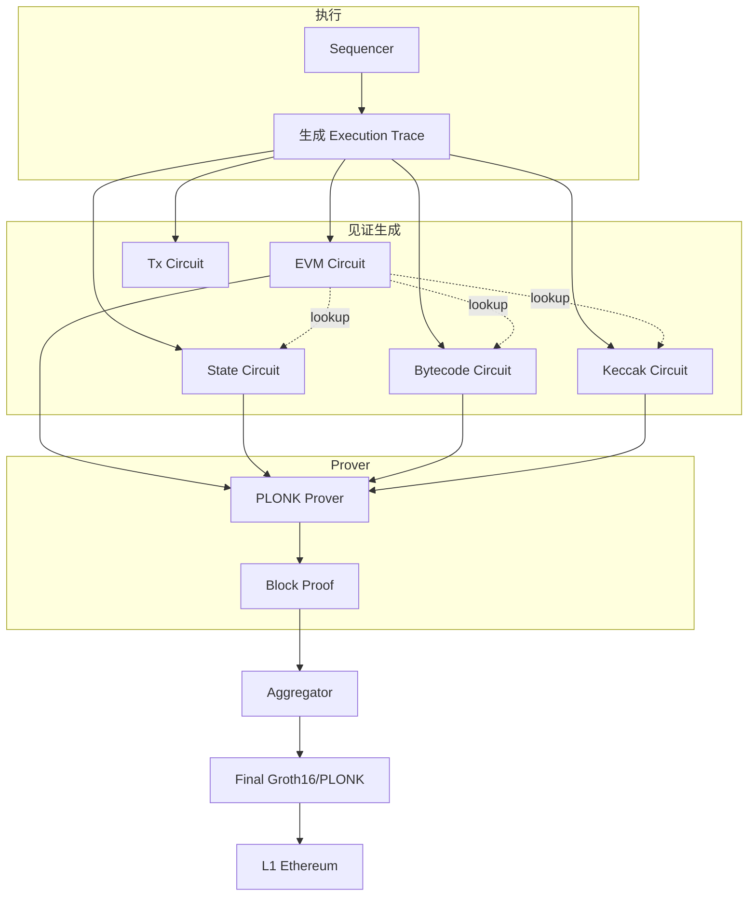
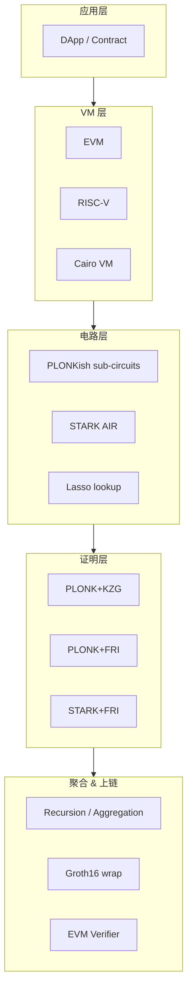

# zkVM：zkEVM Type 1-4、RISC Zero、SP1、Jolt、Cairo VM

> **TL;DR**：zkVM 是"可被证明执行"的虚拟机——用户在 VM 上跑程序，Prover 生成一张 ZK 证明使 Verifier 在不重执行的前提下相信输出正确。两大赛道：(1) **zkEVM**：证明 Ethereum EVM 字节码执行，按 Vitalik 分类 Type 1-4；(2) **通用 zkVM**：证明 RISC-V / MIPS / Cairo 等通用指令集（RISC Zero、SP1、Jolt、Nexus、Miden）。2024–2025 是 zkVM 元年——生产 rollup（Scroll、Taiko、Linea、zkSync Era）用 zkEVM，链下协处理器（Bonsai、Succinct Network）用通用 zkVM。本篇系统对比这两条路线。

## 1. 背景与动机

### 1.1 为什么要 VM 化

早期 ZK rollup（Zcash、zkSync Lite、Loopring、StarkEx）让开发者**写电路**：Solidity → Circom → R1CS，门槛极高。Uniswap 迁移需要工程师 6 个月。zkEVM 承诺"写 Solidity = 写 ZK 合约"——开发者无需理解 ZK，Prover 自动生成证明。

通用 zkVM 更进一步：**任何 Rust / Go / C 程序都可产生证明**，应用场景从 rollup 扩展到：
- **ZK Coprocessor**：Axiom、Brevis 做链上历史查询证明。
- **ZK Oracle**：证明链下 API / 数据的完整性。
- **ZK Bridge**：证明 light client 更新。
- **ZK ML**：证明模型推理。

### 1.2 Vitalik 的 zkEVM 分类（2022-08）

| Type | 兼容等级 | Prover 成本 | 代表 |
| --- | --- | --- | --- |
| Type 1 | 完全等价 EVM | 最慢 | Taiko、原 Hermez |
| Type 2 | 等价 EVM（小修改） | 慢 | Scroll |
| Type 2.5 | 等价 EVM + gas 调整 | 中 | Linea |
| Type 3 | 几乎等价 EVM | 快 | 旧 Polygon zkEVM |
| Type 4 | 编译 Solidity 到 ZK-friendly 字节码 | 最快 | zkSync Era, Starknet Solidity 编译器 |

Type 越高数字越接近 EVM，但牺牲 Prover 性能。2025 年硬件进步让 Type 1/2 可用；Type 3/4 通常用于需要高吞吐的场景。

## 2. 核心原理（深度要求：≥1500 字）

### 2.1 形式化：VM 证明的关系

一个 zkVM 证明的关系：
$$
\mathcal{R}_{\text{VM}} = \{(x, w) : x = (\text{ELF}, \text{input}, \text{output}),\ w = \text{execution trace},\ \text{VM}(\text{ELF}, \text{input}) = \text{output}\ \text{via trace}\}
$$

具体而言，执行轨迹 $T = (s_0, s_1, \ldots, s_n)$，每 $s_i$ 是 VM 状态（PC、寄存器、内存、调用栈）。约束分为：

1. **Boundary**：$s_0 = (\text{entry PC}, \text{init regs})$；$s_n$ 含 $\text{output}$。
2. **Transition**：$s_{i+1} = \delta(s_i, \text{prog}[s_i.\text{PC}])$，即 opcode 分派函数。
3. **Memory consistency**：读的值等于最后一次写。
4. **Program integrity**：指令读自 ELF 二进制哈希。

这是一个**非一致 AIR**——每种 opcode 都有自己的 transition 约束。要么用**巨大 selector 多项式**（所有 opcode 或运算都编码进一个大约束），要么用 **lookup**（预置表）或 **SuperNova**（每 opcode 一个子 AIR）。

### 2.2 zkEVM 的电路化手法

**Scroll / Polygon zkEVM / Linea 路线**：PLONKish + 多个"sub-circuit"（EVM Circuit、State Circuit、Tx Circuit、Bytecode Circuit、MPT Circuit、Keccak Circuit…），通过 **lookup** 互相连接。每个 sub-circuit 负责 EVM 某一层：

| Sub-circuit | 职责 |
| --- | --- |
| EVM Circuit | opcode dispatch 与算术 |
| State Circuit | SLOAD/SSTORE、读写一致性 |
| Tx Circuit | 交易签名验证 |
| Bytecode Circuit | 校验 code 对 keccak hash 一致 |
| MPT Circuit | Merkle Patricia Trie 证明 |
| Keccak Circuit | Keccak256 计算 |
| EcRecover Circuit | secp256k1 签名恢复 |

### 2.3 通用 zkVM 的 RISC-V 路线

**RISC Zero**：把 RISC-V RV32IM 的每条指令（40+ 种）编码为 STARK AIR。Rust 程序 → RV32IM ELF → zkVM 运行 → Plonky2 + FRI 证明。优势：成熟的编译器生态（rustc、go、C via wasm→rv32im）。

**SP1（Succinct Labs）**：类似 RISC Zero 但采用 PLONKish + FRI；引入 **precompile** 优化（Keccak、secp256k1、BN254 等热点以定制电路实现而非纯 RV32IM，加速 10–100x）。

**Jolt（Arasu-Setty-Thaler 2023）**：全新范式——把每条 RISC-V 指令通过 **lookup argument（Lasso）** 证明，几乎所有指令都 reduce 到"查一张预计算表"。Prover 复杂度接近线性，实测比 RISC Zero 快 2–10 倍。

### 2.4 Cairo VM

StarkNet 的 Cairo（CPU Algebraic Intermediate Representation for Oblivious RAM）是**专为 STARK 设计的 VM**：
- 字长 = 素数域 $\mathbb{F}_p$（$p = 2^{251} + 17 \cdot 2^{192} + 1$）；
- 无通用寄存器，只有 AP/FP/PC 三个指针；
- 内存是**只写一次**（Write-Once Memory），天然对应 trace 列。

Cairo 的设计让 AIR 非常紧凑，Prover 性能优于把任意通用 VM 强行 arithmetize。代价是开发者必须学 Cairo 语言或用 Starknet 的 Solidity→Cairo 编译器（Kakarot / Warp）。

### 2.5 Lookup argument：zkVM 的"万能钥匙"

**Plookup（Gabizon-Williamson 2020）**：证明向量 $\vec{f}$ 的每个元素都属于表 $\vec{t}$。证明约束
$$
\prod_i (\alpha + f_i) \cdot \prod_j (\alpha + t_j)^{m_j} = \prod_j (\alpha + t_j)^{m_j + [\text{freq}_i]}
$$
对随机 $\alpha$ 成立。

**Lasso（Setty-Thaler-Wahby 2023）**：支持巨大表（$2^{128}$）通过 SOS（Sum-of-tables）分解，结合 sumcheck，验证成本 $O(\log n)$。Jolt 的核心。

**Caulk / Baloo**：KZG-based，表 $\vec{t}$ 只需 commit 一次，查询 $O(1)$。zkEVM 中预计算 Keccak/EcRecover/MPT 查询。

### 2.6 子机制拆解

1. **Instruction Decoder**：PC → opcode selector。
2. **Register/Memory File**：读写一致性约束。
3. **ALU**：算术指令的 PLONKish gate 或 lookup。
4. **Program ROM**：ELF 的 Merkle/KZG 承诺。
5. **Precompile**：Keccak、secp256k1 等定制电路。
6. **Proof System**：PLONK+KZG（zkSync Era）/ PLONK+FRI（Polygon）/ STARK+FRI（StarkNet、RISC Zero）/ Lasso-based（Jolt）。
7. **Recursion/Aggregation**：Nova/Halo2 折叠多个 block proof。

### 2.7 参数与取舍

| 参数 | zkEVM（Scroll） | RISC Zero | Jolt |
| --- | --- | --- | --- |
| ISA | EVM | RV32IM | RV32I/IM |
| Word size | 256-bit | 32-bit | 32-bit |
| Field | BN254 | Baby Bear / Goldilocks | BN254 |
| Proof size | ~50 KB → 400 B (final PLONK wrap) | ~200 KB → 200 B (Groth16 wrap) | ~100 KB |
| Prover RAM | 256+ GB for 1M gas | 32 GB for 1M cycles | 16 GB |
| Prover 吞吐 (2025 GPU) | ~10 MGas/s | ~1 MHz | ~3 MHz |

### 2.8 zkEVM 内部数据流



### 2.9 边界与失败模式

- **Memory soundness**：RAM 非原生对应 polynomial constraint，需要 **offline memory checking**（Blum 94），若实现错误可伪造读写。
- **Precompile bug**：Scroll 2024 年 testnet 发现 Keccak precompile 拼接 bug，修复后重跑 proof。
- **Prover OOM**：RV32IM 执行 1s 产生 ~10M 步；witness ~200 GB RAM，必须分段。
- **EVM 兼容性 gap**：zkSync Era（Type 4）不支持 `SELFDESTRUCT`、某些 precompile 行为不同，合约迁移时踩坑。

## 3. 架构剖析（深度要求：≥1200 字）

### 3.1 分层视图



### 3.2 核心模块清单

| 模块 | 职责 | 代表实现 | 可替换性 |
| --- | --- | --- | --- |
| VM runtime | 执行 + trace | geth, revm, cairo-run, risc0-zkvm-runtime | 中 |
| Witness builder | 各 sub-circuit witness | scroll `zkevm-circuits`, zksync-era `prover` | 低 |
| Circuit library | gate & lookup | halo2-lib, plonky3, plonky2 | 中 |
| Proof system | Prove/Verify | halo2, plonky2, gnark, bellman | 中 |
| Aggregator | 多 proof 合并 | halo2-aggregator, Nova | 高 |
| Final wrapper | 压缩 + EVM | gnark/Groth16 | 高 |
| Prover cluster | GPU/FPGA | Cysic, Ingonyama, Ulvetanna | 高 |

### 3.3 端到端生命周期（Scroll zkEVM）

```
1. Sequencer 接 tx，用 revm 执行，生成 block trace
2. Coordinator 把 trace 分配给 Prover 节点
3. Prover:
   a. 解析 trace → 6+ sub-circuit 的 witness
   b. Halo2 prove（每 sub-circuit）
   c. Aggregate：Halo2 over Halo2
   d. Final wrap: Halo2 → Groth16 on BN254
4. 提交 proof + state root + batch data 到 L1 Scroll Rollup 合约
5. L1 Verifier.sol 验证 Groth16（3 pairings）
6. L1 合约更新 state root，commit phase 结束
```

耗时（2025 Scroll mainnet）：
- 1 M gas block ~ 30 s prove（单 GPU）+ 5 s aggregate + 1 s wrap；
- 链上验证 ~380K gas。

### 3.4 参考实现

| 系统 | Prover | 验证成本 | 仓库 |
| --- | --- | --- | --- |
| Scroll | halo2 + KZG | ~380K gas | `scroll-tech/zkevm-circuits` |
| Polygon zkEVM | Plonky3 + FRI | ~450K | `0xPolygonHermez/zkevm-proverjs` |
| Linea | gnark PLONK + KZG | ~400K | `ConsenSys/linea-prover` |
| zkSync Era | Boojum (halo2 + FRI + recursion) | ~1M | `matter-labs/era-boojum` |
| Taiko | SGX + ZK | dynamic | `taikoxyz/zk-node` |
| RISC Zero | Plonky2 + FRI | ~500K (with Groth16 wrap 250K) | `risc0/risc0` |
| SP1 | halo2 + FRI | ~400K | `succinctlabs/sp1` |
| Jolt | Lasso + Spartan | ~400K | `a16z/jolt` |

### 3.5 扩展与互操作

- **Proof composition**：zkEVM block proof 被 EigenLayer AVS 使用；RISC Zero receipt 可被 SP1 验证。
- **Precompile 注册表**：SP1 / RISC Zero 提供 syscall 接口让 Rust 程序调用高性能电路（Keccak、sha256、secp256k1、bn254、ed25519…）。
- **Universal Verifier**：Ethereum EIP-2537（BLS12-381 precompile）未来上线后 FRI 验证成本下降。

## 4. 关键代码 / 实现细节

**Scroll zkEVM 的 EVM Circuit 片段**（`scroll-tech/zkevm-circuits`，commit `v0.13`，`zkevm-circuits/src/evm_circuit/execution/stop.rs`）：

```rust
// zkevm-circuits/src/evm_circuit/execution/stop.rs（简化）
impl<F: Field> ExecutionGadget<F> for StopGadget<F> {
    const NAME: &'static str = "STOP";
    const EXECUTION_STATE: ExecutionState = ExecutionState::STOP;

    fn configure(cb: &mut EVMConstraintBuilder<F>) -> Self {
        // 约束 1: opcode = OpcodeId::STOP
        let opcode = cb.query_cell();
        cb.opcode_lookup(opcode.expr(), 1.expr());

        // 约束 2: 状态转移 — 当前 call 结束，回到调用者
        cb.require_step_state_transition(StepStateTransition {
            program_counter: Transition::Same,  // 终止
            stack_pointer: Transition::Same,
            reversible_write_counter: Transition::Delta(0.expr()),
            ..StepStateTransition::any()
        });

        // 约束 3: 若 call_depth > 0，回到上一 call
        cb.restore_context(...);

        Self { opcode }
    }
}
```

**Jolt 的 RISC-V ADD 指令**（`a16z/jolt`，`jolt-core/src/jolt/instruction/add.rs`）：

```rust
// jolt 用 Lasso lookup 证明 ADD：
// 分解 32-bit 值为 4 个 8-bit chunk，查预置加法表
impl JoltInstruction for ADDInstruction {
    fn operands(&self) -> (u64, u64) { (self.0, self.1) }
    fn combine_lookups<F: JoltField>(&self, vals: &[F], _C: usize, M: usize) -> F {
        // 8-bit 加法表输出 16-bit 结果；拼回 32-bit
        concatenate_lookups(vals, C, log2(M) as usize)
    }
    fn subtables<F: JoltField>(&self, _: usize) -> Vec<(Box<dyn LassoSubtable<F>>, SubtableIndices)> {
        vec![(Box::new(IdentitySubtable::new()), SubtableIndices::from(0..C))]
    }
}
```

## 5. 演进与版本对比

| 年份 | 事件 |
| --- | --- |
| 2018 | StarkEx（Cairo VM 早期）上线 dYdX |
| 2020 | Hermez / Matter Labs 推出 L2 trustless |
| 2022-08 | Vitalik 发布 zkEVM Type 1-4 分类 |
| 2023 Q1 | zkSync Era、Polygon zkEVM、Scroll、Linea 先后主网 |
| 2023 Q2 | RISC Zero Bonsai proof market |
| 2023 Q4 | SP1 alpha 发布 |
| 2024 Q1 | Jolt 论文 + 实现 |
| 2024 Q3 | Taiko Type 1 zkEVM 主网 |
| 2025 | zkVM hardware prover（Cysic、Fabric）大规模部署 |

## 6. 实战示例

**SP1：用 Rust 写 Fibonacci + 证明**

```rust
// program/src/main.rs
#![no_main]
sp1_zkvm::entrypoint!(main);

pub fn main() {
    let n = sp1_zkvm::io::read::<u32>();
    let mut a = 0u32; let mut b = 1u32;
    for _ in 0..n { let c = a.wrapping_add(b); a = b; b = c; }
    sp1_zkvm::io::commit(&a);
}
```

```rust
// script/src/main.rs
use sp1_sdk::{ProverClient, SP1Stdin};
const ELF: &[u8] = include_bytes!("../../program/elf/riscv32im-succinct-zkvm-elf");
fn main() {
    let mut stdin = SP1Stdin::new();
    stdin.write(&100u32);
    let client = ProverClient::new();
    let (pk, vk) = client.setup(ELF);
    let proof = client.prove(&pk, stdin).run().unwrap();
    client.verify(&proof, &vk).unwrap();
    println!("OK fib(100) = {:?}", proof.public_values.read::<u32>());
}
```

## 7. 安全与已知攻击

- **zkSync Era 2022 formal verification 报告**：发现多个 edge case 在 opcode 处理差异；通过补丁 + 形式化证明覆盖关键约束。
- **Scroll 2024 Keccak precompile bug**：witness 拼接顺序错误，testnet 环境；修复后增加 invariant 测试。
- **Nova / Plonky2 FRI soundness**：早期参数估算保守，后续 ethSTARK V2 更新。
- **zkEVM 信任假设**：当前大多数 zkEVM 的 Prover 是中心化 sequencer，若 Prover 宕机 rollup 停滞；需要强制包含（force-inclusion）机制保证活性。

## 8. 与同类方案对比

| 维度 | zkEVM (Scroll) | RISC Zero | SP1 | Jolt | Cairo VM |
| --- | --- | --- | --- | --- | --- |
| 目标 | Ethereum L2 | 通用 coprocessor | 通用 coprocessor | 通用 coprocessor | StarkNet L2 |
| ISA | EVM | RV32IM | RV32IM + precompile | RV32I | Cairo (domain-specific) |
| 算术化 | PLONKish | STARK AIR | PLONK+FRI | Lasso | STARK AIR |
| Prover 吞吐 | 中 | 低-中 | 中-高 | 高 | 高（专用 VM） |
| 开发语言 | Solidity | Rust | Rust | Rust | Cairo / Solidity(Kakarot) |
| EVM 兼容 | 接近 100% | 通过 revm 模拟 | 通过 revm 模拟 | — | 通过 Kakarot |
| 最终证明 | Groth16 wrap | Groth16 wrap | Groth16 wrap | Spartan | STARK → Groth16 |

## 9. 延伸阅读

- **博客**：Vitalik《The different types of ZK-EVMs》(2022)、Starkware《Medusa》、Succinct《SP1 release》、a16z《Jolt》。
- **论文**：Jolt (2023/1217)、Lasso (2023/1216)、Cairo (Starkware)、Hyperplonk (2022/1355)。
- **代码**：`risc0/risc0`、`succinctlabs/sp1`、`a16z/jolt`、`scroll-tech/zkevm-circuits`、`matter-labs/era-boojum`、`starkware-libs/cairo`。
- **课程**：0xPARC ZK bootcamp、RareSkills zkEVM 课程、EF ZK Hack。

## 10. 术语表

| 术语 | 英文 | 释义 |
| --- | --- | --- |
| zkVM | Zero-Knowledge Virtual Machine | 可证明执行的 VM |
| zkEVM | ZK EVM | 证明 EVM 字节码执行 |
| RV32IM | RISC-V 32-bit Integer + Multiply | 通用 zkVM 主流 ISA |
| Type 1-4 | Vitalik's zkEVM classification | 兼容度分级 |
| Cairo | Cairo | StarkNet 专用 VM/语言 |
| Precompile | Precompile | 针对热点的定制电路 |
| Lookup | Lookup Argument | 查表证明 |
| Lasso | Lasso | 大表 lookup + sumcheck |
| Plookup | Plookup | 多项式 lookup |
| MPT | Merkle Patricia Trie | Ethereum 状态树 |
| Coprocessor | Coprocessor | 链下可证明计算服务 |

---

*Last verified: 2026-04-22*
