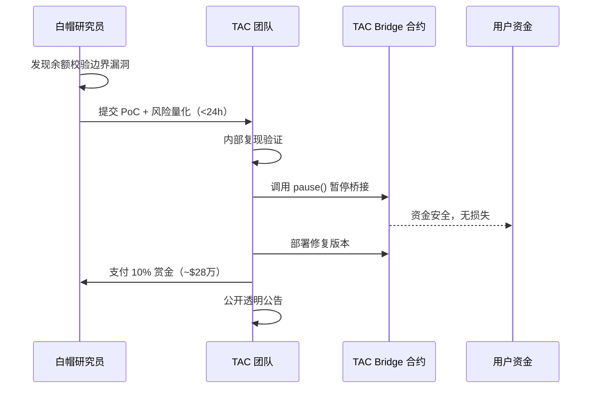

# TAC Protocol Bridge（2026-05初，~$280万，白帽桥漏洞）

> **TL;DR**：2026年5月初，**TAC Protocol**（TON 生态 EVM 二层框架）的跨链桥被白帽安全研究员发现一处桥合约逻辑漏洞，理论最大可抽 **~$280万** 资金。白帽研究员通过官方漏洞赏金计划负责任地披露，TAC 团队迅速修复并暂停桥接服务，**实际用户资金零损失**。白帽获得 **10% 赏金（约 $28万）**。此事件是桥接协议建立规范白帽通道的正面案例。

> **本条目源于 SlowMist/PeckShield 2026-05 早期报告，细节仍在持续更新，请重审。**

## 1. 事件背景

### 1.1 TAC Protocol 简介

[TAC Protocol](https://tacprotocol.io)（TON Application Chain）是连接 **TON 生态与 EVM 生态**的二层框架。核心设计：用户在 TON 上发起交易 → TAC 共识层打包 → 通过 TAC Bridge 在 EVM 侧执行 Solidity 合约逻辑。TAC 的主要价值主张是让 TON 的 ~10 亿潜在用户（Telegram 月活）能无缝使用 DeFi 应用，无需切换钱包或链。

2026-Q1 TAC 处于主网早期阶段，桥接 TVL 约 $3000万–$5000万（主要为 TON/USDT/tETH）。

### 1.2 时间轴

| 时间（UTC 估算） | 事件 |
|------|------|
| 2026-05 上旬 | 白帽研究员在对 TAC Bridge 合约进行安全审查时发现逻辑漏洞 |
| 发现后 <24 h | 白帽通过 TAC 官方漏洞赏金渠道提交 PoC，附链上资金流风险量化 |
| 提交后 <12 h | TAC 团队验证漏洞，暂停跨链桥接功能（智能合约 pause） |
| 暂停后数日内 | 漏洞修复完毕，合约升级，桥接服务恢复 |
| 修复后 | TAC 官方公告确认漏洞及白帽贡献，支付 10% 赏金（~$28万） |

### 1.3 发现过程

白帽研究员对 TAC Bridge 的 Solidity 合约进行手工代码审查，发现在**跨链消息验证流程**中存在一处边界条件未正确处理，理论上可构造特殊消息绕过余额校验。研究员量化了可利用的最大资金规模（~$280万），并提供完整的 PoC 攻击步骤。

TAC 团队通过内部沙盒复现了 PoC，确认为高危漏洞，立即启动应急响应。

## 2. 事件影响

### 2.1 直接损失

| 项目 | 数值 |
|------|------|
| **实际资金损失** | **$0**（白帽负责任披露，无链上利用） |
| 理论最大可损失 | ~$280万（按事发当时价格） |
| 赏金支出 | ~$28万（损失上限 10%） |

### 2.2 间接影响

- **服务中断**：桥接功能暂停数日，影响跨链流动性
- **信任增益**：负责任披露 + 迅速修复 + 公开透明的赏金支付，强化了 TAC 社区信任
- **行业示范**：白帽赏金机制的有效运作案例，被安全社区正面引用

### 2.3 连带影响

依赖 TAC 桥的 DeFi 应用在桥暂停期间无法进行跨链操作；无代币大幅波动记录（TVL 短暂下降后恢复）。

## 3. 技术根因（代码级分析）

> **注意**：TAC Protocol 官方 post-mortem 发布前，以下分析基于公开报告推断。正式报告发布后请对照更新。

### 3.1 漏洞分类

**Bridge / Protocol-Bug — 跨链消息余额校验边界条件缺陷**

### 3.2 攻击面定位

TAC Bridge 的跨链消息处理流程：

```
TON 侧发起 → 消息序列化 → TON Relay 签名
    → TAC EVM 侧 Bridge 合约收到消息
    → 校验签名 → 校验余额/额度
    → 执行铸币或转账
```

漏洞点位于 EVM 侧的 **余额/额度校验逻辑**——在特定参数组合下，校验函数返回 `true` 但实际余额未正确扣减，导致可在 TON 侧以极低成本触发 EVM 侧的超额铸币或转账。

### 3.3 模式示意（Solidity 伪代码）

```solidity
// 漏洞模式（简化）：余额校验与状态更新非原子
function processMessage(Message calldata msg) external onlyRelay {
    // 漏洞：先校验余额充足
    require(_checkBalance(msg.token, msg.amount), "insufficient");
    // 漏洞：特殊边界值使 _checkBalance 通过但 _deduct 未正确执行
    _deduct(msg.token, msg.amount);   // 边界条件下 amount 溢出/截断
    _mint(msg.recipient, msg.amount); // amount 按原始值铸造
}
```

攻击者可构造 `amount` 使其在 `_checkBalance` 中解析为小值（通过校验），但在 `_mint` 中解析为大值（超额铸造）。

### 3.4 为何此前未发现

- TAC 主网上线时间较短，外部独立审计覆盖未及桥接消息解码的边界情况
- 跨链消息格式（TON 与 EVM ABI 的编解码差异）是高度专业化的攻击面，常规 Solidity 审计工具覆盖率低

## 4. 事后响应

### 4.1 项目方行动

| 步骤 | 内容 |
|------|------|
| 紧急暂停 | 调用 Bridge 合约 `pause()` 方法，停止所有跨链消息处理 |
| 漏洞修复 | 修复余额校验与状态更新的原子性问题，增加消息参数范围校验 |
| 合约升级 | 通过 Proxy 模式更新 Bridge 实现合约（无需用户操作） |
| 服务恢复 | 修复验证完成后重启桥接，公告桥接已安全 |
| 赏金支付 | 按 10% 标准向白帽研究员支付 ~$28万 赏金 |

### 4.2 资产追回

无需追回（零实际损失）。

### 4.3 行业联动

此事件提示其他 TON-EVM 桥接项目（如 TON Bridge、StarkNet-TON 方案等）自查跨链消息解码逻辑中的类型转换边界。

## 5. 启发与教训

### 5.1 对开发者

- **跨链消息的编解码须独立严格验证**：TON TL-B 格式与 Solidity ABI 的类型映射存在隐式截断风险，务必在 EVM 侧对所有字段做范围校验（`require(amount <= MAX_BRIDGE_AMOUNT)`）
- **余额校验与状态更新需保持原子一致性**：先 `_deduct` 再 `_mint`，而非并列逻辑；使用 `SafeCast` 防止隐式截断
- **建立完善的 Pause 机制**：紧急情况下能在一笔 tx 内完成全功能冻结

### 5.2 对审计方

- 桥合约的跨链消息格式转换是高风险区域，需要专项 fuzz（生成极端边界 amount 值）
- 建议在审计清单中加入"消息字段跨语言类型转换边界测试"一项

### 5.3 对用户

- 白帽赏金计划健全的协议更值得信赖；可查阅项目是否有公开的漏洞赏金政策（Immunefi/官方平台）

### 5.4 正面教训：白帽赏金机制的价值

此案例说明 **10% 赏金上限模型**在实践中可有效激励负责任披露：白帽可预期获得约 $28万 收益，远低于 $280万 的理论黑市收益，但合法且无法律风险。TAC 通过支付赏金而非静默修复，向行业展示了透明文化。



## 6. 参考资料

- **SlowMist Hacked 数据库** — <https://hacked.slowmist.io>（检索 "TAC Protocol"）
- **PeckShield Alert** — <https://twitter.com/PeckShieldAlert>（2026-05 告警推文）
- **TAC Protocol 官方公告** — <https://tacprotocol.io>（post-mortem 待归档）
- **Immunefi / 官方赏金平台**（赏金支付记录）
- **链上证据** — TAC Bridge 合约地址：待补充（Etherscan / TON Explorer）

---

*Last verified: 2026-05-19 | 本条目源于公开早期报告，官方 post-mortem 发布后请对照更新*
