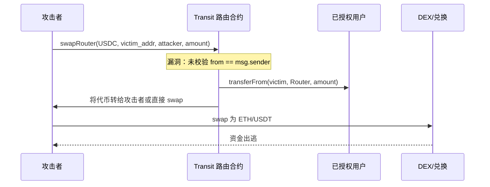

# Transit Finance（2026-05-13，~$188万，跨链聚合协议被抽）

> **TL;DR**：2026-05-13，多链 DEX 与跨链桥聚合平台 **Transit Finance** 的路由合约遭攻击，损失 **~$188万**。攻击向量为跨链聚合路由合约中**用户授权（Approval）被恶意利用**或**输入参数校验缺失**，使攻击者构造特殊调用路径直接从已批准（approve）Transit 合约的用户账户中转走代币。此类"聚合器被抽"攻击与 2022 年 Transit 曾经历过的同类漏洞一脉相承，表明聚合协议的 `transferFrom` 授权管理是长期高危攻击面。

> **本条目源于 SlowMist/PeckShield 2026-05 早期报告，细节仍在持续更新，请重审。**

## 1. 事件背景

### 1.1 Transit Finance 简介

[Transit Finance](https://transit.finance) 是一个**多链 DEX 聚合 + 跨链桥聚合**路由平台，支持 Ethereum、BNB Chain、Polygon、Avalanche、Arbitrum、Optimism 等主流网络。用户在 Transit 上一站式完成代币兑换与跨链，协议在后台选取最优路由（DEX 池 / 桥接方案）。

Transit Finance 此前曾在 **2022 年 10 月** 经历类似的授权抽取攻击（损失 $2900 万，后追回约 $1650 万），本次为 2026 年的新一起同类漏洞。

### 1.2 攻击时间轴

| 时间（UTC 估算） | 事件 |
|------|------|
| 2026-05-13 | 攻击者部署攻击合约，构造恶意调用路径 |
| 2026-05-13 | 攻击交易执行，多链上已授权 Transit 路由合约的用户账户资金被抽走 |
| 2026-05-13 <1h | PeckShield / Cyvers 告警，Transit 团队暂停合约 |
| 2026-05-13 | Transit 官方确认攻击，公告暂停服务 |
| 2026-05-14 起 | 官方展开合约审查与修复 |

### 1.3 发现过程

链上监控工具（PeckShield、Cyvers）检测到 Transit 路由合约的异常大额转账模式（非正常用户兑换路径），触发告警。

## 2. 事件影响

### 2.1 直接损失

| 项目 | 数值 |
|------|------|
| **实际资金损失** | **~$188万**（多链合计，事发当日 USD 估值） |
| 受害方 | 已授权 Transit 路由合约的用户（`approve` 未撤销） |
| 攻击链 | 多链分散（具体链分布待 post-mortem 确认） |

### 2.2 连带影响

- Transit 服务中断，用户无法正常使用跨链聚合功能
- 事件触发用户大规模撤销 Transit 合约 Approval（`revoke`）
- 同类聚合协议（如 deBridge、O3 Swap 等）收到社区安全提示，自查路由合约授权逻辑

### 2.3 资金去向

攻击者将抽取的代币快速通过 DEX 兑换为 ETH/USDT，部分资金通过混币服务转移。链上追踪持续进行中（截至 2026-05-19 尚未追回）。

## 3. 技术根因（代码级分析）

> **注意**：Transit Finance 官方 post-mortem 发布前，以下分析基于同类历史漏洞模式与公开早期报告推断。

### 3.1 漏洞分类

**Bridge / Protocol-Bug — 跨链聚合路由合约授权抽取（Approval Drain）**

### 3.2 背景：聚合器授权抽取的通用模式

用户使用聚合器前需 `approve` 路由合约一定额度（或 `max approval`）。若路由合约存在以下任一缺陷，攻击者可构造调用直接转走用户资金：

```
A) 路由参数中 tokenIn/recipient 可任意指定，未限制为 msg.sender
B) 合约将调用转发给任意外部地址（arbitrary external call）
C) swap 路由的 from 参数可填任意地址（未校验 msg.sender）
```

### 3.3 Transit Finance 2026 攻击路径（推断）

```solidity
// 漏洞模式示意（路由合约无 msg.sender 校验）
function swapRouter(
    address tokenIn,
    address from,      // ← 漏洞：可填任意已授权地址
    address to,
    uint256 amount,
    bytes calldata data
) external {
    // 未检查 from == msg.sender
    IERC20(tokenIn).transferFrom(from, address(this), amount);
    // ... 后续路由逻辑
}
```

攻击者遍历已授权 Transit 合约的地址，调用 `swapRouter(tokenIn, victim, attacker, maxBalance, ...)` 逐一抽取资金。

### 3.4 历史对比：2022 年 Transit 攻击

2022-10 的 Transit 漏洞同为授权抽取，但利用的是 `_swapInternalV2` 函数的任意外部调用（arbitrary call）：攻击者传入恶意合约地址作为 swap 目标，路由合约代为执行 `transferFrom(victim, attacker, amount)`。两次漏洞的根因类似——**路由合约对调用参数的来源校验不足**。

### 3.5 为何同类漏洞再现

- 2022 年修复集中于 `_swapInternalV2` 函数，但 2026 年漏洞可能在新上线的跨链路由模块（非原修复范围）
- 聚合器的功能迭代频繁，新增跨链桥路由时未经系统级的授权校验复核

## 4. 事后响应

### 4.1 项目方行动

| 步骤 | 内容 |
|------|------|
| 紧急暂停 | 暂停路由合约，阻止进一步损失 |
| 用户告知 | 官方发布公告，提示用户立即撤销 Transit 合约 Approval |
| 漏洞修复 | 修复路由参数来源校验，限制 `from` 必须等于 `msg.sender` |
| 合约升级 | 通过升级机制部署修复版本 |

### 4.2 资产追回

截至 2026-05-19，损失 $188万 尚未追回；项目方联系攻击者提供返还渠道（结果待更新）。

### 4.3 行业联动

此事件再次提示所有聚合协议用户：**定期检查并撤销不再使用的合约 Approval**（推荐工具：revoke.cash、Etherscan Token Approvals）。

## 5. 启发与教训

### 5.1 对开发者

- **路由合约中 `from` 参数必须强制等于 `msg.sender`**，禁止任意地址参数作为 `transferFrom` 来源
- **禁止任意外部调用（arbitrary external call）**：路由目标地址必须在白名单内
- **新功能模块上线前须完整复核授权模型**，不能仅修复已知漏洞点而忽视新增代码

### 5.2 对审计方

- 聚合器审计的**必检项**：枚举所有 `transferFrom` 调用，验证 `from` 来源是否等于 `msg.sender` 或来自可信路径
- 使用 Slither 规则：`arbitrary-send-erc20`（检测任意发送漏洞）

### 5.3 对用户

- **最小 Approval 原则**：仅授权当次交易所需额度，交易后立即撤销
- **使用 revoke.cash 定期清理** 高风险合约（聚合器、路由协议）的历史 Approval
- 聚合器发生安全事件时立即撤销所有授权，勿等待官方公告



## 6. 参考资料

- **SlowMist Hacked 数据库** — <https://hacked.slowmist.io>（检索 "Transit Finance 2026"）
- **PeckShield Alert** — <https://twitter.com/PeckShieldAlert>（2026-05-13 告警推文）
- **Transit Finance 官方公告** — <https://transit.finance>（post-mortem 待归档）
- **DeFiHackLabs** — <https://github.com/SunWeb3Sec/DeFiHackLabs>（PoC 待跟进）
- **2022 年 Transit 历史漏洞参考**：<https://rekt.news>（检索 "Transit Finance 2022"）
- **revoke.cash** — <https://revoke.cash>（用户撤销 Approval 工具）

---

*Last verified: 2026-05-19 | 本条目源于公开早期报告，官方 post-mortem 发布后请对照更新*
