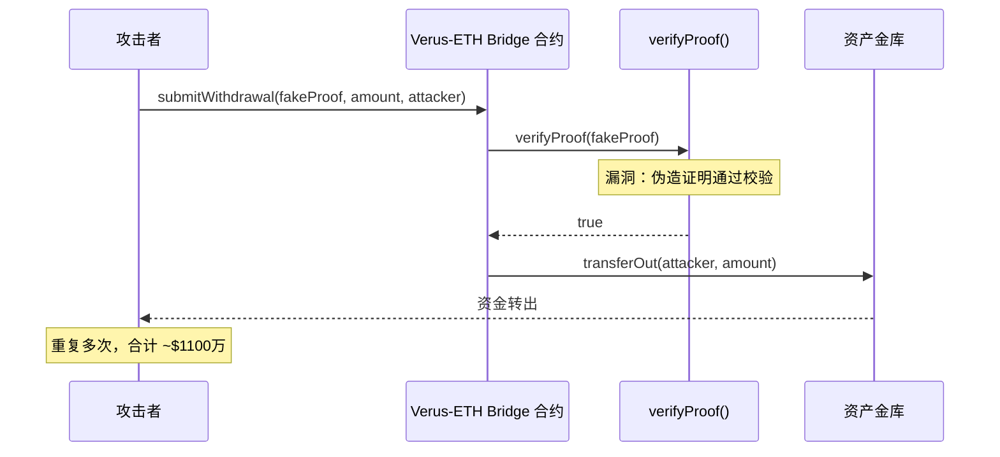

# Verus-Ethereum Bridge（2026-05-18，~$1100万，桥验证漏洞）

> **TL;DR**：2026-05-18，隐私公链 **Verus** 与 Ethereum 之间的官方桥接合约被利用，损失 **~$1100万**。攻击利用桥接合约在验证 Verus 链上跨链证明（cross-chain proof）时存在的**逻辑缺陷**，攻击者通过提交伪造或格式异常的证明绕过验证，在 Ethereum 侧无对应锁仓的情况下解锁/铸造资产。此漏洞属于**"桥验证失效"**的经典类别，与 Nomad 2022（`acceptableRoot[0] = 0`）、Wormhole 2022（`verify_signatures` 跳过）同族。

> **本条目源于 SlowMist/PeckShield 2026-05-18 早期报告，细节仍在持续更新，请重审。**

## 1. 事件背景

### 1.1 Verus 公链与跨链桥简介

[Verus](https://verus.io) 是一条以**隐私、自主主权身份与去中心化跨链**为核心设计目标的 L1 公链（2018 年启动）。核心技术栈：
- **VerusHash 2.2**：CPU 公平挖矿算法（同时支持 PoW + PoS 混合共识）
- **PBaaS（Public Blockchains as a Service）**：允许在 Verus 协议下注册和运行子链
- **Verus-Ethereum Bridge**：官方提供的双向锚定桥，允许 VRSC（Verus 原生代币）、veETH 等资产在 Ethereum 与 Verus 间流转

Verus-Ethereum Bridge 在 Ethereum 侧部署了智能合约，用于：
1. **锁定 ERC-20 资产**（ETH/USDC 等）并通知 Verus 侧铸造镜像代币
2. **接收 Verus 侧提款证明**并在 Ethereum 侧释放对应资产

### 1.2 攻击时间轴

| 时间（UTC 估算） | 事件 |
|------|------|
| 2026-05-18 | 攻击者构造伪造/异常跨链证明，向 Verus-Ethereum Bridge 合约提交提款请求 |
| 2026-05-18 | 合约验证缺陷导致伪造证明被接受，攻击者在 Ethereum 侧成功解锁/提取资产 |
| 2026-05-18 | 攻击者快速将提取资产兑换为 ETH/稳定币，分散转移 |
| 2026-05-18 <2h | 链上监控工具告警，Verus 团队发现异常，紧急暂停桥合约 |
| 2026-05-18 | Verus 官方发布紧急公告，确认安全事件 |

### 1.3 发现过程

链上监控（PeckShield/SlowMist）检测到 Verus 桥合约的非常规大额解锁操作，与 Verus 链上锁仓量不匹配，触发告警。

## 2. 事件影响

### 2.1 直接损失

| 项目 | 数值 |
|------|------|
| **实际资金损失** | **~$1100万**（按 2026-05-18 USD 估值） |
| 受损资产 | 主要为锁定在 Ethereum 侧桥合约中的 ETH 和 ERC-20 代币（具体构成待 post-mortem 确认） |
| 受害方 | 通过 Verus-Ethereum Bridge 跨链的用户 + 桥合约流动性提供者 |

### 2.2 连带影响

- **VRSC 代币价格受冲击**：事件公开后 VRSC 短期下跌，市场信心受损
- **桥接服务中断**：Verus-Ethereum Bridge 暂停，Verus 生态跨链流动性断路
- **行业关注**：小众 L1 的跨链安全再次引发讨论——预算有限的项目是否有资源维护安全的桥接基础设施

### 2.3 资金去向

攻击者将提取的 ETH/代币通过去中心化交易所快速兑换，之后转入混币渠道（THORChain/Tornado Cash 等，具体路径待链上分析确认）。截至 2026-05-19，资金未追回。

## 3. 技术根因（代码级分析）

> **注意**：Verus 官方 post-mortem 尚未发布，以下分析基于公开报告与同类跨链桥验证漏洞模式推断。

### 3.1 漏洞分类

**Bridge / Protocol-Bug — 跨链提款证明验证失效**

### 3.2 Verus-Ethereum Bridge 证明验证架构

Verus-Ethereum Bridge 的安全核心是：在 Ethereum 侧合约验证 Verus 链上的状态证明（State Proof），确认某笔资产在 Verus 侧已销毁/锁定，才能在 Ethereum 侧释放对应资产。

```
Verus 链 ──[用户发起提款 + 销毁资产]──> 生成跨链证明
           ──[提款者提交证明]──> Ethereum 侧 Bridge 合约
                               ──[验证证明]──> 释放 ERC-20 资产
```

Verus 的跨链证明格式基于其自研的 **Verus Proof Protocol**（MMR 证明 + 公证人多签混合），具有较高的实现复杂度。

### 3.3 漏洞推断

根据同类桥验证漏洞的历史模式，漏洞可能位于以下位置之一：

**模式 A：证明哈希零值绕过（类 Nomad 2022）**

```solidity
// Nomad 式漏洞：初始化时将 bytes32(0) 设为可接受的 root
function acceptableRoot(bytes32 _root) public view returns (bool) {
    // 漏洞：如果 validRoots 包含 bytes32(0)
    // 任何证明都能通过（proof leaf 默认值为 0）
    return validRoots[_root];
}
```

**模式 B：签名验证被跳过（类 Wormhole 2022）**

```solidity
// Wormhole 式漏洞：公证人签名验证函数可被绕过
function verifySignatures(bytes memory encoded, Signature[] memory sigs) internal view {
    // 漏洞：在特定条件下 sigs.length == 0 通过检查
    if (sigs.length == 0) return; // 错误的短路返回
}
```

**模式 C：Verus 特有的 MMR/Notarization 校验边界条件**

Verus 使用自研的 [VerusBridge](https://github.com/monkins1010/VerusBridgeEthereum) 合约（Ethereum 侧），该合约实现了对 Verus 链 MMR 根和公证人签名的校验。如果校验函数存在：
- 公证人集合更新时的边界竞态条件
- 证明元数据字段的类型截断
- 空公证人集合时的默认通过

均可导致伪造证明被接受。

### 3.4 攻击步骤（推断）

```
Step 1: 攻击者观察 Verus-Ethereum Bridge 合约的 verifyProof 逻辑
Step 2: 构造满足漏洞条件的伪造跨链证明（无需对应 Verus 侧真实销毁）
Step 3: 向 Ethereum 侧桥合约提交伪造证明
Step 4: 合约校验通过 → transferOut(attacker, amount)
Step 5: 重复多次，合计提走 ~$1100 万
```

### 3.5 为何此前未发现

- Verus 桥合约代码为社区开发，审计资源有限
- Verus 自研的跨链证明格式（非标准如 IBC/LayerZero）缺乏行业级审计积累
- 小众公链跨链桥的安全社区关注度低于 EVM 主流桥

## 4. 事后响应

### 4.1 项目方行动

| 步骤 | 内容 |
|------|------|
| 紧急暂停 | 暂停 Ethereum 侧 Bridge 合约，阻止进一步提款 |
| 公告发布 | 官方 Discord / Twitter 发布紧急公告，告知用户不要进行跨链操作 |
| 漏洞调查 | 联合外部安全公司开始代码审查 |
| 修复计划 | 重写证明验证模块，拟引入外部审计后重新部署 |

### 4.2 资产追回

截至 2026-05-19，损失未追回；项目方正联系链上追踪机构（SlowMist AML / Chainalysis）协助追踪资金路径。

### 4.3 赔付方案

尚未公布；鉴于 Verus 是社区驱动项目，赔付能力有限，方案可能通过社区治理决策。

## 5. 启发与教训

### 5.1 对开发者

- **跨链证明验证必须经过专项安全审计**：自研证明格式的风险显著高于采用标准协议（IBC、LayerZero）
- **验证函数不得有任何"空集通过"逻辑**：`sigs.length == 0` → reject；`root == bytes32(0)` → reject
- **引入 Fuzz 测试**：对所有证明验证路径进行边界值模糊测试（特别是空值、最大值、异常格式）
- **多重防线**：验证失败应硬拒绝（revert），而非静默失败或返回 false

### 5.2 对审计方

- 跨链证明验证是**必须专项深挖**的区域，建议单独作为审计任务处理
- 重点检查：公证人集合为空/单一时的逻辑分支；哈希值默认零值的处理；证明格式解析的溢出/截断
- 推荐引入形式化验证（Certora/K Framework）对核心验证函数进行数学级别的正确性证明

### 5.3 对用户

- 使用小众链/自研桥的用户承担额外风险：优先选择经多家顶级审计机构审计的桥（如 LayerZero、IBC、Wormhole 修复版）
- 跨链大额资金前查阅项目审计报告，关注自研组件的审计覆盖情况

### 5.4 行业系统性风险

本次事件揭示**长尾公链桥接**的安全困境：

```
资源有限 → 审计预算不足
    → 自研协议缺乏标准化
    → 外部安全研究较少关注
    → 漏洞更易藏匿
    → 用户风险敞口更大
```

解法建议：采用模块化、可审计的标准跨链消息协议（IBC、LayerZero V2）替代完全自研的验证逻辑。



## 6. 参考资料

- **SlowMist Hacked 数据库** — <https://hacked.slowmist.io>（检索 "Verus Bridge 2026"）
- **PeckShield Alert** — <https://twitter.com/PeckShieldAlert>（2026-05-18 告警推文）
- **Verus 官方公告** — <https://verus.io>（post-mortem 待归档）
- **VerusBridge Ethereum 合约源码** — <https://github.com/monkins1010/VerusBridgeEthereum>
- **DeFiHackLabs** — <https://github.com/SunWeb3Sec/DeFiHackLabs>（PoC 待跟进）
- **类比参考**：
  - Nomad 2022 — `acceptableRoot[0]=0` 初始化漏洞 → [2022-nomad](../bridge/2022-nomad.md)
  - Wormhole 2022 — 签名验证绕过 → [2022-wormhole](../bridge/2022-wormhole.md)
  - Hyperbridge 2026 — MMR leaf_index 边界漏洞 → [2026-hyperbridge](../bridge/2026-hyperbridge.md)

---

*Last verified: 2026-05-19 | 本条目源于公开早期报告，官方 post-mortem 发布后请对照更新*
