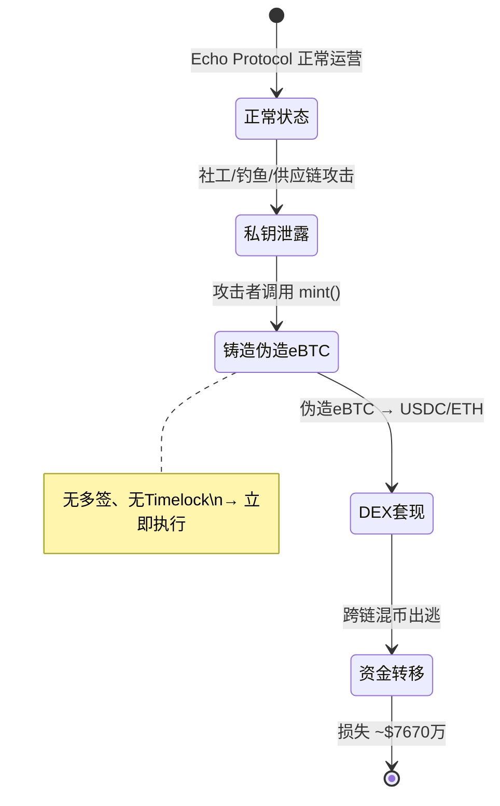

# Echo Protocol（2026-05-19，~$7670万，管理员私钥泄露 + 伪造 eBTC）

> **TL;DR**：2026-05-19（今日），运行于高性能 EVM 链 **Monad** 上的 Bitcoin 锚定衍生品协议 **Echo Protocol** 遭遇 **~$7670万** 损失。攻击分两步：**①** 攻击者通过某种渠道获取 Echo Protocol 的**管理员私钥**（admin private key）；**②** 利用管理员权限调用无多签保护、无 Timelock 的 `mint` 函数，无中生有地铸造巨量 **eBTC**（Echo Protocol 的 Bitcoin 锚定代币），随后在 Monad DeFi 生态内套现。此漏洞属于**"管理员私钥失控 + 无 Timelock 铸币"**的经典类别，与 PlayDapp 2024（$290M）、Gala Games 2024（$21M）一脉相承。

> **⚠️ 本事件发生于 2026-05-19（今日），细节仍在快速更新中，本条目基于事发初期报告。请 24–72 小时后重审并对照官方 post-mortem 更新所有占位内容。**

## 1. 事件背景

### 1.1 Echo Protocol 简介

**Echo Protocol** 是部署在 [Monad](https://monad.xyz) 链上的 Bitcoin 锚定衍生品协议。核心产品为 **eBTC**（Ethereum-side Bitcoin，或 Monad-side Bitcoin）——用户存入 BTC（通过跨链桥）或 WBTC，协议铸造等额 eBTC 作为链上 Bitcoin 凭证；eBTC 可在 Monad DeFi 生态（DEX、借贷协议）中流通使用。

**Monad** 是高性能 EVM 兼容 L1（2026年进入主网阶段），以极高 TPS（理论 10,000+ TPS）和并行 EVM 执行为核心差异化，吸引了大量 DeFi 协议早期部署。

Echo Protocol 的 TVL 在事发前估计为数千万美元量级（具体数字待 post-mortem 确认）。

### 1.2 攻击时间轴

| 时间（UTC 估算） | 事件 |
|------|------|
| 2026-05-19 之前某时 | 攻击者通过社工/钓鱼/供应链攻击获取 Echo Protocol 管理员账户私钥 |
| 2026-05-19 | 攻击者使用管理员私钥调用 eBTC 合约的特权 `mint` 函数 |
| 2026-05-19 | 无多签/Timelock 保护 → 伪造 eBTC 立即被铸造至攻击者地址 |
| 2026-05-19 | 攻击者将伪造 eBTC 在 Monad DEX 上换为真实 BTC/USDC/ETH 等价值资产 |
| 2026-05-19 | Cyvers / PeckShield 告警，Echo Protocol 团队暂停合约 |
| 2026-05-19 | Echo Protocol 发布紧急公告，损失 ~$7670万 |

### 1.3 管理员私钥如何泄露

根据早期报告，私钥获取方式尚未最终确认，可能路径包括（按历史频率排序）：
1. **LinkedIn/Telegram 假面试攻击**（DPRK TraderTraitor 典型手法）：向团队成员投递含恶意代码的"技术任务"或"NFT 合约文件"
2. **开发环境被渗透**：CI/CD 管道或本地开发机器遭恶意软件植入，私钥从 `.env` 文件或内存中窃取
3. **内鬼开发者**：类 Munchables 2024 模式，北朝鲜开发者混入团队后直接获取密钥

## 2. 事件影响

### 2.1 直接损失

| 项目 | 数值 |
|------|------|
| **实际资金损失** | **~$7670万**（按 2026-05-19 USD 估值）|
| 攻击方式 | 伪造铸币 + DeFi 套现 |
| 受害方 | Echo Protocol 协议储备金 / eBTC 真实持有用户（超额发行导致储备不足）|
| 攻击链 | Monad |

### 2.2 连带影响

- **eBTC 锚定失效**：伪造铸造导致 eBTC 发行量超过实际 BTC 储备，eBTC 价格脱锚
- **Monad DeFi 生态冲击**：接受 eBTC 作为抵押品的协议遭受坏账风险
- **Monad 链形象受损**：主网早期阶段即发生如此规模安全事件，影响生态信心

### 2.3 资金去向

攻击者将伪造 eBTC 在 Monad 上的 DEX 快速清仓，换为流动性更强的资产（ETH/USDC/USDT），随后开始跨链转移（路径待链上分析）。截至 2026-05-19 资金仍在转移中。

## 3. 技术根因（代码级分析）

> **注意**：Echo Protocol 官方 post-mortem 尚未发布，以下分析基于早期公开信息与同类事件模式推断。

### 3.1 漏洞分类

**Governance-Admin / Key-Mgmt — 管理员私钥失控 + 无 Timelock/多签保护的铸币函数**

### 3.2 eBTC 铸币权限架构（推断）

正常的 Bitcoin 锚定代币（eBTC/WBTC 类）应具有以下安全结构：

```solidity
// 安全设计：多签 + Timelock 保护的 mint
contract eBTC is ERC20 {
    address public minter;  // 应为多签合约地址

    modifier onlyMinter() {
        require(msg.sender == minter, "not minter");
        _;
    }

    // mint 应通过 Timelock 合约调用，增加响应窗口
    function mint(address to, uint256 amount) external onlyMinter {
        _mint(to, amount);
    }
}
```

**漏洞状态（推断）**：Echo Protocol 的 `minter` 权限指向一个**单一 EOA（外部账户）**而非多签合约，且无 Timelock 保护——管理员私钥一旦泄露，攻击者可立即铸造任意数量 eBTC。

### 3.3 攻击执行

```solidity
// 攻击者调用（使用泄露的管理员私钥签名）
eBTC.mint(attacker_address, 76700000_USD_worth_of_eBTC);

// 随后在 DEX 上套现
DEX.swap(eBTC, USDC, attacker_address);
```

由于：
1. 无多签要求（单私钥即可执行）
2. 无 Timelock（无延迟，即时生效）
3. 无异常告警系统（或告警触发时已完成铸造）

整个攻击在极短时间内（可能数分钟）完成。

### 3.4 为何此前未发现

- 私钥保管问题难以通过合约代码审计发现——审计员看代码，看不到密钥存储方式
- 单 EOA 作为 minter 在部署初期出于"效率"考量，计划在成熟后迁移多签，但未能及时完成
- Monad 主网早期，协议处于快速迭代阶段，安全加固滞后于功能开发

### 3.5 类比对比

| 事件 | 年份 | 损失 | 根因 |
|------|------|------|------|
| PlayDapp | 2024 | $290M | admin 私钥泄露 → SuperMinter 权限无限铸币 |
| Gala Games | 2024 | $21M | mint 权限泄露 → 无多签 |
| Echo Protocol | 2026 | $76.7M | admin 私钥泄露 → eBTC 无 Timelock 铸币 |

**PlayDapp 是最接近的历史案例**：2024年管理员私钥泄露后，攻击者调用 `addMinter()` 赋予自己无限铸币权限，铸造巨量 PLA 代币套现。详见 → [2024-playdapp](./2024-playdapp.md)

## 4. 事后响应

### 4.1 项目方行动

| 步骤 | 内容 |
|------|------|
| 紧急暂停 | 暂停 eBTC 合约（pause），停止进一步铸造和转账 |
| 密钥轮换 | 废弃泄露管理员密钥，切换至新密钥或多签合约 |
| 紧急公告 | 向用户告知攻击情况，提示 eBTC 持有风险 |
| 损失评估 | 统计伪造铸造量与实际储备缺口 |

### 4.2 后续计划（待更新）

- 赔付方案：尚未公布（需社区治理）
- 合约升级：将 minter 权限迁移至多签 + Timelock 架构
- 外部审计：委托顶级审计机构对整个 Echo Protocol 重新审计

### 4.3 归因

截至 2026-05-19，归因未确认。如攻击手法包含社工/假面试，将进行 DPRK TraderTraitor 关联性分析。

## 5. 启发与教训

### 5.1 对开发者

**铸币权限的黄金标准**：

```
✅ 正确架构：
  minter = Timelock(48h) + 3/5 多签

❌ Echo Protocol 问题架构：
  minter = 单一 EOA（管理员）
```

- **任何具有 `mint()` 的合约**，minter 角色必须是多签合约（至少 3/5），且通过 Timelock（最少 24–48h 延迟）
- **私钥永远不应以明文形式存在于可网络访问的设备上**：使用 HSM（硬件安全模块）或 MPC 签名服务（如 Fireblocks、Fordefi）
- **单独审计密钥管理操作程序**，而不仅是合约代码

### 5.2 对审计方

- 合约审计范围应包含**权限架构图**：枚举所有特权函数（`mint`/`burn`/`pause`/`upgrade`），确认每个函数的调用者是 EOA 还是多签，是否经过 Timelock
- 单 EOA 特权函数是**高风险发现**，即使暂时性，也应在报告中高亮

### 5.3 对用户

- **eBTC 类锚定代币使用前查阅审计报告**，确认 minter 权限的保护层级
- **关注协议的多签/Timelock 配置**，这是衡量协议"去中心化程度"与安全性的关键指标
- 事件发生时立即检查持仓中是否含受影响代币，评估脱锚风险



### 5.4 Monad 生态早期安全反思

Monad 作为新兴高性能 L1 在主网早期吸引了大量 DeFi 协议快速部署，但快速迭代与安全加固之间的权衡需要引起注意：
- **新链生态**更应强制推行最佳实践（多签、Timelock），而非等到协议成熟再实施
- 生态基金/孵化器可将安全架构要求作为资助门槛

## 6. 参考资料

- **SlowMist Hacked 数据库** — <https://hacked.slowmist.io>（检索 "Echo Protocol Monad 2026"）
- **PeckShield Alert** — <https://twitter.com/PeckShieldAlert>（2026-05-19 告警推文）
- **Echo Protocol 官方公告** — <https://echo.xyz>（post-mortem 待归档）
- **Monad Explorer** — 攻击交易链接（待补充）
- **类比参考**：
  - PlayDapp 2024（管理员私钥 + 无限铸币）→ [2024-playdapp](./2024-playdapp.md)
  - Gala Games 2024（mint 权限泄露）→ [2024-gala-games-mint](./2024-gala-games-mint.md)
- **密钥安全最佳实践**：Fireblocks MPC Wallet Security Whitepaper；Trail of Bits "Smart Contract Security Verification Standard"

---

*Last verified: 2026-05-19 | ⚠️ 本事件今日发生，细节持续更新中，请 24–72h 后重审*
