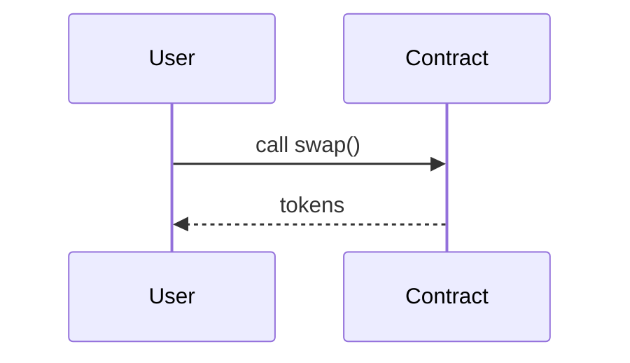

# 写作规范（CONTRIBUTING）

本仓库由 AI Agent 批量生产 + 人工校订。以下规范确保所有文章风格一致、可比、可检索。

---

## 一、文件组织

- 文件路径：`<module>/<submodule>/<topic>.md`
- 目录索引：每个子目录内可放 `_index.md` 作为"总览 + 对比表"。
- 占位文件：尚未撰写完整内容的文件必须保留 frontmatter + TODO 大纲，以便批量追踪。

## 二、frontmatter 必填字段

```yaml
---
title: <中文标题（English Term）>
module: <路径>
priority: P0 | P1 | P2
status: TODO | DRAFT | REVIEWED | DONE
word_count_target: 5000
last_verified: YYYY-MM-DD
primary_sources: [...]
---
```

**priority 规则**：
- **P0**：公链主链、主流 L2、头部协议（Uniswap/Aave/Chainlink/Lido/Maker）、ERC-20/721/1155、ZK-SNARK、EIP-1559、EIP-4337。
- **P1**：活跃但非头部；有重要替代方案意义的协议。
- **P2**：历史意义 / 边缘 / 特定赛道（如算法稳定币 UST/LUNA 复盘、Plasma、State Channels）。

**status 流转**：`TODO → DRAFT → REVIEWED → DONE`。
- `TODO`：仅占位。
- `DRAFT`：已成文 ≥ 80% 目标字数。
- `REVIEWED`：独立 Agent 或人工反查完成，修订 discrepancies。
- `DONE`：链接全部 200 OK，代码引用可验证。

## 三、中英术语规范

- **首次出现**：中文术语（English Term, ABBR）。例："权益证明（Proof of Stake, PoS）"。
- **后续重复**：可直接用缩写 PoS。
- **不翻译的词**：协议名、产品名（Uniswap、Chainlink）、文件/函数名、EIP 编号、opcode 名保持原文。
- **常见中文术语统一**（详见 `00-overview/glossary.md`）：

| 英文 | 中文 | 备注 |
| --- | --- | --- |
| block | 区块 | |
| transaction | 交易 | |
| consensus | 共识 | |
| smart contract | 智能合约 | |
| validator | 验证者 | 不用"验证人" |
| staking | 质押 | |
| slashing | 罚没 | |
| rollup | Rollup | 保留原文 |
| bridge | 跨链桥 | |
| oracle | 预言机 | |

## 四、引用规范

- 所有链接使用 `[文字](URL)` 格式，不用裸链接。
- 代码引用给 **文件路径 + 行号** 或 **函数名**。示例：`` `go-ethereum/core/vm/interpreter.go` 中的 `Interpreter.Run()` ``。
- 引用数据（TVL/TPS/市值）必须带日期：`（截至 2026-04，来源 DefiLlama）`。
- Tier 5 源不得作为唯一出处，必须有 Tier 1/2/3 佐证。

## 五、图片与图示

- 优先用 **Mermaid** 嵌入，保证文本可编辑、可版本控制：

````markdown

````

- 复杂图表可用图片，放 `<module>/<topic>/assets/` 下，命名 `fig-01-xxx.png`。
- 截图必须标注来源与日期。

## 六、代码块规范

- 指定语言：` ```solidity ` / ` ```rust ` / ` ```go ` / ` ```python ` / ` ```bash `
- 代码片段 ≤ 80 行；超过则拆分或链接官方文件。
- 配中文注释；移除无关样板代码。
- 涉及私钥、API Key 的位置必须用 `<YOUR_KEY>` 占位。

## 七、禁止事项

- 不造数据；找不到权威源的数字不写具体数值，用 "据 XX 估计…"。
- 不将 Medium/Twitter thread 作为唯一依据。
- 不使用营销语言（"革命性"、"颠覆"、"史诗级"）。
- 不简单复制官方文档；必须归纳、结构化、中文化。
- 每篇文章涉及安全/金融的判断必须中立，明确声明非投资建议。
